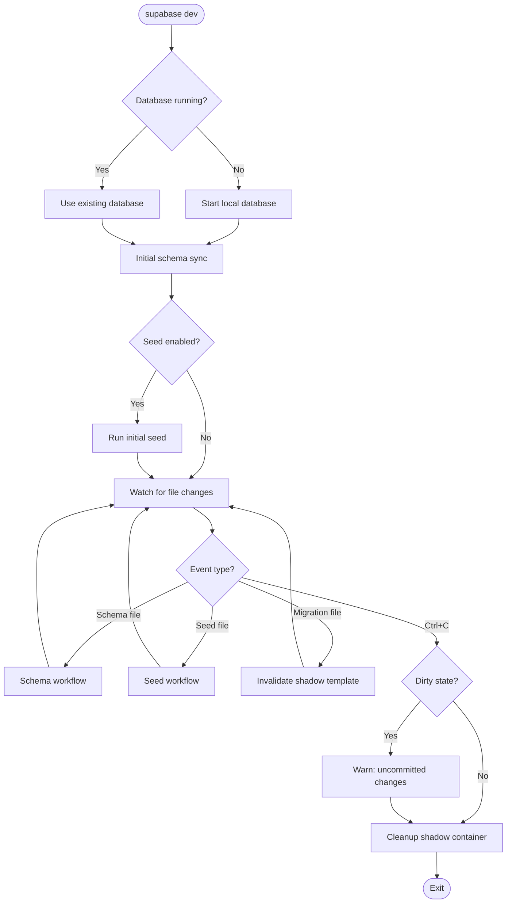
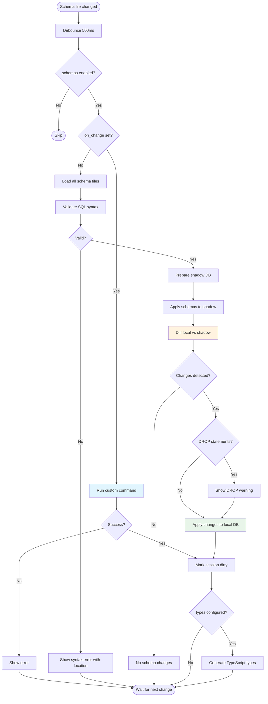
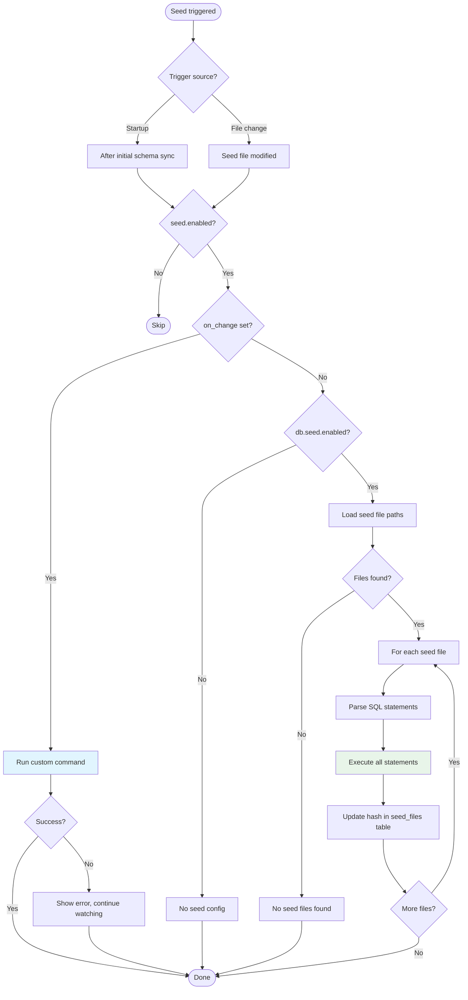
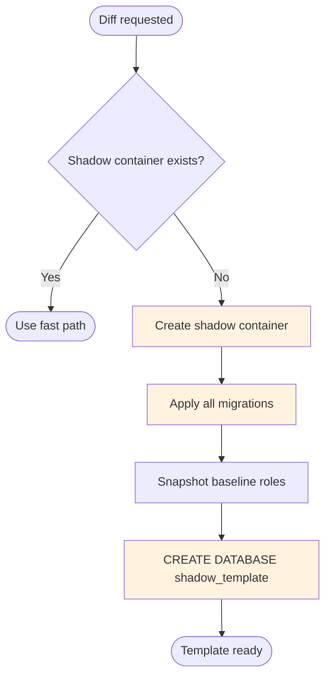
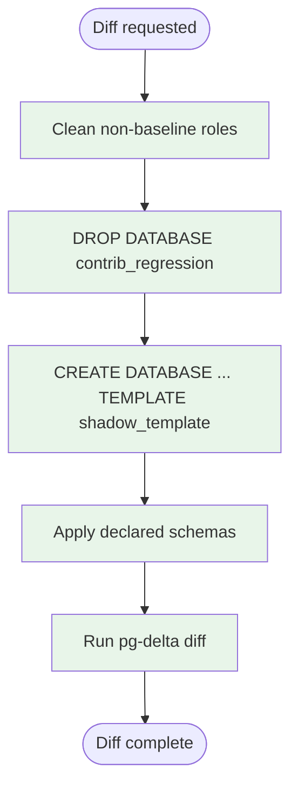

# feat: Add `supabase dev` command for reactive schema development

## Summary

This PR introduces a new `supabase dev` command that provides a reactive development experience for database schema changes. The command watches `supabase/schemas/` for SQL file changes and automatically validates, diffs, and applies them to the local database **without creating migration files**.

**Core principle**: Migrations are an implementation detail for deployment. During development, users just want to evolve their schema and see changes reflected quickly.

## Motivation

Currently, developers working with Supabase schemas must manually run `supabase db diff` and `supabase db push` after every change. This creates friction in the development workflow, especially during rapid prototyping. The `supabase dev` command eliminates this friction by:

1. Automatically detecting file changes
2. Validating SQL syntax before attempting to apply
3. Computing diffs and applying changes in real-time
4. Warning about destructive changes (DROP statements)
5. Tracking "dirty" state to remind users to create migrations before deployment

## Features

### 1. Reactive Schema Watching

```bash
$ supabase dev

[dev] Watching: [schemas/**/*.sql]
[dev] On change: (internal differ)
[dev] Press Ctrl+C to stop

[dev] Applying initial schema state...
[dev] Initial sync complete
[dev] Watching for changes...

[dev] Change detected: supabase/schemas/users.sql
✓ Schema changes applied successfully
Applied:
    CREATE TABLE public.profiles (id uuid PRIMARY KEY, name text);

[dev] Watching for changes...
```

### 2. SQL Validation Gate

Before attempting to diff, all schema files are validated using `pg_query_go` (Go bindings to Postgres's actual parser). This provides immediate feedback about syntax errors:

```
[dev] Change detected: supabase/schemas/users.sql
Syntax error in supabase/schemas/users.sql
    Line 3, Column 8: syntax error at or near "TABL"
    Waiting for valid SQL...
```

### 3. DROP Statement Warnings

Destructive changes are detected and highlighted:

```
Warning: Found DROP statements:
    DROP TABLE public.old_table;
✓ Schema changes applied successfully
```

### 4. Dirty State Tracking

On exit, the command warns if the local database has uncommitted schema changes:

```
^C
[dev] Stopping dev session...
Warning: Local database has uncommitted schema changes!
    Run 'supabase db diff -f migration_name' to create a migration
```

### 5. Extensible Workflow Configuration

The command supports multiple workflows through configuration:

```toml
[dev.schemas]
enabled = true                    # Enable/disable schema workflow
watch = ["schemas/**/*.sql"]      # Glob patterns to watch
on_change = ""                    # Custom command (e.g., "npx drizzle-kit push")
types = "src/types/database.ts"   # Auto-generate TypeScript types
```

**Supported workflows:**
- **Supabase native** (default): SQL files in `supabase/schemas/`, uses internal differ
- **Custom tooling**: Any external command via `on_change`:
  - Drizzle: `on_change = "npx drizzle-kit push"`
  - Prisma: `on_change = "npx prisma db push --skip-generate"`
  - Or any custom script/command
- **Disabled**: `enabled = false` for users with their own watch tooling

### 6. Automatic Seeding

The dev command includes automatic seeding support that runs:
- **On startup**: After initial schema sync
- **On seed file changes**: When seed files are modified

```bash
$ supabase dev

[dev] Watching: [schemas/**/*.sql]
[dev] On change: (internal differ)
[dev] Seed: (internal)
[dev] Press Ctrl+C to stop

[dev] Applying initial schema state...
[dev] Initial sync complete
[dev] Running initial seed...
Seeding data from seed.sql...
[dev] Initial seed complete
[dev] Watching for changes...

# User edits seed.sql
[dev] Seed file change detected: supabase/seed.sql
[dev] Reseeding database...
Seeding data from seed.sql...
[dev] Reseed complete
[dev] Watching for changes...
```

**Configuration:**

```toml
[dev.seed]
enabled = true                    # Enable/disable seed workflow (default: true)
on_change = ""                    # Custom command (e.g., "npx prisma db seed")
```

- Seed file patterns come from existing `[db.seed].sql_paths` config
- When `on_change` is empty, uses internal seeding from `[db.seed]` config
- Schema changes do NOT trigger reseeding (only seed file changes do)

### 7. Migration File Detection

The watcher also monitors the `migrations/` directory. When a migration file is created (e.g., by running `supabase db diff -f` in another terminal), the shadow template is invalidated:

```
[dev] Migration file changed - shadow template invalidated
[dev] Note: Run 'supabase db reset' or restart dev mode to apply new migrations
[dev] Watching for changes...
```

**Why we don't auto-apply migrations:**
- If you create a migration with `db diff -f`, your local DB already has those changes (that's what was diffed)
- Auto-applying would fail or cause conflicts
- The shadow template is invalidated so the next diff cycle uses the updated migrations
- For external migrations (e.g., from `git pull`), restart dev mode or run `db reset`

### 8. Debug Logging

Namespaced debug logging (similar to Node.js debug package):

```bash
DEBUG=supabase:dev:*        # All dev logs
DEBUG=supabase:dev:timing   # Timing information
DEBUG=supabase:dev:watcher  # File watcher logs
DEBUG=supabase:dev:sql      # SQL statements being executed
```

## Architecture

```
┌─────────────────────────────────────────────────────────────────┐
│                         supabase dev                            │
├─────────────────────────────────────────────────────────────────┤
│  DevSession                                                     │
│  ├── Ensures local DB is running (starts if needed)            │
│  ├── Coordinates schema and seed watching                       │
│  ├── Runs initial schema sync + seed on startup                │
│  └── Manages graceful shutdown with cleanup                     │
├─────────────────────────────────────────────────────────────────┤
│  SchemaWatcher                                                  │
│  ├── Watches configurable glob patterns + migrations/ + seeds  │
│  ├── Debounces file changes (500ms)                             │
│  ├── Detects migration vs schema vs seed changes               │
│  ├── Ignores temp files (.swp, ~, .tmp, etc.)                  │
│  └── Dynamically watches new subdirectories                    │
├─────────────────────────────────────────────────────────────────┤
│  SQLValidator                                                   │
│  ├── Uses pg_query_go (libpg_query bindings)                   │
│  ├── Validates ALL .sql files before diffing                   │
│  └── Returns detailed error positions                          │
├─────────────────────────────────────────────────────────────────┤
│  Differ (pg-delta)                                              │
│  ├── Uses @supabase/pg-delta via Bun in Docker                 │
│  ├── Compares local DB vs shadow DB with declared schemas      │
│  └── Outputs SQL migration statements                          │
├─────────────────────────────────────────────────────────────────┤
│  SeedRunner                                                     │
│  ├── Runs on startup (after schema sync) + on seed file changes│
│  ├── Supports custom on_change commands (e.g., Prisma, Drizzle)│
│  └── Uses internal SeedData() when on_change is empty          │
├─────────────────────────────────────────────────────────────────┤
│  Shadow Database (optimized)                                    │
│  ├── Persistent container with PostgreSQL template databases   │
│  ├── Fast reset via CREATE DATABASE ... TEMPLATE (~10ms)       │
│  ├── Tracks cluster-wide objects (roles) separately            │
│  └── Proper cleanup on exit                                    │
└─────────────────────────────────────────────────────────────────┘
```

### Workflow Diagrams

#### Dev Session Lifecycle



#### Schema Workflow



#### Seed Workflow



#### Shadow Database: Cold Start (~14s)



#### Shadow Database: Fast Path (~10ms)



## Performance Optimization: Persistent Shadow Database

### Problem

Without optimization, each diff cycle would take ~15s:
- Shadow DB container creation: ~11s (Docker overhead)
- Migration application: ~3s (same migrations every time)
- Schema application + diff: ~500ms

### Solution: Template Database Approach

The shadow container persists across file changes and uses PostgreSQL's `CREATE DATABASE ... TEMPLATE` for fast resets:

**First run (cold start ~14s):**
1. Start persistent shadow container (named `supabase_db_<project>_shadow`)
2. Apply all migrations → creates baseline state
3. Snapshot baseline roles: `SELECT rolname FROM pg_roles`
4. `CREATE DATABASE shadow_template TEMPLATE contrib_regression`
5. Ready for diffing

**Subsequent runs (fast path ~10ms):**
1. Clean cluster-wide objects (roles not in baseline)
2. `DROP DATABASE contrib_regression`
3. `CREATE DATABASE contrib_regression TEMPLATE shadow_template`
4. Apply declared schemas
5. Diff with pg-delta

### Why Template + Role Tracking?

PostgreSQL template databases only copy **database-scoped objects** (tables, views, functions, extensions). They do NOT copy **cluster-wide objects** (roles, role memberships). If declared schemas contain `CREATE ROLE`, we must track and clean them explicitly between diffs.

## New Files

| File | Description |
|------|-------------|
| `cmd/dev.go` | Cobra command definition |
| `internal/dev/dev.go` | Main session orchestration and lifecycle |
| `internal/dev/watcher.go` | File watcher with debounce and glob matching |
| `internal/dev/validator.go` | SQL syntax validator using pg_query_go |
| `internal/dev/differ.go` | Diff computation using pg-delta and application |
| `internal/dev/shadow.go` | Persistent shadow database management |
| `internal/dev/seed.go` | Seed runner with custom command support |
| `internal/dev/debug.go` | Namespaced debug loggers |

## Modified Files

| File | Changes |
|------|---------|
| `go.mod` / `go.sum` | Added `pg_query_go/v6` and `doublestar/v4` dependencies |
| `pkg/config/config.go` | Added `[dev.schemas]`, `[dev.functions]`, and `[dev.seed]` config sections |
| `internal/db/diff/diff.go` | Added `CreateShadowDatabaseWithName()` for named containers |
| `internal/utils/docker.go` | Fixed third-party image registry handling (e.g., `oven/bun`) |
| `internal/utils/logger.go` | Added `DebugLogger` with namespaced pattern matching |

## New Dependencies

- `github.com/pganalyze/pg_query_go/v6` - Go bindings to libpg_query for SQL validation
- `github.com/bmatcuk/doublestar/v4` - Glob pattern matching with `**` support

## CLI Usage

```bash
supabase dev
```

**Workflows** (configured via `config.toml`):
- `schemas` - Watch schema files, auto-apply to local database
- `seed` - Run seeds on startup and when seed files change
- `functions` - (coming soon) Watch and auto-deploy edge functions

**Flags**: None currently. All configuration is done via `config.toml`.

**Debug logging** (via environment variable):
```bash
DEBUG=supabase:dev:* supabase dev       # All dev logs
DEBUG=supabase:dev:timing supabase dev  # Timing information only
```

## Configuration Examples

### Default (Supabase users)

No configuration needed - works out of the box:

```bash
# Edit supabase/schemas/tables.sql
# Changes are automatically applied to local database
# Run `supabase db diff -f migration_name` when ready
```

### Drizzle ORM

```toml
[dev.schemas]
watch = ["../src/db/schema/**/*.ts"]
on_change = "npx drizzle-kit push"
```

### Prisma ORM

```toml
[dev.schemas]
watch = ["../prisma/schema.prisma"]
on_change = "npx prisma db push --skip-generate"
```

### With TypeScript Types

```toml
[dev.schemas]
types = "src/types/database.ts"
```

### Disabled (use external tooling)

```toml
[dev.schemas]
enabled = false
```

### Custom Seed Command (Prisma)

```toml
[dev.seed]
on_change = "npx prisma db seed"
```

### Custom Seed Command (Drizzle)

```toml
[dev.seed]
on_change = "npx tsx ./scripts/seed.ts"
```

### Disable Seeding in Dev Mode

```toml
[dev.seed]
enabled = false
```

## Testing

### Manual Testing Checklist

- [ ] Run `supabase dev` - database starts if not running
- [ ] Edit a schema file and save - changes applied automatically
- [ ] Introduce a syntax error - validation error shown, no diff attempted
- [ ] Save rapidly multiple times - debounce prevents multiple diffs
- [ ] Add a DROP statement - warning shown before applying
- [ ] Press Ctrl+C with changes applied - dirty state warning shown
- [ ] Run `supabase db diff` - accumulated changes visible
- [ ] Create new subdirectory in schemas/ - automatically watched
- [ ] Add a new migration file - shadow template invalidated (not auto-applied)
- [ ] Run with `DEBUG=supabase:dev:*` - debug logs visible
- [ ] Initial seed runs after schema sync on startup
- [ ] Edit seed file - database is reseeded automatically
- [ ] Schema change does NOT trigger reseed
- [ ] Custom `on_change` seed command works (e.g., Prisma)
- [ ] `[dev.seed] enabled = false` disables seeding

### Edge Cases

- Empty schema files (valid, skipped)
- Schema files with only comments (valid)
- Multiple syntax errors (first error shown)
- Shadow container already exists (reused)
- Database stops during dev session (detected, error shown)
- New migration file added while dev mode running (shadow invalidated, not auto-applied)
- Missing seed files (handled gracefully, warning shown)
- Seed errors don't crash dev mode (warning shown, continues watching)

## Known Limitations

### Running `db diff` while dev mode is active

Currently, `supabase db diff -f` cannot run in parallel with `supabase dev` because both use the same shadow database port. If you try to run `db diff` while dev is running, it will fail with a port conflict.

**Workarounds:**
1. Stop dev mode → run `db diff -f` → restart dev mode
2. Wait for the future "m" shortcut (runs within dev process, no port conflict)

This will be addressed in a future PR by either:
- Using different ports for dev vs diff shadow databases
- Implementing the "m" shortcut that creates migrations from within dev mode

## Next Steps (Future PRs)

The following enhancements are planned for follow-up PRs:

### 1. Drift Detection on `db push`

When running `supabase db push`, warn if the local database has schema changes that aren't captured in migration files:

```
$ supabase db push

Warning: Your local database has schema changes not captured in migrations:
  - Table: public.profiles (new)
  - Column: public.users.full_name (new)

These changes will NOT be pushed to the remote database.
Run 'supabase db diff -f migration_name' to create a migration first.

Continue anyway? [y/N]
```

This prevents accidentally deploying without the schema changes developed in dev mode.

### 2. Interactive Terminal UI

Enhance the dev mode terminal with:
- **Keyboard shortcuts**: Press `m` to create a migration, `r` to restart, `q` to quit
- **Project status**: Show linked project ID, current branch, dirty state
- **Better formatting**: Colored output, progress indicators

### 3. Edge Functions Workflow

The `[dev.functions]` config structure is already in place. Future work includes:
- Watch edge functions for changes
- Auto-deploy to local edge runtime
- Unified dev experience for schema + functions

### 4. Interactive Setup Wizard

On first run of `supabase dev`, offer an interactive setup flow to configure the dev workflow:

```
$ supabase dev

Welcome to Supabase Dev Mode! Let's configure your workflow.

? Are you using supabase-js in your project? (Y/n) Y
? Generate TypeScript types automatically? (Y/n) Y
? Where should types be saved? src/types/database.ts

? How do you manage your database schema?
  > Supabase SQL files (supabase/schemas/*.sql)
    Drizzle ORM
    Prisma ORM
    Other / I'll configure manually

Configuration saved to config.toml:
  [dev.schemas]
  types = "src/types/database.ts"

Starting dev mode...
```

This would:
- Detect existing project setup (package.json for supabase-js, prisma/schema.prisma, drizzle config)
- Pre-fill sensible defaults based on detection
- Write configuration to `config.toml`
- Only run on first invocation (or with `--setup` flag)

## Platform Enhancement Ideas

Beyond the `dev` command, this work highlighted a broader DX improvement opportunity:

### Lazy Service Startup with Proxy

Currently, `supabase start` spins up all services (postgres, auth, storage, realtime, etc.), which can take significant time. A more efficient approach:

1. **Start only postgres initially** - The database is the core dependency
2. **Add a lightweight proxy** (Kong or similar) in front of other services
3. **Lazy-start services on first request** - Proxy holds the request, starts the container, then forwards

This would dramatically reduce cold start time for users who only need the database (common during schema development). Services like Auth, Storage, and Realtime would start on-demand when actually accessed.

This is a platform-wide architectural change, not specific to the `dev` command.

## Breaking Changes

None. This is a new command that doesn't affect existing functionality.

## Related Issues

<!-- Link any related issues here -->

---

🤖 Generated with [Claude Code](https://claude.ai/code)
