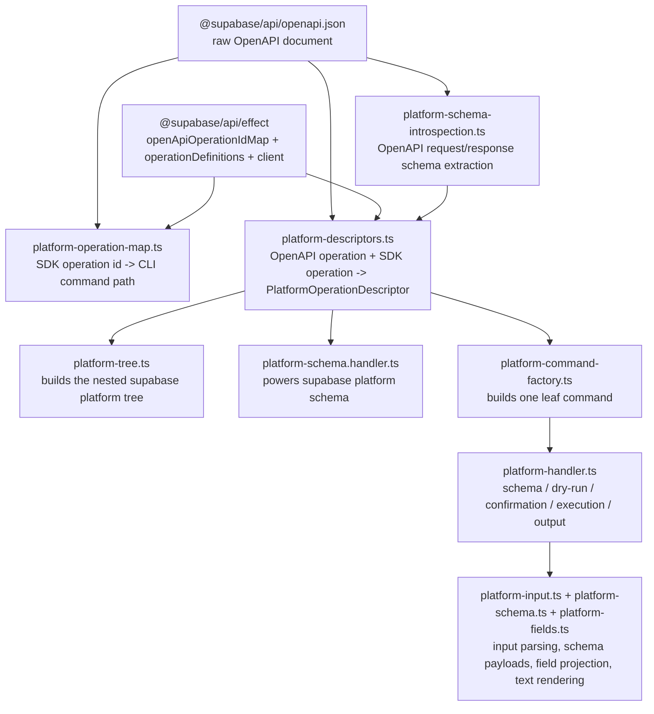

# Platform Command Generation

## Overview

The `platform` command tree in `@supabase/cli` is no longer a checked-in generated forest of command files. Instead, the CLI builds that tree dynamically at startup from the raw OpenAPI document exported by `@supabase/api`, then joins each OpenAPI operation back to the typed SDK operation it executes.

This keeps ownership clean:

- `@supabase/api` stays focused on the typed Management API SDK
- `@supabase/cli` owns the command surface, naming, input UX, and output UX
- the CLI does not parse the OpenAPI snapshot independently anymore

## Source Of Truth

The platform command system starts from three public exports in `@supabase/api`:

- `@supabase/api/openapi.json`
- `openApiOperationIdMap`
- `operationDefinitions` / `SupabaseApiClient`

The CLI treats the raw OpenAPI document as the metadata source of truth, then uses the id map to locate the matching typed SDK operation for decode and execution.

## High-Level Flow

## File Map

### Command tree construction

- `src/commands/platform/platform.command.ts`
  Stable command entrypoint expected by the CLI structure conventions. It currently re-exports the tree builder.
- `src/commands/platform/platform-tree.ts`
  Groups operation descriptors by command path and recursively builds the `platform` command tree.
- `src/commands/platform/platform-command-factory.ts`
  Creates one executable leaf command from one `PlatformOperationDescriptor`.

### Metadata and naming

- `src/commands/platform/platform-operation-map.ts`
  Resolves every SDK operation id to a CLI command path from OpenAPI path/method metadata plus CLI overrides.
- `src/commands/platform/platform-openapi.ts`
  Loads `@supabase/api/openapi.json`, joins raw OpenAPI ids to SDK ids, and exposes normalized raw operation entries.
- `src/commands/platform/platform-schema-introspection.ts`
  Converts raw OpenAPI request and response schemas into CLI request/response schema nodes.
- `src/commands/platform/platform-descriptors.ts`
  Assembles the final CLI-facing descriptor model for each OpenAPI operation plus its linked SDK operation.
- `src/commands/platform/platform-types.ts`
  Shared command-local types for descriptors, body kinds, and schema nodes.

### Execution and UX

- `src/commands/platform/platform-handler.ts`
  Shared execution flow for all generated platform commands.
- `src/commands/platform/platform-input.ts`
  Parses `--params`, `--json`, and `--body`, prompts for missing values, validates stdin usage, and builds dry-run previews.
- `src/commands/platform/platform-schema.ts`
  Builds the payload returned by `supabase platform schema ...`.
- `src/commands/platform/platform-fields.ts`
  Implements `--fields` projection and text-mode rendering.
- `src/commands/platform/platform-api-client.layer.ts`
  Wires auth and config into `SupabaseApiClient`.
- `src/commands/platform/platform.errors.ts`
  Command-local errors for auth, input, metadata, and schema lookup failures.

## Command Path Resolution

`platform-operation-map.ts` is where the CLI decides what the public platform command surface should be.

Most command paths are derived automatically from:

- the HTTP path
- the HTTP method
- the operation id

Some endpoints need explicit overrides to avoid awkward or unstable names. Examples:

- `v1AuthorizeUser` -> `platform oauth authorize`
- `v1DiffABranch` -> `platform branches diff`
- `v1ListJitAccess` -> `platform projects database jit list`
- bulk endpoints such as `projects secrets bulk-create`

The resolver validates two invariants eagerly:

- no duplicate command paths
- no prefix conflicts where one resolved command path would shadow another

If either invariant fails, CLI startup fails fast with a metadata error.

## Descriptor Model

Each SDK operation becomes one `PlatformOperationDescriptor`.

That descriptor keeps:

- operation id
- command path
- HTTP method and path
- short and long descriptions
- request metadata
- response schema
- an `execute` function that decodes input against the SDK schema and calls `SupabaseApiClient.execute`

The CLI-specific request model is intentionally smaller than the raw OpenAPI definition:

- `request.params`
  Path, query, and header inputs exposed through `--params`
- `request.body`
  One of `none | json | binary | multipart | urlencoded`

This is the core translation layer between API metadata and CLI UX.

## Request Input Flags

Every generated platform leaf command supports the same high-level flags:

- `--params`
  Non-body request input as inline JSON, or `-` for stdin
- `--json`
  Object-shaped request bodies
- `--body`
  Non-object bodies and raw body content, including JSON arrays/scalars and binary payloads
- `--body-file`
  File-backed raw request body input
- `--upload`
  Multipart binary field input as `field=path` or `field=-`
- `--fields`
  Response projection
- `--schema`
  Print the request and response schema instead of executing
- `--dry-run`
  Validate and preview the request without executing
- `--yes`
  Skip the confirmation prompt for mutating requests

### Body behavior

- JSON object body
  Use `--json`
- JSON array or scalar body
  Use `--body`
- `multipart/form-data`
  Use `--json` for structured fields and `--upload` for binary fields
- `application/x-www-form-urlencoded`
  Use `--json` with an object; the CLI serializes it as form data
- binary or file-like body
  Use `--body-file` or `--body -` for raw bytes

Only one of `--params`, `--json`, `--body`, or `--upload` may read from stdin in the same invocation.

### Binary body details

The CLI does not invent its own binary contract. It maps user input onto the binary types accepted by `@supabase/api`, where `Uint8Array` is the canonical byte representation.

- Raw binary request bodies
  Use `--body-file ./bundle.eszip` to load bytes from disk, or `--body -` to read bytes from stdin.
- Multipart binary fields
  Use repeated `--upload field=path` flags.
  Example:
  `--upload file=./bundle-1.eszip --upload file=./bundle-2.eszip`
- Multipart structured fields
  Keep object-valued fields such as `metadata` in `--json`. The CLI leaves them structured and the SDK serializes them as JSON text parts.
- Urlencoded bodies
  Pass structured fields with `--json`. The CLI serializes them as urlencoded form data.

Today this matters most for:

- `v1CreateAFunction`
- `v1UpdateAFunction`
- `v1DeployAFunction`

If the SDK binary contract changes, update this section together with `packages/api/docs/request-body-encoding.md`.
The user-facing contract is intentionally explained in command help, `supabase platform schema ...`, and runtime error suggestions, so future body-kind changes must update all three surfaces together.

## Schema And Dry Run

Two inspection flows are built on top of the same descriptors:

- `supabase platform schema <method>`
  Returns the normalized request/response schema and the available `--fields` projections
- `supabase platform ... --dry-run`
  Parses, prompts, validates, redacts sensitive values, and previews the outgoing request without executing it

The schema method name is derived from the command path by dropping `platform` and joining the remaining segments with dots.

Examples:

- `supabase platform projects create` -> `projects.create`
- `supabase platform oauth authorize` -> `oauth.authorize`

## Adding Or Updating An Endpoint

When the Management API changes, the normal workflow is:

1. Regenerate `@supabase/api`
2. Review the new operation in `platform-operation-map.ts`
3. Add an explicit override if the derived command path is awkward, ambiguous, or unstable
4. Run the platform metadata tests
5. Add or update request-shape tests if the endpoint introduces a new body pattern

In most cases, no CLI command file needs to be created manually. A new SDK operation becomes available automatically once:

- it has a resolved command path
- its schemas can be introspected into a descriptor

## Tests

The current platform coverage is split across a few focused tests:

- `platform-metadata.test.ts`
  Ensures every SDK operation maps to exactly one command path, checks normalization, and verifies body kinds
- `platform-input.test.ts`
  Covers request merging, prompting, and request-body parsing behavior
- `projects-create.integration.test.ts`
  Covers a representative JSON-object command flow
- `platform-bodies.integration.test.ts`
  Covers JSON array, binary, multipart, and urlencoded bodies
- `platform-schema.integration.test.ts`
  Covers `platform schema`
- targeted e2e tests
  Cover normalized command paths and representative command execution

## Design Notes

This architecture intentionally avoids reintroducing CLI-side checked-in OpenAPI codegen while still keeping the CLI on a standard metadata source.

If you need to change the platform command UX, prefer changing one of these local seams:

- `platform-openapi.ts` for raw spec loading and SDK id joins
- `platform-operation-map.ts` for naming
- `platform-descriptors.ts` for metadata shaping
- `platform-input.ts` for input rules
- `platform-handler.ts` for execution behavior
- `platform-schema.ts` for inspection output

If a future platform command needs bespoke UX that does not fit this generic model, it can coexist as a hand-written command without changing the rest of the generated tree.
