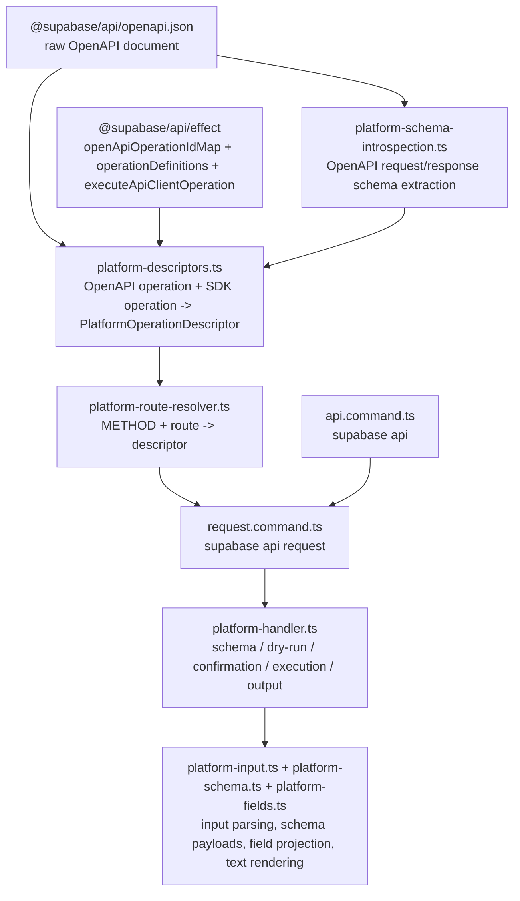

# Route-First Management API Commands

## Overview

The low-level Management API surface in `@supabase/cli` is now route-first and intentionally minimal:

- `supabase api routes`
- `supabase api request /v1/projects`
- `supabase api request /v1/projects --method POST`
- `supabase api request /v1/projects/{ref}/config/auth --schema`

The CLI no longer derives a separate public command vocabulary from the OpenAPI document. It keeps the OpenAPI route template as the user-facing identifier, lists discoverable routes directly from the exported spec metadata, resolves the matching operation, and executes the generated `api.v1.*` client directly.

This keeps ownership simple:

- `@supabase/api` owns the typed versioned client and operation metadata
- `@supabase/cli` owns route resolution, request UX, and output UX
- there is no CLI-side command tree generation, reflection, or operation-name rewriting

## Source Of Truth

The route-first `api` namespace uses these public `@supabase/api` exports:

- `@supabase/api/openapi.json`
- `openApiOperationIdMap`
- `operationDefinitions`
- `executeApiClientOperation`

The OpenAPI snapshot is the metadata source of truth. The typed SDK remains the execution source of truth.

## High-Level Flow

## File Map

### Command entrypoints

- `src/commands/platform/api.command.ts`
  Declares the `supabase api` namespace command and its `routes` and `request` subcommands.
- `src/commands/platform/request.command.ts`
  Implements `supabase api request <route>`.
- `src/commands/platform/routes.command.ts`
  Implements `supabase api routes`.
- `src/commands/platform/platform-route-resolver.ts`
  Resolves a normalized route template plus optional method into one operation descriptor.
- `src/commands/platform/platform-routes.ts`
  Derives the path-level route catalog and text rendering from descriptor metadata.

### Metadata and schemas

- `src/commands/platform/platform-openapi.ts`
  Loads `@supabase/api/openapi.json`, joins raw OpenAPI ids to SDK ids, and exposes normalized operation entries.
- `src/commands/platform/platform-schema-introspection.ts`
  Converts raw OpenAPI request and response schemas into CLI request/response schema nodes.
- `src/commands/platform/platform-descriptors.ts`
  Assembles the final CLI-facing descriptor model for each route/method pair and binds execution through the API package.
- `src/commands/platform/platform-types.ts`
  Shared command-local types for descriptors, body kinds, and schema nodes.

### Execution and UX

- `src/commands/platform/platform-handler.ts`
  Shared execution flow for route inspection, dry runs, confirmation, execution, and output.
- `src/commands/platform/platform-input.ts`
  Parses `--params`, `--json`, `--body`, `--body-file`, and `--upload`, prompts for missing values, validates stdin usage, and builds dry-run previews.
- `src/commands/platform/platform-schema.ts`
  Builds the payload returned by `supabase api request <route> --schema`.
- `src/commands/platform/platform-fields.ts`
  Implements `--fields` projection and text-mode rendering.
- `src/commands/platform/platform-cli.ts`
  Small route-first formatting helpers used in prompts, examples, and schema guidance.
- `src/auth/platform-api.layer.ts`
  Wires auth and config into the unified versioned `PlatformApi` client.

## Route Resolution

The request resolver works from the OpenAPI path template itself rather than a derived CLI method name.

Rules:

- Normalize the positional route so both `v1/projects` and `/v1/projects` work.
- If `--method` is provided, resolve the exact `METHOD + route` pair.
- If `--method` is omitted and the route has exactly one operation, use it.
- If `--method` is omitted and the route supports `GET`, default to `GET`.
- Otherwise fail with a clear error listing the supported methods.

This keeps the route template as the public identifier while still giving discovery and execution separate subcommands.

## Route Discovery

`supabase api routes` exposes a discovery-first view over the same metadata:

- group routes by OpenAPI `tags` in text output
- keep JSON output flat and machine-friendly
- support filtering by:
  - `--group`
  - `--method`
  - `--search`

The discovery flow is intentionally simple:

1. `supabase api routes`
2. `supabase api request <route> --schema`
3. `supabase api request <route> [--method ...]`

## Descriptor Model

Each OpenAPI operation becomes one `PlatformOperationDescriptor`.

That descriptor keeps:

- operation id
- HTTP method and path template
- available methods for the same route
- short and long descriptions
- request metadata
- response schema
- an `execute` function that decodes input and calls the API-owned generated executor, which in turn dispatches to `api.v1.*`

The CLI-specific request model is intentionally smaller than the raw OpenAPI definition:

- `request.params`
  Path, query, and header inputs exposed through `--params`
- `request.body`
  One of `none | json | binary | multipart | urlencoded`

## Request Input Flags

`supabase api request <route>` keeps one consistent flag surface:

- `--method`
  Select the HTTP method when a route exposes multiple operations
- `--params`
  Non-body request input as inline JSON, or `-` for stdin
- `--json`
  Object-shaped request bodies
- `--body`
  Non-object bodies and raw body content, including JSON arrays/scalars and binary payloads
- `--body-file`
  File-backed raw request body input
- `--upload`
  Multipart binary field input as `field=path` or `field=-`
- `--fields`
  Response projection
- `--schema`
  Print the request and response schema instead of executing
- `--dry-run`
  Validate and preview the request without executing
- `--yes`
  Skip the confirmation prompt for mutating requests

### Body behavior

- JSON object body
  Use `--json`
- JSON array or scalar body
  Use `--body`
- `multipart/form-data`
  Use `--json` for structured fields and `--upload` for binary fields
- `application/x-www-form-urlencoded`
  Use `--json` with an object; the CLI serializes it as form data
- binary or file-like body
  Use `--body-file` or `--body -` for raw bytes

Only one of `--params`, `--json`, `--body`, or `--upload` may read from stdin in the same invocation.

## Schema And Dry Run

Two inspection flows are built on top of the same descriptors:

- `supabase api routes`
  Lists discoverable route templates derived from the exported OpenAPI spec
- `supabase api request <route> --schema`
  Returns the normalized request/response schema and available `--fields` projections
- `supabase api request <route> --dry-run`
  Parses, prompts, validates, redacts sensitive values, and previews the outgoing request without executing it

For multi-method routes, include `--method` whenever you need the non-GET variant or the route does not expose `GET`.

Examples:

- `supabase api routes --group projects`
- `supabase api request /v1/projects`
- `supabase api request /v1/projects --method POST`
- `supabase api request /v1/projects/{ref}/config/auth --method PATCH --schema`

## Adding Or Updating An Endpoint

When the Management API changes, the normal workflow is:

1. Regenerate `@supabase/api`
2. Run the platform metadata and resolver tests
3. Update request-shape tests if the endpoint introduces a new body pattern
4. Update `api routes` / `api request` docs and examples if the endpoint needs bespoke help text

In most cases, no new CLI command file is needed. A new OpenAPI route becomes reachable automatically once:

- it appears in the generated API exports
- its schemas can be introspected into a descriptor

## Tests

The current route-first coverage is split across a few focused tests:

- `platform-metadata.unit.test.ts`
  Ensures every exported operation is covered exactly once and verifies route metadata/body kinds
- `platform-routes.unit.test.ts`
  Covers route discovery, grouping, filtering, help docs, and default method selection
- `platform-route-resolver.unit.test.ts`
  Covers route normalization, GET defaulting, sole-method fallback, and ambiguous-route errors
- `platform-input.unit.test.ts`
  Covers request merging, prompting, and request-body parsing behavior
- `projects-create.integration.test.ts`
  Covers a representative JSON-object route flow
- `platform-bodies.integration.test.ts`
  Covers JSON array, binary, multipart, and urlencoded bodies
- `platform-schema.integration.test.ts`
  Covers schema payload generation

## Design Notes

This architecture deliberately keeps the low-level CLI surface boring:

- the public identifier is the OpenAPI route template
- the only execution surface is `api.v1.*`
- the CLI does not derive or preserve a second management-command namespace

If a future route needs bespoke UX, a hand-written high-level command can still exist separately without complicating the low-level `api` surface.
