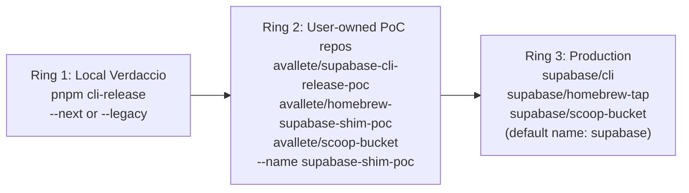
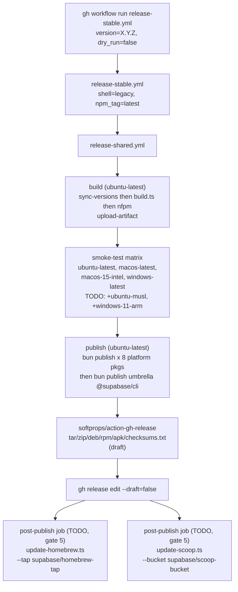

# Release Process

This document is the operational playbook for releasing the Supabase CLI TypeScript build. It covers three environments ("rings"):

1. **Ring 1 — Local Verdaccio.** Fastest feedback loop. Build and install the CLI from a local npm registry on your own machine. No network side-effects; no repo pushes.
2. **Ring 2 — User-owned PoC repos.** End-to-end validation through the exact same Homebrew / Scoop / GitHub-Release code paths production uses, but pointed at a reviewer's own GitHub account and a non-`supabase` artifact name. This is how ADR 0011 gates 2 and 3 are validated without risking the real production channels.
3. **Ring 3 — Production.** The real `supabase/cli` npm package + `supabase/homebrew-tap` + `supabase/scoop-bucket` + GitHub Releases on `supabase/cli`. Driven by GitHub Actions (`release-stable.yml` / `release-alpha.yml`).



Move outward one ring at a time. Only promote to production after Ring 2 has exercised the full channel end-to-end on a fresh machine.

See [ADR 0011](../../../docs/adr/0011-cli-release-and-distribution-strategy.md) for the decision record behind this process (why Bun SFE, why npm `optionalDependencies`, why nfpm, why no hosted apt/rpm repo, why unsigned).

---

## Ring 1 — Local Verdaccio

Use this loop while iterating on build scripts, the Node shim, or anything that changes what gets packed into `@supabase/cli` or `@supabase/cli-<platform>`. It installs the CLI into a local npm registry and lets you `npx --registry http://localhost:4873 @supabase/cli` as if you'd installed from npm.

Start the registry in one terminal:

```sh
pnpm local-registry
```

Publish the CLI into it from another terminal (current platform only, faster than a cross-platform build):

```sh
# TS-native shell only ("next"):
pnpm cli-release --next

# Legacy shell (TS shim + Go sidecar — requires Go on PATH and `pnpm repos:install`):
pnpm cli-release --legacy
```

Test it:

```sh
npx --registry http://localhost:4873 @supabase/cli@<printed-version> --version
```

`[tools/release/local-release.ts](../../../tools/release/local-release.ts)` does the heavy lifting: it builds the platform SFE (+ Go binary for `--legacy`) and the umbrella `@supabase/cli` package, materialises them in a `tmp` dir (so no workspace `package.json` is modified), and publishes both to Verdaccio. The cleanup is automatic even on failure.

This is the right ring for:

- Debugging the Node shim (`[apps/cli/src/shared/cli/bin.ts](../src/shared/cli/bin.ts)`) — which platform package gets resolved, `execFileSync` behaviour.
- Reproducing a `@supabase/cli`-from-npm experience without touching any remote.
- Verifying `SUPABASE_CLI_VERSION` injection propagates to `--version` output.

It is **not** a valid test for Homebrew or Scoop — those paths are covered in Ring 2.

---

## Ring 2 — Testing uploads with user-owned repos

This is how you validate the Homebrew formula, Scoop manifest, and GitHub-Release-host resolution on real infrastructure without touching `supabase/`\* repos or risking a clash with an already-installed `supabase` CLI on the reviewer's machine.

Both updater scripts support a `--name <custom>` flag that pushes the formula / manifest under a different name (e.g., `supabase-shim-poc`) and, when the name differs from `supabase`, renames the installed binary (`bin.install "supabase" => "supabase-shim-poc"` on Homebrew, `["supabase.exe", "supabase-shim-poc"]` alias-tuple on Scoop). This keeps the reviewer's real `supabase` CLI intact and makes it obvious which binary is being exercised.

### One-time setup (per reviewer)

Create three empty repos on your own GitHub account:

| Purpose                      | Repo name constraint                                                         | Example                                                                                         |
| ---------------------------- | ---------------------------------------------------------------------------- | ----------------------------------------------------------------------------------------------- |
| GitHub Release artifact host | None                                                                         | `[avallete/supabase-cli-release-poc](https://github.com/avallete/supabase-cli-release-poc)`     |
| Homebrew tap                 | Must be named `homebrew-<anything>` (so `brew tap <owner>/<anything>` works) | `[avallete/homebrew-supabase-shim-poc](https://github.com/avallete/homebrew-supabase-shim-poc)` |
| Scoop bucket                 | None                                                                         | `[avallete/scoop-bucket](https://github.com/avallete/scoop-bucket)`                             |

All three can be empty git trees — the updater scripts `gh repo clone` them into a tmpdir, write their generated file, commit, and push.

Authenticate the GitHub CLI once with write access to all three:

```sh
gh auth login
gh auth status  # verify: ✓ Logged in to github.com account <you>
```

### Dry-run: generate artifacts without pushing

The `--dry-run` flag on both updater scripts produces the `Formula/<name>.rb` and `<name>.json` in `dist/` and prints them, without cloning or pushing to the tap/bucket. Good for inspecting changes before they go out.

```sh
# Build all eight platform archives + linux packages + checksums.txt.
# Shell = legacy (ship the Go sidecar alongside the Bun SFE); use --shell next
# once we're actually cutting over to the TS-native CLI.
bun apps/cli/scripts/build.ts --version 0.0.1 --shell legacy

# Render the Homebrew formula against your PoC release host + tap.
bun apps/cli/scripts/update-homebrew.ts --version 0.0.1 \
    --repo avallete/supabase-cli-release-poc \
    --tap avallete/homebrew-supabase-shim-poc \
    --name supabase-shim-poc \
    --dry-run

# Render the Scoop manifest against your PoC release host + bucket.
bun apps/cli/scripts/update-scoop.ts --version 0.0.1 \
    --repo avallete/supabase-cli-release-poc \
    --bucket avallete/scoop-bucket \
    --name supabase-shim-poc \
    --dry-run
```

Inspect `dist/supabase-shim-poc.rb` and `dist/supabase-shim-poc.json`. The `sha256` / `hash` fields resolve against `dist/checksums.txt`; the `url` fields point at `https://github.com/avallete/supabase-cli-release-poc/releases/download/v0.0.1/...` (the release host specified by `--repo`).

### Upload the GitHub Release

The updater scripts do **not** create the GitHub Release or upload `dist/`\* — in production that's `[release-shared.yml](../../../.github/workflows/release-shared.yml)`'s `publish` job. For a PoC run, do it manually with `gh release create`:

```sh
gh release create v0.0.1 \
    --repo avallete/supabase-cli-release-poc \
    --title "v0.0.1" \
    --notes "Ring 2 validation release" \
    dist/supabase_0.0.1_darwin_arm64.tar.gz \
    dist/supabase_0.0.1_darwin_amd64.tar.gz \
    dist/supabase_0.0.1_linux_arm64.tar.gz \
    dist/supabase_0.0.1_linux_amd64.tar.gz \
    dist/supabase_0.0.1_linux_arm64.deb \
    dist/supabase_0.0.1_linux_amd64.deb \
    dist/supabase_0.0.1_linux_arm64.rpm \
    dist/supabase_0.0.1_linux_amd64.rpm \
    dist/supabase_0.0.1_linux_arm64.apk \
    dist/supabase_0.0.1_linux_amd64.apk \
    dist/supabase_0.0.1_windows_amd64.zip \
    dist/supabase_0.0.1_windows_arm64.zip \
    dist/checksums.txt
```

### Push formula + manifest to PoC tap / bucket

Rerun the updater scripts without `--dry-run`. They clone the target repo into a tmpdir, write the new file, commit with message `<name> <version>`, and push.

```sh
bun apps/cli/scripts/update-homebrew.ts --version 0.0.1 \
    --repo avallete/supabase-cli-release-poc \
    --tap avallete/homebrew-supabase-shim-poc \
    --name supabase-shim-poc

bun apps/cli/scripts/update-scoop.ts --version 0.0.1 \
    --repo avallete/supabase-cli-release-poc \
    --bucket avallete/scoop-bucket \
    --name supabase-shim-poc
```

### User-side install commands

These are what a fresh reviewer would run — no repo clone required.

**macOS / Linux (Homebrew):**

```sh
brew tap avallete/supabase-shim-poc   # note: "avallete/<tap-suffix>", not the full repo name
brew install supabase-shim-poc
supabase-shim-poc --version           # expect: supabase v0.0.1
brew test supabase-shim-poc           # expect: pass
```

The `brew tap <owner>/<suffix>` command looks up `https://github.com/<owner>/homebrew-<suffix>`. That's why the tap repo must be named `homebrew-supabase-shim-poc`, not just `supabase-shim-poc`.

**Windows (Scoop):**

```powershell
scoop bucket add avallete-poc https://github.com/avallete/scoop-bucket
scoop install supabase-shim-poc
supabase-shim-poc --version           # expect: supabase v0.0.1
```

Validated on Windows x64 (`v0.0.1`, 2026-04-21): installed with no SmartScreen block on the unsigned Bun SFE, `--version` output matched. Windows arm64 (Surface / Copilot+ / ARM VM) still pending — needs hardware or a Windows-on-ARM VM to exercise the `windows_arm64.zip` archive added by this branch.

### What to validate

Beyond `--version` and `brew test`, exercise a Phase-0 proxied subcommand that requires the `supabase-go` sidecar (`--shell legacy` only):

```sh
supabase-shim-poc projects list --help
```

This must spawn the colocated `supabase-go` and print help text — not return `NotFound: ChildProcess.spawn (supabase ...)`. If it fails, the Homebrew install step is wrong: check that `[apps/cli/scripts/update-homebrew.ts](../scripts/update-homebrew.ts)`'s install-lines block ran `bin.install "supabase-go" if File.exist?("supabase-go")`, and that the built archive actually contains `supabase-go` (it should, for any `--shell legacy` build).

### Local-artifact testing (no GitHub Release upload)

Both updater scripts also support `--local`, which generates a formula/manifest pointing at `file://$PWD/dist/...` instead of a GitHub URL. Useful for a totally offline test:

```sh
bun apps/cli/scripts/update-homebrew.ts --version 0.0.1 \
    --name supabase-shim-poc --local --dry-run > /tmp/supabase-shim-poc.rb

brew install --build-from-source /tmp/supabase-shim-poc.rb
```

```powershell
bun apps/cli/scripts/update-scoop.ts --version 0.0.1 `
    --name supabase-shim-poc --local --dry-run
# Copy the JSON from dist/supabase-shim-poc.json, then:
scoop install .\dist\supabase-shim-poc.json
```

---

## Ring 3 — Production release flow [TO TEST]

Production releases are driven by two thin trigger workflows on top of one shared implementation:

- `[.github/workflows/release-stable.yml](../../../.github/workflows/release-stable.yml)` — `shell=legacy`, `npm_tag=latest`, `prerelease=false`. This is what real users get when they run `npm i -g @supabase/cli` or `brew install supabase`.
- `[.github/workflows/release-alpha.yml](../../../.github/workflows/release-alpha.yml)` — `shell=next`, `npm_tag=alpha`, `prerelease=true`. Opt-in TS-native CLI for early adopters. Homebrew / Scoop are **not** updated from alpha releases.

Both call `[release-shared.yml](../../../.github/workflows/release-shared.yml)` with different inputs.



### Trigger

Via the GitHub UI (Actions → Release Stable / Release Alpha → Run workflow) or the `gh` CLI:

```sh
# Dry run first — every production release SHOULD be exercised with dry_run=true once:
gh workflow run release-stable.yml \
    --field version=0.1.0 \
    --field dry_run=true

# Real run:
gh workflow run release-stable.yml \
    --field version=0.1.0 \
    --field dry_run=false
```

Alpha is identical with `release-alpha.yml`.

### What each job does

`**build` (ubuntu-latest):\*\*

1. `[pnpm exec bun apps/cli/scripts/sync-versions.ts --version X.Y.Z](../scripts/sync-versions.ts)` — writes the release version into every `package.json` (umbrella + eight platform packages) and resolves the umbrella's `workspace:`\* `optionalDependencies` to `X.Y.Z`.
2. `[pnpm exec bun apps/cli/scripts/build.ts --version X.Y.Z --shell <legacy|next>](../scripts/build.ts)` — cross-compiles the Bun SFE for all eight targets (including windows-arm64), cross-compiles the Go sidecar (`--shell legacy` only), builds the six Linux packages via `nfpm`, produces the tar/zip archives, and writes `dist/checksums.txt`.
3. `actions/upload-artifact` preserves `packages/cli-*/bin/` and `dist/` for the downstream jobs.

`**smoke-test` (matrix: `ubuntu-latest`, `macos-latest`, `macos-15-intel`, `windows-latest`):\*\*

Downloads the build artifact, makes the SFE executable (`chmod +x` on non-Windows), installs Scoop on Windows, and runs `pnpm run test:smoke -- --version X.Y.Z --tag <latest|alpha>` from `apps/cli`. Any failure blocks publishing.

The matrix does not yet include `windows-11-arm` (gate 6) or an Alpine musl runner (also gate 6). Until those land, arm64 / musl regressions only surface in Ring 2 validation.

`**publish` (ubuntu-latest, `if: !inputs.dry_run`):\*\*

1. Re-runs `sync-versions.ts` (download-artifact restores file modes but not JSON mutations).
2. `[pnpm exec bun apps/cli/scripts/publish.ts --tag <latest|alpha>](../scripts/publish.ts)` — publishes the eight platform packages in parallel, then the umbrella package last so `optionalDependencies` resolve cleanly at install time.
3. `softprops/action-gh-release` creates a **draft** Release `v<version>` on `supabase/cli` with all tar / zip / deb / rpm / apk + `checksums.txt`.
4. `gh release edit v<version> --draft=false` finalises it (immutable from this point).

### Post-publish: Homebrew + Scoop (currently manual — ADR 0011 gate 5)

Until gate 5 lands, the updater scripts run from a maintainer's checkout after the GitHub Release is finalised. Only for `latest` — alpha does not update Homebrew or Scoop.

```sh
# Re-download the finalised Release assets so checksums.txt resolves against
# the real, published archives (bytes-identical to what CI produced).
gh release download v0.1.0 --repo supabase/cli --dir dist

bun apps/cli/scripts/update-homebrew.ts --version 0.1.0
bun apps/cli/scripts/update-scoop.ts --version 0.1.0
```

Both scripts default `--repo supabase/cli`, `--tap supabase/homebrew-tap`, `--bucket supabase/scoop-bucket`, `--name supabase`, so no flags are needed for the production path. Each script clones the target repo into a tmpdir, writes `Formula/supabase.rb` / `supabase.json`, commits, and pushes.

**The release is not complete** until both updaters have pushed. Users installing via `brew install supabase` or `scoop install supabase` resolve against the tap/bucket, not against npm.

### Verification

After `release-shared.yml` finishes and the two updater scripts have pushed:

```sh
npm view @supabase/cli@0.1.0 dist-tags   # expect: latest: 0.1.0
gh release view v0.1.0 --repo supabase/cli

# macOS / Linux:
brew update && brew upgrade supabase
supabase --version   # expect: supabase v0.1.0

# Windows:
scoop update
scoop install supabase
supabase --version   # expect: supabase v0.1.0
```

### Rollback

The per-channel artifacts are immutable once published, so rollback = point users at the previous good version:

1. **npm:** `npm dist-tag add @supabase/cli@<prev-good-version> latest`. The broken version stays installable but loses the `latest` tag.
2. **GitHub Release:** `gh release delete v<broken-version> --repo supabase/cli` (or mark it `prerelease: true` via `gh release edit` to keep the tag around). Artifacts remain downloadable unless the release itself is deleted.
3. **Homebrew:** in `supabase/homebrew-tap`, `git revert <commit that wrote Formula/supabase.rb for broken version>` + push. `brew update` picks it up.
4. **Scoop:** same pattern in `supabase/scoop-bucket` — `git revert` the manifest commit.

Rollback is straightforward because each channel is its own commit / release. There's no cross-channel state to reconcile.

---

## See Also

- [ADR 0011](../../../docs/adr/0011-cli-release-and-distribution-strategy.md) — the decision record. Channel choices, signing rationale, open pre-cutover gates.
- `[apps/cli/docs/binary-distribution.md](./binary-distribution.md)` — why each platform package contains two binaries (`supabase` SFE + `supabase-go` sidecar) and how they're resolved at runtime.
- `[tools/release/local-release.ts](../../../tools/release/local-release.ts)` — Ring 1 implementation.
- `[apps/cli/scripts/build.ts](../scripts/build.ts)`, `[publish.ts](../scripts/publish.ts)`, `[sync-versions.ts](../scripts/sync-versions.ts)`, `[update-homebrew.ts](../scripts/update-homebrew.ts)`, `[update-scoop.ts](../scripts/update-scoop.ts)` — release script implementations.
- `[.github/workflows/release-shared.yml](../../../.github/workflows/release-shared.yml)`, `[release-stable.yml](../../../.github/workflows/release-stable.yml)`, `[release-alpha.yml](../../../.github/workflows/release-alpha.yml)` — Ring 3 pipeline.
