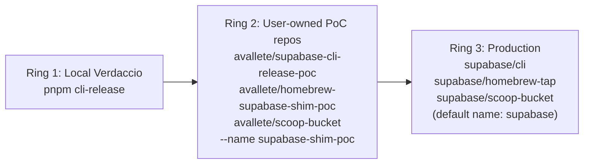
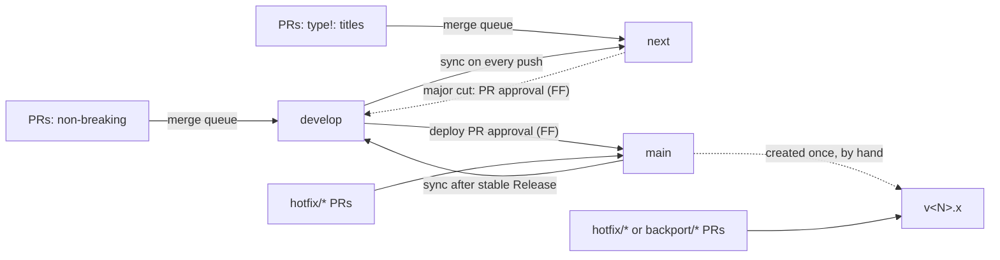
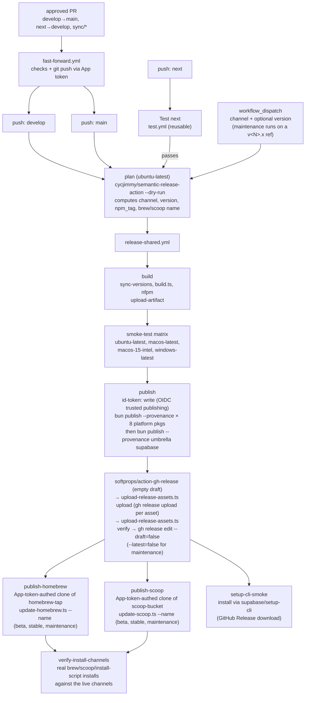

# Release Process

This document is the operational playbook for releasing the Supabase CLI TypeScript build. It covers three environments ("rings"):

1. **Ring 1 — Local Verdaccio.** Fastest feedback loop. Build and install the CLI from a local npm registry on your own machine. No network side-effects; no repo pushes.
2. **Ring 2 — User-owned PoC repos.** End-to-end validation through the exact same Homebrew / Scoop / GitHub-Release code paths production uses, but pointed at a reviewer's own GitHub account and a non-`supabase` artifact name. This is how ADR 0011 gates 2 and 3 are validated without risking the real production channels.
3. **Ring 3 — Production.** The real `supabase` npm package + `supabase/homebrew-tap` + `supabase/scoop-bucket` + GitHub Releases on `supabase/cli`. Driven by GitHub Actions (`release.yml`, which dispatches four channels — `beta`, `stable`, `next`, `maintenance` — into the shared `release-shared.yml`).


```mermaid
flowchart LR
    local["Ring 1: Local Verdaccio<br/>pnpm cli-release"]
    poc["Ring 2: User-owned PoC repos<br/>avallete/supabase-cli-release-poc<br/>avallete/homebrew-supabase-shim-poc<br/>avallete/scoop-bucket<br/>--name supabase-shim-poc"]
    prod["Ring 3: Production<br/>supabase/cli<br/>supabase/homebrew-tap<br/>supabase/scoop-bucket<br/>(default name: supabase)"]

    local --> poc --> prod
```

Move outward one ring at a time. Only promote to production after Ring 2 has exercised the full channel end-to-end on a fresh machine.

See [ADR 0011](../../../docs/adr/0011-cli-release-and-distribution-strategy.md) for the decision record behind this process (why Bun SFE, why npm `optionalDependencies`, why nfpm, why no hosted apt/rpm repo, why unsigned).

---

## Ring 1 — Local Verdaccio

Use this loop while iterating on build scripts, the Node shim, or anything that changes what gets packed into `supabase` or `@supabase/cli-<platform>`. It installs the CLI into a local npm registry and lets you `npx --registry http://localhost:4873 supabase` as if you'd installed from npm.

Start the registry in one terminal:

```sh
pnpm local-registry
```

Publish the CLI into it from another terminal (current platform only, faster than a cross-platform build):

```sh
# CLI (Bun SFE + Go sidecar — requires Go on PATH and `pnpm repos:install`):
pnpm cli-release
```

Test it:

```sh
npx --registry http://localhost:4873 supabase@<printed-version> --version
```

`[tools/release/local-release.ts](../../../tools/release/local-release.ts)` does the heavy lifting: it builds the platform SFE (+ Go sidecar) and the umbrella `supabase` package, materialises them in a `tmp` dir (so no workspace `package.json` is modified), and publishes both to Verdaccio. The cleanup is automatic even on failure.

This is the right ring for:

- Debugging the Node shim (`[apps/cli/src/shared/cli/bin.ts](../src/shared/cli/bin.ts)`) — which platform package gets resolved, `execFileSync` behaviour.
- Reproducing a `supabase`-from-npm experience without touching any remote.
- Verifying `SUPABASE_CLI_VERSION` injection propagates to `--version` output.

It is **not** a valid test for Homebrew or Scoop — those paths are covered in Ring 2.

---

## Ring 2 — Testing uploads with user-owned repos

This is how you validate the Homebrew formula, Scoop manifest, and GitHub-Release-host resolution on real infrastructure without touching `supabase/`\* repos or risking a clash with an already-installed `supabase` CLI on the reviewer's machine.

Both updater scripts support a `--name <custom>` flag that pushes the formula / manifest under a different name (e.g., `supabase-shim-poc`) — that is, a different filename and Ruby class / scoop manifest. The installed binary is always `supabase` (matching the Go CLI), so PoC reviewers should `brew uninstall supabase` / `scoop uninstall supabase` first if they already have the official CLI installed.

### One-time setup (per reviewer)

Create three empty repos on your own GitHub account:

| Purpose                      | Repo name constraint                                                         | Example                                                                                         |
| ---------------------------- | ---------------------------------------------------------------------------- | ----------------------------------------------------------------------------------------------- |
| GitHub Release artifact host | None                                                                         | `[avallete/supabase-cli-release-poc](https://github.com/avallete/supabase-cli-release-poc)`     |
| Homebrew tap                 | Must be named `homebrew-<anything>` (so `brew tap <owner>/<anything>` works) | `[avallete/homebrew-supabase-shim-poc](https://github.com/avallete/homebrew-supabase-shim-poc)` |
| Scoop bucket                 | None                                                                         | `[avallete/scoop-bucket](https://github.com/avallete/scoop-bucket)`                             |

All three can be empty git trees. The downstream updater scripts clone the Homebrew tap / Scoop bucket into a tmpdir with git, write their generated file, commit, and push.

Authenticate the GitHub CLI once with write access to all three:

```sh
gh auth login
gh auth status  # verify: ✓ Logged in to github.com account <you>
```

### Dry-run: generate artifacts without pushing

The `--dry-run` flag on both updater scripts produces the `Formula/<name>.rb` and `<name>.json` in `dist/` and prints them, without cloning or pushing to the tap/bucket. Good for inspecting changes before they go out.

```sh
# Build all eight platform archives + linux packages + checksums.txt.
# Ships the Go sidecar alongside the Bun SFE.
bun apps/cli/scripts/build.ts --version 0.0.1

# Render the Homebrew formula against your PoC release host + tap.
bun apps/cli/scripts/update-homebrew.ts --version 0.0.1 \
    --repo avallete/supabase-cli-release-poc \
    --tap avallete/homebrew-supabase-shim-poc \
    --name supabase-shim-poc \
    --dry-run

# Render the Scoop manifest against your PoC release host + bucket.
bun apps/cli/scripts/update-scoop.ts --version 0.0.1 \
    --repo avallete/supabase-cli-release-poc \
    --bucket avallete/scoop-bucket \
    --name supabase-shim-poc \
    --dry-run
```

Inspect `dist/supabase-shim-poc.rb` and `dist/supabase-shim-poc.json`. The `sha256` / `hash` fields resolve against `dist/checksums.txt`; the `url` fields point at `https://github.com/avallete/supabase-cli-release-poc/releases/download/v0.0.1/...` (the release host specified by `--repo`).

### Upload the GitHub Release

The updater scripts do **not** create the GitHub Release or upload `dist/`\* — in production that's `[release-shared.yml](../../../.github/workflows/release-shared.yml)`'s `publish` job. For a PoC run, do it manually with `gh release create`:

```sh
gh release create v0.0.1 \
    --repo avallete/supabase-cli-release-poc \
    --title "v0.0.1" \
    --notes "Ring 2 validation release" \
    dist/supabase_0.0.1_darwin_arm64.tar.gz \
    dist/supabase_0.0.1_darwin_amd64.tar.gz \
    dist/supabase_0.0.1_linux_arm64.tar.gz \
    dist/supabase_0.0.1_linux_amd64.tar.gz \
    dist/supabase_0.0.1_linux_arm64.deb \
    dist/supabase_0.0.1_linux_amd64.deb \
    dist/supabase_0.0.1_linux_arm64.rpm \
    dist/supabase_0.0.1_linux_amd64.rpm \
    dist/supabase_0.0.1_linux_arm64.apk \
    dist/supabase_0.0.1_linux_amd64.apk \
    dist/supabase_0.0.1_windows_amd64.zip \
    dist/supabase_0.0.1_windows_arm64.zip \
    dist/checksums.txt
```

### Push formula + manifest to PoC tap / bucket

Rerun the updater scripts without `--dry-run`. They clone the target repo into a tmpdir, write the new file, commit with message `<name> <version>`, and push.

```sh
bun apps/cli/scripts/update-homebrew.ts --version 0.0.1 \
    --repo avallete/supabase-cli-release-poc \
    --tap avallete/homebrew-supabase-shim-poc \
    --name supabase-shim-poc

bun apps/cli/scripts/update-scoop.ts --version 0.0.1 \
    --repo avallete/supabase-cli-release-poc \
    --bucket avallete/scoop-bucket \
    --name supabase-shim-poc
```

### User-side install commands

These are what a fresh reviewer would run — no repo clone required.

**macOS / Linux (Homebrew):**

```sh
brew uninstall supabase || true       # PoC formula installs a `supabase` binary too
brew tap avallete/supabase-shim-poc   # note: "avallete/<tap-suffix>", not the full repo name
brew install supabase-shim-poc
supabase --version                    # expect: supabase v0.0.1
brew test supabase-shim-poc           # expect: pass
```

The `brew tap <owner>/<suffix>` command looks up `https://github.com/<owner>/homebrew-<suffix>`. That's why the tap repo must be named `homebrew-supabase-shim-poc`, not just `supabase-shim-poc`.

**Windows (Scoop):**

```powershell
scoop uninstall supabase  # PoC manifest also shims `supabase.exe`
scoop bucket add avallete-poc https://github.com/avallete/scoop-bucket
scoop install supabase-shim-poc
supabase --version        # expect: supabase v0.0.1
```

Validated on Windows x64 (`v0.0.1`, 2026-04-21): installed with no SmartScreen block on the unsigned Bun SFE, `--version` output matched. Windows arm64 (Surface / Copilot+ / ARM VM) still pending — needs hardware or a Windows-on-ARM VM to exercise the `windows_arm64.zip` archive added by this branch.

### What to validate

Beyond `--version` and `brew test`, exercise a Phase-0 proxied subcommand that requires the `supabase-go` sidecar:

```sh
supabase completion bash
```

This must spawn the colocated `supabase-go` and print the generated completion script — not return `NotFound: ChildProcess.spawn (supabase ...)`. (`supabase --version` is served by the Bun wrapper and never touches the sidecar, so it is not a sufficient check on its own.) If it fails, the Homebrew install step is wrong: check that `[apps/cli/scripts/update-homebrew.ts](../scripts/update-homebrew.ts)`'s install-lines block ran `bin.install "supabase-go" if File.exist?("supabase-go")`, and that the built archive actually contains `supabase-go` (it should, for any release build).

### Local-artifact testing (no GitHub Release upload)

Both updater scripts also support `--local`, which generates a formula/manifest pointing at `file://$PWD/dist/...` instead of a GitHub URL. Useful for a totally offline test:

```sh
bun apps/cli/scripts/update-homebrew.ts --version 0.0.1 \
    --name supabase-shim-poc --local --dry-run > /tmp/supabase-shim-poc.rb

brew install --build-from-source /tmp/supabase-shim-poc.rb
```

```powershell
bun apps/cli/scripts/update-scoop.ts --version 0.0.1 `
    --name supabase-shim-poc --local --dry-run
# Copy the JSON from dist/supabase-shim-poc.json, then:
scoop install .\dist\supabase-shim-poc.json
```

---

## Ring 3 — Production release flow

Production releases live in a single `[.github/workflows/release.yml](../../../.github/workflows/release.yml)` that dispatches four channels into the shared `[release-shared.yml](../../../.github/workflows/release-shared.yml)`:

| Channel     | Trigger                               | npm dist-tag  | brew / scoop name                       | GH release              | Version        |
| ----------- | ------------------------------------- | ------------- | --------------------------------------- | ----------------------- | -------------- |
| beta        | push: develop                         | `beta`        | `supabase-beta`                         | prerelease              | `X.Y.Z-beta.N` |
| stable      | push: main (post-FF)                  | `latest`      | `supabase`                              | latest                  | `X.Y.Z`        |
| next        | push: next (after `Test next` passes) | `next`        | none                                    | prerelease              | `X.Y.Z-next.N` |
| maintenance | manual dispatch on a `v<N>.x` ref     | `v<N>.stable` | `supabase@<N>` / `supabase-v<N>-stable` | published, never latest | `N.Y.Z`        |

`beta` auto-publishes on every merge to `develop` (CLI). `stable` auto-publishes after a develop→main fast-forward, which itself happens when the weekly `[deploy.yml](../../../.github/workflows/deploy.yml)` cron PR is approved (the FF push to `main` re-fires `release.yml` via the `push: branches: [main]` trigger). `next` auto-publishes on every push to the `next` branch, and `maintenance` is dispatched by hand (see [Maintenance lines](#maintenance-lines)).

Versions are computed by `cycjimmy/semantic-release-action` from the first line of each squash commit (the PR title). Conventional commit titles use `feat:` → minor, `fix:`, `perf:`, or `revert:` → patch, and `!` after the type or scope (`feat!:` / `fix(scope)!:`) → major. Commit bodies, including `BREAKING CHANGE` notes, are ignored for version calculation. The `release` config lives in `apps/cli/package.json`: `develop` is a `beta` prerelease branch, `next` is a `next` prerelease branch, `main` emits plain `X.Y.Z`, and a wildcard entry `v+([0-9]).x` turns every `v<N>.x` branch into a maintenance line on the `v<N>.stable` channel (the entry is ignored while no such branch exists).

`alpha` remains an accepted npm tag in the scripts but no workflow publishes it. [ADR 0028](../../../docs/adr/0028-release-branches-and-maintenance-lines.md) records the channel layout.

### Branches and promotion paths

| Branch    | Holds                                                    | Lands via                                                             |
| --------- | -------------------------------------------------------- | --------------------------------------------------------------------- |
| `develop` | Non-breaking integration                                 | PRs through the merge queue; `next` → `develop` cut (approval FF)     |
| `main`    | Stable                                                   | develop → main deploy PR (approval FF); `hotfix/*` PRs                |
| `next`    | Breaking-change integration for the next major           | PRs titled `type(scope)!:` through the merge queue; sync from develop |
| `v<N>.x`  | Maintenance for a past major, created by hand at the cut | `hotfix/*` or `backport/*` PRs                                        |


```mermaid
flowchart LR
    feat["PRs: non-breaking"] -->|merge queue| develop
    brk["PRs: type!: titles"] -->|merge queue| next
    develop -->|"sync on every push"| next
    develop -->|"deploy PR approval (FF)"| main
    main -->|"sync after stable Release"| develop
    next -.->|"major cut: PR approval (FF)"| develop
    hot["hotfix/* PRs"] --> main
    main -.->|"created once, by hand"| vN["v&lt;N&gt;.x"]
    back["hotfix/* or backport/* PRs"] --> vN
```


```mermaid
flowchart TD
    pushDev[push: develop] --> plan
    pushMain[push: main] --> plan
    pushNext[push: next] --> testNext["Test next<br/>test.yml (reusable)"]
    testNext -->|passes| plan
    pr["approved PR<br/>develop→main, next→develop, sync/*"] --> ff["fast-forward.yml<br/>checks + git push via App token"]
    ff --> pushMain
    ff --> pushDev
    dispatch["workflow_dispatch<br/>channel + optional version<br/>(maintenance runs on a v&lt;N&gt;.x ref)"] --> plan

    plan["plan (ubuntu-latest)<br/>cycjimmy/semantic-release-action --dry-run<br/>computes channel, version, npm_tag, brew/scoop name"]
    plan --> shared

    shared["release-shared.yml"]
    shared --> build["build<br/>sync-versions, build.ts, nfpm<br/>upload-artifact"]
    build --> smoke["smoke-test matrix<br/>ubuntu-latest, macos-latest,<br/>macos-15-intel, windows-latest"]
    smoke --> pub["publish<br/>id-token: write (OIDC trusted publishing)<br/>bun publish --provenance × 8 platform pkgs<br/>then bun publish --provenance umbrella supabase"]
    pub --> rel["softprops/action-gh-release (empty draft)<br/>→ upload-release-assets.ts upload (gh release upload per asset)<br/>→ upload-release-assets.ts verify → gh release edit --draft=false<br/>(--latest=false for maintenance)"]
    rel --> hb["publish-homebrew<br/>App-token-authed clone of homebrew-tap<br/>update-homebrew.ts --name <brew_name><br/>(beta, stable, maintenance)"]
    rel --> sc["publish-scoop<br/>App-token-authed clone of scoop-bucket<br/>update-scoop.ts --name <scoop_name><br/>(beta, stable, maintenance)"]
    rel --> sucs["setup-cli-smoke<br/>install via supabase/setup-cli<br/>(GitHub Release download)"]
    hb --> vic["verify-install-channels<br/>real brew/scoop/install-script installs<br/>against the live channels"]
    sc --> vic
```

### Trigger

Most releases are automatic — merge a PR into `develop` (beta) or `next` (next), or approve the weekly Prod-Deploy PR into `main` (stable). Hotfixes use the same production gate: a reviewed `hotfix/*` PR targets `main`, and the resulting `main` push triggers the stable release path. Maintenance releases are always dispatched by hand on the `v<N>.x` ref. For a one-off override, dispatch manually:

```sh
# Manual beta or stable override (operator-supplied version):
gh workflow run release.yml \
    --field channel=beta \
    --field version=0.0.0-beta.99 \
    --field dry_run=true
```

Auto-trigger paths leave `version` empty: semantic-release computes it from commits since the last tag. A dispatch with an empty `version` does the same for the dispatched ref, and fails if the channel does not match the ref or if semantic-release computes no release.

The plan job refuses a dispatch when:

- `channel=next` is not on the `next` ref, or `channel=maintenance` is not on a `v<N>.x` ref;
- `next` or a `v<N>.x` ref is dispatched with `beta` or `stable` (those refs release only their own channel);
- `channel=stable` is not a dry run and the ref is neither `main` nor `hotfix/*` (the `hotfix/*` dry run in [Hotfix release flow](#hotfix-release-flow) is unaffected);
- a non-empty `version` is not `X.Y.Z` or `X.Y.Z-<prerelease>` (no `v` prefix, no build metadata).

### Hotfix release flow

Use a hotfix when an urgent stable fix must ship before the next scheduled `develop` -> `main` promotion. The hotfix path deliberately reuses the production PR gate instead of adding a second approval mechanism:

1. Branch from the current `main` tip:

   ```sh
   git fetch origin main
   git switch -c hotfix/<short-description> origin/main
   ```

2. Make the smallest safe fix and open a PR from `hotfix/<short-description>` into `main`.
3. Before merging, run a release dry run against the hotfix branch and the next unique stable version:

   ```sh
   gh workflow run release.yml \
       --ref hotfix/<short-description> \
       --field channel=stable \
       --field version=<next-patch-version> \
       --field dry_run=true
   ```

4. After review and green checks, merge the hotfix PR into `main`. The `push: main` trigger runs the normal stable release pipeline and publishes the next semantic-release version.
5. Watch the stable release workflow through publish, Homebrew/Scoop updates, and verification.
6. Confirm that `Sync branches` (`main-into-develop`) succeeds. It merges `main` back into `develop` after a successful `Release` run on `main`, keeping the hotfix reachable from the next beta and the next scheduled production deploy. If the sync conflicts it opens a sync PR; resolve it as described in [Sync and fast-forward](#sync-and-fast-forward) before the next production promotion. The `develop` → `next` sync then carries the fix on to `next`.

Do not use `workflow_dispatch dry_run=false` as the normal hotfix path. Manual stable dispatch is reserved for re-cutting a unique version after an interrupted or stale-bytes release. Hotfixes should land through a PR to `main` so the production source of truth and release tag history stay aligned.

### The `next` channel

`next` is one long-lived branch reused for every future major. Breaking PRs target `next` instead of `develop`, with a `type(scope)!:` title; they use the same merge queue, required checks, and review as `develop`. The `Lint Pull Request` check fails any `!` title whose base is not `next`, with one exception: the `next` → `develop` cut PR.

Every push to `next` first runs the full `test.yml` suite (the `Test next` job in `release.yml`). Only when it passes does the pipeline plan and publish `X.Y.Z-next.N` to the npm `next` dist-tag and a GitHub prerelease. `next` has no Homebrew, Scoop, or Linear publication. It does get the raw semantic-release changelog on its GitHub Release (`backfill-release-notes`); the LLM-proposed notes PR is stable-only, and `apply-release-notes` still accepts `-next` tags for a manual proposal.

`next` publishes use the `next` prerelease identifier so versions never collide with `beta` on npm after a cut. After a stable release, semantic-release on `next` computes past it on the following push. The npm `next` dist-tag is not moved by the stable release, because publishing is OIDC-only and `npm dist-tag add` needs a token the pipeline does not hold; `supabase@next` catches up on the next push to `next`. A release can be re-cut by dispatching `release.yml` with `channel=next` on the `next` ref.

The nightly live e2e run covers `main`, `develop`, and `next`.

### Sync and fast-forward

`[sync-branches.yml](../../../.github/workflows/sync-branches.yml)` (`Sync branches`) keeps the branches ordered. It replaces the former `Sync main to develop` workflow.

| Pair                | Trigger                                                    |
| ------------------- | ---------------------------------------------------------- |
| `main-into-develop` | a successful `Release` run on `main` (and manual dispatch) |
| `develop-into-next` | every push to `develop` (and manual dispatch)              |

Only these two pairs exist. A sync PR is accepted only from the release App bot, only from `sync/main-into-develop` into `develop` or `sync/develop-into-next` into `next`; any other `sync/*` head (including the `sync/api-package` and `sync/api-types` bot PRs, which keep auto-merging) is not a fast-forward PR. A hand-made PR from one of those two branches is refused with a comment: close it and run `gh workflow run sync-branches.yml -f pair=<pair>`.

A clean merge is pushed straight to the target with the release GitHub App token. If the target branch does not exist (for example `next` before it is created), the run skips cleanly.

On a conflict the workflow opens a **sync PR**:

- Branch `sync/<source>-into-<target>`, pointing at the **source** tip, so the PR has commits and GitHub reports it as conflicting.
- PR into `<target>` titled `chore(repo): sync <source> into <target>`, labelled `do not merge`, listing the conflicting files and the resolution commands.
- While that PR is open, further syncs for the pair skip.

Resolve by merging the target into the sync branch and pushing:

```sh
git fetch origin
git switch sync/develop-into-next        # or the branch named in the PR
git merge origin/next                    # the target; resolve conflicts, commit
git push origin sync/develop-into-next
```

The PR is authored by the release App, so the person who resolved it can approve it. This is an accepted decision: sync resolvers are trusted maintainers with write access, and the resolution content is not independently reviewed. `bot-pr-auto-merge.yml` excludes both sync heads so the bot never approves or auto-merges them. **Approving the PR fast-forwards the target to the PR head** and deletes the sync branch; do not use the merge button (the repo is squash-only and squashing destroys the merge ancestry the sync relies on). The `Require fast-forward` check fails on these PRs to enforce that.

#### Fast-forward on approval

`[fast-forward.yml](../../../.github/workflows/fast-forward.yml)` (`Fast-forward on approval`) handles every approval-driven promotion. A `gate` job checks the approver first and holds no concurrency slot, so an approval from someone without write access cannot replace a maintainer's pending run:

| PR                                                                      | Effect of approval                                 |
| ----------------------------------------------------------------------- | -------------------------------------------------- |
| `develop` → `main`                                                      | deploy: `main` moves to the approved `develop` tip |
| `next` → `develop`                                                      | major cut                                          |
| `sync/main-into-develop` → `develop`, `sync/develop-into-next` → `next` | conflict resolution (bot-authored only)            |

Before pushing, the job checks, in order:

1. **Approver access.** The approver must have `admin`, `maintain`, or `write` permission on the repository. Otherwise the run ends green with a notice and nothing is pushed.
2. **Approved commit is the head.** The approval's commit must equal the current PR head, and the PR must be open and not a draft. A stale approval is rejected with a comment; re-approve the new head.
3. **Required checks are green on the head.** `Check code quality`, `Run unit and integration tests`, `Run end-to-end tests`, and `Lint Pull Request` must all have succeeded. They are read from the PR's own check rollup (GraphQL), counting only GitHub Actions runs attached to this PR, so runs of another PR on the same commit cannot satisfy or mask a check. Deploy PRs and hotfix PRs into `main` run the full suite (`test.yml` also triggers on PRs into `main`), so these checks exist on the deploy PR head.
4. **Major guard (any promotion into `main`).** If the commits since the last stable tag include a breaking `!` title, the PR needs the `release-major` label. Without it the job comments and fails.
5. **Target has not moved.** The push is a plain, non-force push of the approved commit, so the server refuses anything that is not a fast-forward. For deploy and cut PRs the job comments and fails; update the PR and re-approve. For sync PRs the bot merges the target and source into the sync branch again, pushes it, and comments; re-approve once checks pass on the new head.

When all checks pass and no major is involved, a deploy PR behaves as before: the App pushes the approved commit to `main` and `push: main` triggers the stable release.

#### Guard checks

| Check                      | Workflow                                                                    | Fails when                                                                            |
| -------------------------- | --------------------------------------------------------------------------- | ------------------------------------------------------------------------------------- |
| `Lint Pull Request`        | `[lint-pull-request.yml](../../../.github/workflows/lint-pull-request.yml)` | a `!` title targets any base other than `next` (the same-repository cut PR is exempt) |
| `Require fast-forward`     | `[branch-policy.yml](../../../.github/workflows/branch-policy.yml)`         | the PR is `next` → `develop` or one of the two sync PRs                               |
| `Check maintenance source` | `[branch-policy.yml](../../../.github/workflows/branch-policy.yml)`         | a PR into `v<N>.x` is not from a `hotfix/*` or `backport/*` branch of this repository |

These only block when they are required checks in the branch rulesets (see [MAINTAINERS.md](../../../.github/MAINTAINERS.md)).

### Cutting a major (v3 runbook)

A major ships by promoting `next` into `develop`, soaking as a beta, then deploying to `main` as usual. The `release-major` label is the explicit gate that stops a breaking change reaching `main` by accident.

1. **Soak on `next`.** All breaking work lands on `next` and publishes `3.0.0-next.N`. Dogfood the `next` build.
2. **Confirm the maintenance prerequisites.** Everything in the [pre-cut checklist](#pre-cut-checklist) is already on `main` through a stable release, so `v2.x` will inherit it.
3. **Pause the `develop` merge queue.** Stop merging into `develop` so it cannot move during the cut.
4. **Make sure `next` contains `develop`.** `Sync branches` has no open `sync/develop-into-next` PR and `git merge-base --is-ancestor origin/develop origin/next` succeeds. Resolve any open sync PR first.
5. **Open a PR `next` → `develop`** (any title; the title guard exempts this PR). Wait for the required checks to pass on its head, then approve. Approval fast-forwards `develop` to the `next` head. If `develop` moved, the job fails with a comment; merge `develop` into `next` (or let the sync do it), then re-approve.
6. **Resume the queue.** The push to `develop` publishes `3.0.0-beta.1`.
7. **Soak the beta.** The deploy fast-forward refuses a major bump without `release-major`, so weekly deploys do not ship 3.0.0 early. v2 fixes go `hotfix/*` → `main` and sync back into `develop` (conflict PR if needed). Breaking merges into `next` are frozen for the duration.
8. **Deploy.** Add the `release-major` label to the deploy PR and approve. `main` moves and the stable release publishes `3.0.0` on `latest`.
9. **Cut `v2.x`** from the last v2 stable tag (see [Creating `v<N>.x`](#creating-vnx)). Patches for v2 then go through `hotfix/*` or `backport/*` PRs into `v2.x`.

`next` stays in place for the following major; the `develop` → `next` sync continues unchanged.

### Maintenance lines

After a major cut, the previous major keeps a **maintenance line**: a long-lived `v<N>.x` branch (`v2.x`) that is released by dispatching `release.yml` on that ref. The workflow, scripts, checkouts, and live e2e tests all come from the frozen `v<N>.x` commit; there is no separate maintenance workflow.

| Aspect         | Value                                                                |
| -------------- | -------------------------------------------------------------------- |
| Version        | `N.Y.Z` within the major, continuing from the last stable `N.*` tag  |
| npm dist-tag   | `v<N>.stable` (for example `npm install supabase@v2.stable`)         |
| Homebrew       | `supabase@<N>` (`brew install supabase/tap/supabase@<N>`)            |
| Scoop          | `supabase-v<N>-stable`                                               |
| GitHub release | published with `--latest=false`; `latest` stays on the current major |
| Skipped        | release-notes PR, Linear sync, docs publish, beta option             |
| Slack          | a success message is posted on release                               |

`supabase@<N>` and `supabase` both install `bin/supabase`, so the versioned formula declares `conflicts_with "supabase"` and brew refuses to install both.

#### What goes into `v<N>.x`

Only:

- dependency security patches;
- our own security fixes;
- fixes for fundamentally broken behaviour, for users who cannot upgrade.

Nothing else: no features, refactors, or routine dependency bumps. Dependabot targets `develop` only, so a security bump on a maintenance line is a manual backport.

Changes reach `v<N>.x` through a PR from a `hotfix/*` or `backport/*` branch (`Check maintenance source` rejects other heads). Backports are cherry-picks of the fix from `develop` or `main` where it applies.

#### Pre-cut checklist

`v<N>.x` is created from the last stable `v<N>.*` tag, so whatever it needs has to be in a v<N> stable release first. Before the cut, confirm these are on `main` through a stable release:

- the `maintenance` channel in `release.yml` and `release-shared.yml`;
- the `v+([0-9]).x` semantic-release entry in `apps/cli/package.json`;
- `--latest=false` for maintenance GitHub releases, and skipping release-notes PRs for maintenance;
- the `v*.x` PR branch filters in `test.yml`, `lint-pull-request.yml`, `run-ci.yml`, and `branch-policy.yml`;
- the `branch` input on `live-e2e-gate.yml`, so the gate looks up runs of the dispatched ref;
- `homebrewClassName` support for `supabase@<N>` in `update-homebrew.ts` and the `v<N>.stable` tag in `publish.ts` and the smoke tests.

#### Creating `v<N>.x`

Create the branch after `N+1.0.0` is on `main` (a maintenance range needs a higher major tag to compute its limits; before then `v2.x` cannot release).

```sh
git fetch origin --tags
last=$(git tag --list 'v2.*' --sort=-v:refname | grep -v -- '-' | head -n 1)
git push origin "${last}^{commit}:refs/heads/v2.x"
```

Then set up the branch ruleset for `v*.x` (release App bypass, `Check maintenance source` required) as listed in [MAINTAINERS.md](../../../.github/MAINTAINERS.md).

#### Releasing from `v<N>.x`

After a fix has merged into `v2.x`, dispatch a dry run first. Leave `version` empty so semantic-release computes it from the ref:

```sh
gh workflow run release.yml --ref v2.x -f channel=maintenance -f dry_run=true
```

Check in the plan job that the channel is `maintenance`, the npm tag is `v2.stable`, brew is `supabase@2`, and scoop is `supabase-v2-stable`, and that the build and smoke tests pass. Then publish:

```sh
gh workflow run release.yml --ref v2.x -f channel=maintenance -f dry_run=false
```

The plan refuses `maintenance` on any ref that is not `v<digits>.x`, and `v<N>.x` refs release only the `maintenance` channel. For a real release the live e2e gate runs `v<N>.x`'s own frozen test suite before publish.

#### Support window

Keep two to three stable majors supported at the same time, roughly six to twelve months after the next major ships. At the end of the window, publish a final release on that line to mark end of life; after that the line takes no further releases.

### Release infra and maintenance lines

`v<N>.x` runs its own frozen copy of the release pipeline, so a fix to release infrastructure on `develop` does not reach an active maintenance line unless someone ports it. **Changes to the paths below must be cherry-picked to every active `v*.x` branch** (via a `backport/*` PR) when they are needed to keep releasing from it, and a PR that touches them should flag this when a `v*.x` branch exists.

- Release workflows: `release.yml`, `release-shared.yml`, `build-cli-artifacts.yml`, `release-smoke-test.yml`, `setup-cli-smoke-test.yml`, `verify-install-channels.yml`, `backfill-release-notes.yml`, `propose-release-notes.yml`, `slack-notify.yml`.
- Live e2e workflows: `live-e2e.yml`, `live-e2e-suite.yml`, `live-e2e-gate.yml`, `live-e2e-notify.yml`.
- PR gating on `v*.x`: `test.yml`, `lint-pull-request.yml`, `run-ci.yml`, `branch-policy.yml`.
- Composite action `.github/actions/setup`.
- Scripts in `apps/cli/scripts/`: `build.ts`, `build-binary.ts`, `compile-options.ts`, `macos-signing.ts`, `publish.ts`, `release-channels.ts`, `sync-versions.ts`, `update-homebrew.ts`, `update-scoop.ts`, `upload-release-assets.ts`, `analyze-commits-title.js`, `backfill-release-notes.ts`, `propose-release-notes.ts`.
- The `release` block in `apps/cli/package.json` and the smoke tests under `apps/cli/tests/`.

`fast-forward.yml`, `sync-branches.yml`, and the `main`/`develop`/`next` promotion paths act on those branches only, so they have no `v*.x` copy to maintain.

### What each job does

`**build` (ubuntu-latest):\*\*

1. `[pnpm exec bun apps/cli/scripts/sync-versions.ts --version X.Y.Z](../scripts/sync-versions.ts)` — writes the release version into every `package.json` (umbrella + eight platform packages) and resolves the umbrella's `workspace:`\* `optionalDependencies` to `X.Y.Z`.
2. `[pnpm exec bun apps/cli/scripts/build.ts --version X.Y.Z](../scripts/build.ts)` — cross-compiles the Bun SFE for all eight targets (including windows-arm64), cross-compiles the Go sidecar, **ad-hoc signs the macOS binaries** (see [Code signing (macOS)](#code-signing-macos)), builds the six Linux packages via `nfpm`, produces the tar/zip archives, and writes `dist/checksums.txt`.
3. `actions/upload-artifact` preserves `packages/cli-*/bin/` and `dist/` for the downstream jobs.

`**smoke-test` (matrix: `ubuntu-latest`, `macos-latest`, `macos-15-intel`, `windows-latest`):\*\*

Downloads the build artifact, makes the SFE executable (`chmod +x` on non-Windows), installs Scoop on Windows, and runs `pnpm run test:smoke -- --version X.Y.Z --tag <latest|beta|next|v<N>.stable>` from `apps/cli`. On the macOS legs this also verifies each binary's signature (`codesign --verify --strict`, correct identifier, not linker-signed) and executes `supabase --version`, which is the real AMFI gate. Any failure blocks publishing.

The matrix does not yet include `windows-11-arm` (gate 6) or an Alpine musl runner (also gate 6). Until those land, arm64 / musl regressions only surface in Ring 2 validation.

`**publish` (ubuntu-latest, `if: !inputs.dry_run`):\*\*

1. Re-runs `sync-versions.ts` (download-artifact restores file modes but not JSON mutations).
2. `[pnpm exec bun apps/cli/scripts/publish.ts --tag <latest|beta|next|v<N>.stable>](../scripts/publish.ts)` — publishes the eight platform packages in parallel via OIDC trusted publishing (`bun publish --provenance`, no `NPM_TOKEN`), then the umbrella package last so `optionalDependencies` resolve cleanly at install time.
3. `softprops/action-gh-release` creates an **empty draft** Release `v<version>` on `supabase/cli`.
4. `[upload-release-assets.ts upload](../scripts/upload-release-assets.ts)` uploads the archives, packages, `checksums.txt`, unversioned aliases, and `install` script **one asset at a time** with `gh release upload --clobber`, up to three attempts each with a five-minute timeout. `gh` itself retries 5xx responses and dropped connections three times within a second; the outer loop covers longer stalls and the `--clobber` delete, which `gh` does not retry. `uploads.github.com` fails single uploads often enough that this is routine: in September 2026 one beta release hit a multi-hour backend degradation and another lost one connection on a healthy backend. The asset list, retry policy, and timeout handling are covered by the unit and integration tests next to the script.
5. `upload-release-assets.ts verify` compares `gh release view --json assets` with the expected asset names. The job fails if any asset is missing or not `uploaded`, so a partial set is never published.
6. `gh release edit v<version> --draft=false` finalises it (immutable from this point). Maintenance releases add `--latest=false` so `releases/latest` keeps pointing at the current major.

A failed `publish` job can be re-run while the run's build-artifact cache exists (about a week); npm publish, the tag push, and the channel-note push skip work already done. Once the cache is evicted, the options are a `workflow_dispatch` on the tag, which rebuilds bytes that differ from npm and re-pushes the Homebrew/Scoop manifests, or deleting the draft.

### Post-publish: Homebrew + Scoop

Both updaters run automatically from `release-shared.yml`'s `publish-homebrew` and `publish-scoop` jobs after the GitHub Release is finalised. Each job mints a GitHub App token scoped to `homebrew-tap` / `scoop-bucket` (via `actions/create-github-app-token` with the `GH_APP_CLIENT_ID` + `GH_APP_PRIVATE_KEY` secrets), runs `gh auth setup-git` + sets a `github-actions[bot]` git identity, then invokes `apps/cli/scripts/update-homebrew.ts` / `update-scoop.ts` with `--name <brew_name>` / `--name <scoop_name>`:

- `stable` → `--name supabase` (the default formula / manifest, what `brew install supabase` resolves)
- `beta` → `--name supabase-beta` (a separate formula / manifest for the prerelease channel)
- `maintenance` → `--name supabase@<N>` / `--name supabase-v<N>-stable` (the Homebrew class is `SupabaseAT<N>`)
- `next` → skipped (npm and GitHub prerelease only)

### Post-publish: install-channel verification

Once the channels are live, two reusable workflows run automatically (last in `release-shared.yml`, non-gating — by the time they run the artifacts are already published, so a failure surfaces as a red post-release signal rather than blocking distribution):

- `[setup-cli-smoke-test.yml](../../../.github/workflows/setup-cli-smoke-test.yml)` (`setup-cli-smoke` job) — installs the released version through `supabase/setup-cli` (the GitHub Release download path) on Linux, macOS, Windows, and Alpine.
- `[verify-install-channels.yml](../../../.github/workflows/verify-install-channels.yml)` (`verify-install-channels` job) — runs a **real** `brew install` (macOS **and** Linux, so both the `on_macos` and `on_linux` stanzas of the formula are exercised), `scoop install`, and `curl|bash` install of the **published** install script (fetched from the release asset, not the repo checkout) against the just-published Homebrew tap, Scoop bucket, and GitHub Release. Each leg then asserts `supabase --version` matches and runs `supabase completion bash` (a Go-proxied command) so a package that omits or misplaces the `supabase-go` sidecar fails too. brew, scoop, and the install script each verify the published `sha256`/`hash` against the downloaded tarball, so this is the signal that would have caught CLI v2.107.0 (where the brew/scoop manifests shipped checksums that did not match the release tarballs and every `brew install` / `scoop install` failed). It only runs for `beta`/`stable`/`maintenance` (the channels that publish brew/scoop) and can be dispatched manually against any already-published version via the Actions tab.

### Code signing (macOS)

The macOS binaries (`supabase` Bun SFE + `supabase-go` sidecar, `darwin-arm64` and `darwin-x64`) are signed inside `build.ts` between compilation and archiving, so the signed bytes flow into every channel that consumes `packages/cli-darwin-*/bin/` — npm platform packages, Homebrew, and the GitHub Release tarballs (which also feed the `install` script and `setup-cli`). Background: [ADR 0014](../../../docs/adr/0014-macos-code-signing-and-notarization.md).

Why this exists: `bun build --compile` and the Go linker emit only a degenerate "linker-signed" ad-hoc signature (identifier `a.out`, no requirements blob). macOS 26+ AMFI rejects it and SIGKILLs the process at launch ([CLI-1621](https://linear.app/supabase/issue/CLI-1621) / [#5556](https://github.com/supabase/cli/issues/5556)). A full ad-hoc signature fixes it.

- **Signing runs on the Linux build runner** via [`rcodesign`](https://github.com/indygreg/apple-platform-rs) (the apple-codesign project), which signs Mach-O binaries without a macOS host. No macOS signing job exists, and **no Apple credentials are required for the current ad-hoc signing** (Phase 1). The version + sha256 are pinned in the "Install rcodesign" step of [`build-cli-artifacts.yml`](../../../.github/workflows/build-cli-artifacts.yml).
- **CI hard-fails if signing is unavailable**: the build job sets `SUPABASE_CLI_REQUIRE_SIGNING=1`, so a missing `rcodesign` fails the build rather than silently shipping unsigned binaries. Local builds without `rcodesign` degrade to a warning and skip signing.
- **Validation gate (required before every production cut):** signing is produced on Linux, so it must be _proven_ on a real Mac before publishing. This is automatic — `publish` has `needs: smoke-test` and the macOS smoke legs (`macos-latest`, `macos-15-intel`) both check the signature and run the binary; a bad signature fails smoke-test and blocks publish. **Before relying on a release, dispatch a staged dry run and confirm the macOS smoke legs are green:**

  ```sh
  gh workflow run release.yml --field channel=beta --field version=0.0.0-beta.99 --field dry_run=true
  # Watch the run; the macOS smoke-test legs must pass. `dry_run=true` runs build + smoke
  # (signature verification + `supabase --version`) but skips publish.
  ```

  This is the gate that catches any divergence between an `rcodesign`-produced ad-hoc signature and what macOS AMFI accepts. Do not promote a real (`dry_run=false`) release until a dry run on the same commit has shown the macOS smoke legs green.

> **Phase 2 (Developer ID + notarization)** is not yet enabled. It only matters for the _direct-download_ path (a quarantined `.tar.gz`/`.zip` from the GitHub Release), not for Homebrew/npm/Scoop. It will be added behind Apple credential secrets — see [ADR 0014](../../../docs/adr/0014-macos-code-signing-and-notarization.md).

### Verification

The `verify-install-channels` workflow above automates the manual checks below for the brew/scoop/install-script channels; the steps remain useful for a manual sanity check or for the npm/provenance bits the workflow does not cover. After `release-shared.yml` finishes (all jobs including `publish-homebrew` and `publish-scoop`):

```sh
npm view supabase@0.1.0 dist-tags   # expect: latest: 0.1.0 (beta: 0.1.0-beta.N, next: 0.1.0-next.N, or v<N>.stable for those channels)
gh release view v0.1.0 --repo supabase/cli

# macOS / Linux:
brew update && brew upgrade supabase   # or: brew install supabase-beta, supabase@<N>
supabase --version   # expect: supabase v0.1.0

# Windows:
scoop update
scoop install supabase                 # or: scoop install supabase-beta, supabase-v<N>-stable
supabase --version   # expect: supabase v0.1.0
```

The npm package page should also show **Provenance** linking back to `supabase/cli` + `release.yml` (OIDC-attested build).

### Rollback

The per-channel artifacts are immutable once published, so rollback = point users at the previous good version:

1. **npm:** `npm dist-tag add supabase@<prev-good-version> latest` (or `v<N>.stable` for a maintenance line). The broken version stays installable but loses the tag. Publishing is OIDC-only, so this needs a maintainer's own npm credentials.
2. **GitHub Release:** `gh release delete v<broken-version> --repo supabase/cli` (or mark it `prerelease: true` via `gh release edit` to keep the tag around). Artifacts remain downloadable unless the release itself is deleted.
3. **Homebrew:** in `supabase/homebrew-tap`, `git revert <commit that wrote Formula/supabase.rb for broken version>` + push. `brew update` picks it up.
4. **Scoop:** same pattern in `supabase/scoop-bucket` — `git revert` the manifest commit.

Rollback is straightforward because each channel is its own commit / release. There's no cross-channel state to reconcile.

---

## See Also

- [ADR 0011](../../../docs/adr/0011-cli-release-and-distribution-strategy.md) — the decision record. Channel choices, signing rationale, open pre-cutover gates.
- [ADR 0028](../../../docs/adr/0028-release-branches-and-maintenance-lines.md) — the `next` channel and `v<N>.x` maintenance lines.
- `[apps/cli/docs/binary-distribution.md](./binary-distribution.md)` — why each platform package contains two binaries (`supabase` SFE + `supabase-go` sidecar) and how they're resolved at runtime.
- `[tools/release/local-release.ts](../../../tools/release/local-release.ts)` — Ring 1 implementation.
- `[apps/cli/scripts/build.ts](../scripts/build.ts)`, `[publish.ts](../scripts/publish.ts)`, `[sync-versions.ts](../scripts/sync-versions.ts)`, `[update-homebrew.ts](../scripts/update-homebrew.ts)`, `[update-scoop.ts](../scripts/update-scoop.ts)` — release script implementations.
- `[.github/workflows/release.yml](../../../.github/workflows/release.yml)`, `[release-shared.yml](../../../.github/workflows/release-shared.yml)`, `[deploy.yml](../../../.github/workflows/deploy.yml)`, `[deploy-check.yml](../../../.github/workflows/deploy-check.yml)`, `[fast-forward.yml](../../../.github/workflows/fast-forward.yml)`, `[sync-branches.yml](../../../.github/workflows/sync-branches.yml)`, `[branch-policy.yml](../../../.github/workflows/branch-policy.yml)` — Ring 3 pipeline and branch promotion.
