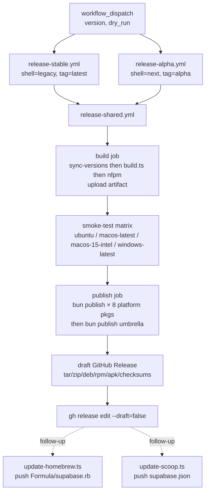

# 0011. CLI Release & Distribution Strategy

**Status**: accepted
**Date**: 2026-04-17 (proposed), 2026-04-21 (accepted)

## Problem Statement

The existing Supabase CLI ships via GoReleaser, which is Go-specific. As the CLI is ported to TypeScript (see [ADR 0004](0004-cli-design-goals-and-workflows.md)), GoReleaser cannot be used. Before the Phase 0 Go-wrapper release ships on the `latest` dist-tag — and before any further command porting — we need a concrete, validated plan for how the TypeScript CLI reaches users across every existing distribution channel.

The CLI is currently distributed through:

- **npm / npx** — the primary install path
- **Homebrew** — `supabase/homebrew-tap`
- **Scoop** — `supabase/scoop-bucket`
- **apt / rpm / apk** — Linux package manager files hosted on GitHub Releases
- **GitHub Releases** — platform archives + checksums for direct download

All channels must continue working after the GoReleaser cutover with no user-visible regression. Tracked in [CLI-1330](https://linear.app/supabase/issue/CLI-1330).

## Decision

We replace GoReleaser with a pipeline built on **Bun `--compile` single-file executables**, **npm `optionalDependencies` platform packages**, and **Nx-driven GitHub Actions workflows**. The artifact shape on every channel remains identical to the GoReleaser output (single `supabase` binary per platform, same archive names and layout), so downstream installers (tap formula, bucket manifest, deb/rpm/apk payloads) are drop-in replacements.

| Concern                        | Choice                                                                                                                                                                                    |
| ------------------------------ | ----------------------------------------------------------------------------------------------------------------------------------------------------------------------------------------- |
| Binary packaging               | **Bun `--compile`** SFE per platform                                                                                                                                                      |
| Platform coverage              | `darwin-{arm64,x64}`, `linux-{arm64,x64}`, `linux-{arm64,x64}-musl`, `windows-{x64,arm64}` — parity with the Go CLI's current GoReleaser targets                                          |
| npm distribution               | `supabase` umbrella + eight `@supabase/cli-<platform>` packages as `optionalDependencies`                                                                                            |
| Platform resolution at runtime | Node shim ([`apps/cli/src/shared/cli/bin.ts`](../../apps/cli/src/shared/cli/bin.ts)) `execFileSync`s the right platform binary                                                            |
| Linux packages                 | **`nfpm`** (binary only, installed from GoReleaser's apt repo) for `.deb` / `.rpm` / `.apk`                                                                                               |
| Homebrew                       | Existing `supabase/homebrew-tap`, updated by [`apps/cli/scripts/update-homebrew.ts`](../../apps/cli/scripts/update-homebrew.ts)                                                           |
| Scoop                          | Existing `supabase/scoop-bucket`, updated by [`apps/cli/scripts/update-scoop.ts`](../../apps/cli/scripts/update-scoop.ts)                                                                 |
| apt / rpm repo hosting         | **None** — stay GitHub-Release-downloads-only                                                                                                                                             |
| Dist-tags                      | `latest` = legacy shell (Phase 0 Go wrapper), `alpha` = next shell (TS-native). No `beta`, `next`, `canary`                                                                               |
| CI                             | Two trigger workflows (`release-stable.yml` / `release-alpha.yml`) calling one shared workflow (`release-shared.yml`) with build → smoke-test matrix → publish → draft Release → finalize |
| Artifact signing               | **Ship unsigned**, matching the current Go CLI's GoReleaser behavior exactly. Fall back to signing only if validation shows Bun SFEs behave differently than Go binaries (see below)      |
| SLSA provenance                | **Deferred**. Go CLI has none today; add it only after signing decisions settle                                                                                                           |

Most of the above is **already implemented and validated** in this repo (build pipeline, npm publish, nfpm, GitHub Release workflows, Homebrew end-to-end on `darwin-arm64`). The gaps this ADR closes were: (1) adding `windows-arm64` as a build target to match Go CLI parity — **landed**; (2) deciding the signing story — **decided (ship unsigned, contingent follow-ups only if validation fails)**; (3) wiring the Homebrew/Scoop updaters into `release-shared.yml` — **still open** and now the single largest remaining pre-cutover item. See the [Implementation progress](#implementation-progress) section for the file-by-file landing record and [`apps/cli/docs/release-process.md`](../../apps/cli/docs/release-process.md) for the operational playbook (local → PoC → production).

## Rationale

### Why Bun `--compile`

`bun build --compile` produces a single static binary per target triple (see `[apps/cli/scripts/build.ts](../../apps/cli/scripts/build.ts)` lines 94–103):

```ts
await $`bun build ${entrypoint} --compile --minify --target=${target.bunTarget} --outfile=${outfile}`;
```

This matches the artifact shape of the current Go releases exactly: one `supabase` (or `supabase.exe`) per `{darwin,linux,windows} × {arm64,x64}` plus `linux-{arm64,x64}-musl`. Every downstream channel — Homebrew, Scoop, deb/rpm/apk, `.tar.gz`/`.zip` on GitHub Releases — receives the same drop-in binary the Go CLI used to produce. No installer logic changes downstream.

Bun is already the build toolchain and runtime for the TypeScript CLI (the CLI imports `@effect/platform-bun`, the monorepo uses `bun` for all build scripts per [AGENTS.md](../../AGENTS.md)). Keeping Bun through packaging avoids introducing a second runtime (Node) just for distribution.

### Why npm `optionalDependencies`

Exactly the pattern used by `esbuild`, `@swc/core`, `turbo`, and `rollup`:

```text
supabase               (umbrella, Node shim in bin)
├─ @supabase/cli-darwin-arm64
├─ @supabase/cli-darwin-x64
├─ @supabase/cli-linux-arm64
├─ @supabase/cli-linux-arm64-musl
├─ @supabase/cli-linux-x64
├─ @supabase/cli-linux-x64-musl
├─ @supabase/cli-windows-arm64
└─ @supabase/cli-windows-x64
```

Each platform package declares `os`, `cpu`, and (on Linux) `libc`, so npm/pnpm/yarn resolve and install only the binary matching the user's machine. The umbrella package's bin is a **Node shim** (not a Bun SFE): it resolves the installed platform package via `require.resolve('@supabase/cli-<platform>/package.json')` and `execFileSync`s the real binary. See `[apps/cli/src/shared/cli/bin.ts](../../apps/cli/src/shared/cli/bin.ts)`. No `postinstall` step, no network download after install, no lifecycle script required.

### Why Effect CLI as the command framework (not oclif)

This is already decided and implemented — the CLI uses `effect/unstable/cli` in both the legacy and next shells (see `[apps/cli/src/legacy/cli/root.ts](../../apps/cli/src/legacy/cli/root.ts)` and `[apps/cli/src/next/cli/root.ts](../../apps/cli/src/next/cli/root.ts)`). The CLI framework choice is orthogonal to packaging: Bun `--compile` does not care what the source code uses. Calling it out here because the original CLI-1330 discussion conflated "oclif as framework" with "oclif pack as packaging" — only the second is rejected (see Alternatives).

### Why nfpm for Linux packages

`nfpm` (the tool; GoReleaser's packager-only binary) is used inside `[apps/cli/scripts/build.ts](../../apps/cli/scripts/build.ts)` to emit `.deb` / `.rpm` / `.apk` from the same per-platform `bin/` directories that feed the `.tar.gz` archives. This keeps one source of truth for "which binary ships where" across all Linux channels.

For the `.apk` (musl) packages, the Bun binary is the musl SFE; the Go binary (Phase 0 only) is reused from the glibc build since it is compiled with `CGO_ENABLED=0` and is fully static.

### Why no hosted apt/rpm repo

Hosting a signed apt/rpm repo (via Cloudsmith, packagecloud, or a self-hosted mirror) adds per-release friction (key management, repo metadata regeneration) and ongoing cost. The existing `supabase/cli` install docs already direct Linux users to the `.deb` / `.rpm` downloads on the GitHub Release page — this is the same UX we maintain. Revisit once install-channel telemetry (see [ADR 0002](0002-cli-product-metrics.md)) shows non-trivial Linux package-manager usage that would benefit from `apt update` / `dnf upgrade` workflows.

### Why only `latest` and `alpha` dist-tags

- `**latest`** — the Phase 0 Go-wrapper (`shell: legacy`) that ships to all existing users without behavioural change. Triggered by `[.github/workflows/release-stable.yml](../../.github/workflows/release-stable.yml)`.
- `**alpha**` — the TS-native rewrite (`shell: next`) for opt-in users. Triggered by `[.github/workflows/release-alpha.yml](../../.github/workflows/release-alpha.yml)`.

Adding `beta`, `next`, or `canary` tags now would fragment installs before the `next` shell is mature. When `alpha` stabilises, `latest` flips over and `alpha` either goes away or becomes the next development line — one decision at a time.

### Why unsigned artifacts (matching the Go CLI)

The current Go CLI release — [`apps/cli-go/.goreleaser.yml`](../../apps/cli-go/.goreleaser.yml) and [`release.yml`](../../apps/cli-go/.github/workflows/release.yml) / [`release-beta.yml`](../../apps/cli-go/.github/workflows/release-beta.yml) — does **no signing of any kind**:

- No `signs:` or `notarize:` block in `.goreleaser.yml`
- No `codesign` / `notarytool submit` / macOS notarization in the release workflow
- No `signtool sign` / Authenticode signing for the Windows `.exe`
- No `cosign sign-blob` over archives or checksums
- No SLSA provenance generator

The CLI has shipped this way for years across `npm`, `supabase/homebrew-tap`, `supabase/scoop-bucket`, and direct GitHub Release downloads. The distribution channels themselves provide enough trust/integrity:

| Channel | Why unsigned binaries work today |
| --- | --- |
| **Homebrew** | `brew install` uses `curl` to fetch the `.tar.gz` + SHA256 verification from the formula. `curl`-downloaded files do not receive the `com.apple.quarantine` xattr, so Gatekeeper does not block them. |
| **Scoop** | Same pattern on Windows: `scoop install` fetches via `Invoke-WebRequest` (no Mark-of-the-Web applied) + SHA256 verification from the manifest. |
| **apt / rpm** | Package managers verify their own checksums; the `.deb` / `.rpm` files are not GPG-signed by the Go CLI today either. |
| **npm** | `execFileSync` of the bundled binary — no OS quarantine path since it runs from `node_modules/` on a local filesystem. |
| **Direct `.tar.gz` / `.zip` download** | User would need to `xattr -d com.apple.quarantine` or Right-click → Unblock on Windows. Already the case today for the Go binary. |

**Decision**: the TypeScript CLI pipeline ships unsigned in v0, exactly mirroring the Go CLI. Any signing work beyond that is contingent on the validation phase (see [Open Questions](#open-questions--blockers)) showing Bun SFEs behave *differently* than the Go binary under Gatekeeper / SmartScreen. If they behave identically, no signing is added.

**Why Bun SFEs could behave differently**: a Bun SFE is not a plain Mach-O / PE — it is the Bun interpreter binary with the user's bundle appended as embedded data. macOS's hardened runtime and JIT policies apply only when the binary is codesigned; unsigned execution should be identical to any other unsigned Mach-O, but this needs empirical confirmation. The [Bun docs § Code signing on macOS](https://bun.com/docs/bundler/executables#code-signing-on-macos) document the `entitlements.plist` required *if* we ever sign — captured here only as a forward reference.

**Fallback plan if validation fails**:

| Failure mode | Minimal response |
| --- | --- |
| `brew install` on macOS 14+ refuses the Bun SFE | Apple Developer ID + `codesign --sign` + `notarytool submit` + staple. Requires Developer ID cert secret in CI. |
| SmartScreen repeatedly blocks `.exe` despite Scoop install | EV / standard Authenticode code-signing cert + `signtool sign`. Requires HSM or cloud-signing service (e.g. Azure Trusted Signing). |
| Users raise integrity concerns on direct downloads | `cosign sign-blob` over archives + `checksums.txt`, publish `.sig` + public key on the GitHub Release. Low effort, no hardware key. |
| External SLSA / supply-chain compliance requirement lands | Adopt `slsa-framework/slsa-github-generator` for provenance. |

All four fallbacks remain concrete follow-ups, but they are now **triggered by validation outcomes**, not scheduled work.

## Architecture

### Release pipeline



The top of the graph is implemented today. The dashed edges (Homebrew and Scoop updates) are existing scripts not yet wired into `release-shared.yml` — see [Open Questions](#open-questions--blockers).

### Per-channel publish mechanisms

#### npm / npx

Canonical path. `supabase` umbrella package has no native code; it ships a single Node shim at `dist/supabase.js` that resolves and `execFileSync`s the platform binary from the matching `@supabase/cli-<platform>` package pulled in by `optionalDependencies`:

```ts
// apps/cli/src/shared/cli/bin.ts (excerpt)
const platformMap = PLATFORMS[process.platform];
const candidates = platformMap[os.arch()];
for (const suffix of candidates) {
  const pkgPath = path.dirname(require.resolve(`@supabase/cli-${suffix}/package.json`));
  binPath = path.join(pkgPath, "bin", `supabase${ext}`);
  break;
}
execFileSync(binPath, process.argv.slice(2), { stdio: "inherit" });
```

Publishing is handled by [`apps/cli/scripts/publish.ts`](../../apps/cli/scripts/publish.ts): all eight platform packages first (parallel `bun publish`), then the umbrella last (so `optionalDependencies` resolve on install).

#### Homebrew

`[apps/cli/scripts/update-homebrew.ts](../../apps/cli/scripts/update-homebrew.ts)` clones the tap repo to a temp dir, writes `Formula/supabase.rb` templated with SHA256s from `dist/checksums.txt`, commits, and pushes. The formula references the `supabase_<version>_<os>_<arch>.tar.gz` archives on the GitHub Release.

Production tap: `supabase/homebrew-tap`. A single `supabase` formula replaces the current Go-CLI formula. No cask, no bottle — the formula points at the GitHub Release `.tar.gz` (same UX as today), avoiding any Gatekeeper quarantine path. The formula's `darwin-arm64` / `darwin-x64` selection uses Homebrew's standard `on_arm` / `on_intel` blocks.

#### Scoop

[`apps/cli/scripts/update-scoop.ts`](../../apps/cli/scripts/update-scoop.ts) clones the bucket repo, writes `supabase.json` (with an `autoupdate` block keyed off GitHub Releases), commits, and pushes. The manifest ships an `architecture` block with both `64bit` (x64) and `arm64` entries — matching the Go CLI's current GoReleaser output, which already targets `windows_arm64` in [`apps/cli-go/.goreleaser.yml`](../../apps/cli-go/.goreleaser.yml). Dropping arm64 would be a user-visible regression for anyone on a Windows-on-ARM device (Surface Pro X, recent Copilot+ PCs, Windows-11-ARM VMs on Apple Silicon).

Windows-arm64 is live in the TS pipeline as of this branch — `packages/cli-windows-arm64/`, `bun-windows-arm64` in [`apps/cli/scripts/build.ts`](../../apps/cli/scripts/build.ts), and the `win32: { arm64, x64 }` map in [`apps/cli/src/shared/cli/bin.ts`](../../apps/cli/src/shared/cli/bin.ts) all shipped together. Bun supports this target natively ([Bun — Single-file executable § Supported targets](https://bun.com/docs/bundler/executables#supported-targets)), so no cross-compilation toolchain changes were required. See [`apps/cli/docs/release-process.md`](../../apps/cli/docs/release-process.md) for the full channel walkthrough.

Production bucket: `supabase/scoop-bucket`.

#### apt / rpm / apk

`nfpm` runs inside `[apps/cli/scripts/build.ts](../../apps/cli/scripts/build.ts)` and emits six Linux packages (deb/rpm/apk × arm64/amd64). All six are uploaded to the GitHub Release as direct downloads; there is no hosted repo. Installation is `dpkg -i supabase_<v>_linux_amd64.deb` or equivalent.

#### GitHub Releases

Draft + finalize by the shared workflow:

```yaml
# .github/workflows/release-shared.yml (publish job, excerpt)
- uses: softprops/action-gh-release@…
  with:
    tag_name: v${{ inputs.version }}
    draft: true
    prerelease: ${{ inputs.prerelease }}
    files: |
      dist/supabase_…_darwin_arm64.tar.gz
      dist/supabase_…_linux_amd64.deb
      …
      dist/checksums.txt
- run: gh release edit v${{ inputs.version }} --draft=false
```

Archive layout (per-platform):

```text
packages/cli-<platform>/bin/
├── supabase      (Bun --compile SFE)
└── supabase-go   (legacy shell only, Phase 0 proxy target)
```

See `[apps/cli/docs/binary-distribution.md](../../apps/cli/docs/binary-distribution.md)` for the runtime-resolution details of the two-binary legacy model.

## Consequences

### Positive

- **Single source of truth for binary shape.** Every channel serves the exact same `supabase` SFE. Tap formula, bucket manifest, deb/rpm/apk, and GitHub Release archives all consume the same `packages/cli-<platform>/bin/supabase` output — no per-channel repackaging.
- **Drop-in replacement for GoReleaser.** File names, archive layout, and checksum format are preserved. Existing users and docs continue to work.
- **No `postinstall` step.** `optionalDependencies` is resolved natively by npm/pnpm/yarn. Security scanners and locked-down CI environments that disable lifecycle scripts are unaffected.
- **One toolchain end-to-end.** Bun compiles, Bun publishes, Bun runs. No Node/Bun split for distribution.
- **Local parity with CI.** `bun apps/cli/scripts/build.ts` and `bun apps/cli/scripts/publish.ts --dry-run` reproduce the CI pipeline bit-for-bit. (Further consolidation tracked in [CLI-1344](https://linear.app/supabase/issue/CLI-1344/investigate-if-we-can-consolidate-local-release-logic-and-pipeline).)
- **Nx caches build artifacts.** CI reuses `packages/cli-*/bin/` across jobs via `actions/upload-artifact`; incremental rebuilds are free on unchanged platforms.

### Negative

- **Binary size.** Bun SFEs are ~60–90 MB per platform, significantly larger than the Go binary (~15 MB). Acceptable for npm users (JS toolchains routinely ship > 100 MB of deps) but noticeable for apt/rpm users on metered connections.
- **Unsigned binaries — same as today.** The Go CLI already ships unsigned and has for years; we inherit the same situation. Risk is that Bun SFEs trigger Gatekeeper / SmartScreen *differently* than Go binaries, which is why end-to-end validation on the three PoC repos is a gating item before cutover rather than a follow-up.
- **musl targets not smoke-tested in CI.** The smoke-test matrix covers `ubuntu-latest` (glibc) only; Alpine / Void validation is manual.
- **Homebrew and Scoop updaters are not automated.** [`update-homebrew.ts`](../../apps/cli/scripts/update-homebrew.ts) and [`update-scoop.ts`](../../apps/cli/scripts/update-scoop.ts) exist and work from a checkout but are not called from `release-shared.yml`. Every release requires a manual `bun apps/cli/scripts/update-{homebrew,scoop}.ts --version …` until the follow-up lands.
- **GoReleaser apt repo dependency for nfpm.** The shared workflow installs `nfpm` from `https://repo.goreleaser.com/apt/`. If that repo is ever unavailable we need a fallback (direct GitHub Release download of the `nfpm` binary).
- **`archlinux` format not yet shipped.** The Go CLI's nfpm config also generates `archlinux` packages; ours does not. Minor Arch-user regression unless we extend [`apps/cli/scripts/build.ts`](../../apps/cli/scripts/build.ts).

## Alternatives Considered

1. **Node SEA (Single Executable Application)** — proposed in the original CLI-1330 comment. Node SEA packs a Node binary + embedded bundle + assets; artifact shape would match Bun `--compile`, but:
    - Bun SFEs are already wired into the build; switching means rewiring `build.ts`.
    - Node SEA requires a `sea.getAsset(...)` + extract-to-tmp dance for any native modules or dynamic imports. Bun SFEs don't.
    - Node SEA binaries are generally larger than Bun SFEs (V8 + SEA assets vs JSC).
    - The CLI depends on `@effect/platform-bun`, which is Bun-specific — a Node SEA port would need `@effect/platform-node` wiring.
2. `**oclif pack`** — produces a directory tree + shell shim, not a single binary. It would work for Homebrew and manual installs but does not fit Scoop's single-manifest expectation or the deb/rpm/apk "drop one binary at `/usr/bin/supabase`" model. Also moot: the CLI uses **Effect CLI**, not oclif, so oclif's packaging is doubly inapplicable.
3. `**vercel/pkg`** — unmaintained since 2023, explicitly deprecated by Vercel in favour of Node SEA. Non-starter.
4. `**deno compile**` — would require porting the runtime away from Bun. The CLI's platform layer (`@effect/platform-bun`) has no Deno equivalent today. Taking two bets at once (SEA + runtime) is the kind of risk the Linear comment already flagged.
5. **Keep GoReleaser, call `bun build` from inside it** — possible but inverts the ownership: a Go tool driving a TypeScript build is confusing, and GoReleaser's value (cross-compiling Go + packaging + publishing in one) is wasted when the Go part goes away. Preserves none of GoReleaser's benefits and keeps its YAML configuration as a liability.
6. **Host an apt/rpm repo** (Cloudsmith / packagecloud / self-hosted) — rejected for v0, revisit per usage signal. See [Rationale](#why-no-hosted-aptrpm-repo).

## Open Questions / Blockers

These split into **pre-cutover gates** (must complete before `latest` flips from Go CLI to the TypeScript pipeline) and **contingent follow-ups** (triggered only by specific validation failures).

### Pre-cutover gates

1. **Windows arm64 build target.** ✅ **DONE** (2026-04-21) — landed on this branch. `bun-windows-arm64` in [`apps/cli/scripts/build.ts`](../../apps/cli/scripts/build.ts) `TARGETS` + `GO_TARGETS`, new [`packages/cli-windows-arm64/`](../../packages/cli-windows-arm64/), `win32: { arm64, x64 }` in [`apps/cli/src/shared/cli/bin.ts`](../../apps/cli/src/shared/cli/bin.ts) and [`apps/cli/src/shared/legacy/go-proxy.layer.ts`](../../apps/cli/src/shared/legacy/go-proxy.layer.ts), eighth entry in [`apps/cli/package.json`](../../apps/cli/package.json) `optionalDependencies`, `windows_arm64.zip` in [`release-shared.yml`](../../.github/workflows/release-shared.yml) release files, `arm64` sub-key in [`update-scoop.ts`](../../apps/cli/scripts/update-scoop.ts). Extending the CI smoke-test matrix to `windows-11-arm` remains open (tracked as a follow-up under gate 6).
2. **Homebrew tap end-to-end validation.** ✅ **`darwin-arm64` validated on `v0.0.1` (2026-04-20)** — `brew tap avallete/supabase-shim-poc && brew install supabase-shim-poc && supabase-shim-poc --version` produced `supabase v0.0.1` with no Gatekeeper quarantine prompt; `brew test` passed; and invoking a Go-backed subcommand (`supabase-shim-poc projects list --help`) correctly spawned the colocated `supabase-go` sidecar. Remaining: repeat on `darwin-x64` (Intel Mac or Rosetta) and `linux-{arm64,x64}` (brew on Linux) to fully close out this gate. If Gatekeeper ever does block the unsigned Bun SFE on a fresh macOS install, escalate to contingent follow-up A below. Full reproducer in [`apps/cli/docs/release-process.md`](../../apps/cli/docs/release-process.md) Ring 2.

   **Bug discovered & fixed during validation:** the initial formula only ran `bin.install "supabase"` and dropped the `supabase-go` sidecar on the floor. Any Go-proxied subcommand then fell through the resolution chain in [`apps/cli/src/shared/legacy/go-proxy.layer.ts`](../../apps/cli/src/shared/legacy/go-proxy.layer.ts) (colocated lookup misses → `require.resolve("@supabase/cli-*")` fails inside a Bun SFE → final fallback spawns `supabase` on PATH), yielding `NotFound: ChildProcess.spawn (supabase <subcmd>)`. Renaming the installed bin to `supabase` turned the fallback into a self-exec fork-bomb (infinite hang). Fix: [`apps/cli/scripts/update-homebrew.ts`](../../apps/cli/scripts/update-homebrew.ts) now emits `bin.install "supabase-go" if File.exist?("supabase-go")` alongside the SFE install line. The `File.exist?` guard keeps the same formula valid for the future `next` shell (SFE only, no sidecar). Scoop is unaffected because its bucket manifests extract the whole zip into `~/scoop/apps/<name>/current/` — the `bin` field only controls PATH shimming, not extraction, so `supabase-go.exe` is always colocated with the SFE on disk.
3. **Scoop bucket end-to-end validation.** ✅ **Windows x64 validated on `v0.0.1` (2026-04-21)** — `scoop bucket add avallete-poc https://github.com/avallete/scoop-bucket && scoop install supabase-shim-poc && supabase-shim-poc --version` produced `supabase v0.0.1` with no SmartScreen block on an unsigned Bun SFE. This closes the Scoop leg against the default `windows_amd64.zip` archive that GoReleaser also ships. Manifest used: [`avallete/scoop-bucket/supabase-shim-poc.json`](https://github.com/avallete/scoop-bucket/blob/main/supabase-shim-poc.json), generated by the `--name` support on [`apps/cli/scripts/update-scoop.ts`](../../apps/cli/scripts/update-scoop.ts) that landed on this branch — see [Implementation progress](#implementation-progress) theme B. Remaining: repeat on a Windows-arm64 host (Surface Pro X / Copilot+ PC / Apple Silicon Windows-11-ARM VM) to exercise the new `windows_arm64.zip` archive. If SmartScreen ever blocks the unsigned `.exe` on a fresh Windows install, escalate to contingent follow-up B below.

   ```powershell
   scoop bucket add avallete-poc https://github.com/avallete/scoop-bucket
   scoop install supabase-shim-poc
   supabase-shim-poc --version   # expect: supabase v0.0.1
   ```
4. **GitHub Release artifact host for PoC.** [`avallete/supabase-cli-release-poc`](https://github.com/avallete/supabase-cli-release-poc) hosts the `dist/supabase_<v>_*.{tar.gz,zip,deb,rpm,apk}` + `checksums.txt` the PoC formula/manifest URLs resolve against. At cutover this is replaced by `supabase/cli` (the current Go CLI Release host). The repo's git *tree* is effectively empty; only its Releases matter.
5. **Wire updaters into `release-shared.yml`.** **Remaining largest item before cutover.** Today [`release-shared.yml`](../../.github/workflows/release-shared.yml) finishes at `gh release edit --draft=false`; no Homebrew/Scoop push happens from CI. Add a `post-publish` job that runs [`update-homebrew.ts`](../../apps/cli/scripts/update-homebrew.ts) and [`update-scoop.ts`](../../apps/cli/scripts/update-scoop.ts) behind the `!inputs.dry_run` gate, only when `npm_tag == 'latest'` (we do not push Homebrew/Scoop for alpha). Needs a GitHub App token (following the pattern in [`apps/cli-go/.github/workflows/release.yml`](../../apps/cli-go/.github/workflows/release.yml): `APP_ID` + `GH_APP_PRIVATE_KEY` secrets, scoped to `homebrew-tap` and `scoop-bucket` repos) so release tokens never hold broader access. Until this lands, the Ring 3 playbook in [`apps/cli/docs/release-process.md`](../../apps/cli/docs/release-process.md) documents the manual `bun apps/cli/scripts/update-{homebrew,scoop}.ts --version <v>` post-release step.
6. **Bun `--compile` musl validation + Windows arm64 smoke-test.** [`buildMuslBinaries`](../../apps/cli/scripts/build.ts) produces musl SFEs but the [smoke-test matrix](../../.github/workflows/release-shared.yml) only runs `ubuntu-latest` (glibc). Add an Alpine container job. Same matrix gap applies to Windows arm64 now that gate 1 is DONE: add a `windows-11-arm` runner (GitHub-hosted preview) so we catch arm64 regressions in CI rather than post-release.
7. **Local vs pipeline release-logic consolidation.** Tracked in sub-issue [CLI-1344](https://linear.app/supabase/issue/CLI-1344/investigate-if-we-can-consolidate-local-release-logic-and-pipeline). Intent: `bun apps/cli/scripts/{build,publish}.ts --dry-run` produces the identical output CI does; `sync-versions.ts` is the single versioning entry point.
8. **`findConfigInRoot` `ENOTDIR` handling.** Discovered while validating gate 2: [`packages/config/src/paths.ts`](../../packages/config/src/paths.ts)'s `fs.exists(supabase/config.json)` throws `BadResource` (`ENOTDIR`) instead of returning `false` when `cwd` contains a *file* named `supabase` (e.g., the extracted SFE in a scratch dir during local install tests). The walk-upward resolver should treat `ENOTDIR` the same as `ENOENT`. Does not block the production brew path (`/opt/homebrew/bin/supabase-shim-poc` has no colliding `supabase` file in any parent), but it's a latent bug for any user whose `$HOME` or a parent contains a `supabase` file. Low-effort fix.

### Contingent follow-ups (triggered by validation outcomes)

These are **not** scheduled work. They activate only if the matching pre-cutover gate fails. Each one mirrors a specific capability the Go CLI does **not** have today — so activating any of them is a *net improvement* over current behavior, not a prerequisite for parity.

- **A. macOS notarization** — trigger: gate 2 shows Gatekeeper blocks `brew install`ed Bun SFEs in a way it did not block Go binaries. Solution: Apple Developer ID cert in CI + `codesign --sign --options runtime` + `notarytool submit --wait` + `xcrun stapler staple`. Requires a paid Apple Developer account.
- **B. Windows Authenticode signing** — trigger: gate 3 shows SmartScreen reliably blocks the unsigned `.exe` on fresh Windows machines beyond what the Go binary currently hits. Solution: EV or standard code-signing cert + `signtool sign /tr http://timestamp.sectigo.com /td sha256 /fd sha256 /a`. For a cloud-native flow, [Azure Trusted Signing](https://learn.microsoft.com/en-us/azure/trusted-signing/) or similar avoids HSM provisioning.
- **C. Linux artifact signing (`cosign`)** — trigger: external integrator / security audit requests verifiable signatures on `.tar.gz` / `.deb` / `.rpm` / `.apk`. Solution: `cosign sign-blob --yes --output-signature <file>.sig` in CI, publish `.sig` + `cosign.pub` on the GitHub Release. Low effort; no hardware key.
- **D. SLSA provenance** — trigger: supply-chain compliance requirement from a downstream consumer. Solution: [`slsa-framework/slsa-github-generator`](https://github.com/slsa-framework/slsa-github-generator) (level-3 attestations on npm + GitHub Release artifacts).
- **E. `archlinux` package format** — trigger: `aur/supabase-bin` maintainers request it, or telemetry shows meaningful Arch usage. Solution: add `archlinux` to the `formats:` list in `apps/cli/scripts/build.ts` (nfpm supports it natively, same as our current apk/deb/rpm config).

### Note on PoC repo management

The three PoC repos (`avallete/homebrew-supabase-shim-poc`, `avallete/scoop-bucket`, `avallete/supabase-cli-release-poc`) are **explicitly not added as `.repos/`* submodules**, even though `[.gitmodules](../../.gitmodules)` already tracks eight vendored reference repos (`effect`, `supabase-cli-go`, `process-compose`, etc.). Existing `.repos/`* entries are read-only source-code references for `grep` / inspection; the PoC repos contain one generated artifact each (`Formula/supabase.rb`, `supabase.json`) or no interesting tree content at all. The `update-*.ts` scripts `gh repo clone` on demand into a tmpdir, so a submodule would change nothing about the release pipeline. Since these repos are PoC-phase only, vendoring now means a `.gitmodules` edit + `git rm` at cutover for zero operational benefit.

## Implementation progress

This section tracks the work that has landed against the pre-cutover gates. Detailed operational steps live in [`apps/cli/docs/release-process.md`](../../apps/cli/docs/release-process.md); the PR changelog lives on GitHub.

**A. Windows arm64 parity** (closes gate 1)
: `bun-windows-arm64` added to [`apps/cli/scripts/build.ts`](../../apps/cli/scripts/build.ts) `TARGETS` + `GO_TARGETS`; new [`packages/cli-windows-arm64/`](../../packages/cli-windows-arm64/) workspace package; `win32: { arm64, x64 }` in [`apps/cli/src/shared/cli/bin.ts`](../../apps/cli/src/shared/cli/bin.ts) and [`apps/cli/src/shared/legacy/go-proxy.layer.ts`](../../apps/cli/src/shared/legacy/go-proxy.layer.ts); 8th entry in [`apps/cli/package.json`](../../apps/cli/package.json) `optionalDependencies`; platform arrays extended in [`apps/cli/scripts/publish.ts`](../../apps/cli/scripts/publish.ts), [`sync-versions.ts`](../../apps/cli/scripts/sync-versions.ts), [`tools/release/local-release.ts`](../../tools/release/local-release.ts), [`apps/cli/tests/helpers/npm-registry.ts`](../../apps/cli/tests/helpers/npm-registry.ts); `windows_arm64.zip` uploaded by [`release-shared.yml`](../../.github/workflows/release-shared.yml).

**B. `--name` + user-owned-repo support on updater scripts** (unblocks gates 2 & 3 end-to-end validation)
: [`apps/cli/scripts/update-homebrew.ts`](../../apps/cli/scripts/update-homebrew.ts) and [`apps/cli/scripts/update-scoop.ts`](../../apps/cli/scripts/update-scoop.ts) now accept `--name <custom>` plus the pre-existing `--repo`, `--tap`/`--bucket`, so the exact production updater code paths can be exercised against a reviewer's own `homebrew-*` / `scoop-*` repos under a non-`supabase` name (e.g., `supabase-shim-poc`). The `--name` flag controls the formula filename + Ruby class on Homebrew, and the manifest filename on Scoop, so `supabase` (stable) and `supabase-beta` can coexist as separate formulas / manifests in the same tap / bucket. The installed binary is always `supabase` (matching the Go CLI's historical behaviour — both `Formula/supabase.rb` and `Formula/supabase-beta.rb` ran `bin.install "supabase"`); PoC reviewers must `brew uninstall supabase` first if the official CLI is already installed. **Side-effect bug fix**: the Homebrew formula now installs the `supabase-go` sidecar alongside the SFE (`bin.install "supabase-go" if File.exist?("supabase-go")`) — see gate 2 above for root-cause analysis.

**C. Real CLI version plumbing** (hygiene; surfaced via gate 2 validation)
: The CLI used to hard-code `"0.1.0"` for both `--version` output and telemetry. New [`apps/cli/src/shared/cli/version.ts`](../../apps/cli/src/shared/cli/version.ts) exports `CLI_VERSION = process.env.SUPABASE_CLI_VERSION ?? "0.0.0-dev"`. [`apps/cli/scripts/build.ts`](../../apps/cli/scripts/build.ts) injects the real version at compile time via `bun build --define=process.env.SUPABASE_CLI_VERSION=...` (both glibc and musl builds). [`apps/cli/src/shared/cli/run.ts`](../../apps/cli/src/shared/cli/run.ts) feeds it into Effect CLI's `Command.runWith`; [`apps/cli/src/shared/telemetry/runtime.layer.ts`](../../apps/cli/src/shared/telemetry/runtime.layer.ts) uses the same constant.

**D. Build correctness fix**
: [`apps/cli/scripts/build.ts`](../../apps/cli/scripts/build.ts) now runs `go build -trimpath -ldflags="-s -w" -o ${outfile} .` with `.cwd(goSource)` instead of passing `goSource` as a positional argument. Passing an absolute path caused Go to resolve the module from the invocation CWD (the repo root, which has no `go.mod`) and fail.

**Still open**: gate 2 (Homebrew on `darwin-x64` + `linux-{arm64,x64}` — Ring 2 reproducer lives in [`release-process.md`](../../apps/cli/docs/release-process.md)), gate 3 (Scoop on Windows arm64 only — x64 validated on `v0.0.1`), gate 5 (wire updaters into `release-shared.yml`), gate 6 (musl + Windows-arm64 smoke-test matrix), gate 7 (local ↔ pipeline release-logic consolidation, [CLI-1344](https://linear.app/supabase/issue/CLI-1344)), gate 8 (`findConfigInRoot` `ENOTDIR` handling).

## Related Decisions

- [ADR 0001](0001-cli-dx-architecture-pillars.md): CLI DX Architecture Pillars — performance budgets the Bun SFE startup cost is measured against.
- [ADR 0004](0004-cli-design-goals-and-workflows.md): CLI Design Goals — legacy vs next shell split that drives the `latest` / `alpha` dist-tag decision.

## See Also

- [`apps/cli/docs/release-process.md`](../../apps/cli/docs/release-process.md) — the operational playbook: local Verdaccio → user-owned PoC repos → production pipeline.
- [`apps/cli/docs/binary-distribution.md`](../../apps/cli/docs/binary-distribution.md) — runtime resolution details for the two-binary legacy model (TS SFE + Go binary).
- [`.github/workflows/release-shared.yml`](../../.github/workflows/release-shared.yml), [`release-stable.yml`](../../.github/workflows/release-stable.yml), [`release-alpha.yml`](../../.github/workflows/release-alpha.yml) — the pipeline implementation.
- [`apps/cli/scripts/build.ts`](../../apps/cli/scripts/build.ts), [`publish.ts`](../../apps/cli/scripts/publish.ts), [`sync-versions.ts`](../../apps/cli/scripts/sync-versions.ts), [`update-homebrew.ts`](../../apps/cli/scripts/update-homebrew.ts), [`update-scoop.ts`](../../apps/cli/scripts/update-scoop.ts) — release scripts.
- [`apps/cli-go/.goreleaser.yml`](../../apps/cli-go/.goreleaser.yml), [`release.yml`](../../apps/cli-go/.github/workflows/release.yml), [`release-beta.yml`](../../apps/cli-go/.github/workflows/release-beta.yml) — the Go CLI release config we mirror (no signing, `windows_arm64` target, GitHub-App-scoped publish tokens).
- [CLI-1330](https://linear.app/supabase/issue/CLI-1330) — origin ticket.
- [CLI-1344](https://linear.app/supabase/issue/CLI-1344/investigate-if-we-can-consolidate-local-release-logic-and-pipeline) — sub-issue: consolidate local and pipeline release logic.
