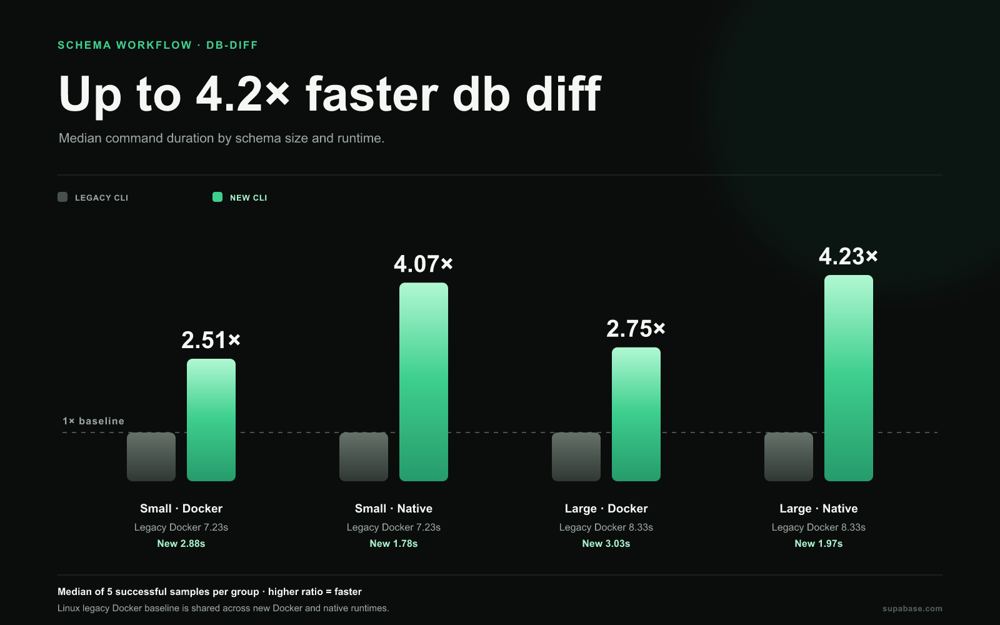
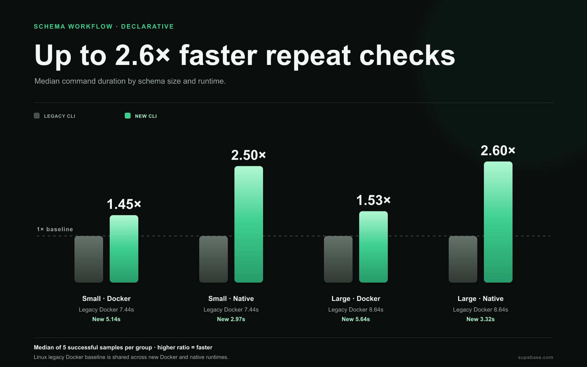

# Database schema benchmarks: faster diff loops

**Benchmark results · September 25, 2026**

Compiled CLI [`4cebcf8`](https://github.com/supabase/cli/commit/4cebcf8779ef8ba983f38632eb4c48a86c5e829e) compared with released CLI **2.117.0**.

A changed diff takes **1.78 s (small)** and **1.97 s (large)** with the new Linux native runtime, versus **7.23 s** and **8.33 s** with the legacy Linux Docker baseline. Those are observed ratios of **4.1× and 4.2×**. New Linux Docker medians are 2.88 s and 3.03 s. Timings are medians from five samples; hosted Linux CPU models varied.

The benchmark covers plain database diffs and declarative schema workflows. The new CLI supports native and Docker runtimes; legacy has Docker measurements only.

## Database diff: changed and unchanged schema

| Linux operation                             | Legacy Docker | New Docker | New native |
| ------------------------------------------- | ------------: | ---------: | ---------: |
| Changed diff · small                        |        7.23 s |     2.88 s |     1.78 s |
| Changed diff · large                        |        8.33 s |     3.03 s |     1.97 s |
| No-change diff · first · small              |        7.23 s |     2.87 s |     1.82 s |
| No-change diff · first · large              |        8.44 s |     3.33 s |     2.02 s |
| No-change diff · repeat · small             |        7.14 s |     2.98 s |     1.77 s |
| No-change diff · repeat · large             |        8.34 s |     3.03 s |     1.97 s |
| Apply generated migration via reset · small |       17.16 s |    12.55 s |     9.74 s |
| Apply generated migration via reset · large |       17.26 s |    12.51 s |     9.89 s |

The legacy Docker figures are the baseline for both new Linux runtimes. No legacy native, legacy macOS, or macOS Docker measurements are available, so no cross-OS comparison is made.

## Declarative schema workflow

The chart shows the repeated no-change case after warmup. Separately, the new CLI runs declarative sync with apply enabled for five changes. Legacy generates a migration and applies it in separate commands; the table compares each complete workflow cycle, not just legacy generation.

| Generate and apply change · Linux | Legacy Docker full cycle | New Docker | New native |
| --------------------------------- | -----------------------: | ---------: | ---------: |
| Add table                         |                   7.85 s |     5.28 s |     2.98 s |
| Add column                        |                   7.80 s |     5.18 s |     2.98 s |
| Large schema · small edit         |                   9.05 s |     5.54 s |     3.33 s |
| Related index, FK, and RLS        |                   7.85 s |     5.18 s |     3.03 s |
| View and function                 |                   7.80 s |     5.08 s |     2.97 s |

The new command is `supabase --experimental db schema declarative sync --name <scenario> --apply`. Legacy generation uses `supabase db diff --local -f <scenario>`, followed by `supabase migration up --local`; full-cycle legacy timings above include both steps. Compilation is excluded.

On macOS native, changed diff medians are 2.60 s for small and 2.71 s for large; repeated no-change medians are 2.53 s and 2.66 s. Declarative generate-and-apply medians range from 4.58 to 4.81 s across the five scenarios. There is no legacy macOS comparison.

## Repeated checks and the schema cache

Within the new CLI, repeating a no-change declarative check is much quicker than explicitly disabling the cache. These are sequential benchmark steps, not a separate randomized cache experiment.

| Linux declarative check | Legacy Docker repeat | New Docker repeat | New native repeat | New Docker `--no-cache` | New native `--no-cache` |
| ----------------------- | -------------------: | ----------------: | ----------------: | ----------------------: | ----------------------: |
| Small schema            |               7.44 s |            5.14 s |            2.97 s |                 25.99 s |                 19.82 s |
| Large schema            |               8.64 s |            5.64 s |            3.32 s |                 26.44 s |                 20.22 s |

## Fixtures and verification

The small project contains the benchmark table. The large fixture adds 100 tables. Both implementations use a database-only local stack, with non-database services excluded. The harness verifies generated objects, applied diffs, seed rows, and reset state. It samples command process-tree peak RSS every 250 ms and records CPU/resource snapshots; this report focuses on command duration. See [shared benchmark notes](../BENCHMARK_NOTES.md) for ranges, workflow sources, and collection details.

See also the [stack startup, downloads, and memory report](../stack/README.md).
