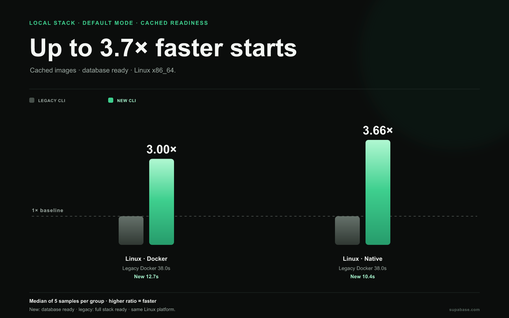
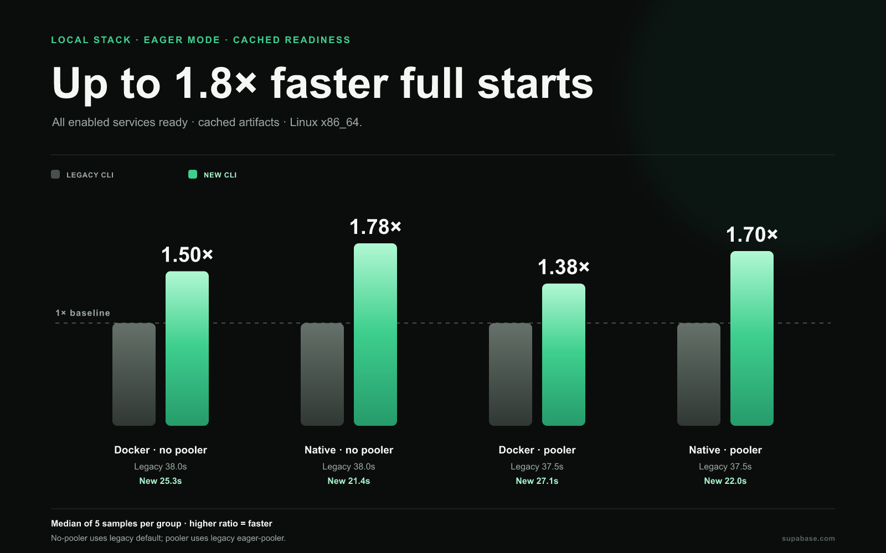
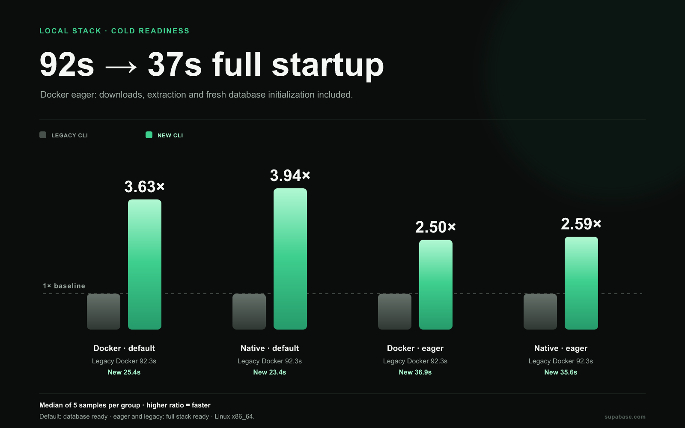
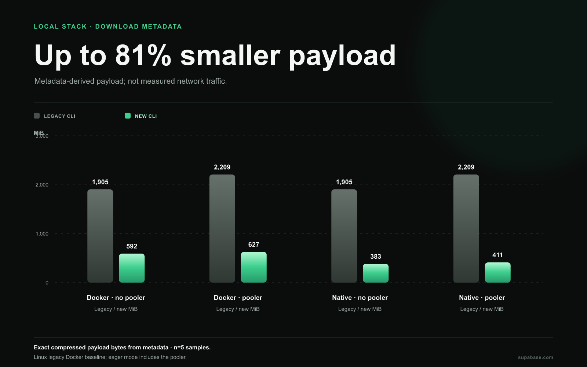
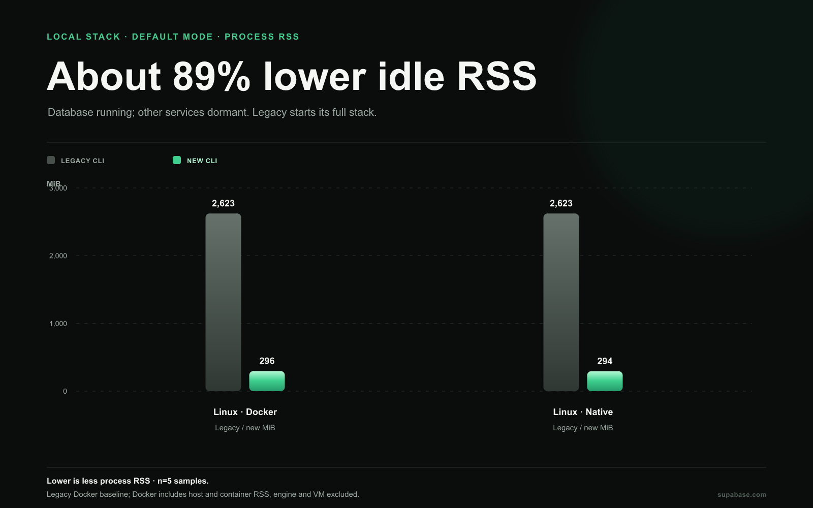
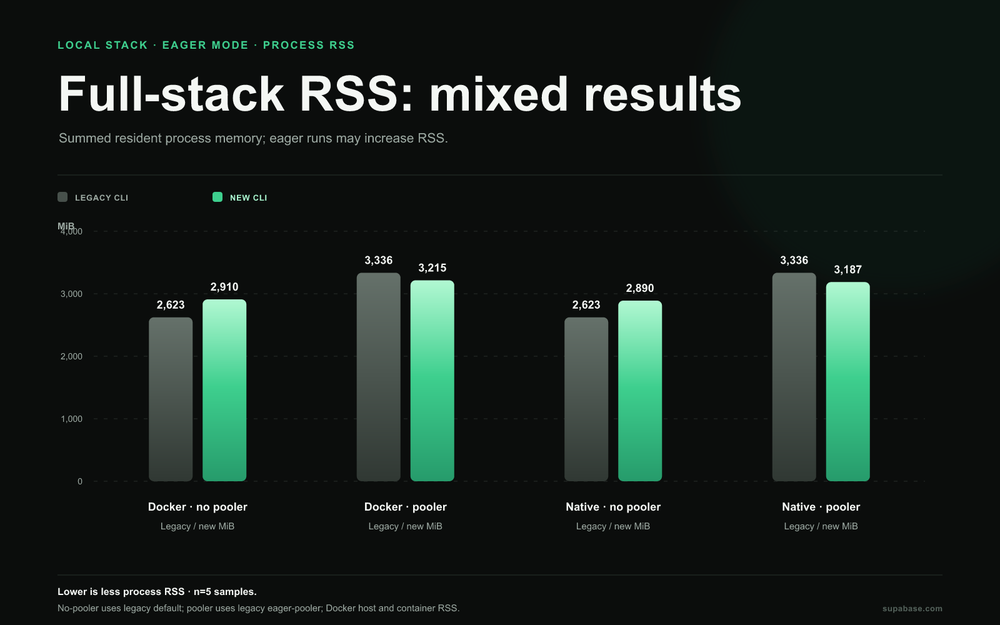

# Local stack benchmarks: database ready sooner

**Benchmark results · September 25, 2026**

The integrated managed stack in CLI commit [`4cebcf8`](https://github.com/supabase/cli/commit/4cebcf8779ef8ba983f38632eb4c48a86c5e829e) reaches database readiness sooner than released CLI **2.117.0** in these Linux CI measurements. The new default keeps non-database services dormant and prepares them in the background, while legacy `supabase start` starts the full configured stack.

- **Cached default startup:** Linux Docker takes 12.7 s (3.0× relative to legacy's 38.0 s); Linux native takes 10.4 s (3.7×).
- **Cold default startup:** Linux Docker takes 25.4 s (3.6× relative to legacy's 92.3 s); Linux native takes 23.4 s (3.9×).
- **Retained-data restart:** new default takes 2.3 s Docker and 1.6 s native, versus 32.5 s for legacy Docker.

The new default’s Linux idle RSS is 296 MiB in Docker and 294 MiB native, about 89% below legacy Docker default at 2,623 MiB. Its metadata-derived compressed payload is 69% smaller for Docker (620 MB vs 1,998 MB) and 80% smaller for native (402 MB vs 1,998 MB). These compare database readiness with legacy full-stack readiness, so timing ratios describe observed developer wait rather than equivalent work. Linux CPU models varied across CI runs, which prevents causal attribution to implementation alone.

## Everyday startup: artifacts already downloaded

The new default starts the database and prepares other enabled services in the background. Eager mode waits for its selected services to start. Eager is a closer readiness comparison with legacy, though the service sets still differ: new eager starts 11 services and legacy default starts 12 containers; service versions and architecture differ too.

| Linux x64 configuration          | Cached ready | Retained-data restart |
| -------------------------------- | -----------: | --------------------: |
| New · Docker default             |       12.7 s |                 2.3 s |
| New · native default             |       10.4 s |                 1.6 s |
| New · Docker eager               |       25.3 s |                12.2 s |
| New · native eager               |       21.4 s |                10.6 s |
| New · Docker eager + pooler      |       27.1 s |                13.6 s |
| New · native eager + pooler      |       22.1 s |                11.2 s |
| Legacy 2.117.0 · Docker default  |       38.0 s |                32.5 s |
| Legacy 2.117.0 · Docker + pooler |       37.5 s |                32.0 s |

The same pooler-enabled rows are 27.1 s with Docker and 22.1 s native. Legacy with pooler takes 37.5 s. Pooler-enabled services are not identical between CLIs.

New eager startup takes 25.3 s with Docker and 21.4 s native, compared with 38.0 s for legacy Docker. These are approximately 1.5× and 1.8× faster by the observed readiness timers. Native execution is available for the new managed stack; released legacy CLI has no native runtime measurement.

## First startup: downloads included

| Linux x64 configuration          | Cold ready |
| -------------------------------- | ---------: |
| New · Docker default             |     25.4 s |
| New · native default             |     23.4 s |
| New · Docker eager               |     36.9 s |
| New · native eager               |     35.6 s |
| New · Docker eager + pooler      |     42.1 s |
| New · native eager + pooler      |     35.5 s |
| Legacy 2.117.0 · Docker default  |     92.3 s |
| Legacy 2.117.0 · Docker + pooler |     98.6 s |

Docker eager cold startup falls from **92.3 s to 36.9 s: 2.5× faster, or 60% less waiting**. Native eager takes **35.6 s**, a **2.6×** observed speedup.

Cold measurements began with empty native artifact caches and Docker preflight image inventories. The legacy run used a GHCR mirror with matching image digests and recorded no throttling or retry markers. Preparation is a separate experiment: new Docker default took 30.9 s median and eager 29.3 s. Do not add preparation time to these cold startup durations.

## Download payload estimates

| Linux x64 mode | Runtime | Estimated compressed payload |
| -------------- | ------- | ---------------------------: |
| New default    | Docker  |                     620.3 MB |
| New eager      | Docker  |                     620.3 MB |
| New default    | Native  |                     401.6 MB |
| Legacy default | Docker  |                   1,997.6 MB |

Payload sizes are estimated from artifact and image metadata. They are not measured network transfer bytes. The macOS arm64 native payload estimates are 421.8 MB default, 421.8 MB eager, and 446.4 MB eager with pooler; there is no legacy macOS payload baseline.

## Idle memory

| Linux x64 configuration     |  Idle RSS |
| --------------------------- | --------: |
| New · Docker default        |   296 MiB |
| New · native default        |   294 MiB |
| New · Docker eager          | 2,910 MiB |
| New · native eager          | 2,890 MiB |
| Legacy · Docker default     | 2,623 MiB |
| New · Docker eager + pooler | 3,215 MiB |
| New · native eager + pooler | 3,187 MiB |
| Legacy · Docker with pooler | 3,336 MiB |

The default-mode gap follows service scope: new default starts the database and keeps other services dormant, while legacy default starts all containers. Without the pooler, eager RSS is about 10–11% higher than legacy: new eager is 2,910 MiB with Docker and 2,890 MiB native. With the pooler enabled, new eager RSS is 3.6% lower with Docker and 4.5% lower native than the corresponding legacy baseline. Pooler-enabled eager starts 12 new services; legacy with pooler starts 13 containers. These are not identical stacks. RSS is sampled during idle windows, not continuously, and is not peak or loaded memory. Docker RSS adds host and container process RSS, so shared pages may be counted twice.

## macOS native results

macOS has no Docker or legacy comparison. These standalone arm64 medians show the new CLI’s platform-specific timings and idle RSS.

| New managed stack · macOS arm64 | Cached ready | Cold ready | Retained restart |  Idle RSS |
| ------------------------------- | -----------: | ---------: | ---------------: | --------: |
| Default                         |      14.88 s |    35.16 s |           2.05 s |   300 MiB |
| Eager                           |      29.66 s |    52.63 s |          13.80 s | 2,188 MiB |
| Eager + pooler                  |      23.27 s |    43.47 s |          10.89 s | 2,279 MiB |

## Commands and measurement scope

The benchmark enabled `[experimental] stack = true` in the new CLI project configuration. It measured `supabase start` for native default mode, `supabase start --runtime docker` for Docker, and added `--eager` for full startup. Pooler cases also enabled `[db.pooler]` in the project configuration. The legacy baseline used the released `supabase start` command. CLI compilation is excluded.

## How to read the results

The campaign measured five samples per configuration. The legacy Docker baseline is used for both new Docker and new native Linux results; native legacy is unavailable. macOS measurements are new-stack native only, with no legacy macOS or Docker data, and are reported without cross-platform ratios. Hosted Linux CPU models vary, so cross-runner results are descriptive and cannot isolate causality.

See the [schema benchmark report](../schema/README.md) for database diff developer-loop measurements, and [shared benchmark notes](../BENCHMARK_NOTES.md) for sample ranges and collection details.
