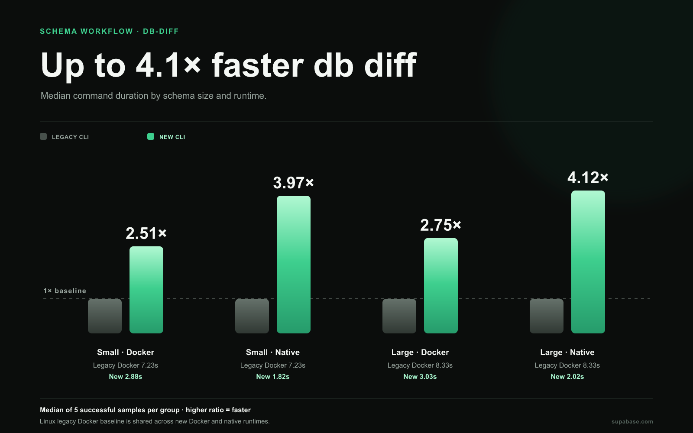
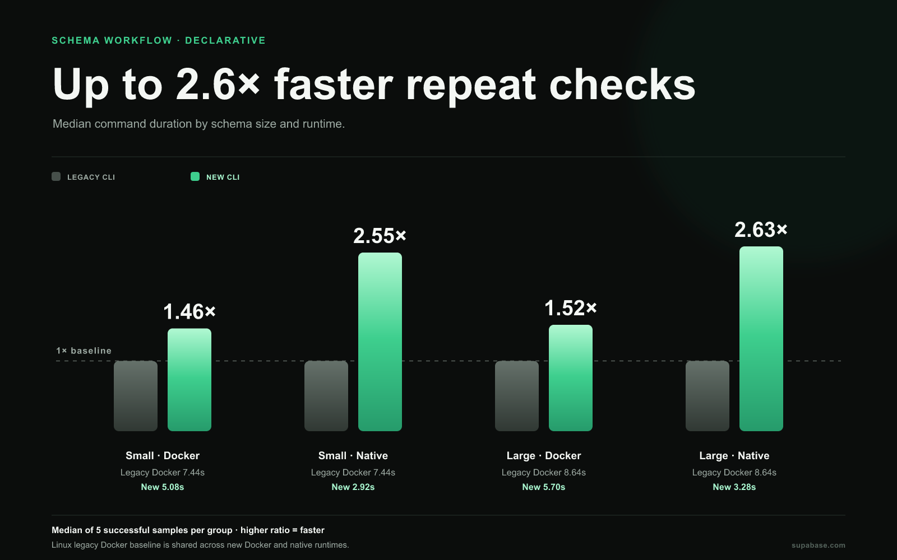

# Database schema benchmarks

**Benchmark results · September 26, 2026 · PR 6831**

## Observed outcomes

- Changed diff · small: legacy Docker 7.23 s, new Docker 2.88 s, new native 1.82 s. Observed Linux ratios: 2.51× Docker, 3.97× native.
- Changed diff · large: legacy Docker 8.33 s, new Docker 3.03 s, new native 2.02 s. Observed Linux ratios: 2.75× Docker, 4.12× native.
- Repeated no-change diff · small: legacy Docker 7.14 s, new Docker 2.83 s, new native 1.82 s.
- Repeated no-change diff · large: legacy Docker 8.34 s, new Docker 3.08 s, new native 1.97 s.

These are median observed timings from separate runs and heterogeneous runners. The ratios do not establish causal speedups.

## Database diff

## Linux changed and repeated no-change diffs

Times are median (min–max; sample count). Changed and repeat-no-change are separate operations.

| Operation             | Size  |           Legacy Docker |              New Docker |              New native | Docker ratio | Native ratio |
| --------------------- | ----- | ----------------------: | ----------------------: | ----------------------: | -----------: | -----------: |
| Changed diff          | small | 7.23 (5.78–7.49; n=5) s | 2.88 (2.53–3.07; n=5) s | 1.82 (1.42–1.87; n=5) s |        2.51× |        3.97× |
| Changed diff          | large | 8.33 (6.84–8.49; n=5) s | 3.03 (2.73–3.87; n=5) s | 2.02 (1.47–2.07; n=5) s |        2.75× |        4.12× |
| Repeat no-change diff | small | 7.14 (5.98–7.33; n=5) s | 2.83 (2.62–3.97; n=5) s | 1.82 (1.42–1.82; n=5) s |        2.52× |        3.92× |
| Repeat no-change diff | large | 8.34 (6.73–8.44; n=5) s | 3.08 (2.77–3.93; n=5) s | 1.97 (1.47–2.03; n=5) s |        2.71× |        4.22× |

## Declarative schema workflow

The chart shows the repeated no-change declarative command after its first check. The scenario table below compares complete validated change cycles.

| Environment                | Scenario                | Successful | Failed |          Total duration | Validation checks (pass/fail) |
| -------------------------- | ----------------------- | ---------: | -----: | ----------------------: | ----------------------------: |
| Legacy · Docker · Linux    | add_column              |        5/5 |      0 | 7.80 (6.24–8.10; n=5) s |                          10/0 |
| Legacy · Docker · Linux    | add_table               |        5/5 |      0 | 7.85 (6.19–8.00; n=5) s |                          10/0 |
| Legacy · Docker · Linux    | large_schema_small_edit |        5/5 |      0 | 9.05 (7.45–9.30; n=5) s |                          10/0 |
| Legacy · Docker · Linux    | related_index_fk_rls    |        5/5 |      0 | 7.85 (6.35–7.90; n=5) s |                          10/0 |
| Legacy · Docker · Linux    | view_function           |        5/5 |      0 | 7.80 (6.29–7.95; n=5) s |                          10/0 |
| New · Docker · Linux       | add_column              |        5/5 |      0 | 5.13 (4.78–5.39; n=5) s |                          10/0 |
| New · Docker · Linux       | add_table               |        5/5 |      0 | 5.04 (4.83–5.59; n=5) s |                          10/0 |
| New · Docker · Linux       | large_schema_small_edit |        5/5 |      0 | 5.48 (5.13–6.08; n=5) s |                          10/0 |
| New · Docker · Linux       | related_index_fk_rls    |        5/5 |      0 | 5.18 (4.73–5.44; n=5) s |                          10/0 |
| New · Docker · Linux       | view_function           |        5/5 |      0 | 5.24 (4.62–5.39; n=5) s |                          10/0 |
| New · Native · Linux       | add_column              |        5/5 |      0 | 2.97 (2.47–3.08; n=5) s |                          10/0 |
| New · Native · Linux       | add_table               |        5/5 |      0 | 3.02 (2.32–3.12; n=5) s |                          10/0 |
| New · Native · Linux       | large_schema_small_edit |        5/5 |      0 | 3.43 (2.47–3.53; n=5) s |                          10/0 |
| New · Native · Linux       | related_index_fk_rls    |        5/5 |      0 | 3.02 (2.37–3.12; n=5) s |                          10/0 |
| New · Native · Linux       | view_function           |        5/5 |      0 | 2.98 (2.37–3.08; n=5) s |                          10/0 |
| New · Native · macOS arm64 | add_column              |        5/5 |      0 | 4.05 (3.82–4.91; n=5) s |                          10/0 |
| New · Native · macOS arm64 | add_table               |        5/5 |      0 | 4.50 (3.11–4.65; n=5) s |                          10/0 |
| New · Native · macOS arm64 | large_schema_small_edit |        5/5 |      0 | 4.69 (3.41–5.53; n=5) s |                          10/0 |
| New · Native · macOS arm64 | related_index_fk_rls    |        5/5 |      0 | 4.10 (3.82–4.74; n=5) s |                          10/0 |
| New · Native · macOS arm64 | view_function           |        5/5 |      0 | 4.31 (3.32–4.53; n=5) s |                          10/0 |

## Semantic correctness

| Environment                | Passed | Failed | Unverified | Unavailable |
| -------------------------- | -----: | -----: | ---------: | ----------: |
| New · Docker · Linux       |     45 |      0 |         75 |           0 |
| New · Native · Linux       |     45 |      0 |         75 |           0 |
| New · Native · macOS arm64 |     45 |      0 |         75 |           0 |
| Legacy · Docker · Linux    |     45 |      0 |         65 |           0 |

Catalog/convergence checks, seed state, and reset behavior are represented when present in the harness. The summarizer's `unverified` category can include exit-zero commands without a matching semantic assertion; it is distinct from a failed assertion.

## Workload and commands

The small fixture contains the benchmark table; the large fixture adds 100 tables (101 total). Both use a database-only local stack with non-database services excluded. New cycles use `supabase --experimental db schema declarative sync --name <scenario> --apply`. Legacy cycles use `supabase db diff --local -f <scenario>` followed by `supabase migration up --local`. Compilation is excluded.

Full command timings and ranges for changed/no-change diffs, declarative first/repeat/no-cache checks, generated cycles, apply/reset, and seed reset are in [measurements.md](../../measurements.md).

## Coverage and provenance

The report combines 15 observed groups and 75 samples: 60 new CLI samples, 10 legacy stack samples, and 5 reused legacy schema samples. Expected coverage is 15 groups × 5 samples. 0 missing or incomplete group entries are recorded.

The new CLI source is [`2c75f9749ec5`](https://github.com/supabase/cli/commit/2c75f9749ec521d6798ec847ed83380b4cf1a0bd). Its benchmark workflow is [run 36269764438](https://github.com/supabase/cli/actions/runs/36269764438) (head `2b0c5870d76336d5dd47d3731dc039f560c87a67`). Separate sources are listed in [shared benchmark notes](../BENCHMARK_NOTES.md).

Legacy schema results are reused from their own run. New schema measurements are from the current run. There are no legacy native, legacy macOS, or macOS Docker measurements.

See the [stack startup report](../stack/README.md) and [shared benchmark notes](../BENCHMARK_NOTES.md).
