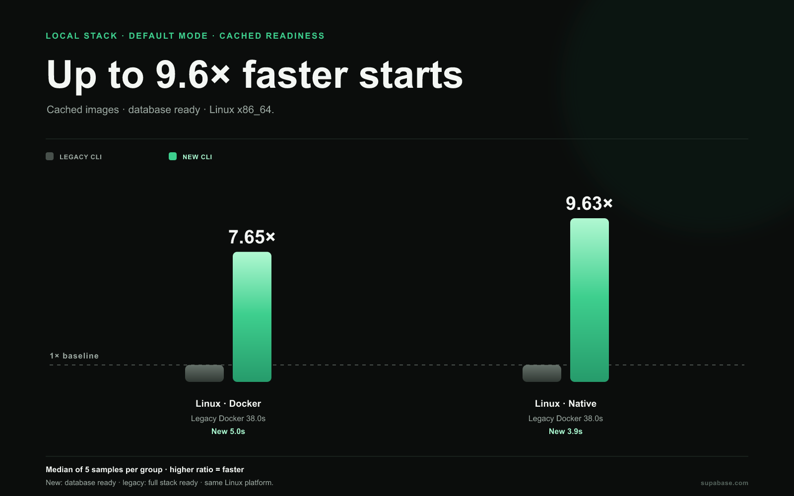
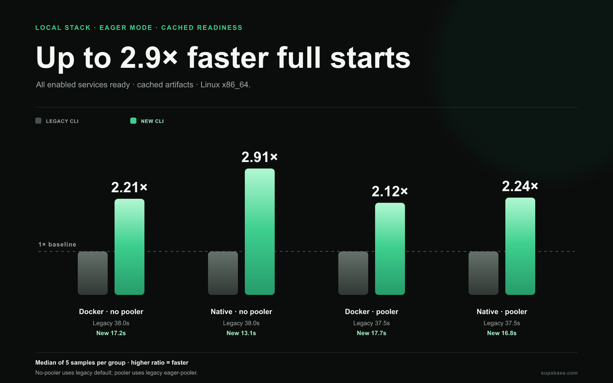
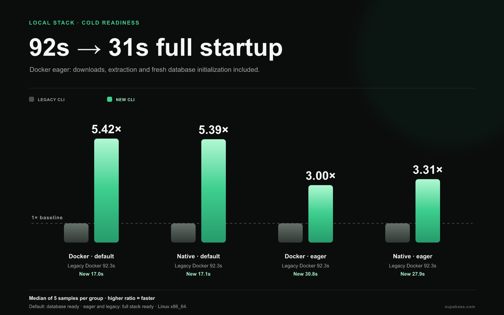
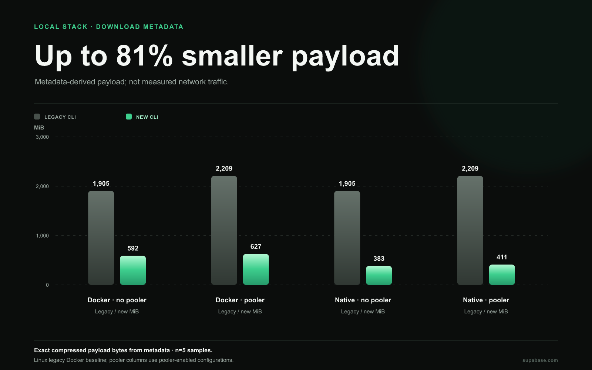
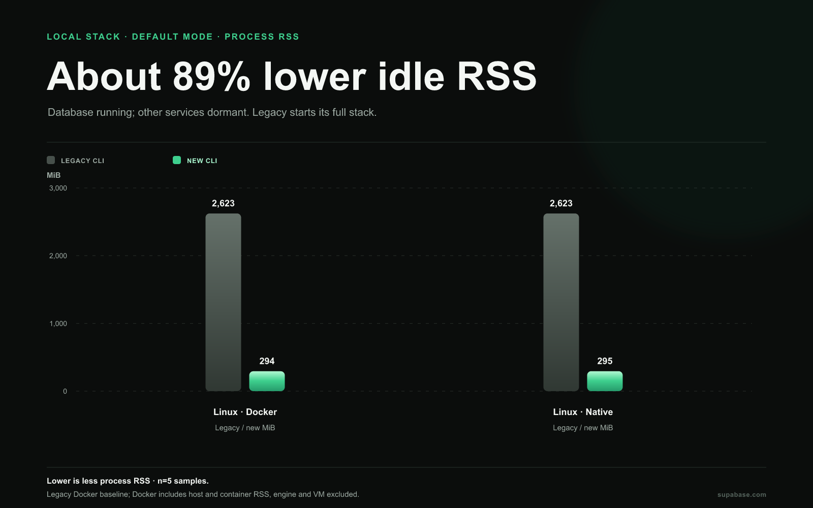
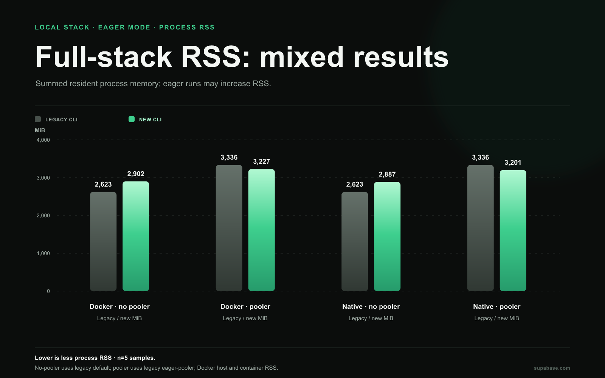

# Local stack benchmarks

**Benchmark results · September 26, 2026 · PR 6831**

## Observed outcomes

- Cached default readiness: new docker reached database-ready in 4.97 s; legacy Docker reached full-stack-ready in 38.02 s (7.65× observed-time ratio).
- Cached default readiness: new native reached database-ready in 3.95 s; legacy Docker reached full-stack-ready in 38.02 s (9.63× observed-time ratio).
- Cached eager readiness: new docker 17.20 s; legacy Docker default 38.02 s (2.21× observed-time ratio).
- Cached eager readiness: new native 13.08 s; legacy Docker default 38.02 s (2.91× observed-time ratio).
- Idle RSS comparisons are mixed across pooler modes: docker no-pooler 2902 vs 2623 MiB; docker pooler 3227 vs 3336 MiB; native no-pooler 2887 vs 2623 MiB; native pooler 3201 vs 3336 MiB. Docker sums host and container process RSS and may double count shared pages.

Default readiness ends when the database is ready while other enabled services prepare in the background. Eager modes wait for selected services; legacy readiness waits for its configured stack. These endpoints and service sets differ, so readiness ratios describe observed wait rather than equal work.

## Cached readiness and retained-data restart

Times are medians with observed ranges and sample counts. Retained restart uses the cached-fresh-project restart measurement.

| Linux x64 configuration          |               Cached ready |      Retained-data restart |
| -------------------------------- | -------------------------: | -------------------------: |
| New · Docker · default           |    4.97 (3.02–5.33; n=5) s |    2.11 (1.50–2.63; n=5) s |
| New · Native · default           |    3.95 (3.91–4.04; n=5) s |    1.58 (1.54–1.71; n=5) s |
| New · Docker · eager             | 17.20 (14.10–18.55; n=5) s | 11.51 (10.02–12.74; n=5) s |
| New · Native · eager             | 13.08 (11.43–16.01; n=5) s |   8.52 (7.46–11.23; n=5) s |
| New · Docker · eager + pooler    | 17.71 (16.37–20.15; n=5) s | 12.27 (10.47–14.04; n=5) s |
| New · Native · eager + pooler    | 16.76 (14.96–17.83; n=5) s | 11.71 (10.89–12.00; n=5) s |
| Legacy · Docker · default        | 38.02 (37.73–38.44; n=5) s | 32.52 (26.51–32.81; n=5) s |
| Legacy · Docker · eager + pooler | 37.50 (36.75–37.71; n=5) s | 32.02 (26.27–32.87; n=5) s |

## First startup

Cold startup includes downloads, extraction, and fresh database initialization. Preparation is a separate timer and must not be added to cold readiness.

| Linux x64 configuration          |                  Cold ready |                                        Preparation |
| -------------------------------- | --------------------------: | -------------------------------------------------: |
| New · Docker · default           |  17.03 (15.19–21.81; n=5) s | 39.11 (31.25–50.77; n=5) s (CLI stack preparation) |
| New · Native · default           |  17.13 (16.71–17.24; n=5) s | 29.89 (25.37–35.11; n=5) s (CLI stack preparation) |
| New · Docker · eager             |  30.82 (29.20–33.04; n=5) s | 38.22 (28.27–52.00; n=5) s (CLI stack preparation) |
| New · Native · eager             |  27.94 (24.83–28.40; n=5) s | 26.22 (24.37–29.86; n=5) s (CLI stack preparation) |
| New · Docker · eager + pooler    |  33.13 (30.43–36.52; n=5) s | 33.39 (31.73–47.91; n=5) s (CLI stack preparation) |
| New · Native · eager + pooler    |  29.43 (26.49–29.79; n=5) s | 37.53 (28.22–40.37; n=5) s (CLI stack preparation) |
| Legacy · Docker · default        | 92.34 (90.74–110.73; n=5) s |     54.67 (53.64–63.20; n=5) s (image_pull_replay) |
| Legacy · Docker · eager + pooler | 98.57 (97.78–117.27; n=5) s |     60.91 (59.28–72.68; n=5) s (image_pull_replay) |

## Payload estimates

Payload sizes come from artifact and image registry metadata. They are not measured network transfer bytes.

| Configuration                                | Compressed payload | Samples with estimate |
| -------------------------------------------- | -----------------: | --------------------: |
| new · docker · default · linux-x64           |           620.2 MB |                     5 |
| new · native · default · linux-x64           |           401.6 MB |                     5 |
| new · docker · eager · linux-x64             |           620.2 MB |                     5 |
| new · native · eager · linux-x64             |           401.6 MB |                     5 |
| new · docker · eager + pooler · linux-x64    |           657.8 MB |                     5 |
| new · native · eager + pooler · linux-x64    |           431.4 MB |                     5 |
| new · native · default · macos-arm64         |           421.9 MB |                     5 |
| new · native · eager · macos-arm64           |           421.9 MB |                     5 |
| new · native · eager + pooler · macos-arm64  |           446.5 MB |                     5 |
| legacy · docker · default · linux-x64        |          1997.6 MB |                     5 |
| legacy · docker · eager + pooler · linux-x64 |          2316.5 MB |                     5 |

## Idle resident memory

Native RSS is host process RSS. Docker RSS adds host and container process RSS per sample; shared pages may be counted twice, so the sum is not physical memory. RSS is sampled during idle windows. CPU utilization and peak RSS were not collected.

| Configuration                                |                        Idle RSS | Measurement                             |
| -------------------------------------------- | ------------------------------: | --------------------------------------- |
| new · docker · default · linux-x64           |    293.7 (292.5–296.8; n=5) MiB | Docker host RSS + container process RSS |
| new · native · default · linux-x64           |    294.6 (290.8–297.6; n=5) MiB | native host RSS                         |
| new · docker · eager · linux-x64             | 2902.1 (2893.1–2925.5; n=5) MiB | Docker host RSS + container process RSS |
| new · native · eager · linux-x64             | 2886.8 (2880.1–2899.1; n=5) MiB | native host RSS                         |
| new · docker · eager + pooler · linux-x64    | 3227.3 (3214.7–3236.6; n=5) MiB | Docker host RSS + container process RSS |
| new · native · eager + pooler · linux-x64    | 3201.2 (3187.6–3206.7; n=5) MiB | native host RSS                         |
| new · native · default · macos-arm64         |    286.6 (281.9–290.9; n=5) MiB | native host RSS                         |
| new · native · eager · macos-arm64           | 2484.9 (2041.3–2602.3; n=5) MiB | native host RSS                         |
| new · native · eager + pooler · macos-arm64  | 2347.6 (2303.0–2694.0; n=5) MiB | native host RSS                         |
| legacy · docker · default · linux-x64        | 2623.5 (2589.5–2639.2; n=5) MiB | Docker host RSS + container process RSS |
| legacy · docker · eager + pooler · linux-x64 | 3336.4 (3296.8–3342.4; n=5) MiB | Docker host RSS + container process RSS |

## macOS arm64

These are new native measurements; there is no legacy macOS or Docker comparison.

| Mode           |               Cached ready |                 Cold ready |           Retained restart |                        Idle RSS |
| -------------- | -------------------------: | -------------------------: | -------------------------: | ------------------------------: |
| default        |    6.89 (5.62–9.44; n=5) s | 27.19 (21.35–29.00; n=5) s |    1.67 (1.40–1.89; n=5) s |    286.6 (281.9–290.9; n=5) MiB |
| eager          | 23.46 (19.33–35.41; n=5) s | 46.29 (34.28–53.23; n=5) s | 14.62 (10.18–15.97; n=5) s | 2484.9 (2041.3–2602.3; n=5) MiB |
| eager + pooler | 21.08 (15.62–27.21; n=5) s | 40.37 (30.87–46.87; n=5) s |  13.40 (9.67–17.53; n=5) s | 2347.6 (2303.0–2694.0; n=5) MiB |

## Commands

The new stack benchmark enabled `[experimental] stack = true`. It used `supabase start` for default mode, `supabase start --runtime docker` for Docker, and added `--eager` for eager startup. Pooler cases enabled `[db.pooler]`. The legacy baseline used released CLI 2.117.0 with `supabase start`. Compilation is excluded.

## Failures, coverage, and provenance

The report combines 15 observed groups and 75 samples: 60 new CLI samples, 10 legacy stack samples, and 5 reused legacy schema samples. Expected coverage is 15 groups × 5 samples. 0 missing or incomplete group entries are recorded.

The new CLI source is [`2c75f9749ec5`](https://github.com/supabase/cli/commit/2c75f9749ec521d6798ec847ed83380b4cf1a0bd). Its benchmark workflow is [run 36269764438](https://github.com/supabase/cli/actions/runs/36269764438) (head `2b0c5870d76336d5dd47d3731dc039f560c87a67`). Separate sources are listed in [shared benchmark notes](../BENCHMARK_NOTES.md).

The new eager configuration selected 11 services while legacy default starts 12 containers. Their service sets, versions, and architecture differ. Linux comparisons use a legacy baseline collected in a separate run; heterogeneous runners prevent causal attribution.
Native artifact metadata digest check: 30/30 samples, 24 service/platform pairs, consistent=true, 0 mismatches.

See the [schema benchmark report](../schema/README.md) and [shared benchmark notes](../BENCHMARK_NOTES.md).
