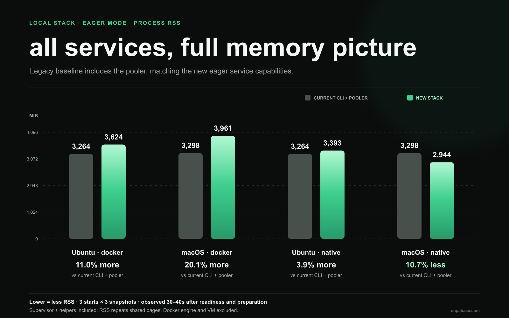

# Benchmark notes

Supporting data for [New local stack: faster startup, less waiting](README.md). The report uses the September 7 optimized campaign and the September 5–6 CLI 2.116.0 baseline. This is a historical comparison, not a controlled A/B rerun.

## Environment and measurement boundaries

- macOS 26.6.2, Apple M3 arm64, 8 cores, 24 GiB. Docker workloads ran through OrbStack.
- Ubuntu 22.04.5 LTS arm64 VM, 3 vCPUs, 8 GiB, on the same Mac; Docker 29.1.3. The campaigns used separate VM runs on that host.
- Optimized source: `1944456f2` plus the preserved CLI and artifact patches. CLI changes were subsequently committed as [`75c6385ca`](https://github.com/supabase/cli/commit/75c6385ca). Measurements used staged experimental archives/images, not subsequently released assets.
- Legacy timing spans process launch through CLI readiness exit. Optimized timing spans public `start()`, excluding `createStack()` and explicit preparation, with approximately 100 ms of status-observer overhead.
- Cached starts use fresh databases and cached artifacts; three samples after warmup. Retained-data restarts reuse the database. Default returns database readiness; eager returns all enabled services ready. First-request activation latency was not measured.
- Legacy defaults start 12 containers without the pooler; new eager starts 11 workloads including the pooler. Versions, gateway and logging arrangements differ. Eager memory is compared with a separate legacy + pooler campaign; startup uses the standard legacy baseline.

## Cached startup

Seconds; optimized medians and ranges from three starts with fresh project data. The legacy medians are **30.26525 s on Ubuntu** and **37.79976 s on macOS**; observed ranges are **30.00284–30.57069 s** and **37.12481–53.58894 s**, respectively.

| Platform     | Configuration  | Median (s) | Observed range (s) | Legacy / optimized |
| ------------ | -------------- | ---------: | -----------------: | -----------------: |
| macOS        | Native default |    2.17271 |    2.16590–2.38241 |             17.40× |
| macOS        | Native eager   |   10.31800 |   9.43529–10.33865 |              3.66× |
| macOS        | Docker default |    3.19502 |    2.68893–3.53849 |             11.83× |
| macOS        | Docker eager   |   10.97177 |  10.51032–12.03806 |              3.45× |
| Ubuntu 22.04 | Native default |    3.27435 |    3.19992–3.31149 |              9.24× |
| Ubuntu 22.04 | Native eager   |    7.21585 |    7.02132–7.23804 |              4.19× |
| Ubuntu 22.04 | Docker default |    2.56511 |    2.42578–3.45309 |             11.80× |
| Ubuntu 22.04 | Docker eager   |   11.40614 |  11.25659–11.82498 |              2.65× |

## Cold startup

**Do not calculate legacy-relative speedups from this table.** Legacy used public downloads: Ubuntu began with an empty Docker image store; macOS used partial image eviction. Optimized cases used local HTTP mirrors/registries, fresh native artifact caches or eviction of exact image references. Shared Docker layers and OS page caches could remain. All values are single observations, not averages or public-network first-install predictions.

| Configuration / download source   | Ubuntu (s) | macOS (s) |
| --------------------------------- | ---------: | --------: |
| Current CLI · public downloads    |  112.24467 |  89.33765 |
| New Docker default · local mirror |    5.17620 |   5.42280 |
| New native default · local mirror |    6.40214 |  13.60928 |
| New Docker eager · local mirror   |   22.40740 |  20.68951 |
| New native eager · local mirror   |   16.72406 |  57.17978 |

For cold default mode, all enabled artifacts were observed ready by **13.79665 s (Ubuntu Docker)**, **16.83240 s (Ubuntu native)**, **14.67848 s (macOS Docker)** and **31.74731 s (macOS native)** from startup. These include status-collection delay and are upper bounds on preparation completion. The main report's cold chart shows only optimized Ubuntu observations.

## Retained-data restarts

Seconds. Legacy is one retained-data restart after its cold run; optimized values are medians of three restarts. Default starts only the database.

| Platform     | Configuration  | Legacy (s) | Optimized median (s) | Optimized range (s) |
| ------------ | -------------- | ---------: | -------------------: | ------------------: |
| macOS        | Native default |   25.72722 |              0.53899 |     0.53153–0.54033 |
| macOS        | Native eager   |   25.72722 |              6.90366 |     6.78512–6.96564 |
| macOS        | Docker default |   25.72722 |              1.15804 |     1.12014–1.16125 |
| macOS        | Docker eager   |   25.72722 |              7.82806 |     7.67438–7.89654 |
| Ubuntu 22.04 | Native default |   25.58501 |              0.36754 |     0.35774–0.42334 |
| Ubuntu 22.04 | Native eager   |   25.58501 |              4.62490 |     4.44017–4.99902 |
| Ubuntu 22.04 | Docker default |   25.58501 |              0.70957 |     0.70822–0.80977 |
| Ubuntu 22.04 | Docker eager   |   25.58501 |              7.32578 |     6.89290–7.39731 |

## Process memory campaign

Memory is observed 30, 35 and 40 seconds after readiness and, for the new stack, background artifact preparation. Each per-start value is the median of those snapshots; the reported value is the median across three starts. The range below spans those three per-start medians.

Process RSS includes service processes, Supervisor, wrappers and Docker CLI helpers. It excludes the Docker engine, containerd, VM and unrelated shared host processes. RSS repeats shared pages; Linux PSS apportions them. macOS native PSS is unavailable. These are post-start observations, not peaks or measurements under application load.

| Platform     | Configuration  | RSS median (MiB) | RSS range (MiB) | Linux PSS median (MiB) |
| ------------ | -------------- | ---------------: | --------------: | ---------------------: |
| macOS        | Native default |           262.20 |   258.48–264.05 |            Unavailable |
| macOS        | Native eager   |          2944.16 | 2710.12–2956.06 |            Unavailable |
| macOS        | Docker default |           371.53 |   369.22–373.18 |            Unavailable |
| macOS        | Docker eager   |          3961.10 | 3888.62–4049.88 |            Unavailable |
| Ubuntu 22.04 | Native default |           285.91 |   285.09–285.96 |                 180.25 |
| Ubuntu 22.04 | Native eager   |          3392.98 | 3370.39–3398.00 |                2107.42 |
| Ubuntu 22.04 | Docker default |           320.61 |   320.32–321.24 |                 210.20 |
| Ubuntu 22.04 | Docker eager   |          3623.76 | 3605.12–3626.88 |                2164.39 |

Default RSS uses the standard legacy baseline; eager RSS/PSS uses legacy with the pooler enabled. On Ubuntu, eager PSS is **9.5% higher for native** and **12.4% higher for Docker** than the pooler-enabled legacy baseline. The PSS chart includes default bars for context; those modes have fewer running services.

## Sources and reproducibility

- [Comparison data](comparison-data.json): exact unrounded legacy/optimized values and calculated speedups.
- [Legacy timing data](sources/legacy-benchmark-data.json) and [legacy process-memory data](sources/legacy-process-memory-data.json).
- [Optimized aggregates](sources/optimized-benchmark-data.json) and [per-start samples](sources/optimized-samples.json). Entries labeled `baseline` in the latter refer to the earlier **new stack**, not the legacy CLI; this report uses entries labeled `optimized`.
- [Artifact identities](sources/optimized-artifacts.json), [CLI patch](sources/cli.patch), [artifact patch](sources/slim-services.patch), and [source snapshot notes](sources/README.md). The patches and datasets are preserved as measured.
- [Original campaign notes](../stack-startup-2026-09-06/BENCHMARK_NOTES.md) retain the historical baseline collection details and earlier experiments. Their older new-stack timings, failure observations and packaging probes are not the latest optimized results.

The full Nix release build had not been run at measurement time. Subsequent [artifact PR #300](https://github.com/supabase/slim-services/pull/300) passed release workflows across Linux amd64, Linux arm64 and macOS arm64. This does not substitute for a benchmark of the published artifacts or a matched public-download cold campaign.
