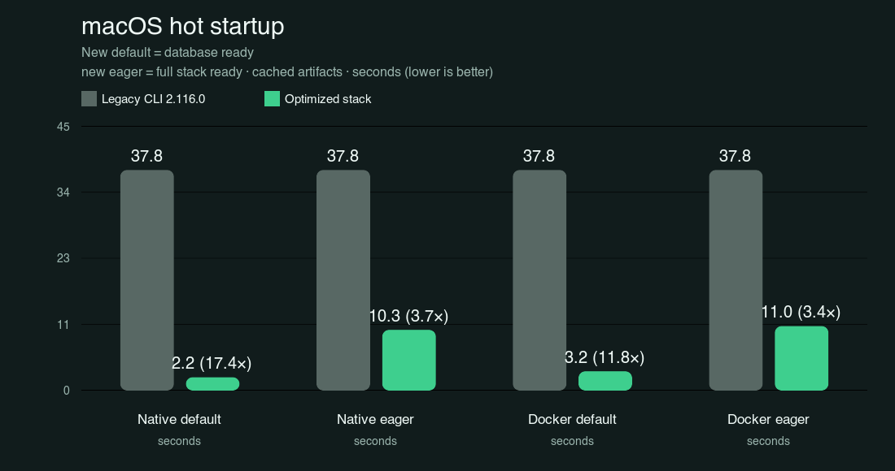
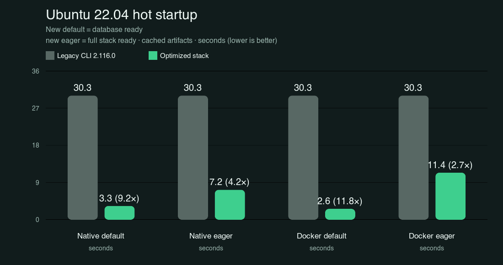
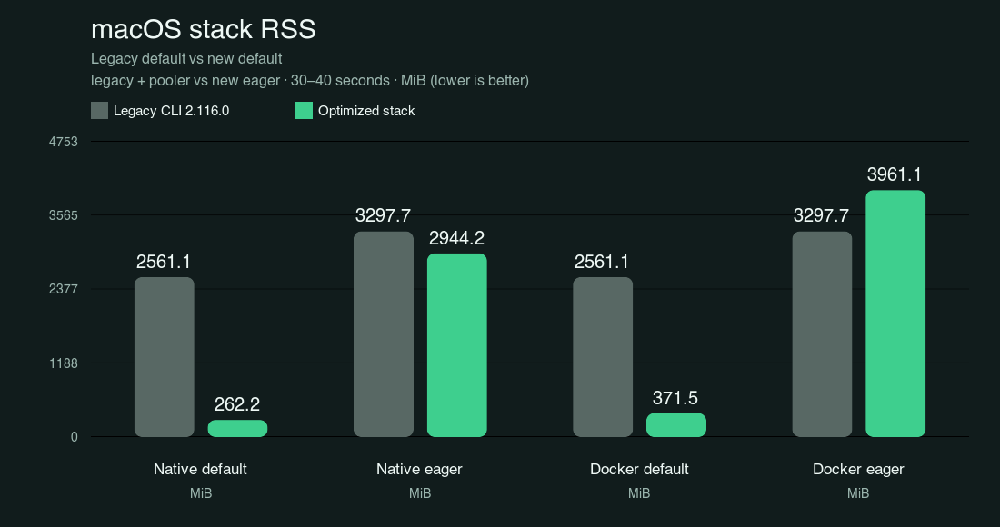
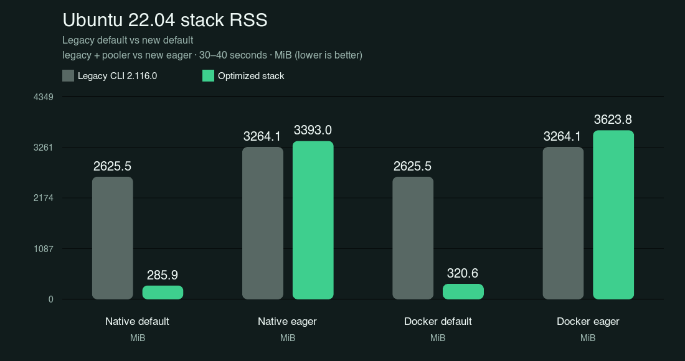

# Supabase stack vs legacy CLI

## Faster startup, with two readiness contracts

The new default path reaches database readiness while other services prepare in the background. The eager path waits for the full enabled stack. Against historical CLI 2.116.0 Docker startup, the optimized stack is **9.24–17.40× faster in default mode** and **2.65–4.19× faster in eager mode**, depending on platform and runtime. Default RSS is **85.5–89.8% lower**; eager RSS is mixed.

> This is a directional comparison across two campaigns, not a controlled A/B rerun. Legacy CLI 2.116.0 was measured earlier; the optimized stack was measured later. Cold values remain raw observations because download sources and cache eviction differ.

## Hot startup: legacy full stack vs optimized stack

The legacy executable starts the published Docker stack and exits when its full-stack readiness command completes. New stack default measures database readiness; eager measures all enabled services. The stacks differ in service count (legacy 12, new 11), and the legacy default path does not include the pooler.

| Platform     |       New mode | Legacy CLI (s) | Optimized stack (s) | Directional ratio |
| ------------ | -------------: | -------------: | ------------------: | ----------------: |
| macOS        | Native default |          37.80 |                2.17 |        **17.40×** |
| macOS        |   Native eager |          37.80 |               10.32 |         **3.66×** |
| macOS        | Docker default |          37.80 |                3.20 |        **11.83×** |
| macOS        |   Docker eager |          37.80 |               10.97 |         **3.45×** |
| Ubuntu 22.04 | Native default |          30.27 |                3.27 |         **9.24×** |
| Ubuntu 22.04 |   Native eager |          30.27 |                7.22 |         **4.19×** |
| Ubuntu 22.04 | Docker default |          30.27 |                2.57 |        **11.80×** |
| Ubuntu 22.04 |   Docker eager |          30.27 |               11.41 |         **2.65×** |

These are medians of three hot starts with fresh project data and cached artifacts. Legacy timing is subprocess start through CLI readiness; optimized timing covers public `start()` and excludes stack construction and explicit preparation.

## Memory: RSS and Linux PSS

RSS includes the owned workload plus supervisor/helpers for both runtimes. Shared pages may be counted repeatedly, so Linux PSS is the better physical-memory signal where available. Legacy default is compared with new default; legacy + pooler is compared with eager because eager includes that additional workload. Versions differ, and post-start first-request latency is outside this measurement.

| Platform     |       New mode | Legacy RSS MiB | Optimized RSS MiB |     Change |
| ------------ | -------------: | -------------: | ----------------: | ---------: |
| macOS        | Native default |        2561.12 |            262.20 | **-89.8%** |
| macOS        |   Native eager |        3297.68 |           2944.16 | **-10.7%** |
| macOS        | Docker default |        2561.12 |            371.53 | **-85.5%** |
| macOS        |   Docker eager |        3297.68 |           3961.10 | **+20.1%** |
| Ubuntu 22.04 | Native default |        2625.51 |            285.91 | **-89.1%** |
| Ubuntu 22.04 |   Native eager |        3264.11 |           3392.98 |  **+3.9%** |
| Ubuntu 22.04 | Docker default |        2625.51 |            320.61 | **-87.8%** |
| Ubuntu 22.04 |   Docker eager |        3264.11 |           3623.76 | **+11.0%** |

Default RSS falls by **89.8% on macOS native**, **89.1% on Ubuntu native**, **85.5% on macOS Docker**, and **87.8% on Ubuntu Docker**. Eager RSS changes by -10.7% on macOS native, +20.1% on macOS Docker, +3.9% on Ubuntu native, and +11.0% on Ubuntu Docker. Linux PSS also rises for eager: +9.5% native and +12.4% Docker versus the legacy + pooler workload.

### Linux PSS

| New mode       | Legacy PSS MiB | Optimized PSS MiB |     Change |
| -------------- | -------------: | ----------------: | ---------: |
| Native default |        1806.31 |            180.25 | **-90.0%** |
| Native eager   |        1925.44 |           2107.42 |  **+9.5%** |
| Docker default |        1806.31 |            210.20 | **-88.4%** |
| Docker eager   |        1925.44 |           2164.39 | **+12.4%** |

## Restart and cold observations

| Platform     |       New mode | Legacy retained-data restart (s) | Optimized retained-data restart (s) |
| ------------ | -------------: | -------------------------------: | ----------------------------------: |
| macOS        | Native default |                            25.73 |                                0.54 |
| macOS        |   Native eager |                            25.73 |                                6.90 |
| macOS        | Docker default |                            25.73 |                                1.16 |
| macOS        |   Docker eager |                            25.73 |                                7.83 |
| Ubuntu 22.04 | Native default |                            25.59 |                                0.37 |
| Ubuntu 22.04 |   Native eager |                            25.59 |                                4.62 |
| Ubuntu 22.04 | Docker default |                            25.59 |                                0.71 |
| Ubuntu 22.04 |   Docker eager |                            25.59 |                                7.33 |

Cold startup values are intentionally not converted to speedup ratios. Legacy cold runs used public image downloads and a different eviction procedure; optimized cold runs used local mirrors and application-cache eviction. These are one observation per cell (n=1). The macOS legacy Docker run used partial image eviction; OS page cache was not flushed. They are useful as raw context, not as a claim of improvement.

| Platform     |       New mode | Legacy cold (s) | Optimized cold (s) |
| ------------ | -------------: | --------------: | -----------------: |
| macOS        | Native default |           89.34 |              13.61 |
| macOS        |   Native eager |           89.34 |              57.18 |
| macOS        | Docker default |           89.34 |               5.42 |
| macOS        |   Docker eager |           89.34 |              20.69 |
| Ubuntu 22.04 | Native default |          112.24 |               6.40 |
| Ubuntu 22.04 |   Native eager |          112.24 |              16.72 |
| Ubuntu 22.04 | Docker default |          112.24 |               5.18 |
| Ubuntu 22.04 |   Docker eager |          112.24 |              22.41 |

## What was measured

- Legacy: Supabase CLI **2.116.0**, historical campaign on macOS 26.6.2 (Apple M3, 8 cores, 24 GiB) and Ubuntu 22.04.5 LTS (arm64 VM, 3 vCPUs, 8 GiB). The legacy restart value is one retained-data restart after the cold run.
- Optimized: PR head `1944456f2` plus the uncommitted optimization patch, using the same enabled workload definition as the prior optimization report. Hot startup and restarts use n=3; hot memory uses snapshots at 30/35/40 seconds, then the median across starts.
- The campaigns ran on the same physical M3 host, but on different dates and VM campaigns. Timing boundaries differ as described above.
- RSS includes supervisor/helpers and workload processes for both native and Docker measurements. Docker daemon, containerd, VM, and unrelated shared host processes are excluded. Default savings reflect dormant services at the measured barrier; first-request latency was not measured.
- The CLI portion is based on commit [`75c6385ca`](https://github.com/supabase/cli/commit/75c6385ca), measured as a local patch. Optimized artifacts are local experimental variants built with the unreleased [`slim-services.patch`](sources/slim-services.patch). The full Nix release build was not run; archive and image identities are in [`sources/optimized-artifacts.json`](sources/optimized-artifacts.json), with patch hashes in [`sources/optimized-benchmark-data.json`](sources/optimized-benchmark-data.json).

The source snapshots and machine-readable comparison data are in [`sources/README.md`](sources/README.md) and [`comparison-data.json`](comparison-data.json).

Generated 2026-09-07.
