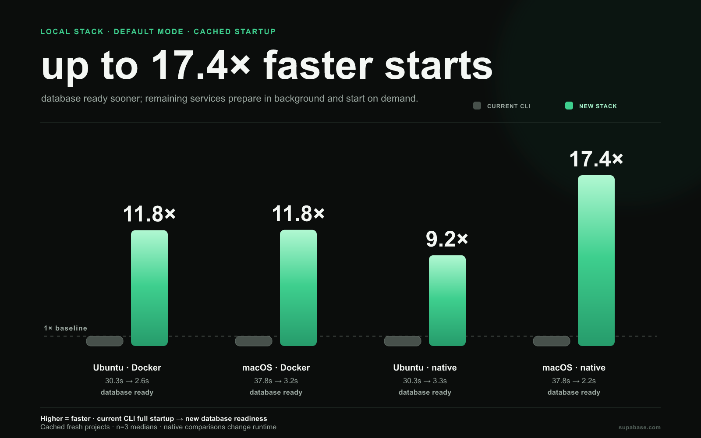
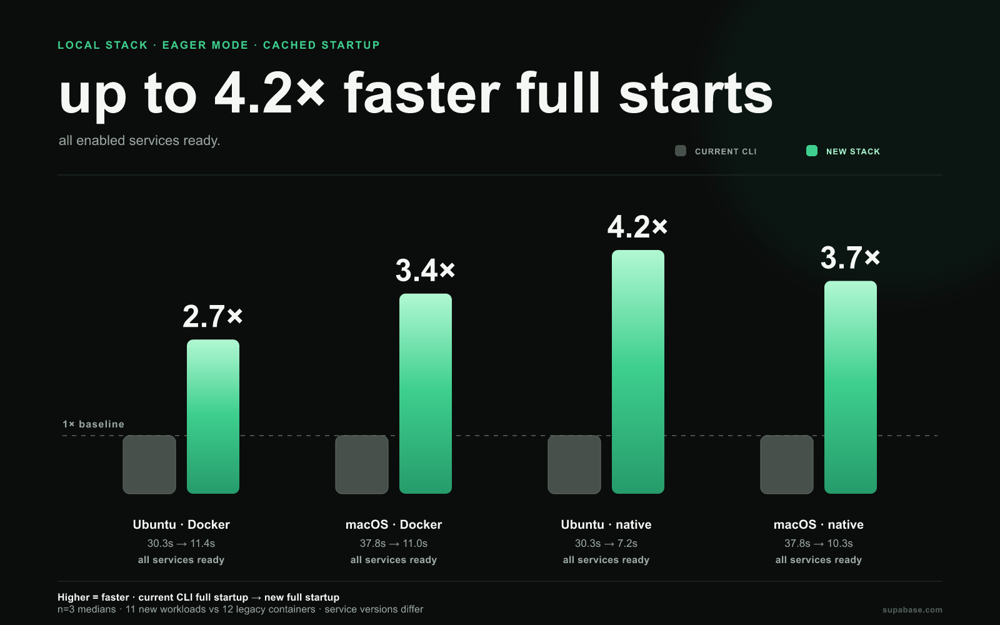
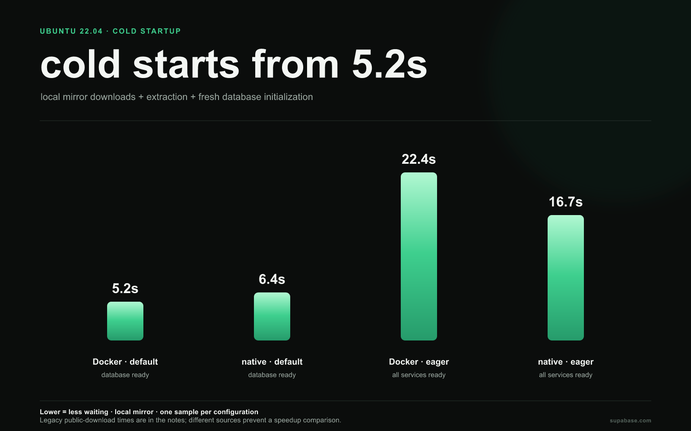
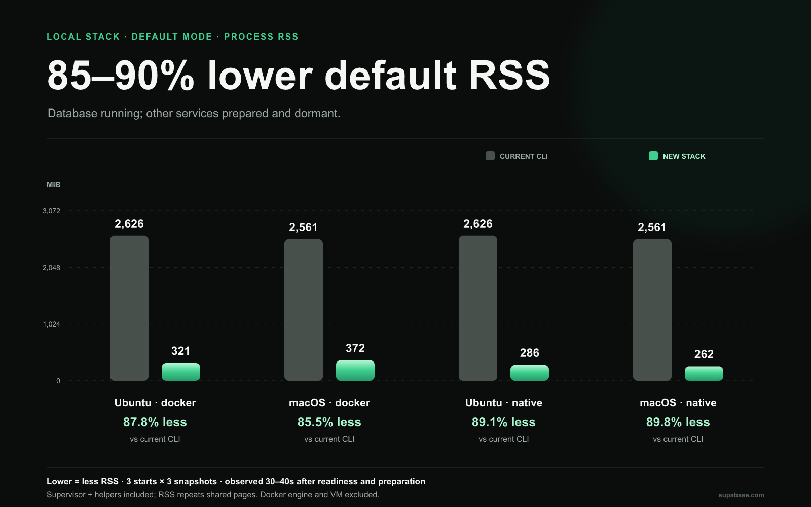
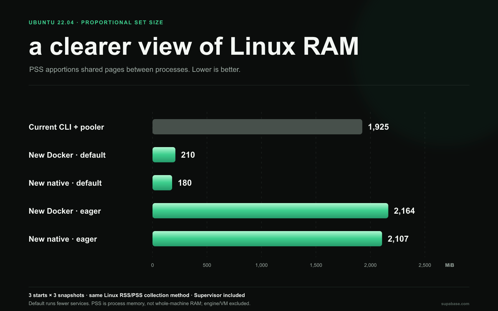

# New local stack: faster startup, less waiting

**Benchmark results · September 7, 2026**

Optimized stack package ([PR #6440](https://github.com/supabase/cli/pull/6440), measured as a local patch on `1944456f2`) compared with the released Supabase CLI **2.116.0**. The new stack was measured through its programmatic API, before CLI integration.

The measurements show two useful improvements: getting a working database sooner, and reducing startup time when all enabled services are needed.

- **11.8× faster cached Docker startup with the new default mode**, across Ubuntu and macOS. That saves **28–35 seconds per start** in these measurements.
- **2.7–3.4× faster cached Docker startup in eager mode**, with all enabled services running: **62–71% less waiting**.
- **Up to 17.4× faster default startup and 4.2× faster eager startup with native execution**, compared with the current CLI's Docker stack on the same host.
- **85–90% lower process RSS in default mode**, across Docker/native and both platforms, with the new stack’s Supervisor included. Full-stack memory is reported separately below.

> These are directional comparisons across campaigns, not a controlled A/B rerun. The legacy baseline was measured on September 5–6; the optimized stack on September 7. Cold download sources differ, so cold times are reported without speedup claims.

## What “ready” means

**Default mode** starts the database and prepares the other enabled services in the background. Those services start when requested. This avoids starting services a developer may never use, but their first request can still incur activation time; that latency was not measured here.

**Eager mode** starts all enabled services before returning. It is the closer comparison to the current CLI's behavior. The defaults still differ: the current CLI starts 12 containers; the new eager stack starts 11 workloads, with different service versions and gateway arrangements.

The speedups below compare each new configuration with the current CLI **on the same host**. They describe the observed startup experience, rather than identical implementations doing identical work.

## Everyday startup: artifacts already downloaded

These runs use cached images or native artifacts and **fresh project data**. Results are medians of three starts. Bars show speedup relative to the current CLI: **higher is faster**, with the current CLI normalized to **1×**. Observed time ranges are in the benchmark notes.

### Default mode: up to 17.4× faster database readiness

### Eager mode: up to 4.2× faster full startup

| Configuration        |      Ubuntu 22.04 |             macOS |
| -------------------- | ----------------: | ----------------: |
| Current CLI · Docker | 30.3 s · baseline | 37.8 s · baseline |
| New default · Docker | **2.6 s · 11.8×** | **3.2 s · 11.8×** |
| New default · native |  **3.3 s · 9.2×** | **2.2 s · 17.4×** |
| New eager · Docker   | **11.4 s · 2.7×** | **11.0 s · 3.4×** |
| New eager · native   |  **7.2 s · 4.2×** | **10.3 s · 3.7×** |

The largest default-mode gains include the decision to leave unused services dormant. Eager mode also improves startup while bringing up all enabled services. Native execution offers another useful option: it produced the fastest default start on macOS and the fastest eager start on both platforms in this sample.

## First startup: downloads included

The optimized cold runs include local mirror downloads, extraction, and fresh database initialization. Native runs used fresh artifact caches; Docker runs evicted the tested image references. Shared Docker layers and OS page caches could remain. **These are not public-network first-install times.**

For Docker on Ubuntu, default mode makes the database ready in **5.2 seconds**. Background preparation of all enabled images was observed complete by **13.8 seconds**; those services remain dormant until needed. Eager startup takes **22.4 seconds**.

Native default startup takes **6.4 seconds** cold, with background artifacts observed ready by **16.8 seconds**. Native eager takes **16.7 seconds**. Artifact-ready observations are upper bounds from status collection, rather than exact transfer-completion timings.

The historical current CLI took **112.2 seconds on Ubuntu** with an empty Docker image store and public downloads, and **89.3 seconds on macOS** after partial image eviction. **Download sources and cache conditions differ, so these observations cannot establish a cold speedup.** All cold values are single observations. The [benchmark notes](BENCHMARK_NOTES.md#cold-startup) include macOS, where optimized native eager took **57.2 seconds**, and the full cold data.

## Retained-data restarts

**Retained-data restarts can be much quicker.** New default-mode native restarts took **0.37 seconds on Ubuntu** and **0.54 seconds on macOS**, compared with **25.6 and 25.7 seconds** for the current CLI's full-stack restart. New default-mode Docker restarts took **0.71 and 1.16 seconds**. Optimized values are medians of three restarts; each legacy value is a single observation. Default mode again brings up only the database. Full eager restart times are in the [benchmark notes](BENCHMARK_NOTES.md#retained-data-restarts).

## Memory: now measured against the current CLI

**The current CLI and new stack have a common process-RSS comparison.** Both campaigns observe memory at **30, 35, and 40 seconds after readiness**. New-stack observations also wait for background artifact preparation. Each number is the median of three per-start medians, with cached artifacts and fresh project data.

The figures below include the **new stack's service processes, Supervisor and its helper processes**. They exclude the Docker engine and VM. They are observations after startup, **not peak memory or memory under application load**.

### Default mode: 85–90% lower process RSS

The saving comes mainly from leaving unused services dormant. RSS grows as those services activate; this is the memory benefit of a database-first workflow, not an equivalent full-stack workload.

| Configuration                 |    Ubuntu RSS |     macOS RSS | Ubuntu PSS |
| ----------------------------- | ------------: | ------------: | ---------: |
| Current CLI · Docker          | **2,626 MiB** | **2,561 MiB** |  1,806 MiB |
| Current CLI + pooler · Docker | **3,264 MiB** | **3,298 MiB** |  1,925 MiB |
| New default · Docker          |   **321 MiB** |   **372 MiB** |    210 MiB |
| New default · native          |   **286 MiB** |   **262 MiB** |    180 MiB |
| New eager · Docker            | **3,624 MiB** | **3,961 MiB** |  2,164 MiB |
| New eager · native            | **3,393 MiB** | **2,944 MiB** |  2,107 MiB |

**RSS** counts resident pages in each process and can count shared pages more than once. **PSS** divides shared pages among the processes using them, making the Ubuntu PSS column a better guide to the stack's proportional physical footprint. For example, current CLI defaults measure **2,626 MiB RSS but 1,806 MiB PSS**.

### Eager mode: compare the whole service set

Legacy defaults leave the connection pooler disabled; new eager mode enables it. We therefore use the measurements of **legacy with the pooler enabled** for the eager memory comparison. This brings the enabled service capabilities closer, although service versions, gateway and logging arrangements still differ.

**Docker host processes add a material cost.** Eager mode keeps Docker CLI log followers and exit watchers running for its workloads. These helpers belong to the new stack and are included in the totals above.

Against legacy with the pooler enabled, **new Docker eager PSS is 12.4% higher** and **new native eager PSS is 9.5% higher** on Ubuntu. Faster full startup should therefore be judged separately from memory savings. Ubuntu eager RSS is **3.9% higher for native** and **11.0% higher for Docker**. On macOS, eager RSS is **10.7% lower for native** and **20.1% higher for Docker**, against the pooler-enabled legacy baseline. A [dedicated eager RSS chart](BENCHMARK_NOTES.md#process-memory-campaign) gives the same comparison visually.

macOS native RSS comes from macOS process accounting, while its Docker service RSS comes from the Linux VM. Both are RSS, but the kernels account differently. Native PSS is unavailable on macOS, so we do **not** turn its RSS comparison into a claim about physical RAM saved. Docker engine and shared OrbStack memory cannot be assigned entirely to one stack.

The [benchmark notes](BENCHMARK_NOTES.md#process-memory-campaign) contain ranges and collection details. [Source snapshots](sources/README.md) preserve the sanitized measurements and artifact identities used for this comparison.

## Remaining work

- **Public-download cold measurements:** rerun both stacks under the same eviction and download conditions before claiming a cold-start speedup.
- **Released-artifact verification:** this campaign used staged experimental artifacts. The subsequent [slim-services PR #300](https://github.com/supabase/slim-services/pull/300) passed its release workflows across Linux amd64, Linux arm64 and macOS arm64; published artifacts have not been rebenchmarked here.
- **First-request latency and full-stack memory:** measure activation after default startup and memory under application load. Eager memory remains higher than legacy in several comparisons.

## How to interpret these numbers

Speedup means **current CLI time ÷ new stack time**. For example, Ubuntu's cached Docker default is `30.265 ÷ 2.565 = 11.8×`, or **92% less waiting**. Ratios use the unrounded measurements.

The new-stack timer covers its public `start()` call; the current CLI timer covers process spawn through readiness exit. Stack construction, explicit preparation, installation and project setup are excluded from the new-stack timer. Ubuntu ran in an ARM64 VM with 3 CPUs and 8 GiB on the same Apple M3 machine used for macOS; these are not independent hardware benchmarks. Legacy measurements come from the earlier campaign. Workloads ran sequentially, with normal desktop activity and no reset of OS or CDN caches.

These are directional engineering measurements, not release guarantees. [Benchmark notes](BENCHMARK_NOTES.md) contain the full numbers, ranges, environment details, and exclusions; [comparison data](comparison-data.json) and [source snapshots](sources/README.md) preserve the measurements used for comparison.
