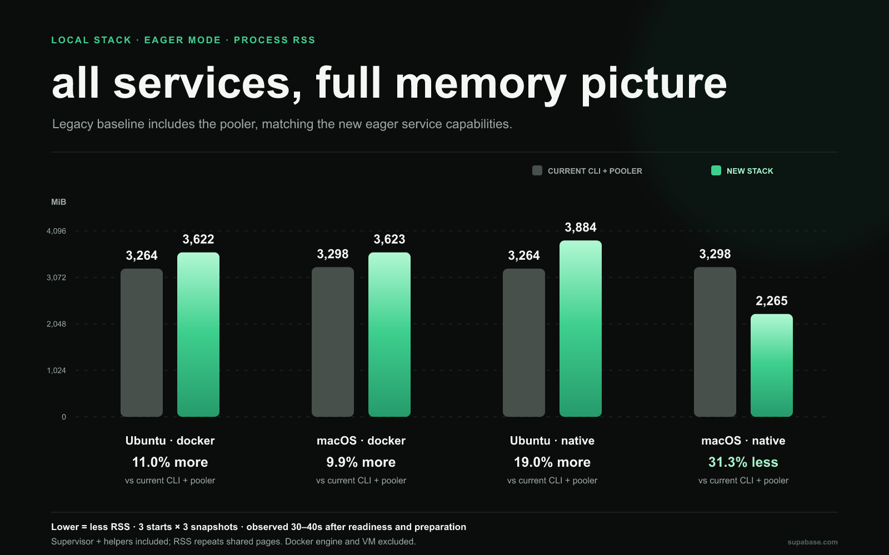

# Benchmark notes

Measured September 5–6, 2026 against PR [#6440](https://github.com/supabase/cli/pull/6440), current stack revision `1944456f2`. The sanitized machine-readable dataset is [benchmark-data.json](benchmark-data.json).

## What the timers mean

New-stack `start` is the public `PromiseStack.start()` wall-clock timer. It excludes stack construction, explicit `prepare()`, and post-start checks. Default mode eagerly starts the database, then prepares the other ten of eleven enabled base artifacts in the background. Eager mode waits for all enabled services before returning; artifact readiness is measured separately after start. Legacy is the published `supabase` CLI `2.116.0`; its timer measures executable spawn through CLI readiness and process exit across its 12-workload service set, with different service versions and gateway wiring.

Hot samples reuse artifact/image caches with fresh project data. Restart is stop/start with retained data. Native cold uses an empty artifact cache. Linux Docker cold uses an empty daemon; historical macOS Docker cold runs evicted ten of eleven tested image IDs but retained image/layer state, so they are partial cold measurements. OS, security, and CDN caches were not reset; the host was not rebooted and normal desktop activity continued.

The Linux host is Ubuntu 22.04.5 LTS arm64, glibc 2.35, in a VM on the same Apple M3 host as macOS: 3 CPUs and an 8 GiB benchmark cgroup. macOS is 26.6.2 on Apple M3 with 8 CPUs and 24 GiB; its Docker engine has 3 CPUs and approximately 11.74 GiB. Hot rows generally have three samples. Cold rows have one sample, except successful macOS native eager cold with two; one Linux native eager cold attempt failed.

The new stack has eleven base workloads versus twelve legacy containers, with different service versions and gateway arrangements. Current new-stack hot rows use `1944456f2`; the macOS legacy baseline is from September 5. Historical macOS cold native-default and Docker rows use `27355b4ca`. Fixed native-eager cold runs used production changes matching `1944456f2`.

## Full-stack results

Seconds; hot values are median (range). Cold values are a single sample unless shown as a two-sample median (range). Artifact readiness is the elapsed barrier for all eleven enabled base artifacts, shown cold/hot. Memory is a snapshot after new-stack readiness and the artifact barrier, or legacy CLI readiness: native exact Supervisor plus descendants RSS; Docker exact-label container working set, excluding the host Supervisor. These accounting bases are not equivalent. Docker values exclude the host Supervisor (roughly 130–189 MiB RSS in cached runs).

| Platform / runtime     |                       Cold start |              Hot start | Restart cold / hot | Artifacts ready cold / hot |       Memory cold / hot |
| ---------------------- | -------------------------------: | ---------------------: | -----------------: | -------------------------: | ----------------------: |
| Linux native / default |                           23.581 |    3.899 (3.223–5.546) |      0.734 / 0.418 |             71.034 / 4.198 |       0.863 / 0.277 GiB |
| Linux native / eager   |                70.462 (n=1 pass) | 22.257 (16.266–38.110) |      6.491 / 8.242 |            70.769 / 22.435 |       3.754 / 3.749 GiB |
| Linux Docker / default |                           16.814 |   8.866 (7.293–10.251) |      2.616 / 2.683 |            63.512 / 11.220 |       0.059 / 0.059 GiB |
| Linux Docker / eager   |                           61.712 | 21.920 (20.502–23.251) |    20.997 / 16.248 |            61.981 / 22.092 |       1.747 / 1.639 GiB |
| Linux legacy Docker    |                          112.245 | 30.265 (30.003–30.571) |         25.585 / — |                      — / — |       1.564 / 1.568 GiB |
| macOS native / default |              33.729 (historical) |    7.661 (7.611–7.784) |          — / 0.580 |             62.740 / 7.929 |       0.512 / 0.242 GiB |
| macOS native / eager   |     99.220 (84.730–113.711, n=2) | 19.499 (18.544–22.645) |          — / 9.674 |            99.237 / 19.520 | 2.536–2.678 / 2.439 GiB |
| macOS Docker / default | 13.567 (historical partial cold) |    5.892 (5.874–6.103) |          — / 1.976 |             41.737 / 7.545 |       0.059 / 0.059 GiB |
| macOS Docker / eager   | 39.059 (historical partial cold) | 25.853 (23.653–27.692) |         — / 16.929 |            39.240 / 26.011 |       1.648 / 1.582 GiB |
| macOS legacy Docker    | 89.338 (historical partial cold) | 37.800 (37.125–53.589) |         25.727 / — |                      — / — |       1.655 / 1.666 GiB |

For the Linux Docker comparison, legacy CLI versus new Docker is 112.245/16.814 = 6.68× cold (85.0% lower) and 30.265/8.866 = 3.41× hot (70.7% lower) in default mode; eager is 1.82× (45.0% lower) cold and 1.38× (27.6% lower) hot. macOS hot legacy Docker versus new Docker is 6.42× (84.4% lower) for default and 1.46× (31.6% lower) for eager. Native comparisons to legacy Docker are contextual because the runtime differs. Historical macOS cold ratios are excluded from controlled comparisons.

## Process memory campaign

A separate campaign on September 6, 2026 measured six configurations on each platform: current CLI defaults, current CLI with pooler enabled, and new Docker/native in default/eager mode. Versions remain CLI 2.116.0, stack `1944456f2`, Bun 1.4.1. All 36 reported fresh starts completed; warmups are excluded. One additional macOS legacy attempt reached readiness but its memory capture failed because Docker’s process listing formatted an unused RSS discovery field as `209m`. The collector was changed to request only PIDs and process names, cleanup succeeded, and the case was rerun; none of that failed capture contributes to the figures. RSS/PSS values themselves always come from the memory files, not the listing. Each start contributes three observations, at requested offsets 30, 35 and 40 seconds after successful readiness. New-stack capture also follows its all-artifacts-ready barrier. The final value is the median of three per-start medians. Ranges below are ranges of those per-start medians, not confidence intervals.

The Ubuntu environment was recreated as Ubuntu 22.04.5 LTS ARM64, glibc 2.35, Docker 29.1.3, with a 3-CPU quota and 8 GiB memory cgroup on the same Apple M3 host. `/proc/meminfo` describes the larger shared Linux kernel environment, not that cgroup limit. macOS remained 26.6.2 on Apple M3, 8 CPUs and 24 GiB, with Docker 29.4.0. Runs were sequential. Artifacts were cached, project data was fresh, and no application load was generated. The startup timings in the earlier table were not replaced by this memory campaign.

MiB = 1,048,576 bytes. Values are median (range).

| Configuration                 |           Ubuntu RSS, MiB |            macOS RSS, MiB |           Ubuntu PSS, MiB |
| ----------------------------- | ------------------------: | ------------------------: | ------------------------: |
| Current CLI · Docker          | 2,625.5 (2,383.5–2,656.1) | 2,561.1 (2,558.2–2,564.2) | 1,806.3 (1,617.2–1,837.0) |
| Current CLI + pooler · Docker | 3,264.1 (3,244.6–3,285.9) | 3,297.7 (3,277.6–3,319.4) | 1,925.4 (1,903.4–1,958.9) |
| New default · Docker          |       319.5 (315.1–319.7) |       306.1 (254.0–357.8) |       209.2 (204.9–209.6) |
| New default · native          |       281.8 (281.4–282.2) |       251.0 (249.1–253.4) |       174.2 (173.0–174.5) |
| New eager · Docker            | 3,622.2 (3,352.8–3,661.6) | 3,622.7 (3,587.8–3,673.8) | 2,138.5 (2,136.0–2,183.6) |
| New eager · native            | 3,884.0 (3,788.9–3,893.6) | 2,265.2 (2,164.8–3,046.7) | 2,313.2 (2,209.9–2,314.7) |

### Collection and ownership

- **Linux native:** exact stack Supervisor plus its process descendants, reading `/proc/<pid>/smaps_rollup`. PID start times are checked before and after each read.
- **Docker:** exact project/stack container label; `docker top` enumerates daemon-host PIDs. A temporary read-only helper with host PID visibility and `SYS_PTRACE` reads those exact processes' `smaps_rollup`, verifies full container-ID membership and PID start time before/after, and is removed after capture. It does not run inside the measured containers. New Docker's host Supervisor and descendants—including Docker CLI helpers and the retained build helper—are collected separately and included in total stack RSS, and in total Linux PSS.
- **macOS native:** exact Supervisor and descendants from `ps`, RSS converted from KiB to bytes. PSS is unavailable. macOS Docker workload PSS is available from its Linux processes, but total PSS is unavailable because the additional Supervisor runs on macOS.
- **Aggregation:** sum owned process values within each snapshot, take the median of three snapshots within each start, then the median of three starts. Component medians need not add exactly to the median of totals. RSS can count shared pages repeatedly; PSS apportions them, including sharing with processes outside the measured stack. Neither is total machine RAM.
- All scheduled captures retain their actual start/end offsets and retry counts in [process-memory-data.json](process-memory-data.json). Reads are sequential rather than atomic, and sampling itself has a small cost. Missing owned-process data causes failure rather than being treated as zero. Docker health is checked in each snapshot. Warmups and cleanup are excluded from measurements.

See the primary definitions in the [Linux proc filesystem documentation](https://docs.kernel.org/filesystems/proc.html) and the [Docker process listing documentation](https://docs.docker.com/reference/cli/docker/container/top/). Docker's separate [container stats metric](https://docs.docker.com/reference/cli/docker/container/stats/) subtracts cache on Linux; it is not summed RSS or PSS.

### Container and host-process components

These RSS figures use the new fixed observation window. The working-set column is a separate, display-rounded `docker stats` observation immediately after that window; do not add it to RSS and call the result one consistent memory metric.

| Platform / configuration | Container RSS, MiB | Additional Supervisor + helpers RSS, MiB | Container PSS, MiB | Container working set after window, MiB |
| ------------------------ | -----------------: | ---------------------------------------: | -----------------: | --------------------------------------: |
| linux / legacy-default   |            2,625.5 |                                      0.0 |            1,806.3 |                                 1,518.9 |
| linux / legacy-pooler    |            3,264.1 |                                      0.0 |            1,925.4 |                                 1,854.7 |
| linux / docker-default   |              134.7 |                                    184.6 |               64.6 |                                    60.5 |
| linux / docker-eager     |            2,831.0 |                                    787.2 |            1,767.1 |                                 1,646.2 |
| macos / legacy-default   |            2,561.1 |                                      0.0 |            1,741.3 |                                 1,580.0 |
| macos / legacy-pooler    |            3,297.7 |                                      0.0 |            1,943.5 |                                 1,807.2 |
| macos / docker-default   |              133.8 |                                    172.5 |               64.6 |                                    60.4 |
| macos / docker-eager     |            2,776.7 |                                    845.4 |            1,754.2 |                                 1,631.7 |

### Service sets and overhead

Legacy defaults run 12 containers; enabling the pooler gives 13. New eager runs 11 base workloads, covering 10 ready capabilities; new default leaves only the database capability ready and the others dormant. Legacy additionally has Kong and Vector; the new stack has different gateway/logging arrangements. The eager Docker runtime keeps two persistent CLI subprocesses per container (log following and exit watching), 22 in total. These belong to the new stack and are included, unlike the shared Docker engine. [Host process breakdown](host-process-memory.json) retains RSS/PSS by executable for the Supervisor group. Exact image references, new native service versions and capability states are retained in the process-memory dataset. The pooler comparison aligns enabled capabilities more closely; it does not make the implementations or service versions identical.

Docker daemon/containerd process RSS/PSS, Linux memory context and shared OrbStack host RSS were captured separately. These are excluded from all stack totals. The shared OrbStack process hosts Linux machines and Docker; its RSS is not a per-stack allocation, a Docker-only overhead measurement, or a quantity that can safely be subtracted from native results. Host caches, shared pages, desktop activity and memory pressure can change these contextual values.

| Platform / mode      | Host executable | Processes | RSS, MiB | PSS, MiB |
| -------------------- | --------------- | --------: | -------: | -------: |
| linux-docker-default | bun             |         1 |      129 |      109 |
| linux-docker-default | docker          |         2 |       55 |       36 |
| linux-docker-eager   | bun             |         1 |      165 |      144 |
| linux-docker-eager   | docker          |        22 |      602 |      206 |
| linux-docker-eager   | esbuild         |         1 |       20 |       20 |
| macos-docker-default | bun             |         1 |      101 |        — |
| macos-docker-default | docker          |         2 |       72 |        — |
| macos-docker-eager   | bun             |         1 |      109 |        — |
| macos-docker-eager   | docker          |        22 |      723 |        — |
| macos-docker-eager   | esbuild         |         1 |       13 |        — |

The table groups only the new stack's owned host processes; it excludes the measured containers. Component medians can differ slightly from the median total.

- linux: observed Docker daemon + containerd summed RSS context ranged from 72.2 to 176.9 MiB.
- macos: observed Docker daemon + containerd summed RSS context ranged from 119.0 to 167.1 MiB.
- Shared OrbStack macOS host-process RSS ranged from 440.8 to 4,894.0 MiB. It also includes the Linux benchmark environment while that VM exists.

### Earlier memory snapshots

The earlier separate Docker Supervisor measurement covered only the Supervisor process itself, omitting descendants. It must not be read as the complete host-side cost. The memory column in the original full-stack timing table and `memorySnapshots` in [benchmark-data.json](benchmark-data.json) retain the previous immediate-after-readiness/barrier measurements. Those use native RSS versus Docker container working set, and a different observation window. They are historical observations, not the basis of the new process-memory charts. No peak-memory or settled-idle claim is made from either campaign.

## Isolated Edge Runtime

These probes use a tiny `/health` service and are separate from full-stack startup. Native cold means a fresh artifact copy; hot reuses that same copy. Docker uses a cached v1.76.2 image and fresh containers, including container creation. Values are milliseconds, median in bold.

| Probe        |                            Cold HTTP 200 |                      Hot HTTP 200 |
| ------------ | ---------------------------------------: | --------------------------------: |
| Linux native |            111.883 / 53.972 / **56.056** |      57.288 / **55.924** / 55.569 |
| Linux Docker |                                        — |   674.330 / **321.192** / 276.944 |
| macOS native | 23,148.728 / **13,303.344** / 12,937.375 |   437.195 / 472.920 / **437.307** |
| macOS Docker |                                        — | 1,214.028 / 249.934 / **302.025** |

The earlier full-stack macOS eager diagnostic recorded Edge readiness at 51.785 seconds; it is not additive to the isolated probe. Supporting loader probes measured macOS fresh-copy `--version` at 24.259 s, same-copy hot at 0.109 s, existing-cache hot at 0.792 s, ONNX library load at 11.684 s, and OpenBLAS load at 1.115 s. Linux `--version` was 9.904–17.754 ms fresh and 4.024–5.454 ms hot. Native HTTP timers include listener-discovery overhead (50 ms Linux process polling or macOS `lsof`); Docker timers include mapping/inspection overhead.

## Failures and limitations

One of two Linux native eager cold attempts failed with a public RPC ownership/liveness timeout; it has no timing and is retained as one pass plus one failure. Cleanup then raced the still-running start request, producing “lifecycle operation already active”; the underlying timeout cause was not distinguishable from the lossy public error. The first Linux legacy cold attempt hit VM `ENOSPC`; it was excluded and a clean retry completed at 112.245 s. All reported successful samples reached readiness and exact cleanup.

The Edge AI endpoint did not establish feature parity: Linux expects an unversioned `libonnxruntime.so`, while the macOS artifact contains only versioned `libonnxruntime.1.24.4.dylib` and its wrapper requests the unversioned name. These are packaging issues, not HTTP readiness results. No peak or settled-idle memory or CPU claim is made.
