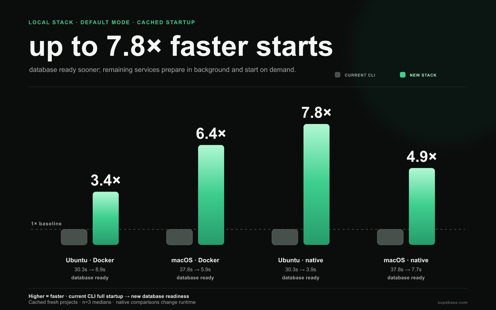
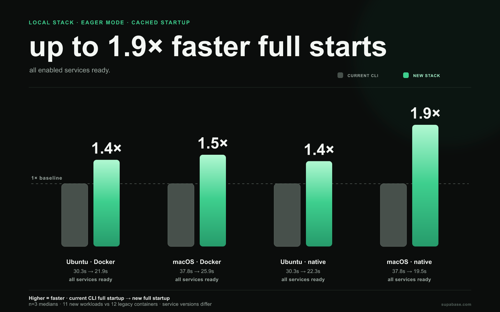
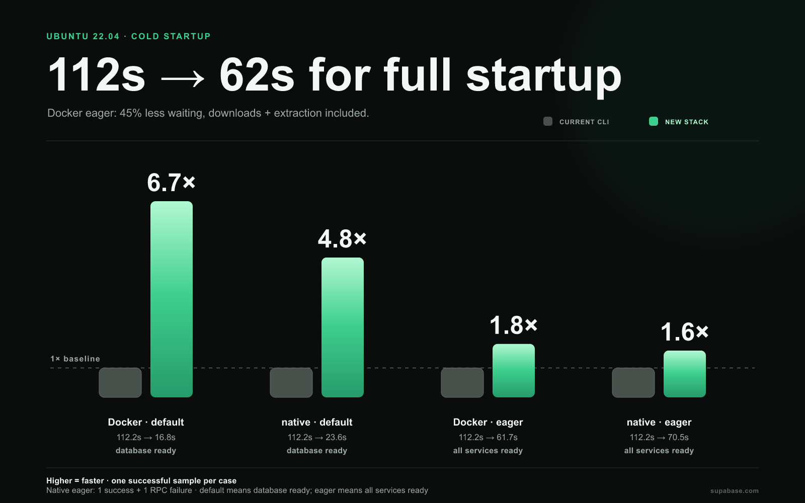
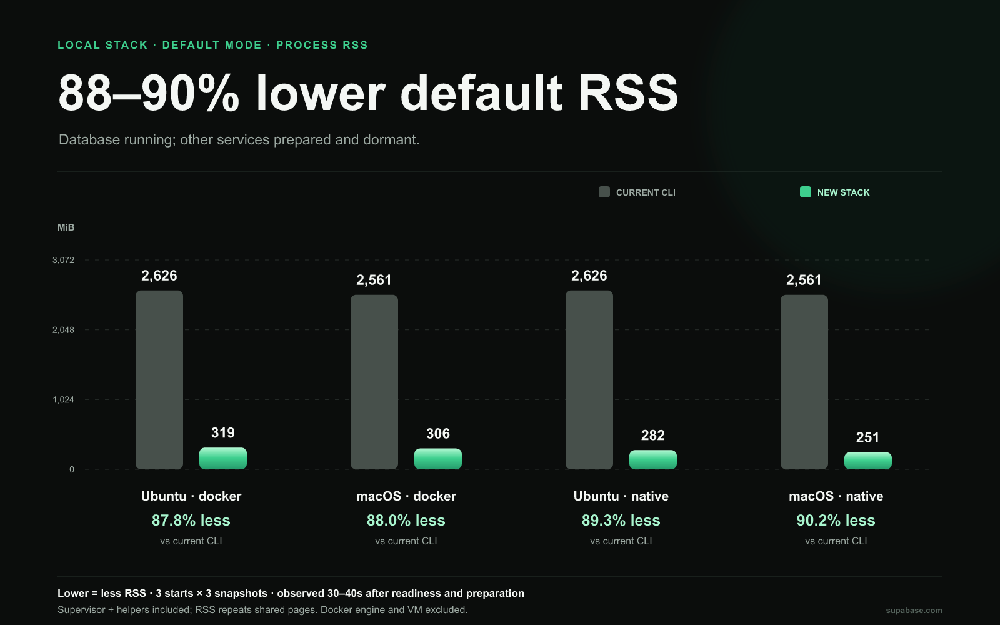
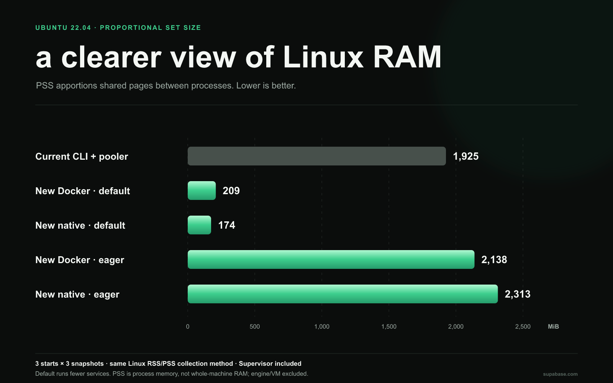

# New local stack: faster startup, less waiting

**Benchmark results · September 5–6, 2026**

Proposed stack package ([PR #6440](https://github.com/supabase/cli/pull/6440), `1944456f2`) compared with the released Supabase CLI **2.116.0**. The new stack was measured through its programmatic API, before CLI integration.

See the [latest benchmark report](../stack-startup-2026-09-07/README.md) for fresh measurements against the released CLI, including the pooler-enabled eager baseline.

The measurements show two useful improvements: getting a working database sooner, and reducing startup time when all enabled services are needed.

- **3.4–6.4× faster cached Docker startup with the new default mode**, across Ubuntu and macOS. That saves **21–32 seconds per start** in these measurements.
- **1.4–1.5× faster cached Docker startup in eager mode**, with all enabled services running: **28–32% less waiting**.
- **1.8× faster cold Docker eager startup on Ubuntu**: **112 seconds → 62 seconds**, including image downloads and extraction.
- **88–90% lower process RSS in default mode**, across Docker/native and both platforms, with the new stack’s Supervisor included. Full-stack memory is reported separately below.

## What “ready” means

**Default mode** starts the database and prepares the other enabled services in the background. Those services start when requested. This avoids starting services a developer may never use, but their first request can still incur activation time; that latency was not measured here.

**Eager mode** starts all enabled services before returning. It is the closer comparison to the current CLI's behavior. The defaults still differ: the current CLI starts 12 containers; the new eager stack starts 11 workloads, with different service versions and gateway arrangements.

The speedups below compare each new configuration with the current CLI **on the same host**. They describe the observed startup experience, rather than identical implementations doing identical work.

## Everyday startup: artifacts already downloaded

These runs use cached images or native artifacts and **fresh project data**. Results are medians of three starts. Bars show speedup relative to the current CLI: **higher is faster**, with the current CLI normalized to **1×**. Observed time ranges are in the benchmark notes.

### Default mode: up to 7.8× faster database readiness

### Eager mode: up to 1.9× faster full startup

| Configuration        |      Ubuntu 22.04 |             macOS |
| -------------------- | ----------------: | ----------------: |
| Current CLI · Docker | 30.3 s · baseline | 37.8 s · baseline |
| New default · Docker |  **8.9 s · 3.4×** |  **5.9 s · 6.4×** |
| New default · native |  **3.9 s · 7.8×** |  **7.7 s · 4.9×** |
| New eager · Docker   | **21.9 s · 1.4×** | **25.9 s · 1.5×** |
| New eager · native   | **22.3 s · 1.4×** | **19.5 s · 1.9×** |

The largest gains come from default mode's decision to leave unused services dormant. Eager mode also improves startup while bringing up all enabled services. Native execution offers another useful option: it produced the fastest default start on Ubuntu and the fastest eager start on macOS in this sample.

## First startup: downloads included

Ubuntu's cold runs began with empty artifact or Docker image stores. This includes downloads, extraction, and fresh database initialization.

For Docker, eager startup saves **50.5 seconds**—a **45% reduction in waiting**. Default mode makes the database ready in **16.8 seconds**, a **6.7× speedup** over the current CLI's full startup. Background preparation of all enabled images finishes at **63.5 seconds**; those services remain dormant until needed.

Native default startup takes **23.6 seconds** cold (**4.8×**), with background artifact preparation complete at **71.0 seconds**. Native eager takes **70.5 seconds** (**1.6×**) in its successful attempt. **One of its two cold attempts failed with an RPC timeout**, so that timing comes with an unresolved reliability finding.

Cold results are single successful observations per configuration, rather than repeated averages. macOS cold results are available in the [benchmark notes](BENCHMARK_NOTES.md); some retained Docker layers and used an earlier stack revision, so they are not used for cold speedup claims here.

## Retained-data restarts

**Retained-data restarts can be much quicker.** New default-mode native restarts took **0.42 seconds on Ubuntu** and **0.58 seconds on macOS**, compared with **25.6 and 25.7 seconds** for the current CLI's full-stack restart. New default-mode Docker restarts took **2.7 and 2.0 seconds**. Each is a single observation, and default mode again brings up only the database.

## Memory: now measured against the current CLI

**The current CLI and new stack now have a common process-RSS comparison.** This separate memory campaign covers **36 fresh starts and 108 snapshots**: six configurations on each platform, observed at **30, 35, and 40 seconds after readiness**. New-stack observations also wait for background artifact preparation. Each number is the median of three per-start medians, with cached artifacts and fresh project data.

The figures below include the **new stack's service processes, Supervisor and its helper processes**. They exclude the Docker engine and VM. They are observations after startup, **not peak memory or memory under application load**.

### Default mode: 88–90% lower process RSS

The saving comes mainly from leaving unused services dormant. RSS grows as those services activate; this is the memory benefit of a database-first workflow, not an equivalent full-stack workload.

| Configuration                 |    Ubuntu RSS |     macOS RSS | Ubuntu PSS |
| ----------------------------- | ------------: | ------------: | ---------: |
| Current CLI · Docker          | **2,626 MiB** | **2,561 MiB** |  1,806 MiB |
| Current CLI + pooler · Docker | **3,264 MiB** | **3,298 MiB** |  1,925 MiB |
| New default · Docker          |   **319 MiB** |   **306 MiB** |    209 MiB |
| New default · native          |   **282 MiB** |   **251 MiB** |    174 MiB |
| New eager · Docker            | **3,622 MiB** | **3,623 MiB** |  2,138 MiB |
| New eager · native            | **3,884 MiB** | **2,265 MiB** |  2,313 MiB |

**RSS** counts resident pages in each process and can count shared pages more than once. **PSS** divides shared pages among the processes using them, making the Ubuntu PSS column a better guide to the stack's proportional physical footprint. For example, current CLI defaults measure **2,626 MiB RSS but 1,806 MiB PSS**.

### Eager mode: compare the whole service set

Legacy defaults leave the connection pooler disabled; new eager mode enables it. We therefore also measured **legacy with the pooler enabled**. This brings the enabled service capabilities closer, although service versions, gateway and logging arrangements still differ.

**Docker host processes add a material cost.** Eager mode keeps 22 Docker CLI helpers running: one log follower and one exit watcher per workload. On Ubuntu, these 22 helpers alone have medians of **602 MiB RSS / 206 MiB PSS**. These helpers belong to the new stack and are included in the totals above.

Against legacy with the pooler enabled, **new Docker eager PSS is 11.1% higher** and **new native eager PSS is 20.1% higher** on Ubuntu. Faster full startup should therefore be judged separately from memory savings. On macOS, eager RSS is **31.3% lower for native** and **9.9% higher for Docker**, against the pooler-enabled legacy baseline. A [dedicated eager RSS chart](BENCHMARK_NOTES.md#process-memory-campaign) gives the same comparison visually.

macOS native RSS comes from macOS process accounting, while its Docker service RSS comes from the Linux VM. Both are RSS, but the kernels account differently. Native PSS is unavailable on macOS, so we do **not** turn its RSS comparison into a claim about physical RAM saved. Docker engine and shared OrbStack memory were recorded separately and cannot be assigned entirely to one stack.

The [benchmark notes](BENCHMARK_NOTES.md#process-memory-campaign) contain ranges, Docker/host-process components, collection details and overhead context. [Process memory data](process-memory-data.json) preserves all 108 sanitized observations. Earlier immediate-after-readiness snapshots remain in the original dataset and notes; the comparisons above use the new, consistent observation window.

## Remaining work

- **Cold native reliability:** investigate the Ubuntu eager RPC timeout. The successful retry does not erase the failed attempt.
- **Edge Runtime packaging:** isolated fresh-file HTTP startup still took **13.3 seconds median on macOS**, versus **56 ms on Ubuntu**. These are separate probes, not full-stack timings, and include measurement overhead. The tested AI paths also failed to locate the expected ONNX library, so HTTP readiness does not establish AI functionality or feature parity.

## How to interpret these numbers

Speedup means **current CLI time ÷ new stack time**. For example, Ubuntu's cached Docker default is `30.265 ÷ 8.866 = 3.4×`, or **71% less waiting**. Ratios use the unrounded measurements.

The new-stack timer covers its public `start()` call; the current CLI timer covers process spawn through readiness exit. Installation and project setup are excluded. Ubuntu ran in an ARM64 VM with 3 CPUs and 8 GiB on the same Apple M3 machine used for macOS; these are not independent hardware benchmarks. macOS's current-CLI startup baseline was measured the previous day. Workloads ran sequentially, with normal desktop activity and no reset of OS or CDN caches.

These are directional engineering measurements, not release guarantees. [Benchmark notes](BENCHMARK_NOTES.md) contain the full numbers, ranges, environment details, and exclusions; [aggregate data](benchmark-data.json) preserves the measurements used for comparison.
