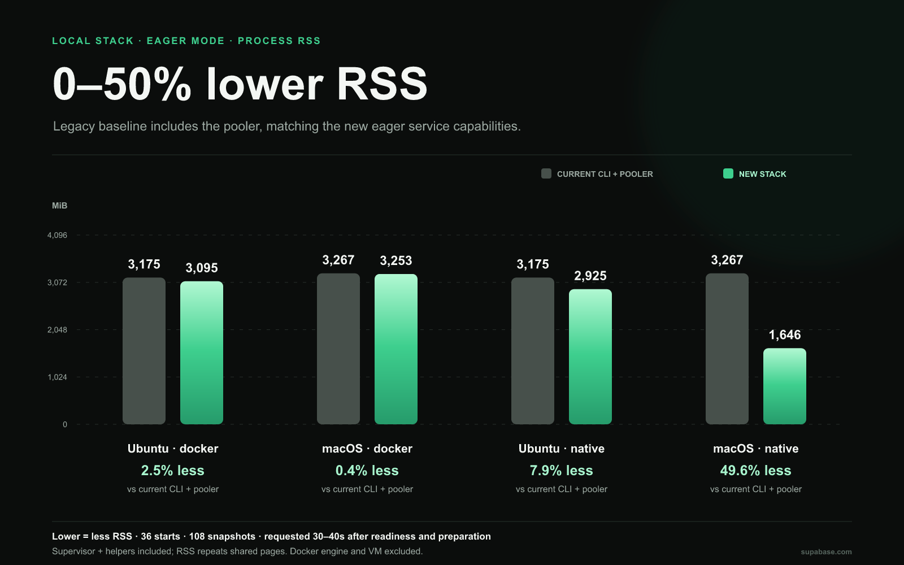

# Benchmark notes · 2026-09-07

Commit: `95c5ab8be71988d244dfa4537db8e454a0bf2e84`  
Legacy CLI: `2.116.0`  
Pull request: [#6440](https://github.com/supabase/cli/pull/6440)  
Environment: Apple M3 macOS ARM64 host (macOS 26.6.2, 8 CPU, 24 GiB) + Ubuntu 22.04.5 LTS ARM64 VM (3 CPU, 8 GiB cgroup limit, Docker 29.1.3); Docker backend used for both platform clients via SSH Unix-socket forwarding; normal desktop activity

## Methodology

Container cases use the shared Ubuntu private Docker backend for both the Ubuntu and macOS clients; macOS container measurements use SSH Unix-socket forwarding. Native workloads execute directly on their named host. Cold cases use fresh artifact, image, and project-data caches, while the operating system and upstream CDN caches are not reset. Every hot sample performs its own warmup outside the measured timer.

The new-stack timer covers its public start() call; the legacy timer covers process spawn through readiness exit. Creating the stack, importing packages, installing dependencies, and setting up the project are outside both timers.

Default mode measures database readiness while the remaining services prepare in the background. Eager mode measures all 11 enabled new-stack workloads ready. The released CLI default is its full 12-container service set; enabling its pooler starts 13 and supplies the eager baseline for startup, restart, and memory comparisons. Kong and Vector remain separate legacy services. Imgproxy is disabled on both sides. The plain legacy baseline measures the released CLI's full default service set, not database-only readiness. The new eager comparison uses the 13-container legacy baseline against 11 new workloads.

Each new-stack memory start reports the median of three settled snapshots requested at 30, 35, and 40 seconds after readiness and the artifact prefetch barrier; legacy starts use readiness as their baseline. The process-level memory summary then reports the median across the three starts for each case. These are observations, not peak memory or application-load measurements. Linux PSS is reported where available; macOS PSS is unavailable and macOS memory results use RSS.

Default RSS rises as dormant services activate. macOS native RSS and Linux VM/container RSS come from different kernels, so the macOS RSS comparison does not claim physical RAM saved.

## Startup observations

All rows contain median seconds and explicit attempts, successes, failures, and ranges.

## New-stack workload provenance

Public catalog provenance records the selected workload versions and identities; these are release metadata, not runtime measurements.

| Workload | Version | Docker image digest | macOS archive SHA | Linux archive SHA |
| --- | --- | --- | --- | --- |
| postgres | 17.6.1.168 | sha256:936536bb1f97… | bd00ee6060c35783709… | 21618c04a668a9a4f9b… |
| postgrest | v16.2 | sha256:0878f80fe6ff… | 2aa250e5b8b627768bd… | ffa38a2aecf4bbdbd80… |
| auth | v2.196.0 | sha256:570efcfd1568… | 00d9e5089f9407f72d3… | 5fc11aa1552b770e559… |
| realtime | v2.134.5 | sha256:7fb53cc69870… | ca4b9b351eea5cc1018… | 3919fe443e0782803d6… |
| storage | v1.73.0 | sha256:69590a75f916… | e3421f27571b48518fc… | d6d9541811484db3d89… |
| edge-runtime | v1.76.2 | sha256:d659e783b91e… | 11cfb6503105980c4e7… | 495ab7695fd0278f904… |
| studio | 2026.09.04-sha-5a67366 | sha256:9823a3166802… | f88037eb8aef3c8ef83… | 7c3c0f3477efff7540c… |
| pgmeta | v0.99.0 | sha256:22d40cf76694… | 5a5a17042d641bdd241… | d0f3f59c9f671480bd3… |
| mailpit | v1.30.2 | sha256:37a38e48e933… | 498d7a08a4155449e43… | 7a85e2521680d4ad280… |
| analytics | v1.50.9 | sha256:7db85cc6cb0c… | ae66d1b012cc10baa51… | 3527e4d95657d023274… |
| pooler | v2.9.12 | sha256:12bb9dcb7dda… | c77e230a5b770569a75… | bdeb1362925cbdb1f5f… |

Full release hashes are preserved in `benchmark-data.json`; manifest runtime fields are not used as benchmark measurements.

## Legacy workload image provenance

Legacy image tags are collected from sanitized successful hot memory snapshots; container names, PIDs, configuration, and credentials are excluded.

| Baseline | Observed image tags |
| --- | --- |
| Current CLI | `public.ecr.aws/supabase/edge-runtime:v1.74.3`, `public.ecr.aws/supabase/gotrue:v2.196.0`, `public.ecr.aws/supabase/kong:2.8.1`, `public.ecr.aws/supabase/logflare:1.50.4`, `public.ecr.aws/supabase/mailpit:v1.30.2`, `public.ecr.aws/supabase/postgres-meta:v0.98.0`, `public.ecr.aws/supabase/postgres:17.6.1.165`, `public.ecr.aws/supabase/postgrest:v16.1`, `public.ecr.aws/supabase/realtime:v2.129.3`, `public.ecr.aws/supabase/storage-api:v1.70.3`, `public.ecr.aws/supabase/studio:2026.08.17-sha-0c1da8f`, `public.ecr.aws/supabase/vector:0.53.0-alpine` |
| Current CLI + pooler | `public.ecr.aws/supabase/edge-runtime:v1.74.3`, `public.ecr.aws/supabase/gotrue:v2.196.0`, `public.ecr.aws/supabase/kong:2.8.1`, `public.ecr.aws/supabase/logflare:1.50.4`, `public.ecr.aws/supabase/mailpit:v1.30.2`, `public.ecr.aws/supabase/postgres-meta:v0.98.0`, `public.ecr.aws/supabase/postgres:17.6.1.165`, `public.ecr.aws/supabase/postgrest:v16.1`, `public.ecr.aws/supabase/realtime:v2.129.3`, `public.ecr.aws/supabase/storage-api:v1.70.3`, `public.ecr.aws/supabase/studio:2026.08.17-sha-0c1da8f`, `public.ecr.aws/supabase/supavisor:2.9.7`, `public.ecr.aws/supabase/vector:0.53.0-alpine` |

### Ubuntu 22.04

| Configuration | Phase | Median | Range | Attempts | Successes | Failures |
| --- | --- | ---: | --- | ---: | ---: | ---: |
| Current CLI · Docker | cached | 29.567s | 28.997–29.672s | 3 | 3 | 0 |
| Current CLI · Docker | cold | 92.842s | 80.309–105.018s | 3 | 3 | 0 |
| Current CLI + pooler · Docker | cached | 40.906s | 37.923–49.492s | 3 | 3 | 0 |
| Current CLI + pooler · Docker | cold | 117.390s | 115.982–117.527s | 3 | 3 | 0 |
| New default · Docker | cached | 4.352s | 3.473–6.941s | 3 | 3 | 0 |
| New default · Docker | cold | 10.094s | 9.761–10.463s | 3 | 3 | 0 |
| New eager · Docker | cached | 14.414s | 13.769–15.980s | 3 | 3 | 0 |
| New eager · Docker | cold | 24.753s | 23.530–30.221s | 3 | 3 | 0 |
| New default · native | cached | 3.648s | 2.669–5.549s | 3 | 3 | 0 |
| New default · native | cold | 6.005s | 5.787–7.634s | 3 | 3 | 0 |
| New eager · native | cached | 8.776s | 8.733–11.925s | 3 | 3 | 0 |
| New eager · native | cold | 16.566s | 15.660–19.139s | 3 | 3 | 0 |

### macOS

| Configuration | Phase | Median | Range | Attempts | Successes | Failures |
| --- | --- | ---: | --- | ---: | ---: | ---: |
| Current CLI · Docker | cached | 30.427s | 29.635–31.269s | 3 | 3 | 0 |
| Current CLI · Docker | cold | 93.138s | 89.911–99.054s | 3 | 3 | 0 |
| Current CLI + pooler · Docker | cached | 30.648s | 29.099–30.728s | 3 | 3 | 0 |
| Current CLI + pooler · Docker | cold | 114.973s | 113.418–150.947s | 3 | 3 | 0 |
| New default · Docker | cached | 6.019s | 5.599–7.073s | 3 | 3 | 0 |
| New default · Docker | cold | 10.700s | 10.492–12.183s | 3 | 3 | 0 |
| New eager · Docker | cached | 15.684s | 15.312–17.449s | 3 | 3 | 0 |
| New eager · Docker | cold | 31.375s | 24.046–31.382s | 3 | 3 | 0 |
| New default · native | cached | 3.085s | 2.591–3.416s | 3 | 3 | 0 |
| New default · native | cold | 24.640s | 23.639–24.646s | 3 | 3 | 0 |
| New eager · native | cached | 17.648s | 15.637–19.103s | 3 | 3 | 0 |
| New eager · native | cold | 83.291s | 79.302–85.395s | 3 | 3 | 0 |

## Cold native artifact preparation

For cold native eager starts, this compares the measured start median with the first status poll where every artifact in the final measurement status was ready. The later interval is not assigned to any individual service; it describes a preparation-to-start performance gap and does not by itself confirm a defect.

| Host | Start median | All artifacts observed ready | Observations |
| --- | ---: | ---: | ---: |
| Ubuntu 22.04 | 16.57s | 11.05s | 3/3 |
| macOS | 83.29s | 22.54s | 3/3 |
## Retained-data restarts

| Host | Configuration | Median | Range | Attempts | Successes | Failures |
| --- | --- | ---: | --- | ---: | ---: | ---: |
| Ubuntu 22.04 | Current CLI · Docker | 25.00s | 24.821–25.370s | 3 | 3 | 0 |
| Ubuntu 22.04 | Current CLI + pooler · Docker | 36.43s | 30.927–36.782s | 3 | 3 | 0 |
| Ubuntu 22.04 | New default · Docker | 2.16s | 2.055–3.182s | 3 | 3 | 0 |
| Ubuntu 22.04 | New eager · Docker | 10.62s | 10.526–17.902s | 3 | 3 | 0 |
| Ubuntu 22.04 | New default · native | 0.43s | 0.421–0.607s | 3 | 3 | 0 |
| Ubuntu 22.04 | New eager · native | 6.30s | 5.231–7.491s | 3 | 3 | 0 |
| macOS | Current CLI · Docker | 26.83s | 26.354–27.092s | 3 | 3 | 0 |
| macOS | Current CLI + pooler · Docker | 27.71s | 26.732–28.549s | 3 | 3 | 0 |
| macOS | New default · Docker | 3.81s | 2.975–4.558s | 3 | 3 | 0 |
| macOS | New eager · Docker | 11.57s | 10.950–11.689s | 3 | 3 | 0 |
| macOS | New default · native | 0.58s | 0.572–0.592s | 3 | 3 | 0 |
| macOS | New eager · native | 12.27s | 11.944–13.746s | 3 | 3 | 0 |

## Process memory campaign

The campaign contains 36 measured starts and 108 snapshots; each start is summarized from three snapshots at the requested 30, 35, and 40 second offsets after readiness and prefetch.

| Host | Configuration | RSS median MiB | RSS range | PSS median MiB |
| --- | --- | ---: | --- | ---: |
| Ubuntu 22.04 | Current CLI · Docker | 2,488 | 2378.789–2491.535 MiB | 1,670 |
| Ubuntu 22.04 | Current CLI + pooler · Docker | 3,175 | 3142.355–3291.246 MiB | 1,846 |
| Ubuntu 22.04 | New default · Docker | 326 | 326.195–329.488 MiB | 216 |
| Ubuntu 22.04 | New default · native | 287 | 286.852–290.758 MiB | 180 |
| Ubuntu 22.04 | New eager · Docker | 3,095 | 3089.723–3123.809 MiB | 2,105 |
| Ubuntu 22.04 | New eager · native | 2,925 | 2911.977–2935.383 MiB | 2,108 |
| macOS | Current CLI · Docker | 2,500 | 2471.484–2567.375 MiB | — |
| macOS | Current CLI + pooler · Docker | 3,267 | 3210.281–3297.562 MiB | — |
| macOS | New default · Docker | 380 | 378.180–382.145 MiB | — |
| macOS | New default · native | 258 | 255.391–261.469 MiB | — |
| macOS | New eager · Docker | 3,253 | 3250.793–3279.715 MiB | — |
| macOS | New eager · native | 1,646 | 863.812–2635.297 MiB | — |

## Reliability

All product measurement attempts completed successfully; no product reliability failures were recorded.

Setup failures are tracked separately and never treated as product startup failures.

- macOS · Current CLI · Docker · sample 1: The harness forwarded Docker socket used a different absolute path from the VM daemon socket; legacy Vector bind-mounted an unavailable socket and failed to connect. Excluded from performance and product reliability statistics.
- macOS · Current CLI · Docker · sample 3: Discarded as a precaution: a 1–2 second local synthetic report render overlapped this timed run. The replacement sample completed successfully without concurrent validation work.
- ubuntu-22.04 · new-container-default · sample 1: Prepared Linux source checkout was accidentally removed by a validation fixture cleanup. Restored the same commit; no stack startup timer began.

## Eager process RSS

This chart compares the pooler-enabled legacy baseline with the new eager cases. Imgproxy is disabled on both sides; Kong and Vector remain separate legacy services.

## Reproducibility

See the [benchmark runner instructions](../../../tools/stack-benchmarks/README.md) for prerequisites and setup. From the repository root, run `SBR_GO=1 python3 tools/stack-benchmarks/run.py --ref <commit> --vm orb --output /tmp/stack-benchmarks-run` on a macOS ARM64 host with an OrbStack Ubuntu 22.04 ARM64 VM. The report builder then consumes the canonical JSON produced by the aggregation step.

## Readiness and accounting

Default reports database readiness with background preparation; eager reports all enabled services ready. RSS counts resident pages per process and may count shared pages repeatedly; Linux PSS apportions shared pages. Docker engine and VM memory are excluded.

Source provenance: [benchmark-data.json](benchmark-data.json)
