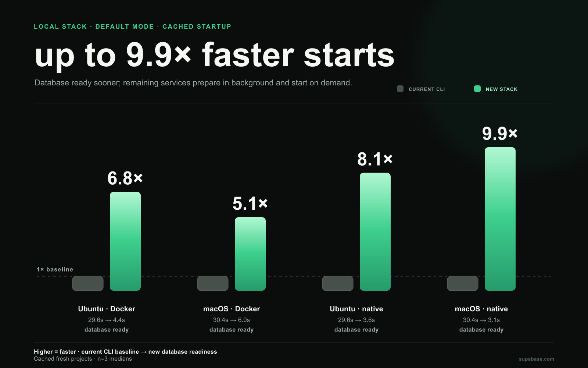
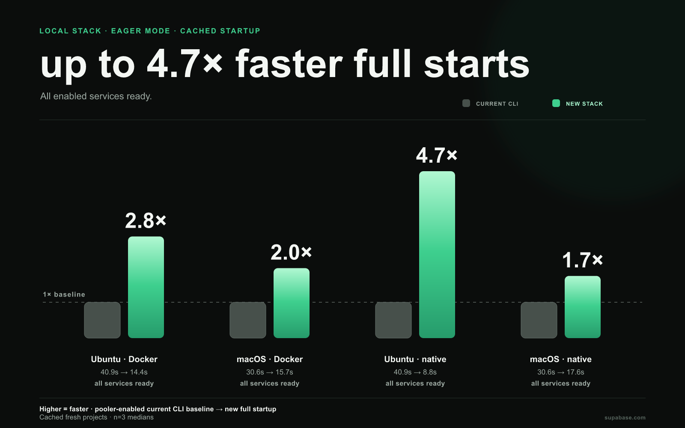
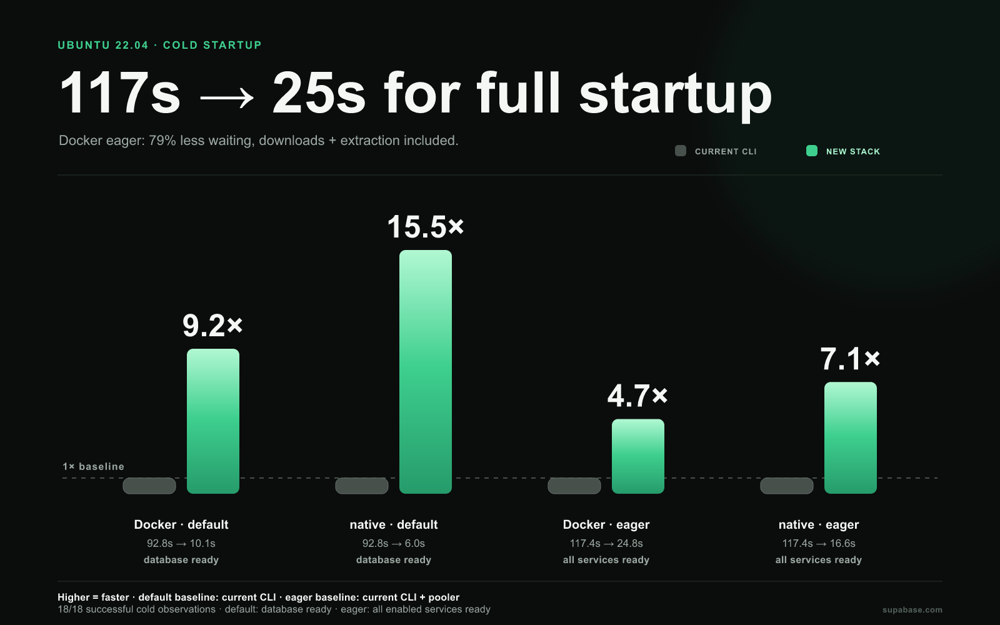
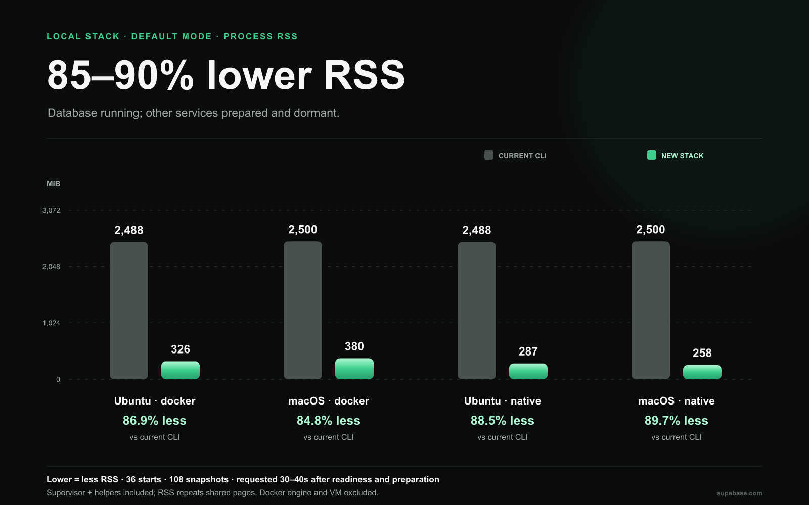
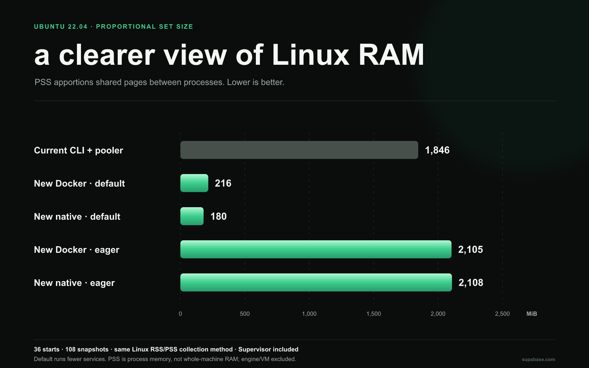

# New local stack: faster startup, less waiting

**Benchmark results · 2026-09-07**  
Proposed stack package ([PR #6440](https://github.com/supabase/cli/pull/6440)), commit `95c5ab8be71988d244dfa4537db8e454a0bf2e84`, compared with the released Supabase CLI **2.116.0**. The new stack was measured through its programmatic API, before CLI integration.

The measurements answer two practical questions: how quickly a working database becomes available, and how quickly the complete enabled service set starts when it is needed.

- **5.1–6.8× faster cached Docker default startup**, across Ubuntu and macOS.
- **2.0–2.8× faster cached Docker eager startup**, with all enabled services ready.
- **117.4s → 24.8s** for the Ubuntu Docker eager cold run (79% less waiting).
- **85–90% lower default-mode process RSS** across Docker/native and both platforms.

## What “ready” means

The new-stack timer covers the public `start()` call. The legacy timer covers process spawn through readiness exit. Creating the stack, importing packages, installing dependencies, and setting up the project are outside both timers.

**Default mode** starts the database and prepares the other enabled services in the background. Those services start when requested, so first-request activation latency is not measured. **Eager mode** starts all enabled services before returning. The released CLI defaults to 12 containers; enabling its pooler starts 13 and supplies the eager baseline. The new stack starts 11 workloads, while Kong and Vector remain separate legacy services, with release versions and artifact identities recorded in the notes. Memory sampling waits until background artifact preparation finishes; default startup ends at database readiness.

## Everyday startup: artifacts already downloaded

These runs use cached images or native artifacts and **fresh project data**. Each configuration targets three starts and its timing median uses successful starts; the matrix contains 36/36 successful cached observations. Default bars use the current CLI baseline; eager bars use the pooler-enabled current CLI baseline. **Higher is faster.**

### Default mode: up to 9.9× faster database readiness

### Eager mode: up to 4.7× faster full startup

| Configuration | Ubuntu 22.04 | macOS |
| --- | ---: | ---: |
| Current CLI · Docker | 29.6 s · baseline | 30.4 s · baseline |
| Current CLI + pooler · Docker | 40.9 s · baseline | 30.6 s · baseline |
| New default · Docker | 4.4 s · **6.8×** | 6.0 s · **5.1×** |
| New default · native | 3.6 s · **8.1×** | 3.1 s · **9.9×** |
| New eager · Docker | 14.4 s · **2.8×** | 15.7 s · **2.0×** |
| New eager · native | 8.8 s · **4.7×** | 17.6 s · **1.7×** |

The default-mode comparison measures database readiness while remaining services prepare in the background. Eager mode measures all enabled services ready. Ranges, exact counts, and failures are preserved in the benchmark notes.

## First startup: downloads included

Ubuntu cold runs began with empty artifact or Docker image stores. This includes downloads, extraction, and fresh database initialization. The campaign recorded **36/36 successful observations**; failed attempts remain visible in [BENCHMARK_NOTES.md](BENCHMARK_NOTES.md).

For Docker eager startup, **117.4s → 24.8s** means **79% less waiting** against the pooler-enabled current CLI. Default and native cases use their declared readiness semantics; background preparation and any reliability failures are reported separately.

On macOS, cold eager startup measured 115.0s for the pooler-enabled current CLI, 31.4s with the new Docker stack, and 83.3s with the new native stack (3/3, 3/3, and 3/3 successful observations, respectively).

## Retained-data restarts

The current CLI retained-data restarts had medians of 25.00s on Ubuntu (3/3 successful) and 26.83s on macOS (3/3 successful). The pooler-enabled current CLI retained-data restarts had medians of 36.43s on Ubuntu (3/3 successful) and 27.71s on macOS (3/3 successful). The new native default retained-data restarts had medians of 0.43s on Ubuntu (3/3 successful) and 0.58s on macOS (3/3 successful). The new Docker default retained-data restarts had medians of 2.16s on Ubuntu (3/3 successful) and 3.81s on macOS (3/3 successful). The complete six-case, two-host restart table is in BENCHMARK_NOTES.md.

## Memory: now measured against the current CLI

The memory campaign covers **36 starts and 108 snapshots**, settled at **30–40 seconds after readiness and preparation**. These are observations, not peak memory or application-load measurements. Figures include new-stack service processes, Supervisor, and helpers; Docker engine and VM are excluded.

### Default mode: 85–90% lower default-mode process RSS

| Configuration | Ubuntu RSS | macOS RSS | Ubuntu PSS |
| --- | ---: | ---: | ---: |
| Current CLI · Docker | 2,488 MiB | 2,500 MiB | 1,670 MiB |
| Current CLI + pooler · Docker | 3,175 MiB | 3,267 MiB | 1,846 MiB |
| New default · Docker | 326 MiB | 380 MiB | 216 MiB |
| New default · native | 287 MiB | 258 MiB | 180 MiB |
| New eager · Docker | 3,095 MiB | 3,253 MiB | 2,105 MiB |
| New eager · native | 2,925 MiB | 1,646 MiB | 2,108 MiB |

RSS counts resident pages in each process and can count shared pages more than once. PSS apportions shared pages on Linux; PSS is unavailable on macOS, so macOS memory results use RSS.

macOS native RSS comes from macOS process accounting, while Linux container RSS comes from the Ubuntu VM; the kernels account differently. RSS grows as dormant services activate, so the default-mode reduction describes a database-first state rather than an equivalent full-stack workload. These RSS values do not establish physical RAM saved on macOS.

### Eager mode: compare the whole service set

The eager RSS comparison is included in [BENCHMARK_NOTES.md](BENCHMARK_NOTES.md#eager-process-rss) because it uses the pooler-enabled legacy baseline.

Against the pooler-enabled legacy baseline, eager Linux PSS was 14.0% higher for the new Docker stack and 14.2% higher for the new native stack. On macOS RSS, the corresponding results were 0.4% lower for Docker and 49.6% lower for native.

## How to interpret these numbers

Speedup means current CLI time divided by new stack time. Ratios use unrounded measurements. Environment, workload definitions, exclusions, ranges, failures, and source provenance are documented in [BENCHMARK_NOTES.md](BENCHMARK_NOTES.md). Source files: [benchmark-data.json](benchmark-data.json).
