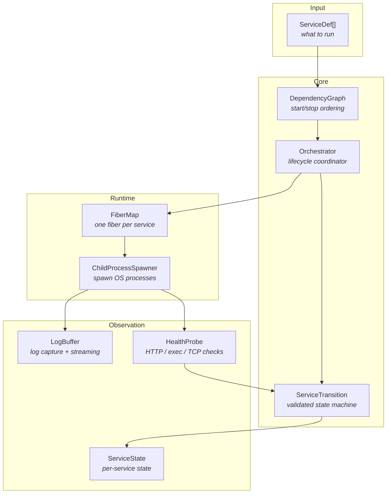
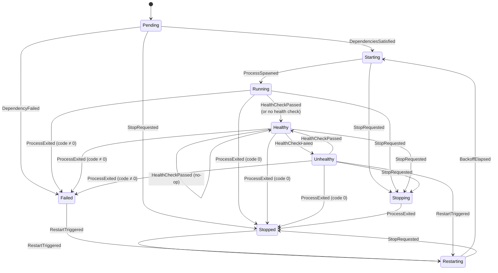
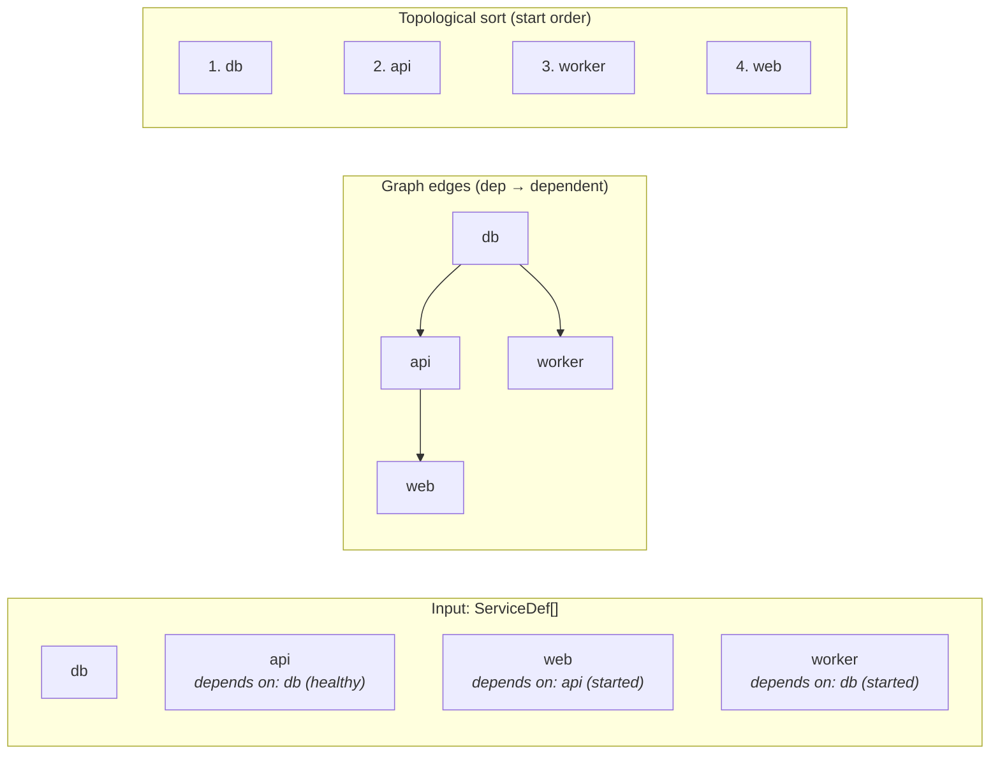
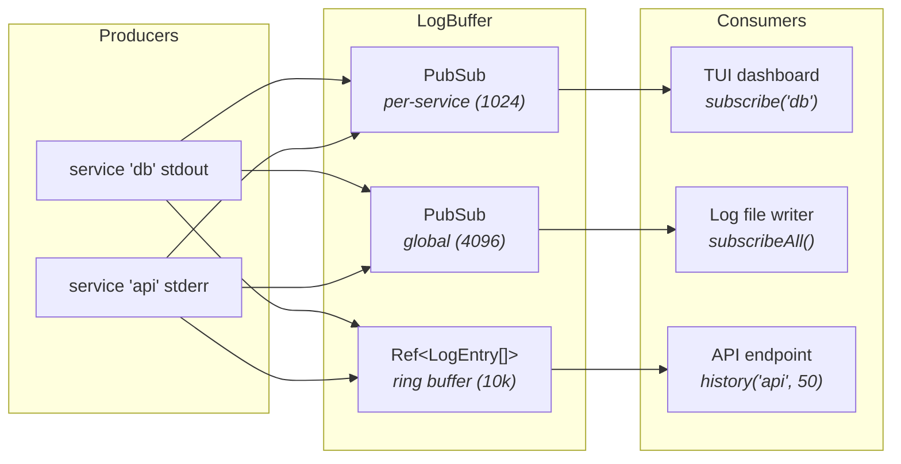
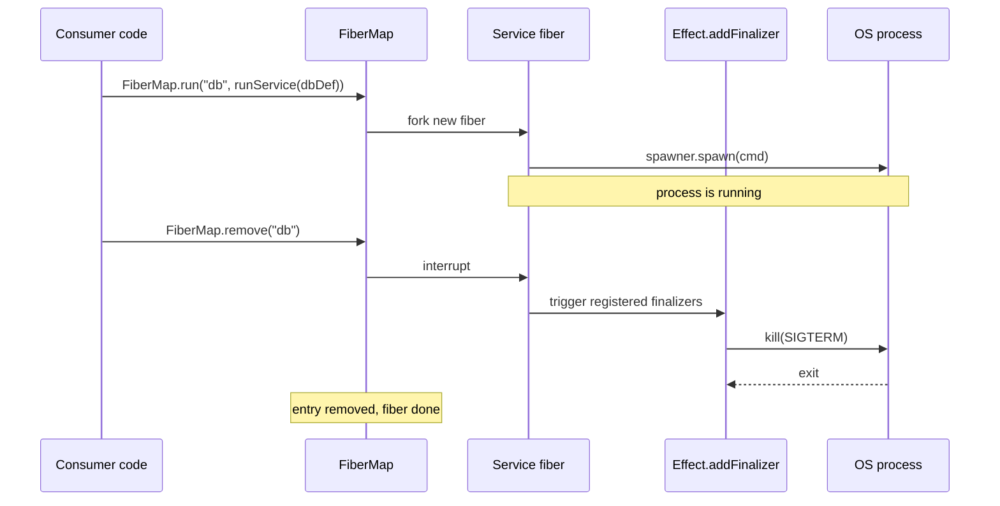
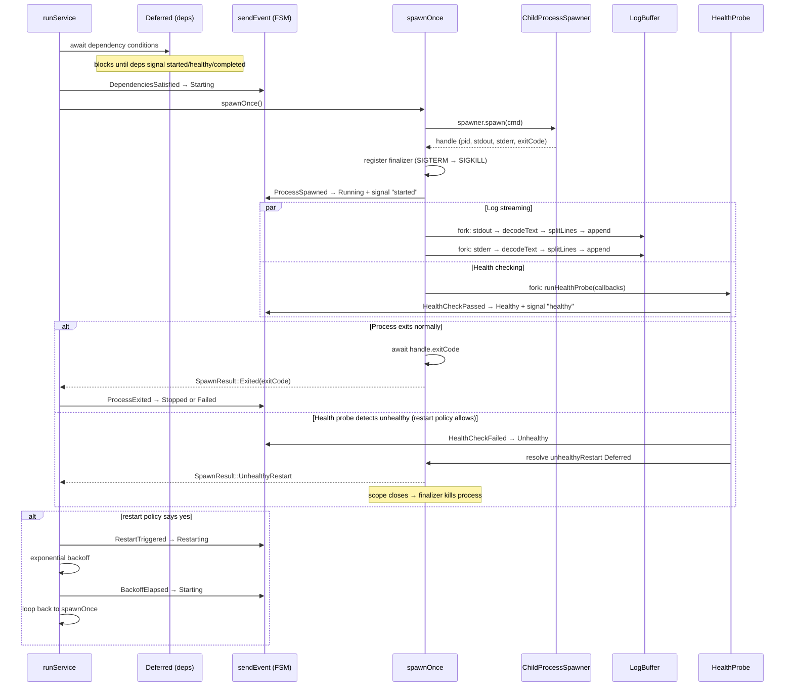
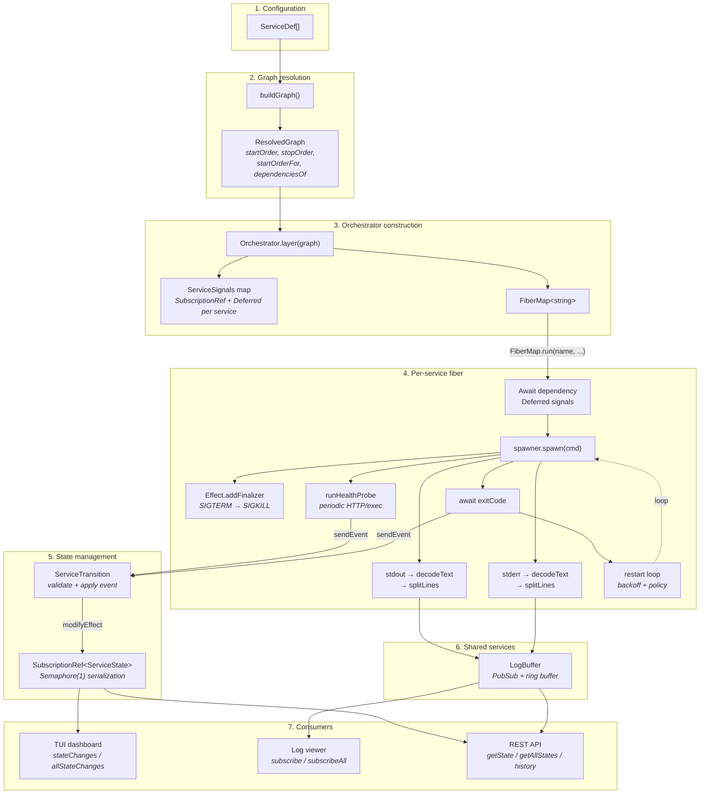

# Architecture of `@supabase/process-compose`

A service orchestrator that manages a dependency graph of long-running processes with health checks, log streaming, restart policies, and graceful shutdown. Built on [Effect V4](https://effect.website).

## Table of contents

- [High-level overview](#high-level-overview)
- [Effect primer for newcomers](#effect-primer-for-newcomers)
- [Components](#components)
  - [ServiceDef — configuration](#servicedef--configuration)
  - [ServiceState — state machine](#servicestate--state-machine)
  - [ServiceTransition — enforced state machine](#servicetransition--enforced-state-machine)
  - [errors — typed error hierarchy](#errors--typed-error-hierarchy)
  - [DependencyGraph — ordering engine](#dependencygraph--ordering-engine)
  - [LogBuffer — log capture and streaming](#logbuffer--log-capture-and-streaming)
  - [HealthProbe — health checking](#healthprobe--health-checking)
  - [Orchestrator — the coordinator](#orchestrator--the-coordinator)
- [Why Effect?](#why-effect)
- [Data flow](#data-flow)

---

## High-level overview

You give process-compose a list of service definitions ("run postgres on port 5432, then start the API once postgres is healthy"). It figures out the right startup order, spawns each process, monitors health, captures logs, and tears everything down cleanly when you ask it to stop.



The library has no CLI, no config file parser, and no HTTP server. It is a pure TypeScript library that exposes an `Orchestrator` service — consumers build their own interface on top.

---

## Effect primer for newcomers

process-compose uses several primitives from the Effect library. If you've never seen Effect before, here's a quick mental model for each one. You don't need to understand them deeply to read this document — just enough to follow the "why" behind each design choice.

### Effect

A lazy, composable description of work. Think of it as a `Promise` that hasn't started yet. You can chain operations, handle errors, and add timeouts — all before anything actually runs. Nothing happens until a "runner" executes the description.

```
Promise:  const result = await fetchUser(id);          // runs immediately
Effect:   const program = fetchUser(id);                // just a description
          const result = await Effect.runPromise(program); // runs here
```

### Fiber

A lightweight green thread managed by the Effect runtime. While an OS thread costs ~1 MB of stack, a fiber costs a few hundred bytes. The runtime multiplexes thousands of fibers onto a small pool of OS threads.

Why this matters for process-compose: we run one fiber per managed service. If you're orchestrating 50 services, that's 50 fibers — trivial for the runtime, but 50 OS threads would be wasteful. More importantly, fibers support **structured concurrency**: when a parent fiber is interrupted, all its children are interrupted too. This is how we guarantee no process is ever leaked.

### Layer and ServiceMap.Service

Effect's dependency injection system. A `Layer` is a recipe for building a service and its dependencies. `ServiceMap.Service` is the base class for declaring a service interface (what methods it provides) and its implementation (a `Layer` that creates those methods).

In process-compose, `Orchestrator`, `LogBuffer`, and `Browser` are all services. Tests swap in mock implementations via `Layer.succeed(ServiceTag, mockImpl)` — no monkey-patching globals, no `jest.mock()`.

### Deferred

A one-shot async signal. Like a `Promise` you resolve manually: anyone can `await` it, and the first call to `succeed` or `fail` resolves all waiters.

```
const gate = Deferred.make<void>();

// In fiber A (waiter):
yield* Deferred.await(gate);   // blocks until resolved

// In fiber B (signaler):
yield* Deferred.succeed(gate, void 0);  // unblocks A
```

process-compose uses one `Deferred` per service per lifecycle condition (`started`, `healthy`, `completed`). When service A depends on service B being "healthy", A's fiber simply `await`s B's `healthy` deferred. No polling, no events, no race conditions.

### SubscriptionRef

A mutable cell that broadcasts every update as a `Stream`. Readers can either snapshot the current value (`getUnsafe`) or subscribe to a stream of all future changes (`changes`).

```
const ref = yield* SubscriptionRef.make(0);

// Writer:
yield* SubscriptionRef.set(ref, 42);

// Reader (snapshot):
const value = SubscriptionRef.getUnsafe(ref);  // 42

// Reader (live stream):
const stream = SubscriptionRef.changes(ref);   // Stream of 0, 42, ...
```

Each service has a `SubscriptionRef<ServiceState>`. The Orchestrator updates it on state transitions; consumers (like a TUI dashboard) subscribe to the stream of changes.

### FiberMap

A concurrent `Map<Key, Fiber>` with a crucial property: **removing a key interrupts its fiber**, which triggers all registered finalizers (cleanup logic). When the FiberMap's scope closes, _all_ entries are interrupted.

This is the single most important data structure in process-compose. Each service gets one entry in the FiberMap:

- **Start a service**: `FiberMap.run(fibers, "postgres", runService(pgDef))` — forks a fiber and stores it
- **Stop a service**: `FiberMap.remove(fibers, "postgres")` — interrupts the fiber, which triggers `Effect.addFinalizer` to send SIGTERM/SIGKILL to the OS process
- **Stop everything**: close the scope — FiberMap auto-interrupts all entries

### Stream and PubSub

`Stream` is a pull-based sequence of values, like an async iterator. `PubSub` is a bounded, backpressure-aware fan-out channel: one publisher, many subscribers, each getting their own queue.

LogBuffer uses `PubSub` internally: when a service writes a log line, it's published once and delivered to every active subscriber (a TUI panel, a log file writer, etc.) independently.

### Graph

Effect's directed graph data structure with built-in topological sort. We build a graph where nodes are services and edges represent dependencies (edge from A to B means "A must start before B"). `Graph.topo()` gives us the correct startup order; reversing it gives shutdown order.

### Data.Class and Data.TaggedError

Immutable value types with built-in **structural equality**. Two `ServiceState` objects with the same fields are `===` equal, which is critical for `SubscriptionRef` — it only emits a change notification when the value actually differs.

`Data.TaggedError` adds a `_tag` field for type-safe pattern matching:

```ts
class SpawnError extends Data.TaggedError("SpawnError")<{ service: string; cause: unknown }> {}
class ServiceNotFoundError extends Data.TaggedError("ServiceNotFoundError")<{ name: string }> {}

// Pattern matching:
effect.pipe(
  Effect.catch("SpawnError", (e) => ...),
  Effect.catch("ServiceNotFoundError", (e) => ...),
)
```

---

## Components

### ServiceDef — configuration

**File:** `src/ServiceDef.ts`

Pure TypeScript interfaces with no Effect imports (except for the `ChildProcess.Signal` type). This is the user-facing API for defining what to run.

```ts
interface ServiceDef {
  name: string; // unique identifier
  command: string; // executable path
  args?: string[]; // command arguments
  env?: Record<string, string>;
  cwd?: string;
  dependencies?: Dependency[];
  dependencyTimeoutSeconds?: number; // max wait for deps (default: 30)
  healthCheck?: HealthCheckConfig;
  shutdown?: ShutdownConfig;
  restart?: RestartPolicy; // "no" | "on-failure" | "always" | "unless-stopped"
  maxRestarts?: number;
  enabled?: boolean;
  hooks?: LifecycleHook[];
}
```

**Dependency conditions** control when a dependent service is allowed to start:

| Condition   | Meaning                                   | Use case                                     |
| ----------- | ----------------------------------------- | -------------------------------------------- |
| `started`   | The dependency's process has been spawned | Services that just need the port to be bound |
| `healthy`   | The dependency's health check is passing  | Services that need a fully-ready database    |
| `completed` | The dependency has exited with code 0     | One-shot setup scripts (migrations, seeding) |

**Health check probes** come in three flavors:

- **HTTP**: `fetch()` to a host:port/path — success if response is 2xx
- **Exec**: runs the configured command with explicit args — success if exit code is 0
- **TCP**: opens a TCP connection to a host:port — success if the connection is established

**Lifecycle hooks** run effects at specific service lifecycle points. The `HookTrigger` determines when a hook fires, and the `LifecycleHook` interface describes what runs:

```ts
type HookTrigger = "started" | "healthy";

// Callback injected into each hook — writes a message to the service's log buffer
type HookLog = (message: string) => Effect<void>;

interface LifecycleHook {
  on: HookTrigger;
  run: (log: HookLog) => Effect<void, unknown>; // log writes to the service's log stream
  timeoutSeconds?: number; // default: 30
  failurePolicy?: "fail" | "ignore"; // default: "fail"
}
```

**Defaults** are defined as a const object and applied where config values are omitted:

| Setting                        | Default                                 |
| ------------------------------ | --------------------------------------- |
| `restart`                      | `"unless-stopped"`                      |
| `maxRestarts`                  | `0` (unlimited when restart is enabled) |
| `dependencyTimeoutSeconds`     | `30`                                    |
| `shutdown.signal`              | `SIGTERM`                               |
| `shutdown.timeoutSeconds`      | `10`                                    |
| `shutdownTimeoutSeconds`       | `60`                                    |
| `healthCheck.periodSeconds`    | `10`                                    |
| `healthCheck.timeoutSeconds`   | `2`                                     |
| `healthCheck.successThreshold` | `1`                                     |
| `healthCheck.failureThreshold` | `3`                                     |
| `hookTimeoutSeconds`           | `30`                                    |

---

### ServiceState — state machine

**File:** `src/ServiceState.ts`

Each service tracks its runtime state as an immutable `Data.Class`:

```ts
class ServiceState extends Data.Class<{
  name: string;
  status: ServiceStatus;
  pid: number | null;
  exitCode: number | null;
  restartCount: number;
  startedAt: number | null;
  error: string | null;
}> {}
```

The status field follows this state machine:



**Why `Data.Class`?** Two `ServiceState` instances with identical fields are structurally equal. This means `SubscriptionRef` can detect when a state update actually changes something — subscribers only receive notifications for real transitions, not redundant updates.

---

### ServiceTransition — enforced state machine

**File:** `src/ServiceTransition.ts`

State transitions are **enforced at runtime**, not just documented. Every state change goes through a validated finite state machine (FSM) that rejects illegal transitions.

#### Why an FSM?

Without enforcement, any code with access to the `SubscriptionRef<ServiceState>` could set any status from any other status. In a concurrent system with multiple mutation sources (process exit handlers, health probe callbacks, manual stop/restart), this leads to subtle bugs:

- A health probe callback firing `Healthy` after a stop has already begun
- A stop setting `Stopped` before the OS process has actually exited
- Concurrent stop and restart racing to update the same state

The FSM eliminates these by making illegal transitions return `null` instead of corrupting state.

#### Events

Instead of directly setting status strings, the Orchestrator sends typed events:

| Event                   | Payload            | Meaning                                |
| ----------------------- | ------------------ | -------------------------------------- |
| `DependenciesSatisfied` | —                  | All dependency conditions met          |
| `DependencyFailed`      | `error: string`    | A dependency exited with non-zero code |
| `ProcessSpawned`        | `pid`, `startedAt` | OS process successfully created        |
| `HealthCheckPassed`     | —                  | Health probe reports success           |
| `HealthCheckFailed`     | —                  | Health probe reports failure           |
| `HookFailed`            | `error: string`    | Lifecycle hook failed                  |
| `ProcessExited`         | `exitCode: number` | OS process exited                      |
| `StopRequested`         | —                  | Manual stop or shutdown initiated      |
| `RestartTriggered`      | `restartCount`     | Restart policy decided to restart      |
| `BackoffElapsed`        | —                  | Restart backoff timer completed        |

#### Transition table

The set of legal `(fromStatus, event)` pairs is defined as data:

```ts
const allowed = new Set([
  "Pending:DependenciesSatisfied", // → Starting
  "Pending:DependencyFailed", // → Failed
  "Pending:StopRequested", // → Stopped (no process to kill)
  "Starting:ProcessSpawned", // → Running
  "Starting:StopRequested", // → Stopping
  "Running:HealthCheckPassed", // → Healthy
  "Running:HookFailed", // → Failed
  "Running:ProcessExited", // → Stopped or Failed
  "Running:StopRequested", // → Stopping
  "Healthy:HealthCheckPassed", // → Healthy (no-op, structural eq)
  "Healthy:HealthCheckFailed", // → Unhealthy
  "Healthy:HookFailed", // → Failed
  "Healthy:ProcessExited", // → Stopped or Failed
  "Healthy:StopRequested", // → Stopping
  "Unhealthy:HealthCheckPassed", // → Healthy
  "Unhealthy:ProcessExited", // → Stopped or Failed
  "Unhealthy:StopRequested", // → Stopping
  "Stopping:ProcessExited", // → Stopped (always, any exit code)
  "Stopped:RestartTriggered", // → Restarting
  "Failed:RestartTriggered", // → Restarting
  "Unhealthy:RestartTriggered", // → Restarting (kill process, restart)
  "Restarting:StopRequested", // → Stopped (no process to kill)
  "Restarting:BackoffElapsed", // → Starting
]);
```

Any `(status, event)` pair not in this set is silently rejected — `applyEvent()` returns `null`. This is intentional: in a concurrent system, a health probe callback racing a shutdown is expected, not an error.

#### Core functions

```ts
// Pure — computes new state or null if the transition is illegal
const applyEvent = (state: ServiceState, event: ServiceEvent): ServiceState | null

// Effectful — atomic validate-and-apply via SubscriptionRef's internal Semaphore
const transition = (
  ref: SubscriptionRef<ServiceState>,
  event: ServiceEvent,
): Effect<ServiceState | null>
```

`transition()` uses `SubscriptionRef.modifyEffect`, which holds a `Semaphore(1)` permit during the entire read-validate-write cycle. This guarantees that concurrent callers (e.g., a health probe and a manual stop) are serialized — one completes before the other starts. No explicit Queue or actor needed.

#### How invalid transitions are handled

When a health probe fires `HealthCheckPassed` but the service is already in `Stopping`:

1. `transition()` acquires the semaphore
2. `applyEvent(Stopping, HealthCheckPassed)` → `null` (not in the allowed set)
3. State is unchanged, `null` returned to caller
4. Semaphore released

The health probe's callback gets `null` back and moves on. No error thrown, no state corrupted. The probe fiber will be interrupted shortly anyway when the service's scope closes.

---

### errors — typed error hierarchy

**File:** `src/errors.ts`

All errors extend `Data.TaggedError`, giving each a unique `_tag` discriminator for pattern matching:

| Error                    | Tag                        | When raised                                                  |
| ------------------------ | -------------------------- | ------------------------------------------------------------ |
| `CyclicDependencyError`  | `"CyclicDependencyError"`  | `buildGraph()` detects a cycle in service dependencies       |
| `MissingDependencyError` | `"MissingDependencyError"` | A service references a dependency that doesn't exist         |
| `ServiceNotFoundError`   | `"ServiceNotFoundError"`   | `getState()`, `stopService()`, etc. called with unknown name |
| `SpawnError`             | `"SpawnError"`             | `ChildProcessSpawner` fails to spawn the process             |
| `ShutdownTimeoutError`   | `"ShutdownTimeoutError"`   | Graceful shutdown exceeds the configured timeout             |

Because these are in the Effect type system, the compiler tracks which functions can fail with which errors. A function returning `Effect<void, ServiceNotFoundError>` guarantees it can only fail with that specific error — no surprise exceptions at runtime.

---

### DependencyGraph — ordering engine

**File:** `src/DependencyGraph.ts`

Turns a flat list of `ServiceDef[]` into a `ResolvedGraph` that answers ordering questions.



**How it works:**

1. **Filter** disabled services (`enabled: false`)
2. **Build** a directed graph where edges point from dependency to dependent (`db → api`)
3. **Validate** — throw `MissingDependencyError` if a dependency references a non-existent service
4. **Cycle check** — `Graph.isAcyclic()` before sorting; throw `CyclicDependencyError` if cyclic
5. **Topological sort** — `Graph.topo()` yields dependencies before their dependents

The `ResolvedGraph` interface exposes five operations:

| Method                 | Purpose                                                    |
| ---------------------- | ---------------------------------------------------------- |
| `startOrder`           | All services in topological order (dependencies first)     |
| `stopOrder`            | Reverse of startOrder (dependents stopped first)           |
| `startOrderFor(name)`  | Only the transitive dependency chain for one service       |
| `dependenciesOf(name)` | Direct dependencies with their conditions                  |
| `dependentsOf(name)`   | Direct dependents of a service (reverse of dependenciesOf) |

`startOrderFor("web")` does a DFS on reverse adjacency from the `web` node, collecting `db`, `api`, and `web` — but not `worker`. This powers selective startup: `orchestrator.startService("web")` only starts what `web` actually needs.

---

### LogBuffer — log capture and streaming

**File:** `src/LogBuffer.ts`

Captures stdout/stderr from every managed process and makes it available for both historical queries and live streaming.



**Internal data structures:**

- **Per-service `PubSub`** (bounded at 1024 entries): delivers log lines to subscribers watching a specific service. If a subscriber falls behind by 1024 lines, the oldest entries are dropped (backpressure).
- **Global `PubSub`** (bounded at 4096): delivers all log lines across all services. Used by `subscribeAll()`.
- **Per-service `Ref<Array<LogEntry>>`**: an in-memory ring buffer capped at 10,000 entries. Powers `history()` for historical queries — new subscribers can catch up on recent output without replaying the entire PubSub.

**Why PubSub instead of EventEmitter?**

- **Backpressure**: bounded buffers prevent a fast producer from overwhelming slow consumers
- **Multiple subscribers**: each subscriber gets its own independent queue — one slow subscriber doesn't block others
- **No callback hell**: consumers read from a `Stream`, which composes cleanly with the rest of the Effect pipeline
- **No memory leaks**: subscribers are cleaned up when their fiber is interrupted (no forgotten `.removeListener()`)

---

### HealthProbe — health checking

**File:** `src/HealthProbe.ts`

Runs periodic health checks against a service and calls back when the service transitions between healthy and unhealthy states.

**Two probe types:**

| Probe | How it works                                              | Success condition      |
| ----- | --------------------------------------------------------- | ---------------------- |
| HTTP  | `fetch(scheme://host:port/path)` with timeout             | Response status is 2xx |
| Exec  | Spawns the configured command directly with explicit args | Exit code is 0         |
| TCP   | `Net.createConnection(host, port)` with timeout           | Connection succeeds    |

**Algorithm:**

1. Wait `initialDelaySeconds` (default: 0)
2. Execute the probe every `periodSeconds` (default: 10)
3. Track consecutive successes and failures in a `Ref<{ successes, failures }>` counter
4. When consecutive successes reaches `successThreshold` (default: 1): call `onHealthy()`
5. When consecutive failures reaches `failureThreshold` (default: 3): call `onUnhealthy()`
6. A success resets the failure counter to 0, and vice versa

The health probe runs as a forked child fiber inside the service's main fiber. When the service fiber is interrupted (e.g., on stop), the health probe fiber is automatically interrupted too — no manual cleanup needed.

---

### Orchestrator — the coordinator

**File:** `src/Orchestrator.ts`

The Orchestrator is the heart of the library. It ties together every other component into a coherent service lifecycle manager.

#### Service interface

```ts
class Orchestrator extends ServiceMap.Service<Orchestrator, {
  start: ()           => Effect<void>;                              // start all services
  startService: (name) => Effect<void, ServiceNotFoundError>;       // start one + its deps
  stop: ()            => Effect<void>;                              // stop all services
  stopService: (name) => Effect<void, ServiceNotFoundError>;        // stop one service
  restartService: (name) => Effect<void, ServiceNotFoundError>;     // stop then start
  getState: (name)    => Effect<ServiceState, ServiceNotFoundError>;// snapshot
  getAllStates: ()     => Effect<ReadonlyArray<ServiceState>>;      // snapshot of all
  stateChanges: (name) => Effect<Stream<ServiceState>, ServiceNotFoundError>; // live
  allStateChanges: ()  => Stream<ServiceState>;                     // live, all services
}>()("process-compose/Orchestrator") { ... }
```

#### Initialization

`Orchestrator.layer` accepts an optional `OrchestratorConfig` parameter (e.g. `shutdownTimeoutSeconds`) that applies global defaults over the per-service configuration.

When the Orchestrator layer is constructed, it:

1. Yields the `ChildProcessSpawner` and `LogBuffer` services from the environment
2. Creates a `Map<string, ServiceSignals>` where each entry holds:
   - `state`: a `SubscriptionRef<ServiceState>` (the live state machine)
   - `started`: a `Deferred<void>` (resolved when the process is spawned)
   - `healthy`: a `Deferred<void>` (resolved when health check passes)
   - `completed`: a `Deferred<number>` (resolved with exit code when the process exits)
   - `stopped`: a `Deferred<void>` (resolved when the service has fully stopped)
3. Creates a `FiberMap<string>` to track one fiber per running service

#### FiberMap — the central data structure

FiberMap is the architectural linchpin. Here's why:



The key insight: **stopping a service is just removing it from the map**. The interrupt cascades to the fiber, which triggers finalizers, which send SIGTERM to the OS process. There's no separate "process manager" or "cleanup registry" — the fiber's scope _is_ the lifecycle.

When the Orchestrator's own scope closes (application shutdown), FiberMap interrupts _all_ entries automatically. Every process gets a graceful shutdown attempt, guaranteed, even if the application crashes.

#### Service lifecycle (`runService`)

Each service follows this lifecycle. All state mutations go through `sendEvent()` which validates transitions via the FSM before updating the `SubscriptionRef`:



#### Dependency waiting

When a service has dependencies, its fiber blocks on `Deferred.await` calls before spawning:

```ts
// Service "api" depends on "db" being healthy
const healthySig = services.get("db")?.healthy;
if (healthySig) yield * Deferred.await(healthySig);
// Execution only continues here once "db" signals healthy
```

This is fundamentally different from polling or event-based approaches:

- **No polling**: the fiber is parked with zero CPU cost until the deferred resolves
- **No race conditions**: `Deferred.await` either returns immediately (already resolved) or suspends
- **No event ordering bugs**: there's no "what if the event fired before we subscribed" problem

The entire dependency-wait phase is wrapped in an `Effect.timeout` using `dependencyTimeoutSeconds` (default: 30s). If dependencies don't reach their conditions in time, the service receives a `DependencyFailed` event with a timeout error message and transitions to `Failed` without ever spawning. This prevents services from blocking indefinitely when a dependency is stuck.

If a dependency exits with a non-zero code and the condition is `completed`, the dependent service also receives a `DependencyFailed` event and transitions to `Failed` without ever spawning.

#### Graceful shutdown

Every spawned process registers a finalizer via `Effect.addFinalizer`:

```
1. Send shutdown signal (default: SIGTERM)
2. Wait for process to exit (up to timeoutSeconds, default: 10)
3. If timeout: send SIGKILL (force kill)
4. Log "Shutdown timed out, sent SIGKILL"
```

Finalizers run in three scenarios:

- **Explicit stop**: `stopService("db")` → `StopRequested` event → `FiberMap.remove` → interrupt → finalizer → `ProcessExited` event
- **Scope close**: application shutdown → FiberMap scope closes → all finalizers
- **Fiber failure**: if `runService` throws, the scope closes → finalizer

**Global shutdown timeout.** The entire `stop()` operation is wrapped in a `shutdownTimeoutSeconds` timeout (default: 60 seconds). If the global timeout expires before all services have stopped — for example because a service ignores SIGTERM and its per-service `shutdown.timeoutSeconds` has not yet elapsed — `FiberMap.clear` force-interrupts all remaining fibers and a `[shutdown-timeout]` warning is appended to every service's log buffer. This is a safety net layered on top of the per-service SIGTERM → wait → SIGKILL escalation controlled by `shutdown.timeoutSeconds`: the per-service timeout governs how long a single process gets to exit gracefully; the global timeout bounds the total wall-clock time the entire shutdown can take.

**Shutdown is parallel, not sequential.** Services stop concurrently, but each service waits for its dependents to stop first before stopping itself. This is achieved via the `stopped` Deferred: a service's stop logic awaits `Deferred.await(dependent.stopped)` for each of its dependents before proceeding with its own shutdown. This mirrors the startup pattern — where services start concurrently and each waits for its dependencies' `started`/`healthy` Deferreds — but in reverse. The `dependentsOf(name)` graph query provides the reverse dependency edges needed to look up which services must stop first.

The FSM guarantees correct state transitions during shutdown. When `stopService` is called:

1. `StopRequested` event transitions the service to `Stopping`
2. `FiberMap.remove` interrupts the fiber, which triggers the finalizer (SIGTERM → wait → SIGKILL)
3. After `remove` completes (the process is dead), a `ProcessExited` event transitions to `Stopped` and the `stopped` Deferred is resolved

This fixes a subtle bug in the pre-FSM design where `Stopped` was set immediately after `FiberMap.remove` returned, before the process had actually exited. The FSM enforces that `Stopping → Stopped` only happens via `ProcessExited`, which is only sent after the fiber (and its finalizer) has completed.

If a health probe callback fires between steps 1 and 3 (the service is in `Stopping`), the FSM silently rejects the `HealthCheckPassed`/`HealthCheckFailed` event — no state corruption.

This is the "Effect advantage" — you write cleanup logic once, attached to the resource, and it runs no matter how the fiber exits. With vanilla Node.js, you'd need try/finally blocks, `process.on('exit')` handlers, and careful bookkeeping to achieve the same guarantee.

#### Log streaming pipeline

Each spawned process has its stdout/stderr piped through a streaming pipeline:

```
handle.stdout (Stream<Uint8Array>)
  → Stream.decodeText      (decode binary to UTF-8 strings)
  → Stream.splitLines       (split on newlines)
  → Stream.runForEach(...)  (send each line to LogBuffer.append)
```

This runs in a forked child fiber (`Effect.forkChild`), so it:

- Runs concurrently with the main process lifecycle
- Is automatically interrupted when the parent fiber (the service) is interrupted
- Catches and ignores stream errors (a broken pipe shouldn't crash the service)

#### Restart loop

After a process exits **or becomes unhealthy**, the restart policy is evaluated:

| Policy             | Restart on crash                | Restart on unhealthy |
| ------------------ | ------------------------------- | -------------------- |
| `"no"`             | Never                           | Never                |
| `"on-failure"`     | Exit code != 0                  | Yes                  |
| `"always"`         | Always (even on success)        | Yes                  |
| `"unless-stopped"` | Always, unless manually stopped | Yes                  |

**Unhealthy restart flow**: when the health probe transitions a service to `Unhealthy` and the restart policy allows it, the Orchestrator races an `unhealthyRestart` Deferred against `handle.exitCode` inside `spawnOnce()`. When the Deferred wins, the scope closes, triggering the kill finalizer (SIGTERM → timeout → SIGKILL). The service then enters the normal restart loop via `RestartTriggered`. Crash restarts and unhealthy restarts share the same `maxRestarts` counter.

If restarting, exponential backoff is applied: `min(30s, 2^(n-1)s)` where n is the restart count. The Deferred signals (`started`, `healthy`, `completed`) are reset before each new spawn so that dependents can await the new instance.

#### Lifecycle hooks

Services can define hooks that run at specific lifecycle points:

- **`on: "started"`** — runs after `ProcessSpawned`, before signaling the `started` Deferred
- **`on: "healthy"`** — runs after the first `HealthCheckPassed`, before signaling the `healthy` Deferred

Hooks run between the state transition and the Deferred signal. This means a service depending on `db` with condition `healthy` will wait until db is Healthy AND db's `on:healthy` hooks complete.

Each hook receives a `HookLog` callback scoped to the service name, allowing it to write directly to the service's log buffer. Hook output appears in the same log stream as the service's stdout/stderr, so callers subscribed to a service's logs see hook messages inline with process output.

Each hook has:

- `run: (log: HookLog) => Effect<void, unknown>` — the effect to execute; `log` writes to the service's log buffer
- `timeoutSeconds` (default: 30) — maximum execution time
- `failurePolicy: "fail" | "ignore"` (default: `"fail"`) — whether hook failure should fail the service

If a hook with `failurePolicy: "fail"` fails or times out, the service receives a `HookFailed` event and transitions to `Failed`. Hooks with `failurePolicy: "ignore"` log a `[hook-ignored]` message and continue.

Multiple hooks on the same trigger run in sequence.

#### Failure diagnostics

When a health probe transitions a service to `Unhealthy`, the Orchestrator emits diagnostic output to the service's stderr log:

- A `[health-check-failed]` header line
- The last 20 log entries from the service (timestamp, stream, content)
- If no recent logs exist, a "no recent log output" message

This mirrors how Docker streams container logs on health check failure, helping operators diagnose issues without manually querying logs.

---

## Why Effect?

The core question: is Effect justified for a process orchestrator?

The answer comes down to three properties that are trivial in Effect but hard to implement correctly by hand: **structured concurrency**, **resource safety**, and **composable observation**.

### Without Effect — what you'd build

A vanilla Node.js orchestrator would need:

```ts
class Orchestrator {
  private processes = new Map<string, ChildProcess>();
  private states = new Map<string, ServiceState>();
  private listeners = new Map<string, Set<(state: ServiceState) => void>>();
  private cleanupHandlers: Array<() => Promise<void>> = [];

  async start() {
    // Sort services topologically (custom implementation)
    const order = topoSort(this.config);

    for (const def of order) {
      // Wait for dependencies (EventEmitter + Promise)
      await this.waitForDependencies(def);

      // Spawn process
      const proc = spawn(def.command, def.args);
      this.processes.set(def.name, proc);

      // Track cleanup
      this.cleanupHandlers.push(async () => {
        proc.kill("SIGTERM");
        await new Promise((resolve) => setTimeout(resolve, 10000));
        if (!proc.killed) proc.kill("SIGKILL");
      });

      // Log streaming
      proc.stdout?.on("data", (chunk) => {
        /* parse lines, notify subscribers */
      });

      // State tracking
      proc.on("exit", (code) => {
        this.states.set(def.name, { ...state, status: code === 0 ? "Stopped" : "Failed" });
        this.listeners.get(def.name)?.forEach((fn) => fn(this.states.get(def.name)!));
        // Handle restart policy...
        // But what if stop() was called during restart backoff?
        // What if the EventEmitter fires before the listener is registered?
        // What if cleanup throws?
      });
    }
  }

  async stop() {
    // Run all cleanup handlers... but what if one throws?
    // What order? What about concurrent stop+restart?
    for (const handler of this.cleanupHandlers.reverse()) {
      try {
        await handler();
      } catch {
        /* swallow? log? */
      }
    }
  }
}
```

This works for simple cases but accumulates edge cases fast:

- **Leaked processes**: if `start()` throws after spawning 3 of 5 services, who cleans up the 3?
- **Race conditions**: what if `stop()` is called while a restart backoff `setTimeout` is pending?
- **Memory leaks**: forgetting to `removeListener()` on a destroyed process
- **Error swallowing**: `try/catch` around cleanup often hides important errors
- **Testing**: mocking `child_process.spawn` globally affects all tests

### With Effect — what you actually write

| Concern                        | Vanilla Node.js                                                      | Effect                                                                         |
| ------------------------------ | -------------------------------------------------------------------- | ------------------------------------------------------------------------------ |
| **Fork a concurrent service**  | `spawn()` + manual tracking                                          | `FiberMap.run(fibers, name, effect)`                                           |
| **Stop a service**             | `proc.kill()` + cleanup bookkeeping                                  | `FiberMap.remove(fibers, name)`                                                |
| **Stop everything**            | Loop over processes + cleanup handlers                               | Close the scope (automatic)                                                    |
| **Leaked process guarantee**   | Must manually handle every exit path                                 | Structured concurrency: parent interrupt = children interrupt = finalizers run |
| **Wait for dependency**        | `EventEmitter` + `Promise` + race-condition handling                 | `Deferred.await(dep.healthy)`                                                  |
| **Observe state changes**      | `EventEmitter` + manual subscriber tracking                          | `SubscriptionRef.changes(ref)` (Stream)                                        |
| **Stream logs to N consumers** | Custom pub/sub or multiple `.on('data')`                             | `PubSub` with bounded backpressure                                             |
| **Graceful shutdown**          | `process.on('exit')` + manual per-process cleanup                    | `Effect.addFinalizer(() => kill then wait then SIGKILL)`                       |
| **Restart with backoff**       | `setTimeout` + state flags + "is this service being stopped?" checks | `Effect.sleep(backoff)` inside a loop — interruption cancels the sleep         |
| **Test process spawning**      | `jest.mock('child_process')` globally                                | `Layer.succeed(ChildProcessSpawner, mockImpl)` per test                        |

The key realization: **most of the vanilla code isn't business logic — it's concurrency plumbing**. EventEmitter subscription management, cleanup handler registries, race-condition guards, manual timeout cancellation. Effect's structured concurrency eliminates all of it, leaving just the business logic: "spawn process, stream logs, check health, restart on failure."

### The fiber advantage, concretely

Consider what happens when you call `orchestrator.stop()`:

**Vanilla**: iterate processes in reverse order, kill each, await exit with timeout, SIGKILL on timeout, handle errors, remove event listeners, cancel pending restart timers, update state, notify subscribers, deallocate buffers...

**Effect**: `FiberMap` scope closes. Each fiber is interrupted. Each fiber's `Effect.addFinalizer` sends SIGTERM, waits, escalates to SIGKILL. `SubscriptionRef` updates automatically. PubSub publishers complete. Child fibers (log streaming, health probes) are interrupted by structured concurrency. Done.

The entire shutdown sequence is **implicit in the fiber tree structure**. There's no explicit "cleanup everything" code because there's nothing to clean up — the resources are tied to the fiber scopes that own them.

---

## Data flow

End-to-end flow from configuration to consumer:


