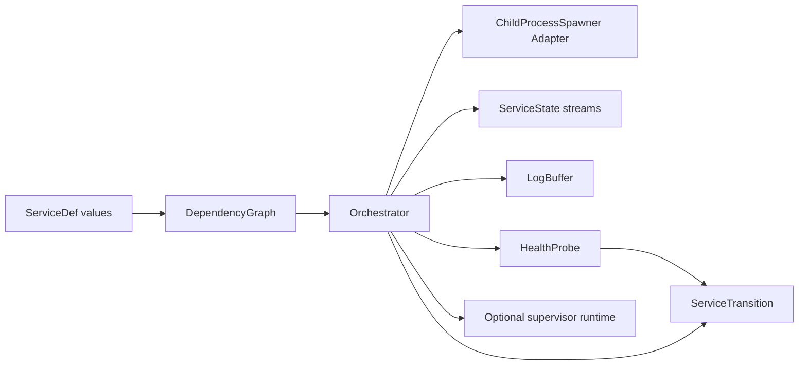

# Architecture of `@supabase/process-compose`

`@supabase/process-compose` supervises an in-memory dependency graph of operating-system
processes. It is a generic Effect Module: it has no Supabase service knowledge, project-file
parser, CLI, or management HTTP server.

## Why the process manager is TypeScript

The local stack needs one lifecycle model for native executables and Docker-backed processes, plus
in-process access to typed state streams, log streams, lifecycle hooks, and scoped cleanup. Keeping
that model in TypeScript lets `@supabase/stack` compose it directly with Effect resources without
maintaining a second configuration and transport protocol to a Go process-manager binary. Docker
Compose would make Docker the orchestration model and would prevent the native-first and
sandbox-friendly runtime. The package borrows useful process-compose concepts—dependency
conditions, health checks, and restart policies—but deliberately implements only the library
capabilities needed by current callers.

## Module map


```mermaid
flowchart LR
    Def["ServiceDef values"] --> Graph["DependencyGraph"]
    Graph --> Orch["Orchestrator"]
    Orch --> Spawn["ChildProcessSpawner Adapter"]
    Orch --> State["ServiceState streams"]
    Orch --> Logs["LogBuffer"]
    Orch --> Probe["HealthProbe"]
    Orch --> Supervisor["Optional supervisor runtime"]
    Probe --> Transition["ServiceTransition"]
    Orch --> Transition
```

The public package export is `src/index.ts`. The principal Interface is `Orchestrator`; callers
construct its layer from a validated `ResolvedGraph`, a `ChildProcessSpawner` Adapter, and a shared
`LogBuffer`.

## Service definitions and dependency graph

`ServiceDef` describes one process:

- executable, arguments, environment, and working directory;
- dependencies and a dependency wait timeout;
- optional HTTP, TCP, or exec health check with separate startup and liveness failure thresholds;
- shutdown signal and grace period;
- restart policy and restart budget;
- `started` and `healthy` lifecycle hooks;
- in-process cleanup and optional external orphan supervision.

`buildGraph()` removes definitions with `enabled: false`, validates every referenced dependency,
rejects cycles, and returns topological start and reverse-topological stop orders. Dependencies use
one of three conditions:

| Condition   | Satisfied when                                                                                     |
| ----------- | -------------------------------------------------------------------------------------------------- |
| `started`   | The dependency is desired to run and has spawned, is healthy/unhealthy, or completed successfully. |
| `healthy`   | The dependency is desired to run and currently `Healthy`.                                          |
| `completed` | The dependency reached `Stopped` with exit code `0`; a non-zero completion fails the dependent.    |

`startService(name)` starts the requested definition and its transitive dependencies.
`stopService(name)` and `restartService(name)` also include active dependents so a caller cannot
leave an already-running dependent attached to a restarted dependency. The pure restart-closure
calculation preserves inactive connector services on a dependency path to an active descendant;
otherwise restarting the descendant without its connector would violate graph order.

`updateServiceDefinition(name, replacement)` validates a graph with the replacement and then swaps
the graph used for subsequent starts and restarts. It does not mutate a process generation that is
already running. The replacement name is normalized to the selected name.

## Desired state and observed state

Each definition owns one stable `SubscriptionRef<ServiceState>` for the lifetime of the
orchestrator. State contains both observed lifecycle status and caller-owned intent:

```ts
type ServiceDesiredState = "inactive" | "running" | "stopped";

interface ServiceState {
  readonly name: string;
  readonly status:
    | "Pending"
    | "Starting"
    | "Running"
    | "Healthy"
    | "Unhealthy"
    | "Stopping"
    | "Stopped"
    | "Failed"
    | "Restarting";
  readonly pid: number | null;
  readonly exitCode: number | null;
  readonly restartCount: number;
  readonly startedAt: number | null;
  readonly error: string | null;
  readonly desired: ServiceDesiredState;
}
```

`inactive` means the definition has not been requested, `running` means the caller wants the
service maintained, and `stopped` records an explicit stop. Desired state is independent of
intermediate observed states and is what prevents an explicit stop from being undone by restart
policy.

`pid` identifies only a currently live process. Process exit, supervisory termination, hook
failure, restart, and forced shutdown clear it. A health-triggered termination does not fabricate
an `exitCode`; the code remains `null` unless the process itself reports an exit.

`ServiceState` extends `Data.Class`, so Effect's `Equal.equals` can compare values structurally. It
does not make two separately allocated objects equal under JavaScript `===`, and
`SubscriptionRef.set` is not itself a distinct-update filter. Callers that want to suppress
redundant publications must compare before writing.

`ServiceTransition` is the only normal path for observed-status changes. `applyEvent()` rejects
illegal `(status, event)` pairs by returning `null`; `transition()` applies a legal event atomically
through `SubscriptionRef.modifyEffect`. Races such as a late health callback during shutdown are
therefore ignored without corrupting state. The transition classification is keyed by every event
tag, so adding an event fails type checking until its legal source statuses are defined.

## Lifecycle of one process generation

For each requested definition, `Orchestrator` runs this sequence:

1. Set desired state to `running` and install one lifecycle fiber in a `FiberMap`.
2. Call `beforeStart`, if supplied. It runs once for initial startup and again before each restart
   backoff, allowing a caller to reserve external resources.
3. Wait for dependencies, bounded by `dependencyTimeoutSeconds` (default: 120 seconds).
4. Transition to `Starting`.
5. Call `beforeSpawn` immediately before every spawn. A caller can use it to release a reserved port
   as late as possible. For a supervised child there is still a spawn-to-bind window because no
   supervisor/child bind handshake exists.
6. Spawn either the configured process or its optional supervisor.
7. Register a scoped finalizer before exposing `Running`.
8. Run `started` hooks sequentially. Only successful hooks allow `ProcessSpawned` to publish
   `Running`.
9. Stream stdout and stderr into `LogBuffer`.
10. Run the health loop, or run `healthy` hooks immediately when no health check exists, then
    publish `Healthy`.
11. Race process exit against unhealthy or hook failure, finalize the child, and apply restart
    policy to process-exit and unhealthy causes.

The service keeps the same state stream across restart generations. Restart backoff is
`min(30 seconds, 2^(restartCount - 1))`.

A no-health-check, `restart: "no"` process is treated as one-shot work. A small isolated poll of
`ChildProcessHandle.isRunning` compensates for adapters that can report process completion before
their `exitCode` Effect becomes observable; it is not part of the general lifecycle loop.

### Lifecycle hooks

Hooks are caller-supplied Effects triggered on `started` or `healthy`. Hooks for one trigger run in
declaration order. Each hook has a timeout (default: 30 seconds) and either:

- `fail`: publish `HookFailed` and stop running later hooks for that trigger;
- `ignore`: append a diagnostic log and continue.

The supplied logger writes tagged stdout/stderr lines into the service's normal log stream. A
failing hook finalizes its process generation before publishing terminal `Failed` state.

## Health and readiness

`HealthProbe` supports:

- HTTP: successful for a 2xx response;
- TCP: successful when a connection opens;
- exec: successful for exit code `0`.

After `initialDelaySeconds`, probes repeat every `periodSeconds`. Each attempt is bounded by
`timeoutSeconds`; consecutive success and failure counters reset each other. Before a process
generation has ever become healthy, `startupFailureThreshold` controls when it becomes
`Unhealthy`. It defaults to `failureThreshold` for compatibility. After the first healthy result,
all later failures use `failureThreshold`, including after an unhealthy-to-healthy recovery.
Initial probe failures are therefore observable rather than leaving the service indefinitely in
`Running`.

An unhealthy process uses the same pure restart-budget decision as a process exit. When restart is
enabled and the budget is exhausted, the supervisor terminates the child and publishes `Failed`
with `pid: null`, `exitCode: null`, and a stable health-exhaustion error. With restart policy `no`,
the live process remains observable as `Unhealthy`.

`waitReady(name)` is intentionally unbounded. For long-running definitions it succeeds at
`Healthy` and fails at a non-restarting terminal state. A `restart: "no"` definition without a
health check is treated as one-shot work, where successful completion is readiness; a
health-checked definition remains subject to health readiness even when restart is disabled.
`waitAllReady()` considers only definitions whose desired state is `running`, so intentionally
inactive definitions do not block lazy callers. Higher-level Modules own any finite user-facing
deadline.

## Restart policies

| Policy           | Exit behavior                                        | Unhealthy behavior                                |
| ---------------- | ---------------------------------------------------- | ------------------------------------------------- |
| `no`             | Never restart.                                       | Leave the live process observable as `Unhealthy`. |
| `on-failure`     | Restart non-zero exits.                              | Restart.                                          |
| `always`         | Restart every exit.                                  | Restart.                                          |
| `unless-stopped` | Restart every exit while desired state is `running`. | Restart.                                          |

`maxRestarts: 0` means unlimited restarts when the selected policy allows one. Manual stop first
sets desired state to `stopped`, so it does not re-enter the restart loop.

## Shutdown and cleanup ownership

Removing a service from the `FiberMap`, clearing the map, or closing the orchestrator scope
interrupts its lifecycle fiber. The generation finalizer:

1. sends the configured shutdown signal (default `SIGTERM`);
2. waits for the configured per-process timeout (default 10 seconds);
3. falls back to `SIGKILL`;
4. runs the in-process `cleanup` Effect.

Whole-graph stop sets desired state first and then stops dependents before dependencies. The global
shutdown budget defaults to 60 seconds. If that budget expires, the orchestrator logs the timeout
and clears all fibers. Services that were running are forced to terminal `Stopped` state with
`pid: null` and exit code `143`.

In-process cleanup and orphan supervision solve different failure modes:

- `cleanup` runs while the owner Effect runtime is alive and can use its dependencies.
- `supervision.orphanCleanup` is serializable work executed by a detached supervisor when the
  owner's stdin closes, its PID disappears, the supervisor receives a termination signal, or the
  managed child exits while cleanup is configured.

`ExternalCleanupAction` supports a shell-free `RunCommand` with an executable, argument array, and
optional timeout, plus `RemovePath` for filesystem cleanup. The supervisor rejects a malformed
decoded cleanup contract before spawning the child, while individual execution failures remain
best-effort. Callers must choose idempotent commands because owner-loss signals can race.

## Supervisor runtime

A definition opts into supervision by setting `supervision`. Instead of spawning the configured
command directly, `Supervisor.makeSupervisedCommand()` launches `supervisor-runtime.ts`. The
supervisor:

- starts the actual command in its own process group on Unix;
- pipes child stdout/stderr back to the orchestrator;
- watches both owner stdin and owner PID;
- kills the entire child tree on owner loss or a shutdown signal;
- applies graceful-then-forceful termination;
- runs serializable orphan cleanup before it exits.

This extra process is required for abrupt owner death: an Effect finalizer cannot run after its
own process has already disappeared. Ordinary definitions avoid the extra process.

## Compiled Bun self-dispatch

Development runtimes can execute `supervisor-runtime.ts` by file path. A Bun single-file executable
cannot: `process.execPath` points back to the compiled CLI, and source URLs may live under Bun's
virtual filesystem. The package therefore uses three internal environment variables:

| Variable                                   | Role                                                                                                                                   |
| ------------------------------------------ | -------------------------------------------------------------------------------------------------------------------------------------- |
| `PROCESS_COMPOSE_SUPERVISOR_SELF_DISPATCH` | Enabled by the compiled parent when this package is loaded from `file:///$bunfs/`; tells later spawns to re-enter the same executable. |
| `PROCESS_COMPOSE_RUN_SUPERVISOR`           | Selects the supervisor runtime when the executable re-enters its main entrypoint.                                                      |
| `PROCESS_COMPOSE_SUPERVISOR_CONFIG`        | Carries the base64url-encoded supervisor configuration for that runtime.                                                               |

The CLI entrypoint calls `enableSupervisorSelfDispatchForCompiledBun()` before normal command
dispatch, checks `isSupervisorRuntimeRequested()`, and invokes `runSupervisorRuntimeFromEnv()`.
The supervisor removes all three variables before starting the managed command, preventing the
protocol from leaking recursively into a service. Contract tests run the same encoded supervisor
configuration through both the source-file argument path and environment-based self-dispatch path.

The stack daemon has a separate Supabase-owned marker, `SUPABASE_STACK_RUN_DAEMON`; it is documented
in [the stack detach-mode guide](../../stack/docs/detach-mode.md#compiled-executable-re-entry).

These contracts exist because compiled-child behavior caused two user-visible incidents:

- [CLI-1452](https://linear.app/supabase/issue/CLI-1452/compiled-bun-compile-next-binary-cant-run-supabase-functions-dev): compiled runtime paths and native watcher bindings were unsafe for functions development.
- [CLI-1453](https://linear.app/supabase/issue/CLI-1453/compiled-bun-compile-next-binary-start-detach-daemon-fork-ignores): detached startup re-entered the CLI instead of the daemon.

## Logs

`LogBuffer` holds a bounded per-service history and a bounded merged history (10,000 entries each),
plus live per-service and merged `PubSub` streams. `historyAll` can filter by service names.
Streams contain new entries only; callers explicitly request history when they need replay.

When a process exits unexpectedly or becomes unhealthy, the orchestrator appends recent buffered
output to its diagnostics.

## Error model

Graph construction can fail with `MissingDependencyError` or `CyclicDependencyError`. Lifecycle
lookup uses `ServiceNotFoundError`; spawn preparation uses `SpawnError`; readiness uses
`ServiceReadyError`. Global shutdown timeout is logged and force-cleared.

## Testing through Interfaces

- Pure unit tests cover graph construction, state transitions, health counters, and log buffering.
- Orchestrator integration tests provide a stateful `ChildProcessSpawner` Adapter and assert on
  public states, desired state, logs, hooks, dependency ordering, restart, and cleanup.
- Supervisor runtime tests use real subprocesses because owner-loss and process-tree behavior cross
  the process Seam.
