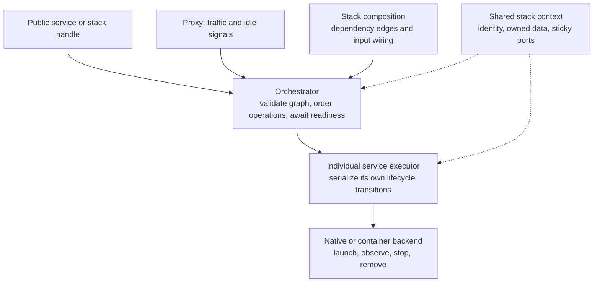
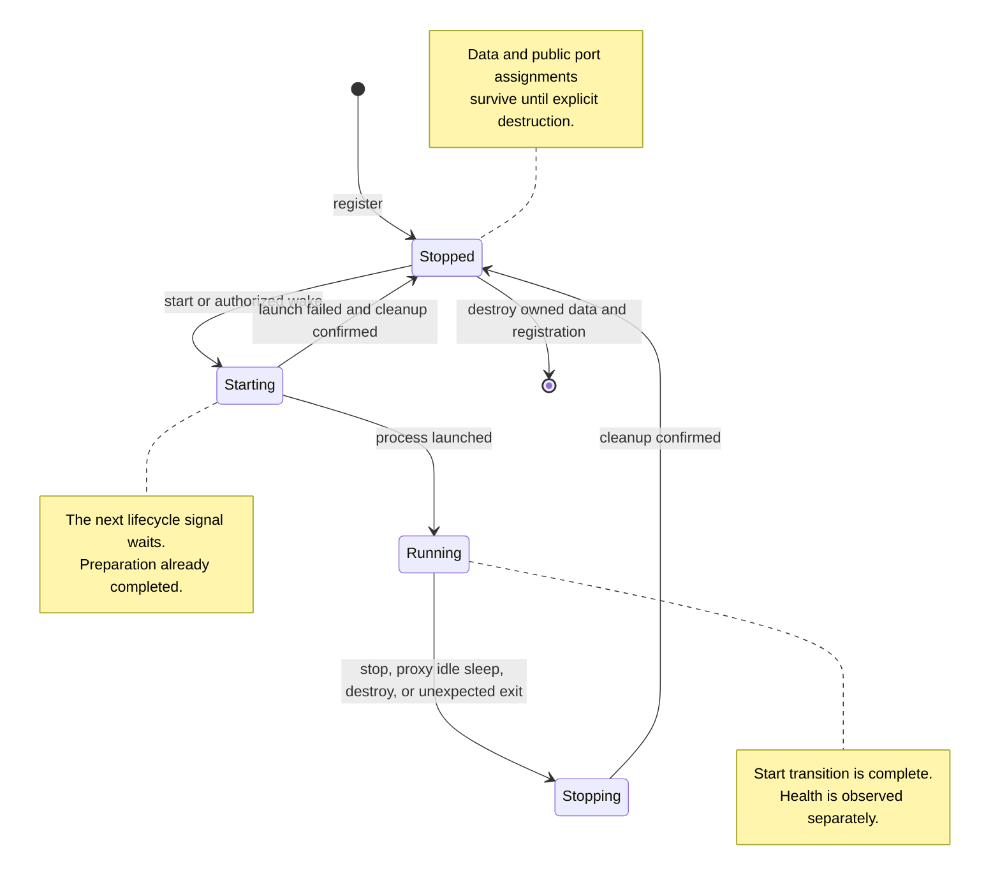
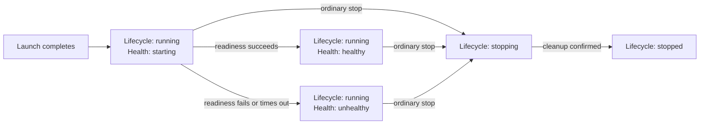
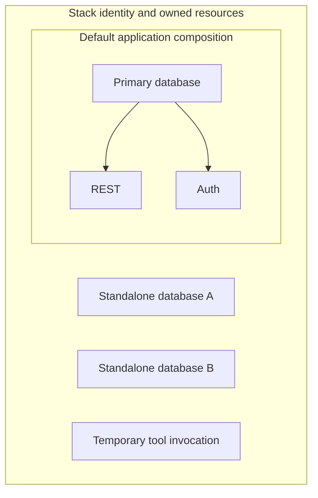
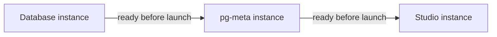
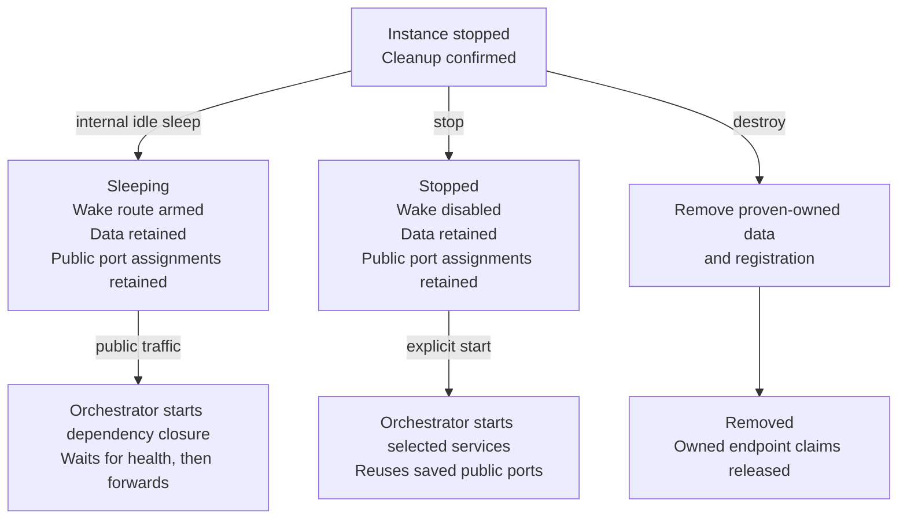
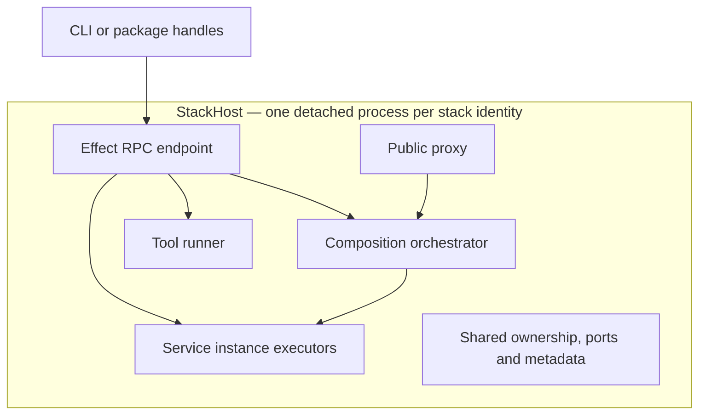
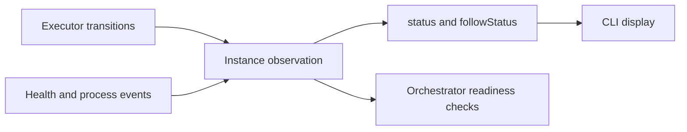
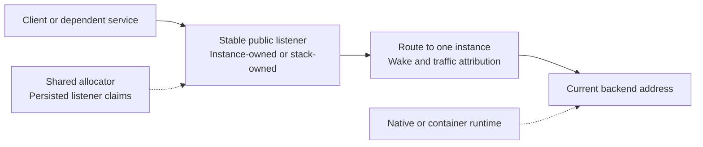

# Stack package architecture

This document defines the stack package architecture. The package implements the service graph, lifecycle, composition, proxy, tools, and detached owner described here. CLI integration is a separate consumer concern.

## Core model

Use **a graph of service instances, with a small serialized lifecycle for each instance**. Keep application readiness separate from that lifecycle. Add a proxy that starts services on public traffic and sleeps them on public inactivity. Run finite tools with the same identity, artifacts and execution primitives, without treating them as services.

The critical simplification is:

> Starting a process and waiting for that process to become healthy are different operations.

A service finishes its current lifecycle transition before accepting another lifecycle signal. There is no cancellation of one transition by another, ownership handoff, special pending-stop state, or general desired-state reconciliation engine.

Preserve the useful identity and instance use cases while replacing the underlying machinery. The contract intentionally stays small and behavioral.

## The mental model: a service runs itself; the orchestrator connects services

Establish the individual service lifecycle first, then compose it through a dependency-aware orchestrator. Identity and resource ownership are foundations for both. The orchestrator uses the same service operations for one service or a whole stack; it does not implement a second lifecycle.



**Dependency declarations and input wiring both belong to stack composition, enforced by the orchestrator.** REST's definition accepts a database URL. It does not declare a database-service dependency or know where that URL comes from. Composition can wire the URL from a managed database instance and declare its readiness edge, or supply an external URL without a managed lifecycle dependency. The orchestrator resolves that wiring, enforces the declared ordering, and passes ordinary configuration values to REST.

A URL implies a connection requirement, not ownership of another service. Do not infer stack graph edges by inspecting URLs. Keep the managed producer reference, readiness requirement and consumer input mapping together in the composition declaration; the service does not maintain a parallel dependency list.

| Boundary          | Knows                                                                    | Does not decide                                         |
| ----------------- | ------------------------------------------------------------------------ | ------------------------------------------------------- |
| Recipe/definition | Typed configuration inputs, such as a database URL; own runtime behavior | Where inputs originate or which stack services must run |
| Stack composition | Concrete dependency edges and how values populate service inputs         | Runtime lifecycle implementation                        |
| Orchestrator      | Graph, input resolution, readiness requirements, selected operations     | How PostgreSQL launches or a container stops            |
| Service executor  | Own state, processes, readiness, data and resolved inputs                | Dependency ordering or other services' lifecycle        |

Calling public `service.start()` or `service.stop()` still goes through the orchestrator. The executor is internal, so callers cannot accidentally bypass graph checks. Sleep is an internal proxy policy over the same stop/start mechanics; it has no public service method or RPC endpoint.

Each long-running service is an individually identified instance with its own executor, lifecycle and health. There is no capability layer, hidden service group or aggregate service handle. Composition connects instances; it does not hide their identities.

## Implementation organization

Keep the implementation Effect V4 from the domain inward. Promise is the outer facade for package consumers and the boundary for foreign APIs; adapt a foreign Promise once at its leaf with typed errors. Host-owned execution fibers own admitted transitions, while callers may cancel only their wait. Use bounded streams and backpressure for tool and log transport.

Organize by cohesive responsibilities. The package shape is:

- `src/` modules: the instance executor, orchestrator, owner, detached host, networking, persistence, and RPC boundary.
- `services/`: one definition per service, owning its configuration, endpoints, launch settings, and readiness. `Catalog.ts` validates and dispatches creation; `Recipe.ts` defines their contract and `ProcessRecipe.ts` shares process mechanics.
- `composition/Supabase.ts`: default Supabase membership, dependency edges, and input wiring.
- `host/`: endpoint projections, tool execution, and tool attachment transport.
- `runtime/`: native and container adapters.
- `Tools.ts`: public finite-tool descriptors.
- `effect.ts`: Effect-facing composition and services.
- `index.ts`: Promise-facing public boundary.

This is navigational guidance, not a required file scaffold. Split modules when a responsibility needs it; avoid one folder or interface per operation. Keep service definitions narrow, with graph edges and input wiring in composition. Do not introduce capabilities, projections, recovery journals, reservations, public sleep APIs, or extra lifecycle states to force this shape.

Application services use Effect `Context.Service` and `Layer.effect`; consumers obtain their dependencies from the Effect context. Each owner receives an isolated orchestrator graph. Tools share the host lifetime alongside the owner. Individual executors, recipes, and process handles remain scoped resources because a stack owns multiple independently identified instances.

## 1. Follow Compose's useful separation

Docker separates container lifecycle from health. A container can be running while its health is still starting. Compose can wait for a dependency's health before starting its dependent, but stop does not wait for the application to become healthy. [Docker startup documentation](https://docs.docker.com/compose/how-tos/startup-order/), [Compose stop implementation](https://github.com/docker/compose/blob/main/pkg/compose/stop.go), [engine stop implementation](https://github.com/moby/moby/blob/master/daemon/stop.go).

Use that separation for both backends:

### Chart 1: one service instance's lifecycle



The final marker means the registration no longer exists. `destroy` of a running instance follows stop, then removal, within the admitted operation. If runtime cleanup fails, remain stopping with the current process/exit observation and cleanup error; the next stop/restart retries the remaining cleanup. Do not report a dead process as running or unfinished cleanup as stopped. Failed data removal leaves the registration present. Restart composes stop and launch; it does not add a new stable state.

### Chart 2: health does not hold the lifecycle gate



Only running + healthy satisfies a readiness wait. A health failure records an error and leaves the process running; it neither locks the lifecycle nor automatically stops the process.

**For one service instance, running means its process has launched. It does not mean the application is ready.** Every instance exposes its own observation. Separately observe health: starting, healthy, or unhealthy. A failed launch records its error; unsuccessful cleanup must not be reported as a successful stop. Destroy removes the registration only after stopped resources and owned data are safely removed.

Example: PostgreSQL launches, so its start transition finishes in running. Its initialization and health are still pending. A stop request can now run the ordinary stopping transition; there is no start transition to interrupt. A request arriving during actual launch waits for launch to settle first.

Dependency waits and health waits never hold a lifecycle transition open. Artifact preparation completes before the start transition is admitted, as a shared cache operation whose callers may cancel their own wait. Downloads and image pulls cannot run inside the serialized launch transition. Bounded native pre-launch steps such as initdb remain part of launch. Actual launch and stop work have bounded success/failure paths. A timeout is the current transition settling through its own failure handling, not another command pre-empting it.

## 2. Ownership, instances and composition

| Concept          | Contains                                                                                                                                |
| ---------------- | --------------------------------------------------------------------------------------------------------------------------------------- |
| Stack            | Identity, complete owned-instance registry, runtime choice, security, resource namespace                                                |
| Composition      | Explicit member selection, dependency edges, input wiring and eager/lazy activation policy                                              |
| Service recipe   | Typed configuration inputs, native/container launch specifications, readiness and optional storage operations; no stack graph knowledge |
| Service instance | Immutable ID, recipe/configuration, runtime handle, lifecycle and health observations; graph relationships belong to stack composition  |
| Tool job         | One finite artifact-backed execution belonging to the stack                                                                             |

The default Supabase composition is a factory that registers, selects and connects instances. Registration establishes ownership; membership establishes participation in the default application. Registering or starting another instance never implicitly adds it to that composition. A shadow database is an ordinary database instance with its own ID, password, ports and data, owned by the same stack but managed individually.



A composition is an explicit selection over the same instance registry and graph, not another StackHost or lifecycle engine. With no declared dependencies, starting a standalone database selects only that instance and its internal owned resources. Dependency checks still use the shared graph when edges exist. Copying an initialization profile from the primary is setup input, not a permanent runtime dependency.

### Proposed standalone instance API

This sketch retains the existing `services.create` shape while making creation independent of default composition membership:

```ts
const shadow = await stack.services.create({
  service: "database",
  config: {
    version: "17",
    endpoints: { sql: { port: "auto" } },
  },
});

try {
  await shadow.start();
  await shadow.ready();
  // Run the migration or comparison against this instance.
} finally {
  await shadow.destroy();
}
```

### Typing the creation API

Use a discriminated union of creation definitions. `DatabaseDefinition` is configuration input, while `DatabaseInstance` is the live handle returned by creation. Neither type needs a runtime class hierarchy. The following abbreviated types illustrate the public contract; the actual configuration types come from each service module's validated schema.

```ts
type DatabaseDefinition = {
  service: "database";
  config: DatabaseConfig;
};

type RestDefinition = {
  service: "rest";
  config: RestConfig;
};

type ServiceDefinition = DatabaseDefinition | RestDefinition;

type ServiceInstances = {
  database: DatabaseInstance;
  rest: RestInstance;
};

interface ServiceCollection {
  create<Input extends ServiceDefinition>(
    input: Input,
  ): Promise<ServiceInstances[Input["service"]]>;
}
```

The `service` literal selects the permitted configuration and the returned handle. An inline call with `service: "database"` infers `DatabaseInstance`; it needs neither a generic argument nor `as const`. For a definition saved in a variable, use `satisfies DatabaseDefinition` to validate it while preserving the discriminator. A definition whose kind is only known at runtime returns the corresponding union of handles. Keep kind/config pairs correlated as a discriminated union, rather than giving `service` and `config` independent unions. As the catalog grows, the union and instance mapping can be derived from one typed catalog rather than duplicated.

Use a service-to-config map and mapped creation union for this typing while keeping dependency requirements in composition rather than individual service definitions. Runtime schema validation remains necessary at persisted/control boundaries; TypeScript alone does not validate received data.

Creation assigns a unique instance identity and isolated data directory; endpoint allocation belongs to that instance and stays sticky until destruction. The same call can create a second independent database. No `shadow` service type or special lifecycle is required. Launch and health remain separate. The caller owns the decision to destroy temporary instances; closing a handle is not destruction. Existing initialization/snapshot options still apply where the CLI needs a prepared database.

Make operation scope explicit in the proposed API:

| Operation                                | Selection                                                                     |
| ---------------------------------------- | ----------------------------------------------------------------------------- |
| `instance.start/stop/restart/destroy()`  | That instance, subject to the ordinary graph rules                            |
| `stack.composition.start/stop/restart()` | Default composition members; start also includes their declared prerequisites |
| `stack.stop()`                           | All owned service instances, including standalone instances                   |
| `stack.destroy()`                        | All owned resources, including standalone instances and tool jobs             |

Namespace stop also cancels and settles attached jobs before StackHost shutdown; composition stop does not reserve services on behalf of tools. Namespace destruction performs shutdown before owned-data removal. The CLI's full stop uses namespace scope; restarting the application composition does not restart shadows. Composition startup never resurrects a standalone instance. Membership and eager/lazy activation are separate: eager means start when the containing composition is started, not include every registered eager instance. The existing stack-wide start convenience, if retained, delegates to default composition startup only.

For example, REST binds to the primary database; a shadow database has no relationship to it unless the caller asks to copy its initialization profile. Functions may run without PostgreSQL or Auth. An API URL in configuration is not automatically a hard lifecycle dependency.

For example, Studio and pg-meta are separate service instances. Each has its own ID, configuration, lifecycle and health. Composition declares the relevant edges explicitly. Storage and imgproxy, or Logflare and Vector, follow the same rule when selected; there is no parent handle that starts private children or computes combined health.



The `service: "database"` discriminator selects a service definition and its configuration type; it does not name a group or identify a unique instance. Two databases have the same definition kind and different instance IDs. Operations and dependency edges address instance IDs. Short-lived initialization helpers remain implementation details of an operation; they do not justify a hidden hierarchy of long-running services.

## 3. One lifecycle implementation, one graph planner

An instance has one serial transition executor. Requests wait until the current transition settles, then revalidate against the resulting state. An already-satisfied request does no runtime work; an explicit stop still updates intent and disables wake as described below. A waiting caller can cancel its wait; an admitted transition belongs to the StackHost and finishes independently of that caller.

### Interruption and command concurrency

An executing instance operation cannot be interrupted or replaced by another command. Start, stop, restart, destroy, export and restore use the same serial execution gate. Internal proxy-triggered sleep also uses that gate. Incoming commands wait, revalidate against the resulting state, then execute. An instance's restart keeps that gate across stop and launch; readiness observation happens afterward. There is no priority-stop path or ownership handoff.

```text
start executing → stop requested → stop waits
start settles   → stop executes  → stopped
```

Cancellation has a limited meaning at each boundary:

| Caller activity                                        | Effect of cancellation                                                                                        |
| ------------------------------------------------------ | ------------------------------------------------------------------------------------------------------------- |
| Preparing artifacts or waiting for execution admission | Abandon this request before its lifecycle operation begins; shared preparation may continue for other callers |
| Waiting for an executing instance operation            | Stop waiting; the StackHost finishes the operation and its cleanup                                            |
| Waiting for readiness or following logs                | End the observation without changing lifecycle                                                                |
| Running an attached tool invocation                    | Terminate and clean up that invocation                                                                        |

A service is stopped by an explicit stop command, not by a disconnected caller. Launch completes at running, so stop during health-starting uses the ordinary stop operation. If the launch ends while a caller awaits readiness, that observation fails rather than attaching to a later launch.

A pending orchestration plan is different from an executing transition: stopping REST while its start request waits for database readiness must prevent the old request from later launching REST. The intent revision described below handles this one stale-request check. It does not interrupt an admitted operation.

Independent instances execute concurrently. Admission and dependency validation use short coordination sections; downloads, readiness probes, process operations and snapshots do not hold a global execution lock. Each operation settles through success or its own timeout/failure handling and cleanup. Process crashes and owner loss remain possible; report unavailable observations or cleanup errors rather than claiming success. Crash recovery is outside this design. This ownership rule does not require one blanket uninterruptible region around all Effect code.

### Chart 3: dependency awareness lives in the orchestrator

Here stack composition has wired the primary database’s connection URL into REST configuration and declared a readiness dependency. The caller composes `start` and `ready`, as a CLI command that needs a usable service would. The service executors never call each other. With an external database URL, the managed database branch is absent.

```mermaid
sequenceDiagram
    participant Caller
    participant O as Orchestrator
    participant DB as Database executor
    participant REST as REST executor

    Caller->>O: Start REST and wait for readiness
    O->>O: Read composition edge and input mapping
    O->>DB: Start
    DB-->>O: Running; health still starting
    Note over DB: Launch transition has finished
    O->>DB: Await readiness of this launch
    Note over O,DB: Observation only; lifecycle remains available
    DB-->>O: Healthy
    O->>O: Revalidate target intent and graph
    O->>REST: Start with ordinary database URL input
    REST-->>O: Running; health still starting
    O->>REST: Await readiness of this launch
    REST-->>O: Healthy
    O-->>Caller: REST ready
```

If the prerequisite stops or readiness fails, the wait fails and REST is not launched. The wait does not reserve a long-running start transition. Deliberate stop still goes through the orchestrator's graph checks.

The orchestrator performs a few graph operations:

| Operation | Rule                                                                                                                                                                                |
| --------- | ----------------------------------------------------------------------------------------------------------------------------------------------------------------------------------- |
| Start     | Start declared prerequisite instances; await their health; launch the selected instance                                                                                             |
| Stop      | Admit only when every dependent is stopped with wake disabled, regardless of batch selection; composition stops dependents first                                                    |
| Restart   | Individual restart follows the same stop check, then launches; composition restart stops in reverse dependency order, then starts in forward order                                  |
| Sleep     | Require proxy inactivity and no running/starting dependent                                                                                                                          |
| Destroy   | Reject while any registered dependent still references the instance; composition/namespace destruction removes dependents first, then performs ordinary stop and owned-data removal |

For stop/restart, a running, starting, stopping or wake-armed dependent blocks prerequisite shutdown until that dependent has stopped and settled. Batch membership never bypasses this check. For sleep, a dependent that is already sleeping does not prevent prerequisite sleep. These are admission checks under the same short graph coordination boundary, not long-lived reservations.

Validate composition references, input/output types and cycles when registering or changing the graph. Wiring uses only a source instance ID and named output mapped to a target instance ID and named configuration input. The service catalog declares those input/output schemas. There is no expression language, arbitrary callback or general JSON-path evaluator. Resolve bindings into ordinary configuration before handing it to the service. Validate each service’s configuration separately from that graph. Bind references to immutable instance IDs, not names. Derive ordering from this one graph; do not maintain separate capability and instance lifecycle graphs.

**Readiness waiting is observation, not a transition.** If PostgreSQL stops while REST is waiting for its health, the wait fails and REST does not launch. It does not restart PostgreSQL or continue using a stale ready result. Readiness is associated with the exact runtime launch.

Before launching a dependent, atomically check its prerequisites, verify its own intent revision is unchanged since the request began, and mark its transition starting. Explicit stop advances that revision and disables wake even if no process exists yet; an older request still preparing artifacts or waiting for dependencies cannot launch afterward. This revision fences unadmitted work; it never interrupts an executing transition. This closes the race between dependency validation and another command stopping the prerequisite. Do not reserve an entire composition or acquire a set of batch locks. Each instance operation waits for its own gate and rechecks the current graph and observations on admission. If another caller starts a dependent between two batch steps, stopping the prerequisite is rejected and the batch reports partial results. A stale start plan cannot resume after another operation stops or replaces its prerequisites.

Independent instances still execute concurrently. A shadow startup or snapshot must not block Functions restart. Serialize only short in-memory admission decisions and durable writes; never hold the graph decision boundary while downloading, starting processes, probing health, archiving data or writing files. Gateway traffic on unrelated ready instances must not wait behind a state write.

Composition and namespace methods select instances and call these same operations. Default composition start first assigns/reuses and binds every configured public listener needed by its selected members, including lazy members, and registers their routes. It then launches eager members and arms lazy routes; it does not select unrelated standalone instances. Successful start returns member observations with their public endpoints; credentials reads render usable connection strings from these assignments without starting lazy backends. It awaits readiness for every launched eager member, including leaves. A failed launch or readiness check makes the operation return an error with per-instance outcomes; a running-but-unhealthy instance remains running, already completed steps are not rolled back, and blocked dependents are not launched. Armed lazy members need not launch unless required by an eager member.

After binding the shared API listener, default composition setup uses the endpoint renderer to populate ordinary configuration values: Studio receives `apiUrl` and `publicApiUrl`, Auth receives `externalApiUrl`, and Functions receives `apiUrl`. When the database has a configured SQL endpoint, Functions also receives its rendered `databaseUrl`; this saved value is refreshed when callers recompose the composition, and does not create a database readiness dependency for Function execution. These values are saved in each instance's configuration alongside the saved listener assignment; individual starts and normal host reopening consume that configuration. This is concrete default setup code, not declarative input wiring or a public listener-binding API. The endpoint renderer owns the host/runtime reachability rules; custom configurations supply plain URLs through the same inputs. URL values do not imply graph edges.

Composition restart is two passes: stop the selected instances in reverse dependency order, then perform composition start in forward dependency order according to eager/lazy policy. It is not a loop of individual `restart()` calls. If the stop pass fails, report partial results without beginning the start pass. A cancelled composition request abandons steps not yet executing; admitted instance operations settle and already launched instances remain. Readiness does not hold an instance gate or a composition-wide reservation. Explicit empty selection is a no-op; there is no generic rollback engine.

## 4. Recipes own runtime details

A recipe receives ordinary typed configuration and a context for its own resources. A database URL is just an input value: the recipe does not receive its producer’s identity, another service handle, or the stack graph. It does not receive the entire persisted stack document. The orchestrator owns resolving managed outputs into these configuration values.

The backend provides mechanical operations: launch, observe exit/logs, stop and remove exact resources. Native and container implementations differ in commands, mounts, network setup and cleanup, but share the lifecycle contract. Keep one runtime choice per stack; mixed backends and automatic tool-runtime fallback are unnecessary for the current scope. Preparation validates that the selected service/tool artifact exists for that runtime and platform, and reports an unsupported-platform/artifact error otherwise. A native stack requires native artifacts; Windows native support is not implied by a fallback branch in the current CLI.

A successful launch returns an owned runtime handle with readiness observation and cleanup. One shared readiness program belongs to each runtime launch and has a bounded outcome. Readiness timeout or initialization failure leaves the process running with unhealthy status and an actionable error. It does not automatically stop or restart the process. Stop remains available, and traffic/dependent launches do not treat unhealthy as ready. Initialization that requires a running process belongs to that runtime session, not the start transition. For PostgreSQL, healthy means required catalog initialization and credential reconciliation have completed—not merely that TCP accepts a connection. Stopping the running instance closes that session, settling its health probes and initialization helpers as ordinary resource cleanup. There are not two competing lifecycle operations.

The database keeps only the initialization information needed to reuse its data on a normal stop/start. Mark initialization complete only after it succeeds. If an ordinary stop interrupts application initialization, the recipe must either support a safe retry or report that initialization is incomplete; do not add a generic persisted operation journal or recovery workflow.

Unexpected process exit is observed by the living host. Immediately disable forwarding and automatic wake for that instance and record its exit result. The executor uses the ordinary serialized stop/remove cleanup for the exact owned runtime handle, reaching stopped only after cleanup succeeds. Stop cannot be a no-op while runtime resources remain; start/restart must finish that cleanup before launching a replacement. If exit occurs during an executing transition, that transition settles and the same gate orders any remaining cleanup; no transition is pre-empted. Old-handle events cannot affect a replacement. This adds no Exited lifecycle state and no cleanup scanner: the host already owns the handle and its exit observation.

There is **no automatic restart, continuous dependency shutdown cascade, or self-healing controller**. A crashed service stays stopped until explicit start/restart. A wake operation may use a running prerequisite or launch a stopped prerequisite whose wake route is armed; an explicitly stopped or unexpectedly exited prerequisite makes wake fail. Only an explicit start may launch those prerequisites. Explicit composition startup can arm initially lazy instances, and sleep retains that permission; unexpected exit removes it. Existing dependents may observe connection failures, as they can with Compose. Deliberate lifecycle changes still obey graph checks.

## 5. Sleep stays simple

**Public traffic through the proxy is the only activity signal.** Sleep is triggered internally by proxy inactivity, never by a public client command. Do not track private connections, background SQL, or inferred workload activity. Add a public sleep operation only if a concrete consumer needs it later.

- A request or open public stream/connection counts as activity; idle HTTP keep-alive does not.
- The idle timer and wake route belong to one instance. Sleep stops that instance after the ordinary dependency checks, retains its data and keeps its wake route armed. It does not implicitly stop companion instances. Instances without a supported public wake route remain running until explicitly stopped; no group sleep mechanism is introduced.
- The next request starts the instance through the orchestrator, ensuring its declared prerequisites are ready, then waits for its own health before forwarding.
- Explicit stop disables wake. Traffic never reverses it.
- If a prerequisite's sleep is blocked by a running dependent, recheck its existing idle eligibility when that dependent sleeps/stops. No new activity heuristic is needed.

Sleep is therefore ordinary stop mechanics plus an armed wake route. There is no separate sleep runtime. Activity acquisition and sleep admission must make one atomic in-memory decision so sleep cannot race a request. A request that arrives after sleep was admitted waits for it to finish, then wakes the instance.

### Chart 4: sleep, stop and destroy have different retained state

These are outcomes of the same local stop mechanics after graph checks. “Sleeping” describes a stopped instance with wake enabled, not another backend state.



Sleep retains the public listener needed to wake. Whole-stack stop closes listeners while preserving saved assignments; the next start rebinds the same ports. Destruction releases only the removed instance's owned assignments, not unrelated services' shared listeners or claims.

Composition validation permits lazy activation only for instances with a configured public wake endpoint. A route-less prerequisite, such as pg-meta without its own public endpoint, is eager; it is not implicitly armed through a dependent. This avoids a second wake-permission mechanism. Internal sleep is available only for instances with a supported public wake route and an enabled idle policy. Database and Functions need no automatic idle timer by default. Functions inspector access remains possible while health is starting; ordinary application traffic waits for healthy.

## 6. Tools share execution, not service lifecycle

Provide a stack-scoped finite runner for concrete CLI needs such as `pg_dump` and `psql`. Each invocation has a job ID; temp files, logs and runtime resources belong to that stack. Jobs reuse artifact selection and native/container process execution. They have exit results and byte streams, not healthchecks, wake policy or service registrations.

For `pg_dump` and `psql`, container mode launches a temporary tool container from a compatible PostgreSQL image, overriding its entrypoint to run the client command. It may reuse the database service's image, but it creates a separate container without starting another database server or mounting the server's data directory. Native mode launches the corresponding binary from the selected native artifact. The tool definition supplies these two executable forms; the runner supplies stack ownership, arguments, environment, streams and cleanup. Docker supports entrypoint overrides and automatic removal for this execution shape. [Docker run reference](https://docs.docker.com/engine/containers/run/).

| Invocation                    | Native runtime                               | Container runtime                                                        |
| ----------------------------- | -------------------------------------------- | ------------------------------------------------------------------------ |
| Run `pg_dump`                 | Spawn the selected client binary             | Create an attached temporary container running `pg_dump`                 |
| Connect to a managed database | Resolved public proxy endpoint               | The same public proxy endpoint, addressed from the container network     |
| Return the result             | Stream stdout/stderr and collect exit status | Stream stdout/stderr, collect exit status and remove the owned container |

The caller supplies ordinary arguments and environment values, including any connection string. The tool runner treats them as opaque: it does not resolve service references, infer dependencies or rewrite URLs. The caller can obtain execution-reachable connection values through `service.credentials({ from: "runtime" })`; `from: "host"` is the default for ordinary host clients. This extends the existing read operation rather than adding tool-specific inputs. The networking/endpoint renderer supplies these concrete values; `localhost` inside a tool container is not generally the host. Managed tool traffic uses the public proxy so the existing wake/activity rules apply. Tools publish no listening ports. Dump output streams to the CLI's destination; temporary files, when needed, use the stack/job directory. Use a client version compatible with the target; matching the managed database's selected major is the simple default. [PostgreSQL client compatibility](https://www.postgresql.org/docs/17/app-pgdump.html).

Managed-local execution uses this temporary-container pattern under stack ownership. Executing a command inside an existing service container is unnecessary for these network clients and need not become a second public tool mechanism.

For the managed local backend, the StackHost owns jobs so it can clean up exact resources after client disconnection. Attached-job cancellation stops that job, not a service transition. Explicit StackHost shutdown cancels and settles attached jobs; finishing the last job does not automatically retire the host. Use bounded, backpressured stdin/stdout/stderr transport; do not buffer entire dumps or confuse output EOF with successful exit.

Tools do not participate in the service dependency graph. Traffic to a public endpoint wakes a sleeping service through the proxy, exactly as traffic from any other client does. An explicitly stopped service remains stopped. There are no tool-specific readiness checks or lifecycle locks: an explicit stop or restart can disrupt the connection and the tool reports its ordinary error. Internal bootstrap helpers use the same low-level runner under their parent service operation.

Migrate **managed-local** dump/reset execution first. Linked/remote and legacy compose CLI paths remain outside this package's lifecycle; do not create a stack or reserve ports just to run their tools. An explicitly supplied stack handle may still run a job against an external URL. The identity claim applies to everything executed through that stack.

CLI policy remains CLI policy: SQL scripts, migrations, seeds, hosted targets, output files and command flags. The caller chooses a compatible client version; the runner resolves that version to its executable artifact and owns execution.

### Proposed public tool API

Expose one awaited `stack.tools.run` operation. The Promise facade below has an Effect counterpart for CLI consumers; both use the same owner-side runner.

```ts
import { postgres } from "@supabase/stack/tools";

// Connection values are plain data, rendered for the stack runtime.
const { databaseUrl } = await database.credentials({ from: "runtime" });
const result = await stack.tools.run(postgres.pgDump({ major: 17 }), {
  args: ["--dbname", databaseUrl, "--schema-only", "--no-owner"],
  stdout: (bytes) => destination.write(bytes),
  stderr: (bytes) => diagnostics.write(bytes),
  signal,
});

// result: { jobId, exitCode }
```

`postgres.pgDump({ major })` describes the selected client package and how to launch its native and container forms. The caller chooses the version; 17 is illustrative. The stack's runtime chooses the execution form. The invocation supplies ordinary arguments, environment and byte streams. Neither descriptor nor invocation declares managed service dependencies.

`databaseUrl` is a plain string. The same invocation can target the primary database, a shadow database or an external database without changing the tool definition or the runner. The proxy handles any wake-up caused by connecting to a sleeping managed service. A URL obtained for container execution is already reachable from that container; endpoint address selection remains outside the generic tool runner. The orchestrator uses the same endpoint renderer when supplying connection values to service instances. It handles the host gateway and the listener binding needed to reach it, not just hostname substitution, and returns an error if the selected networking configuration cannot reach the endpoint. Caller-supplied external URLs remain unchanged.

Arguments are passed as an argument vector, not interpreted as shell text. Stdin accepts an optional asynchronous byte stream; stdout/stderr callbacks receive bytes and may return Promises, which the runner awaits for backpressure. All examples use byte sinks whose writes await capacity. `psql` uses the same operation with `postgres.psql({ major })`, optionally supplying stdin. Callers supply stdout/stderr sinks explicitly. Neither facade collects unbounded output into a return value.

The operation settles after process exit, output delivery and owned-resource cleanup. A nonzero tool exit is returned in `exitCode` for CLI-specific handling; preparation, transport, sink and cleanup failures reject with typed execution errors. Cancellation stops and cleans up the attached job and reports cancellation. The StackHost assigns `jobId` and owns the resources. No public job registry, job healthcheck, persistent tool service or separate launch/attach/wait sequence is needed for these use cases.

## 7. StackHost owns lifetime; components own behavior

Use `StackHost` for the detached process that owns one stack identity. It hosts the service executors, composition orchestrator, proxy, tool runner and shared resources. A standalone instance needs this owner and its executor without needing composition scheduling. Tools use the runner without entering the service dependency graph.

The host acquires exclusive ownership, constructs the components, exposes Effect RPC, delegates requests and coordinates explicit shutdown. Domain behavior remains in the components: the host does not understand PostgreSQL archives, decide dependency order or implement another service state machine. Existing dependency checks still apply when individual operations target instances with declared graph relationships.



Keep Effect RPC as the transport initially. Its handlers should mostly delegate to the same operations used by internal components. Composition startup calls the executors directly, not RPC back into its own host. Replacing RPC with handwritten messages would still require framing, validation, errors and stream transport; that replacement is not part of this simplification.

### Proposed RPC surface

| Area                 | Methods                                                                                                                | Responsibility                                                |
| -------------------- | ---------------------------------------------------------------------------------------------------------------------- | ------------------------------------------------------------- |
| Host                 | `host.describe`, `host.stop`, `host.destroy`                                                                           | Inspect the stack; stop or destroy everything it owns         |
| Registry             | `services.create`, `services.get`, `services.list`                                                                     | Create and locate instances                                   |
| Instance lifecycle   | `service.prepare`, `service.start`, `service.stop`, `service.restart`, `service.destroy`                               | Operate one instance                                          |
| Instance observation | `service.status`, `service.ready`, `service.followStatus`, `service.logs`, `service.followLogs`, `service.credentials` | Read state, await health and inspect outputs                  |
| Database snapshots   | `database.exportSnapshot`, `database.restoreSnapshot`                                                                  | Database-specific storage operations                          |
| Composition          | `composition.configure`, `composition.describe`, `composition.start`, `composition.stop`, `composition.restart`        | Define and operate the application selection and dependencies |
| Tools                | `tools.run`, `tools.writeStdin`, `tools.closeStdin`                                                                    | Execute an attached command with streamed input/output        |

These are proposed wire names. Public `shadow.start()` maps to `service.start({ id })`; `stack.stop()` maps to `host.stop`. Public `stack.composition.stop()` leaves the host and independent instances available. `composition.configure` sends validated declarative membership, edges and input wiring, not executable callbacks. Configuration changes use the same graph and lifecycle admission rules as other mutations.

### Host lifecycle

Launch the host when an operation needs a live owner. Once started, it remains alive until namespace stop or destruction. Client disconnection, completion of a tool, or stopping the final individual instance does not cause automatic retirement. The accepted tradeoff is one resident process for an opened stack until explicitly stopped, even if all its service instances are stopped.

```mermaid
stateDiagram-v2
    [*] --> Starting: operation needs a host
    Starting --> Serving: ownership acquired, metadata loaded, RPC ready
    Starting --> Exited: startup fails or another owner wins
    Serving --> Serving: clients connect or disconnect
    Serving --> Serving: instances start, stop or sleep
    Serving --> Draining: host.stop or host.destroy
    Draining --> Exited: operations settled and cleanup complete
    Draining --> Serving: cleanup failed; report error and retain ownership
    Exited --> [*]
```



During Starting, acquire the exclusive stack lease, load the instance definitions and saved resources needed for normal restart, construct components and open the control endpoint. The lease is held by an operating-system locking primitive whose ownership ends with the process; an on-disk PID/endpoint file is only discovery metadata and never proves an active owner. A competing launcher connects to the winning owner. Startup does not replay interrupted operations or scan for orphaned resources. Existing runtime or port conflicts are reported rather than automatically adopted or removed, including leftover containers from a previous host. No resource adoption or orphan cleanup is added after owner death.

During Serving, keep the owner alive independently of callers. Sleeping instances still need its public listeners. This is process lifetime management, not automatic service restart or continuous reconciliation.

Where the platform delivers SIGTERM or SIGINT to the host, treat it as the same graceful shutdown request as `host.stop`. Repeated shutdown requests join that shutdown; they do not pre-empt executing transitions. Forced termination remains outside the graceful-shutdown guarantee.

During Draining:

1. Close admission to new mutations and proxy wake requests.
2. Reject queued work that has not begun.
3. Let executing instance operations settle.
4. Cancel and settle attached tools and stop owned services through their existing operations.
5. For destruction, remove proven-owned data and metadata after shutdown.
6. Send the outcome, close the control endpoint and release ownership.

Public whole-stack `stop` and `destroy` complete only after acknowledged cleanup and confirmed owner-process exit. The client captures the live owner PID from the validated identity endpoint or readiness handshake, completes and closes the shutdown RPC, then performs bounded process-existence checks. An absent PID confirms exit; a permission-denied probe remains inconclusive until the deadline. Failure to confirm exit is a `shutdown-exit` error carrying the PID in its message, even when workload cleanup has already succeeded. This does not require persisted PID records or forceful termination. Caller cancellation ends its wait without cancelling admitted owner cleanup.

Callers must not start or restart the same stack concurrently with whole-stack shutdown. In particular, replacing an owner between identity lookup and the shutdown request is outside this guarantee. Parallel stacks with separate identities remain independent. Client disposal and Effect scope closure do not implicitly stop a detached stack; disposable fixtures register explicit destruction.

On cleanup failure, retain the host so callers can inspect the current observations and error. Returning to Serving does not undo completed cleanup. Unexpected host death is outside the supported normal stop/start lifecycle: there is no automatic recovery, orphan reconciliation or resumption of interrupted operations. Leftover resources may require manual cleanup. A lost control response is reported as uncertain; do not blindly retry a mutation.

### Request lifetime is separate from execution lifetime

Once an instance operation starts executing, the host owns it until settlement. An RPC disconnect ends the caller's wait without interrupting that operation. Status and log subscriptions end with their connection. Requests not yet admitted remain cancellable as described in the concurrency section.

```mermaid
sequenceDiagram
    participant Client
    participant RPC as RPC handler
    participant Executor as Host-owned executor
    Client->>RPC: service.start(id)
    RPC->>Executor: Submit start
    Executor->>Executor: Admit and execute launch
    Client--xRPC: Client disconnects
    Note over RPC: Caller stops waiting
    Note over Executor: Executing operation continues
    Executor->>Executor: Record running or failure
    Client->>RPC: Reconnect; service.status(id)
    RPC->>Executor: Read observation
    Executor-->>RPC: Current state
    RPC-->>Client: Current state
```

A lost response does not prove failure. While the host lives, callers can inspect its instance observations and in-memory operation result; never blindly repeat creation or restoration. No operation journal or result history survives host death, and there is no command replay or exactly-once execution promise.

Attached tools have a separate contract. `tools.run` streams `started(jobId)`, stdout/stderr chunks and a terminal exit result. Optional input arrives through bounded `tools.writeStdin` calls and `tools.closeStdin`. These calls are restricted to the originating invocation/session. Cancelling or losing the execution stream terminates and cleans up that job. The public `stack.tools.run()` wrapper handles this exchange behind its stdin/stdout interface; no separate public launch/attach/wait workflow is required. The terminal success response follows output delivery and cleanup, with execution/cleanup failures reported as errors.

## 8. Keep safety infrastructure at its boundary

### Instance observations are the runtime source of truth

Each instance owns one observable runtime state. Its executor updates lifecycle and current operation; runtime observations update health, exits and errors. `service.status`, `service.followStatus`, dependency readiness checks and CLI presentation consume those same observations. Endpoint availability comes from the component that owns the listener. The StackHost transports these observations without maintaining another lifecycle copy.



A composition returns the observations of its members. Remove the separate capability status and aggregate stack lifecycle models, their conversion rules and their offline reconstruction. No shared summary model is required. The StackHost's Serving/Draining state describes only the owner process and remains independent of instance observations.

### Persist only what normal stop/start needs

Retain stack/instance identity, service configuration and selected versions, composition membership/wiring, credentials, public port assignments and the service-specific information needed to reopen the data. Derive stack and instance data locations from the state root and saved identities rather than persisting duplicate paths. Keep the data itself across stop. Shared port claims remain necessary for stickiness across parallel stacks. The active host's exclusive lease prevents competing owners; it is not a crash-recovery subsystem.

Do not persist health, runtime lifecycle projections, transition progress, command queues, operation results or recovery checkpoints. A disconnected caller can reconnect to the same living host; resuming after host death is not part of the contract. Incomplete operations and leftover resources after a crash may require manual cleanup, without automatic deletion of valuable data.

Some foundations are not optional, but they do not need to dominate the service model:

| Foundation | Keep                                                                                                                                        |
| ---------- | ------------------------------------------------------------------------------------------------------------------------------------------- |
| Identity   | Stack and instance IDs; deterministic names and paths for their resources                                                                   |
| Ownership  | One detached StackHost and exclusive lease; client handles do not own service lifetime                                                      |
| Ports      | Persist public port assignments across stop/start; reuse the same ports, including initially automatic assignments; never silently relocate |
| Data       | Stop retains data; destroy removes only proven owned data                                                                                   |
| Snapshots  | DB-specific stopped export, compatible empty-target restore, complete archive publication and credential reconciliation                     |

### Port allocation and endpoint ownership

The shared allocator manages physical public listeners. A service definition declares its endpoints; composition may map an HTTP route to a shared listener. The service implementation does not search for public host ports. A requested port is a number or `"auto"`.

| Listener owner | Allocation key                           | Example                                                                |
| -------------- | ---------------------------------------- | ---------------------------------------------------------------------- |
| Instance       | `(stack ID, instance ID, endpoint name)` | Database `sql`, Functions `inspector`                                  |
| Stack          | `(stack ID, listener name)`              | Shared `api` listener serving REST, Auth, Storage and Functions routes |

A shared listener is a networking resource, not a capability or service group. Composition maps each route to an individual instance ID. Traffic is attributed to the matched route's instance for wake and idle decisions; there is no aggregate service lifecycle.

| Address | Purpose                                                              | Lifetime                                                                               |
| ------- | -------------------------------------------------------------------- | -------------------------------------------------------------------------------------- |
| Public  | Stable endpoint exposed through a dedicated listener or shared route | Assignment survives stop/start until its owner is destroyed or explicitly reconfigured |
| Backend | Address where the current process/container can be reached           | May change on each launch                                                              |

**Reservation happens during startup endpoint setup, before URLs are returned—not on the first request.** `supabase start` and programmatic composition startup perform the same sequence: assign or reuse all configured public ports for the selected composition, bind the proxy listeners, register the routes, then apply eager/lazy activation. Shared listeners are bound once even if every route is lazy. An individual explicit `instance.start()` likewise prepares its endpoints before launching. `services.create()` alone records endpoint intentions and does not promise a bound port for `"auto"`.

A lazy database already has a bound SQL proxy listener and a concrete connection URL; lazy REST already has its path on the bound shared API listener. Their backend processes may still be absent. The first request launches the needed backends, waits for readiness and forwards through the already published endpoint. Backend address allocation can wait until that launch; public port assignment cannot. If a required listener cannot bind, startup returns an error with partial outcomes rather than reporting successful startup with unusable URLs.

A host-wide allocation registry coordinates claims across parallel stacks, including stopped instances and stacks. Before first listener activation, obtain an assignment and bind it. Automatic allocation excludes managed claims and tries to bind an available candidate. Persist the assignment before advertising it and retain that socket; do not probe then release it. Later activations bind the saved port. Fixed requests obey the same ownership and binding checks.



| Operation              | Dedicated instance listener                                     | Route on a shared listener                                 |
| ---------------------- | --------------------------------------------------------------- | ---------------------------------------------------------- |
| Start                  | Bind saved port and connect backend                             | Enable this route and bind the saved shared port if needed |
| Restart                | Retain assignment and update target                             | Retain shared assignment and update this route's target    |
| Sleep                  | Keep listener for wake                                          | Keep route armed for wake                                  |
| Stop                   | Close listener; retain claim                                    | Disable this route; leave other routes alone               |
| Instance destroy       | Remove endpoint and release its claim                           | Remove this route; retain the stack-owned listener claim   |
| Namespace stop/destroy | Close all listeners; stop retains claims, destroy releases them | Same rule                                                  |

A shared listener stays bound while any route is running or armed. When no route needs it, its socket may close while its stack-owned claim remains. Removing the final route does not release that claim; namespace destruction or explicit listener reconfiguration does. Sleeping routes still need the listener.

**Public port stickiness is a retained contract.** Sleep/wake, stop/start, restart and host reopening preserve every established assignment, including the shared API port. Other managed stacks cannot take retained claims. An unrelated process may occupy a saved port while its socket is closed; the next activation reports a conflict and preserves the assignment, never silently relocating it. A destroyed and recreated instance has a new identity and receives a new dedicated allocation.

Standalone and composed instances use the same allocator. Two shadow databases have separate IDs, data and dedicated listeners. Composition membership does not change listener ownership. The runtime reports the backend address; the proxy updates its target without altering the public assignment.

The endpoint renderer produces host-facing or stack-runtime-facing connection values for `service.credentials({ from: "host" | "runtime" })` and for composition wiring. This is ordinary networking configuration, not a dependency-aware tool API. In container mode, both the rendered address and configured listener reachability must work from that network; report unsupported network configurations before executing the dependent/tool.

| Owner              | Responsibility                                                                                        |
| ------------------ | ----------------------------------------------------------------------------------------------------- |
| Service definition | Declare endpoint names and workload behavior                                                          |
| Composition        | Map shared HTTP routes to individual instances                                                        |
| Allocator          | Assign and persist listener addresses and claims                                                      |
| Runtime            | Report the launched workload's backend address                                                        |
| Networking/proxy   | Render reachable connection values, bind listeners, route traffic and attribute activity to instances |

Mutable files live under the stack namespace; container resources carry equivalent identity labels. Shared immutable artifact caches and host-wide port coordination are justified exceptions. User-requested exports can live at their chosen destination.

The StackHost serializes updates to saved instance definitions, composition wiring and resource assignments. Lifecycle, health, active operations, runtime handles and errors remain in the live instance observation. There is no durable lifecycle/operation journal, projected capability state or duplicate stack lifecycle state.

Persistence supports reopening normally stopped instances, not reconstructing interrupted execution after owner loss. Do not infer current runtime state from saved configuration. When the host is absent or unreachable, expose the saved definitions and ports separately from unavailable live observations. Crash recovery, automatic orphan cleanup, resource adoption, interrupted-operation replay and private-format migration machinery are outside scope.

### Durable stack layout

The state root is the stack registry root. Each stack keeps one state document and its owned runtime data together:

```text
<stateRoot>/<stack-id>/state.json
<stateRoot>/<stack-id>/data/<instance-id>/...
```

The artifact cache is independent and shared across stacks. Normal stop preserves the stack directory and service data. Destroy removes the state document and proven-owned, empty parents; caller-owned paths such as Storage uploads remain untouched.

### Snapshots belong to the database instance

Snapshots are initially supported only for `database`, including the shadow-baseline cache use case. Start with that concrete case.

Expose `exportSnapshot` and `restoreSnapshot` on `DatabaseInstance` only. The common service handle retains lifecycle, health and logs; REST and other instance types do not expose unsupported snapshot methods. Keep a database-specific snapshot descriptor. No generic snapshot provider registry, mandatory storage interface or whole-composition snapshot is needed until a second concrete use case requires one.

```ts
interface DatabaseInstance extends ServiceInstance {
  readonly service: "database";
  exportSnapshot(options: { destination: string }): Promise<DatabaseSnapshot>;
  restoreSnapshot(options: { source: string }): Promise<DatabaseSnapshot>;
}

// `baseline` has already been initialized; `shadow` is a fresh instance.
await baseline.stop();
await baseline.exportSnapshot({ destination: archivePath });

await shadow.restoreSnapshot({ source: archivePath });
await shadow.start();
await shadow.ready();
```

The database implementation owns the snapshot format, PostgreSQL data selection, compatibility validation, initialization metadata and credential reconciliation. It uses native filesystem operations or container volume/helper operations through the runtime backend. The orchestrator knows only admission, instance ownership and operation settlement; it never needs to understand PostgreSQL archive contents.

Keep the contract narrow:

- Export requires confirmed stopped, initialized data. The caller explicitly stops first; snapshotting does not secretly stop dependents or restart services.
- Restore requires a confirmed stopped instance with empty data. Validate archive safety, format, artifact/runtime compatibility and initialization profile before installing restored data. Reject a nonempty target; there is no overwrite option.
- Both operations occupy the instance's existing serial operation gate and leave lifecycle stopped. Queued start, destroy or another storage operation waits for settlement and revalidates. No new lifecycle states are necessary; the observable pending operation identifies snapshot work. An armed wake route is not a substitute for explicit stop.
- Export publishes only a completed archive. Validate and stage restoration before treating the target as usable. Normal failures clean up this invocation's temporary resources and report any cleanup failure; incomplete restoration is never reported as success. Do not add persisted recovery phases or an operation journal.
- Restore transfers compatible database contents, not the source instance's identity, public port claims or composition membership. The target retains its own data location and configuration, with database-specific credentials reconciled before readiness.

These are physical database snapshots for the cache use case. A `pg_dump` invocation remains an ordinary client tool for logical exports. CLI code owns cache keys, eviction, migrations and the decision to fall back to rebuilding a baseline. The snapshot API does not acquire those policies.

### Resetting database data

`DatabaseInstance.resetData` removes the selected database instance's owned data and initialization metadata while retaining its registration, configuration, composition bindings, and public port assignments. It is database-specific, alongside snapshot export and restore; other service types do not expose a reset operation.

The caller must stop the database with wake disabled first. Reset runs through the same serialized storage-operation gate as snapshots and leaves the database stopped. Deletion uses the database's ownership checks and runtime-specific filesystem handling. The next normal start initializes a fresh PostgreSQL cluster using the retained configuration. Reset does not apply project migrations or seeds, stop other services, or resume the composition; those decisions belong to the CLI. It adds no lifecycle state or persisted recovery phase.

## 9. What changes for the CLI

Make lifecycle and health explicit in status instead of forcing them into the old single `phase` enum. Update repo consumers together; do not add a historical compatibility projection. A presentation label can be derived as follows:

| Runtime observation                   | Display/consumer meaning                                                                                       |
| ------------------------------------- | -------------------------------------------------------------------------------------------------------------- |
| Stopped, wake disabled, no exit error | Stopped                                                                                                        |
| Stopped with armed wake route         | Sleeping                                                                                                       |
| Launch transition executing           | Starting process                                                                                               |
| Running, health starting              | Running; waiting for readiness                                                                                 |
| Running, healthy                      | Ready                                                                                                          |
| Running, unhealthy                    | Unhealthy; process still running                                                                               |
| Stopping                              | Stopping                                                                                                       |
| Process exited                        | Exit result is visible while ordinary cleanup settles, then stopped; report unexpected exit as failure         |
| Stop cleanup failed                   | Runtime cleanup remains stopping with current process/exit observation and error; stop/restart retries cleanup |

Functions serve observes lifecycle and health separately and reports an unhealthy or stopped runtime. DB/storage readiness checks require running and healthy. The current operation remains observable in memory, but shadow finalizers no longer poll it: `destroy()` queues behind an executing snapshot and runs after settlement. Do not persist it for crash recovery. Health observations are attached to the current launch; they cannot make a replacement healthy or failed.

The public surface stays recognizable: create/open/discover, services create/get/list, lifecycle, credentials, status/logs and preparation. Promise stays an outer adapter over Effect. The important API clarification is **launch versus readiness**.

Use one explicit contract: `start` completes launch; `ready` waits for the current launch's readiness. For an individual instance, `restart` is serialized stop plus launch, followed by a separate readiness wait where the consumer needs it. Composition orders these ordinary instance operations without a second lifecycle state machine. Default composition start composes the two for its eager members and their dependencies. No readiness wait holds the lifecycle gate.

Update actual consumers together:

| Consumer             | Required sequence                                                                                        |
| -------------------- | -------------------------------------------------------------------------------------------------------- |
| DB start and shadows | Launch → await ready → SQL/migrations                                                                    |
| Functions serve      | Launch/restart → await ready → follow logs and status; inspector flags are unsupported                   |
| Proxy wake           | Launch if sleeping → await ready → forward                                                               |
| DB reset/cache       | Stop selected dependents → stopped snapshot/restore or DB config work → launch/ready → resume dependents |
| Tools                | Select identity/artifact → execute/stream → await exit and cleanup                                       |

A Functions runtime exit must reach `followStatus` so serve can report it.

### Established CLI integration boundaries

The Stack package remains the owner of identity semantics. It canonicalizes `projectRoot`, resolves the Git branch context (or ordinary-workspace fallback), and validates the stack name in [`Identity.ts`](./src/identity/Identity.ts); it also owns `deriveStackId` from that complete tuple. The CLI currently calls `resolveStackIdentity` through the internal [`identity` entrypoint](./src/identity/Identity.ts), then uses the result when matching `discover` records for status and related read operations. Resolving identity is read-only and does not create a stack. A follow-up recommendation is to expose an equivalent public, read-only `resolveIdentity` operation so the CLI need not import an internal entrypoint; this is a recommended public API, not an existing export.

When `stack start` includes Functions, the CLI uses the existing package export `@supabase/stack/internal/functions/serve-main`, whose source is [`serve.main.ts`](./src/functions/serve.main.ts), as the bootstrap entrypoint for esbuild bundling in [`stack-functions-bundler.ts`](../../apps/cli/src/command-internal/stack-functions-bundler.ts). The stack-backed `functions serve` command uses the same bootstrap when it creates a temporary Functions instance. Configured embedded templates may satisfy the same bootstrap input before bundling is needed.

The CLI owns the foreground `functions serve` session. It attaches to an existing composition member and leaves it available on exit. Supported explicit overrides replace its configuration for the session, then restore it on normal cleanup. If Functions is excluded, the CLI creates and later destroys one standalone instance without changing composition. The package needs no session or recovery API: ordinary create, start, restart, status, logs, and destroy suffice. Functions accepts custom environment values and a database URL; its recipe derives default keys, while the composer supplies the runtime database URL without a dependency edge. See the [command lifecycle](../../apps/cli/docs/stack-commands.md) for supported flags and cleanup limits.

PostgreSQL artifact knowledge remains in Stack and is exposed through [`postgres-artifact.ts`](./src/internal/postgres-artifact.ts), including catalog resolution and native artifact preparation and verification. A remote `db dump --db-url` can use those existing helpers and run without creating a local or dummy stack: the CLI owns the external process or container execution, as shown by [`bundled-postgres-client.ts`](../../apps/cli/src/command-internal/bundled-postgres-client.ts), while managed jobs continue to use `stack.tools.run`.

Changing internal and public-to-repository contracts is acceptable when callers are updated; preserving valuable data is still required. Keep per-instance configuration replacement through `service.restart({ config })`. Validate the candidate configuration and prepare its artifacts before stopping the existing runtime; invalid input must leave it running. The admitted restart then performs ordinary stop and launch without waiting for application health inside the gate. Adding or removing a companion means explicitly adding or removing an ordinary instance and updating composition edges. Validate the graph using the same rules as registration; do not implement private-child expansion or group replacement logic. Defer live shared configuration changes and config-bearing whole-stack restart.

## 10. What we can delete or consolidate

| Current complexity                                                               | Replacement                                                                     |
| -------------------------------------------------------------------------------- | ------------------------------------------------------------------------------- |
| Start-to-stop ownership handoffs and supersession                                | Serial transitions; health wait outside transition                              |
| Lifecycle decisions spread across phase maps, batch claims, traffic and journals | One instance record and transition executor; one short graph admission boundary |
| Capabilities and hidden service groups                                           | Remove; each service has an instance ID and its own lifecycle/health            |
| Global runtime specifications reading whole stack state                          | Cohesive recipes with narrow inputs                                             |
| Durable operation journals and crash reconciliation                              | Remove; persist only normal stop/start definitions and resources                |
| Separate capability/stack lifecycle projections                                  | Observe instance state directly; composition returns its member observations    |
| Separate whole-stack behavior                                                    | Selection over the same graph operations                                        |
| Managed-local CLI tool ownership branches                                        | Shared stack job execution                                                      |

Before the package is considered complete or integrated with the final CLI, remove superseded package capability, supervisor, projection and journal implementations together with tests and exports that only served those implementations. The final package has one implementation path and no compatibility facade or parallel lifecycle implementation.

During this replacement, the in-repository CLI may temporarily fail to compile against the new package. Update its consumers in the final integration step before repository-wide acceptance; do not retain old package exports to keep that intermediate state compiling.

Do not replace every existing file with a new abstraction. A recipe is an ordinary module, a graph is ordinary data, a transition is a bounded Effect, and readiness is observation of an owned runtime. No actor framework, event-sourced history, generic workflow engine, or automatic recovery scheduler is needed.

## 11. Acceptance scenarios

Verify through consumed integration flows:

1. Studio and pg-meta appear as individually addressable instances with separate lifecycle/health; no capability or hidden group handle exists. REST accepts the same configuration shape for a managed database URL or an external URL; only composition carries a managed readiness edge. Launch finishes before health; stop during health waiting uses ordinary stop. Stop during actual launch waits for launch settlement. No lifecycle signal pre-empts a transition.
2. Dependency readiness gates dependent launch; stopping a prerequisite invalidates an outstanding wait and a stale plan cannot restart it. Composition restart stops dependents first, then starts prerequisites first. Racing an individual start with composition stop yields a safe partial failure rather than bypassing a dependency check or holding a batch reservation.
3. Register two standalone databases, then start/restart the default composition: neither standalone instance is implicitly started or restarted. Namespace stop/destroy still includes both. Two stacks and multiple databases have separate ports/data; a shadow operation does not block Functions restart. Record every public endpoint, stop the stack, start another parallel stack, then reopen/start the original: every original public port is unchanged. Occupying one saved port with an unrelated listener instead produces a conflict without rewriting its assignment.
4. Start a composition containing lazy database and REST instances: startup returns concrete URLs with their proxy listeners bound and their backend processes still absent. Connecting to the returned database/REST URLs launches the appropriate instances without changing the URLs. No public or RPC sleep operation is exposed. Proxy inactivity can trigger internal sleep; public traffic prevents it; sleep retains wake; explicit stop disables wake; prerequisite idle eligibility is rechecked after dependent sleep.
5. Unexpected exit disables wake and triggers ordinary cleanup of the owned runtime before another launch; Functions can explicitly restart afterward. Traffic cannot restart an exited prerequisite. A stale exit cannot damage a replacement.
6. Normal snapshot failures do not publish partial archives or overwrite existing data. Client disconnection leaves admitted snapshot work owned by the live host. Host-crash recovery is not an acceptance requirement; unavailable observations must not be presented as current running/healthy/stopped state.
7. Container-mode service wiring and dumps receive a reachable runtime-facing database URL as plain data. Dumps stream with bounded buffering and exact cleanup; stackless commands create no managed stack. Stopping/destroying REST leaves Auth on the shared API port working; shared port claims survive removal of the final route.
8. Namespace stop settles executing work and leaves no live runtime resources; failed cleanup cannot report successful stop. Disconnecting a client does not stop admitted lifecycle/snapshot operations. Stopping the last individual instance or finishing the last tool does not retire the StackHost; namespace stop/destroy does.
