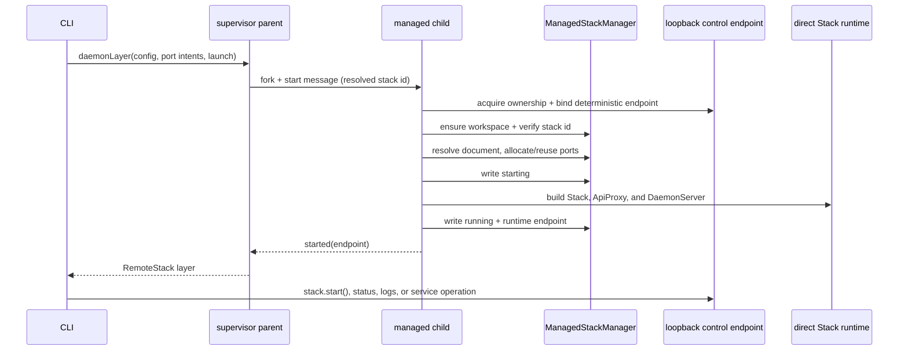

# How `@supabase/stack` works

`@supabase/stack` is the local Supabase runtime for Node and Bun. It has two
runtime modes that share the same service graph, port allocator, and HTTP
proxy:

- **Direct** (`createStack`) keeps the stack in the caller's process and lets
  the caller own its lifecycle.
- **Managed** (`daemonLayer` and the managed lifecycle facade) runs one
  supervisor child per deterministic stack identity. The CLI uses this mode
  when a stack must outlive one command, be reattached by another command, or
  be isolated from a sibling worktree.

Choose direct mode for an application, test, or script that can keep a handle
open and dispose it. Choose managed mode for a CLI workflow or any caller that
needs detached ownership, durable status, sticky ports, logs, or reattachment.
Managed mode is a coordination layer around the direct runtime; it does not
introduce a second service registry, repository contract, or SQLite adapter.

## Managed startup at a glance

The parent resolves the workspace identity before forking. During normal
startup, the child owns the lease, binds the control endpoint, and performs the
manager writes under that ownership. Recovery operations can acquire the same
ownership through the lifecycle facade.


```mermaid
sequenceDiagram
    participant CLI
    participant Parent as supervisor parent
    participant Child as managed child
    participant Manager as ManagedStackManager
    participant Control as loopback control endpoint
    participant Runtime as direct Stack runtime

    CLI->>Parent: daemonLayer(config, port intents, launch)
    Parent->>Child: fork + start message (resolved stack id)
    Child->>Control: acquire ownership + bind deterministic endpoint
    Child->>Manager: ensure workspace + verify stack id
    Child->>Manager: resolve document, allocate/reuse ports
    Child->>Manager: write starting
    Child->>Runtime: build Stack, ApiProxy, and DaemonServer
    Child->>Manager: write running + runtime endpoint
    Child-->>Parent: started(endpoint)
    Parent-->>CLI: RemoteStack layer
    CLI->>Control: stack.start(), status, logs, or service operation
```

`running` in the managed document means that the supervisor and control owner
are ready. The service states are published by the same `Stack` runtime and
move when the caller invokes `stack.start()` or an individual service
operation.

## Public entrypoints

The package exposes the same platform-neutral contracts through conditional
Node and Bun bindings:

- `@supabase/stack` is the Promise-based direct API (`createStack`, `prefetch`,
  and the stack types).
- `@supabase/stack/effect` provides the platform-bound Effect layers. It
  includes `foregroundLayer` for direct use, `daemonLayer` to launch a managed
  supervisor, `connectLayer` to reattach, and lifecycle/discovery helpers such
  as `stopDaemon` and `updateManagedLaunch`.
- `@supabase/stack/managed` exposes managed identity, control, document,
  manager, and lifecycle operations for consumers that need those boundaries
  directly.
- `@supabase/stack/testing` exposes only runtime seams used to build integration
  tests; it is not a production repository or fixture contract.

`@supabase/stack/daemon-bun` is an internal compiled-Bun re-entry target. The
Node and Bun entrypoints provide filesystem, path, process, HTTP, and control
transport services to the shared implementation.

The shared runtime modules are Effect-native. Promise-based methods exist only
in the outer direct entrypoint for non-Effect consumers. Native fetch and
process callbacks are wrapped at the platform adapter seams with interruption
cleanup; resource ownership, retries, concurrency, and typed failures remain
inside Effect.

## Direct runtime

`createStack` resolves configuration, reserves a private port lease, and
prepares/builds a scoped runtime and handle. It does **not** start service
processes. Asset preparation and process-compose graph construction happen
when the handle is first started or a service is activated.

`stack.start()` prepares and starts Postgres plus the services whose resource
policy is `eager`, then waits for the selected readiness policy. Services whose
policy is `lazy` remain dormant until a proxy request or explicit service
operation activates them; activation prepares the service and its required
dependencies before starting it. The handle also exposes status, logs,
per-service operations, and graceful `stop()`/`dispose()` methods. Its scope
owns service processes and releases the lease when disposed. A direct stack
never reads or writes managed documents and never coordinates with a sibling
stack.

## Managed lifecycle

### One document and one owner

Each managed stack has one durable document under:

```text
<supabase-home>/managed/stacks/<stack-id>/stack.json
```

The same directory contains `data/` for managed service data, `logs/` for
runtime logs, and `runtime/` for supervisor-owned runtime files. The
`ManagedStackManager` is the only component that writes `stack.json`.

Control ownership is the liveness and mutation authority. `acquireControl`
returns `Owned` for the process that bound one of the deterministic endpoint
candidates or `Attached` for a live owner found on any candidate. An attached
caller uses the owner's actual endpoint for runtime requests; it never edits
the document directly.

### Start and attach

1. `daemonLayer` discovers the workspace and derives the stack id before the
   parent forks a supervisor child. Managed-only port intents and launch
   metadata stay separate from the generic daemon configuration.
2. The child binds the loopback control endpoint first, re-checks workspace
   discovery, and refuses to continue if the identity no longer derives the
   same id.
3. The supervisor removes stale resources with the selected container runtime
   when required. The manager then allocates or reuses ports and records
   `starting`.
4. The child builds the direct runtime and `DaemonServer`, records `running`
   with its control endpoint, and sends the endpoint to the parent.
5. The parent returns a `RemoteStack` layer. The CLI then calls
   `stack.start()` over the control transport when service startup is needed.

`connectManagedStack` reads the document, probes the deterministic endpoint
candidates without binding them, and returns a `RemoteStack` against the
owner's actual endpoint only when the owner reports a ready running state.
Read-only status and discovery therefore do not claim an endpoint; mutating
operations acquire control ownership.

### Update, stop, and delete

- `updateManagedLaunch` is owner-gated. An attached client posts the validated
  launch payload to `/managed/launch`; the owner invokes
  `ManagedStackManager.updateLaunch`, and the caller re-reads the document.
- `stopManagedStack` asks an attached owner to perform a graceful
  `RemoteStack.stop()`, waits for the document to become `stopped`, and lets
  the owner close the runtime before releasing control. If the old owner is
  gone, the facade acquires control, removes containers through the persisted
  container runtime, records `stopped`, and does not inspect PIDs or scan
  processes.
- `deleteManagedStack` requires owned control, removes resources through the
  persisted container runtime, and deletes the document and its managed data
  root. A live owner cannot be deleted because the caller cannot acquire
  ownership; stale `starting`, `running`, or `failed` documents are reconciled
  after ownership recovery. The explicit destructive path can also remove an
  invalid document after ownership is acquired; ordinary status and start
  operations report corruption instead of guessing.

### Failure and recovery

The owner records `starting`, `running`, `stopped`, `failed`, and `deleting`
transitions. A startup error records `failed` and releases the port lease. A
graceful stop closes the direct runtime before recording `stopped`.

If a supervisor crashes, its document and possible runtime artifacts remain.
The next managed start acquires control, reconciles container resources through
the persisted runtime by stack id, and reuses sticky ports according to their
persisted `exact` or `automatic` intent. No PID file, process scan, second
metadata file, or registry surgery is needed for recovery.

## Identity and state

The stack id is a deterministic hash of workspace lineage, checkout lineage,
branch or detached context, the canonical local project key, and the managed
stack name. `workspaceId` identifies a local repository or ordinary-folder
lineage; it is not a remote Supabase project id.

For a Git checkout, `localProjectKey` is the canonical project-root path
relative to the enclosing checkout root, normalized with `/` and `.` for the
root. Sibling nested projects therefore get different identities and ports
even when they use the default name. Renaming a local project directory
intentionally creates a new identity; migration is not attempted.

Git metadata supplies checkout and branch context. An ordinary folder receives
an explicit private marker under `.supabase/`. Git checkout markers and
ordinary-folder markers are private, unreleased storage owned by the current
build; there is no migration layer or parallel document format.

Consuming applications resolve and pass the canonical local Supabase project
root to the managed environment APIs. `workspacePath` is an identity input, not
an arbitrary current working directory: the stack does not inspect
`supabase/config.toml`, remote-link metadata, or CLI-specific project layout
conventions.

Moved checkouts can be repaired with `repairWorkspace`, preserving the identity
and ports. Duplicate checkout adoption is intentionally unsupported and
requires an explicit ownership decision. Read-only project discovery treats
unsupported or unreadable Git metadata as no managed stack; mutating operations
fail loudly rather than creating state against ambiguous identity evidence.

## Ports and control ownership

Managed port assignments preserve both a port and its intent:

- `exact` means the caller requested that number and a live conflicting owner
  is an error.
- `automatic` means the assignment is sticky for the document but may be
  allocated independently for a sibling worktree or nested project.

Startup derives active and disabled fields from the enabled-service
configuration and preserves the raw project document so omitted values remain
automatic. Automatic managed service allocation excludes the entire loopback
control range (`10000..32767`). Explicit service ports may use that range, but
they still conflict with the incoming stack's deterministic endpoint, a known
persisted endpoint, or another stack's reservation under the normal exact-port
rules. A persisted automatic assignment in the control range is invalid and
fails loudly rather than being silently migrated.

`reservePortSet` is the single allocation and ownership module for direct and
managed stacks. It binds each TCP listener before publishing a per-user claim.
A lease may release a listener immediately before the owning runtime binds the
port while retaining the claim; `releaseAll` removes only the listeners and
claims owned by that lease. Stale claims are reclaimed only while the requested
TCP port is already bound by the new lease, so claim recovery cannot steal a
live port.

The control endpoint is derived from the stack id and served on loopback. The
derivation yields a short deterministic candidate sequence rather than a
single port: an owner binds the first free candidate, skipping candidates
occupied by other stacks or unrelated listeners, and readers scan the same
sequence and match the published `ownershipId`. A hash collision between two
stack ids therefore degrades to the collided stack binding its next candidate
instead of failing. Acquisition fails with a typed conflict only when every
candidate is occupied by a foreign listener; a read-only probe treats an
address with no matching owner as non-live and never claims it. An exact
service port can still equal a candidate of an identity that has never
started, so every stack's full candidate set is reserved against exact-port
requests rather than forbidding every explicit port in the reserved range.

This is deliberately a small single-user localhost mechanism. The control
protocol has no token authentication; ownership, endpoint identity, and
protocol-version checks provide the lifecycle boundary. `DaemonServer` exposes
status, service operations, logs, graceful stop, and launch-update routes;
`RemoteStack` is the typed client used by consumers.

## Service execution and `ApiProxy`

`StackPreparation` plans resources without materializing them, then prepares
only the requested services and their required dependency closure. Concurrent
requests for the same resource share one installation or pull. Native assets
come from the pinned slim-services release contract and are checksum- and
manifest-verified before atomic publication. Docker assets use one canonical
`ghcr.io/supabase/cli/<service>:<version>` reference; a locally cached image is
reused and a missing image is pulled without registry fallback. Stack creation
selects exactly one execution mode: a usable Docker daemon is preferred, then a
usable Podman service; if neither responds, the stack uses native mode. An
explicit `mode: "native"` rejects Docker-only services, while explicit `mode:
"docker"` requires a usable container runtime. Preparation never falls back to
the other mode after that choice. Once a managed supervisor claims and persists
that selection, it remains pinned even when startup later fails during image
pull, native download, graph build, or readiness. Retries restore or start the
persisted runtime and reuse the same mode; selecting another mode requires
deleting and recreating the stack, which removes its managed data.

The `StackBuilder` turns planned resolutions into one process-compose graph,
without eagerly materializing every graph resource. Container resources are
namespaced with the managed stack id and every pull, launch, health check, and
cleanup uses the selected Docker or Podman executable.

`ApiProxy` listens on the configured public `apiPort` and routes Supabase API
paths (`/auth`, `/rest`, `/functions`, `/realtime`, `/storage`, `/pg`,
`/analytics`, and related endpoints) to the service ports. The database URL
and direct service endpoints remain available from `Stack.getInfo()`. The
loopback control endpoint is management traffic and is never the user-facing
API URL.

## Platform re-entry: compiled Bun

In source mode, Node and Bun supervisors fork the adjacent `daemon-node.ts` or
`daemon-bun.ts` entrypoint. A Bun single-file executable cannot fork a source
URL from Bun's virtual filesystem, so the child re-enters the compiled CLI
instead. The parent sets `SUPABASE_STACK_RUN_DAEMON=1`; the CLI entrypoint
handles that marker before normal command dispatch and invokes the same
`runBunDaemon()` supervisor entrypoint. This is the only stack-specific
self-dispatch path; the daemon branch does not run normal CLI command dispatch.

## Module map

| Concern                                           | Owner                                                             |
| ------------------------------------------------- | ----------------------------------------------------------------- |
| Public Promise and Effect entrypoints             | `src/{node,bun,effect-node,effect-bun}.ts`                        |
| Identity discovery and stack id                   | `managed/environment.ts`, `managed/identity.ts`, `managed/git.ts` |
| Document paths, schema, and atomic persistence    | `managed/paths.ts`, `managed/document.ts`, `managed/store.ts`     |
| Managed reads, writes, ports, and lifecycle state | `managed/manager.ts`, `managed/lifecycle.ts`, `discovery.ts`      |
| Ownership and deterministic endpoint              | `managed/control.ts`                                              |
| Detached child protocol and startup               | `supervisor.ts`, `daemon-node.ts`, `daemon-bun.ts`                |
| Runtime control routes and client                 | `DaemonServer.ts`, `RemoteStack.ts`, `HttpTransportClient.ts`     |
| Direct runtime construction and service lifecycle | `createStack.ts`, `layers.ts`, `LocalStack.ts`, `Stack.ts`        |
| Asset resolution and native/Docker graph          | `StackPreparation.ts`, `StackBuilder.ts`, `ServiceCatalog.ts`     |
| Public API routing                                | `ApiProxy.ts`                                                     |
| Platform listeners and process services           | `platform-node.ts`, `platform-bun.ts`                             |

## Testing boundary

Integration tests exercise the surfaces a consumer uses: manager identity and
documents, sibling worktrees and nested projects, detached start/reattach,
launch updates, status and logs, graceful stop, stale-owner recovery, and
deletion. A small number of end-to-end tests cover real subprocess and runtime
boundaries.

Unit tests are reserved for pure identity, port, document, projection, and
platform algorithms or for branches unreachable through the public runtime
surface. The testing entrypoint exposes only the `DaemonServer` and transport
seams needed to build those journeys; it does not recreate a repository,
SQLite adapter, or contract-fixture implementation.
