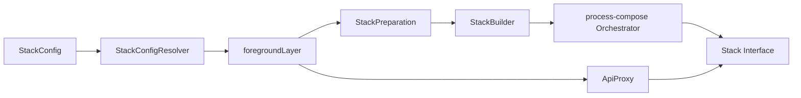

# Architecture of `@supabase/stack`

`@supabase/stack` turns Supabase-local configuration into a supervised graph of native processes
and Docker containers. It owns Supabase-specific configuration, artifact selection, topology,
proxying, state projection, managed-daemon persistence, and cleanup. Generic process lifecycle is
delegated to [`@supabase/process-compose`](../../process-compose/docs/architecture.md).

## Public entrypoints

The package exposes four levels of Interface:

- `@supabase/stack` selects `bun.ts` or `node.ts` through export conditions and exposes the
  Promise-oriented `createStack()` / `StackHandle` Interface plus prefetch helpers.
- `@supabase/stack/effect` selects a runtime Adapter through the same export conditions and exposes
  Effect Interfaces plus platform-bound layer factories used by the CLI and advanced callers.
- `@supabase/stack/managed` selects the Node or Bun SQLite Adapter and exposes managed identity,
  discovery, persistence, and lifecycle coordination. Its repository can be replaced by a caller.
- `@supabase/stack/testing` exposes test-only tags plus contract fixtures, validators, the
  in-memory repository seam, and transport helpers. Runtime implementation tags do not leak
  through the root or Effect barrels.

Internal runtime Adapters provide Effect filesystem, path, child-process, HTTP-server, and Unix
socket HTTP implementations. `createStack.ts` and the layer factories remain platform-agnostic;
the conditional root and Effect entries bind them to their selected runtime.

The direct and managed surfaces compose in one direction only: managed policy resolves one opaque
stack identity and concrete roots, ports, and runtime selection, then a caller may pass those
resolved values to the core runtime. The core runtime never discovers workspaces or opens the
global registry.

`createStack()` and the ordinary daemon are deliberately external, unmanaged participants. They
use an ephemeral allocator and never read, reserve, or update managed reservations. A managed
coordinator supplies the runtime with one complete allocation and its held lease; the runtime does
not reselect ports or infer ownership from filesystem metadata.


```mermaid
flowchart LR
    Input["StackConfig"] --> Resolve["StackConfigResolver"]
    Resolve --> Layer["foregroundLayer"]
    Layer --> Prepare["StackPreparation"]
    Prepare --> Builder["StackBuilder"]
    Builder --> Orch["process-compose Orchestrator"]
    Layer --> Proxy["ApiProxy"]
    Orch --> Stack["Stack Interface"]
    Proxy --> Stack
```

`StackHandle` converts Effect calls and streams to Promises and `AsyncIterable`s and implements
`AsyncDisposable`. The Effect `Stack` Interface is also implemented by `RemoteStack`, so CLI code
can use the same lifecycle calls against an in-process stack or a detached daemon.

## Configuration and roots

`StackConfig` is an in-memory library input, not the project configuration-file schema. Its
top-level fields choose runtime mode, startup mode, cache/runtime roots, API keys, JWT secret, a
resolved Edge Functions bundle, and per-service configuration. `false` disables an optional
service.

`StackConfigResolver.resolveConfig()`:

1. chooses cache, durable stack, runtime, and project roots;
2. allocates every required port through one port allocator;
3. creates development JWTs and opaque publishable/secret keys;
4. applies per-service defaults and current `DEFAULT_VERSIONS`;
5. records auto-managed paths for scoped cleanup.

Readiness policy is part of the resolved configuration. The package default is a finite three-minute
deadline; callers can choose a different finite deadline or explicit infinite waiting. Per-call
`ReadyOptions` take precedence over the stack policy, while `inherit` delegates to the stack
policy. The local Implementation applies this resolver to startup, service activation, restart,
reload, and explicit readiness waits. A finite deadline fails with `StackReadinessError` and runs
the same scoped cleanup used by disposal. Promise and remote Adapters pass `ReadyOptions` through
to that Implementation instead of layering a second timeout rule around it.

Request-triggered lazy activation expands the package-default deadline when a service's transitive
startup budget is longer than three minutes. Explicit finite and infinite stack policies are never
expanded.

The current zero-config stack enables PostgreSQL, PostgREST, Auth, and Edge Runtime. Realtime,
Storage, imgproxy, Mailpit, Postgres Meta, Studio, Analytics, Vector, and Supavisor are enabled only
when their corresponding configuration object is present. In `native` mode, Edge Runtime is also
disabled by omission because the automatic artifact policy currently classifies it as Docker-only.

`mode` has these meanings:

- `native`: require native artifacts and reject enabled Docker-only services;
- `auto`: prefer supported native artifacts, then fall back to Docker;
- `docker`: resolve every enabled service to a Docker image.

`startupMode` defaults to `eager`; `lazy` defers eligible proxied services until first use.

## Preparation and artifact resolution

Preparation is separate from topology construction:

- `ServiceCatalog.ts` is the exhaustive source for service identity, default version, runtime
  support, artifact providers, activation policy, and allocated port fields.
- `BinaryResolver` detects the platform, downloads and verifies archives, restores executable
  permissions, and publishes complete cache entries atomically.
- `StackPreparation` resolves all enabled public services, emits download/pull progress, and
  returns `PreparedStackArtifacts`.
- `StackBuilder` consumes only resolved artifacts; it does not perform network fetches.

Native cache identity includes service, provider, version, and asset name. `.complete` is written
last, so an incomplete download is never treated as reusable. Supabase-owned Docker images are
tried through ECR, Docker Hub, then GHCR; upstream images use their canonical repository.

`ServiceResolution` belongs to this preparation domain. `prefetch()` uses the same
`StackPreparation` Interface and its binary-to-Docker fallback without constructing a lifecycle
runtime.

## Service coverage and topology

`StackBuilder.build(config, prepared)` is the explicit owner of cross-service topology. Individual
factories under `src/services/` own executable arguments, environment, mounts, health checks, and
per-process cleanup. Docker factories also own their host-network and port-mapping arguments. The
builder owns which definitions exist and how they depend on one another, including the choice
between `postgres-init (completed)` and `postgres (healthy)` for every database consumer.

| Public service | Automatic runtime support               | Principal dependency or role                                                                                       |
| -------------- | --------------------------------------- | ------------------------------------------------------------------------------------------------------------------ |
| `postgres`     | Native preferred, Docker fallback       | Root database process. Native PostgreSQL also introduces the internal `postgres-init` one-shot definition.         |
| `postgrest`    | Native preferred, Docker fallback       | Database initialization completed, or PostgreSQL healthy in all-Docker mode.                                       |
| `auth`         | Native preferred, Docker fallback       | Database initialization completed/healthy; optionally sends mail through Mailpit.                                  |
| `edge-runtime` | Docker-only under automatic preparation | Database initialization completed/healthy; reads a generated functions runtime file.                               |
| `realtime`     | Docker                                  | Database initialization completed/healthy; started eagerly and routed by the API proxy for ordinary HTTP requests. |
| `storage`      | Docker                                  | Database initialization completed/healthy; optionally calls imgproxy.                                              |
| `imgproxy`     | Docker                                  | Storage healthy; owned and activated with Storage.                                                                 |
| `mailpit`      | Docker                                  | Direct web, SMTP, and POP3 listeners.                                                                              |
| `pgmeta`       | Docker                                  | Database initialization completed/healthy.                                                                         |
| `analytics`    | Docker                                  | Database initialization completed/healthy.                                                                         |
| `vector`       | Docker                                  | Analytics healthy; owned and activated with Analytics.                                                             |
| `pooler`       | Docker                                  | Database initialization completed/healthy; direct database and admin listeners.                                    |
| `studio`       | Docker                                  | Postgres Meta healthy and, when enabled, Analytics healthy.                                                        |

`postgres-init` is an internal helper only for native PostgreSQL. It applies initial schema and
privilege setup and completes before database consumers start. `StackStateProjection` hides it and
projects active initialization as `postgres: Initializing`; helper failure is projected onto
PostgreSQL.

Configuration validation prevents unsupported combinations, including imgproxy without Storage,
Vector without Analytics, and Studio without Postgres Meta.

## Lifecycle ownership

The local Implementation is `LocalStack`. Its scoped layer owns one lifecycle:

- preparation and its single-flight deferred;
- graph construction and the process-compose runtime;
- a shared `LogBuffer`;
- public state projection;
- activation and lifecycle locks;
- exact cleanup targets and metadata persistence;
- disposal of processes, Docker resources, ports, and auto-managed paths.

`Stack.ts` contains only the public Effect Interface and transport schemas. `LocalStack` constructs
the state once and publishes both `Stack` and the narrower `StackServiceActivator` Interface from
the same scoped layer. `ApiProxy` therefore activates a lazy backend without gaining unrelated
lifecycle operations or requiring a second pass-through lifecycle tag.

Before the orchestrator exists, `LocalStack` publishes synthetic `Pending` and `Downloading`
states. After construction, it subscribes to raw process-compose state and publishes only public
projected states. `StackServiceState` adds `Downloading`, `Initializing`, and `Dormant` to the raw
process statuses.

`start()` prepares artifacts, creates the runtime once, starts the appropriate services, and waits
for their generic process-compose readiness. `stop()` preserves explicit per-service stop intent;
`dispose()` additionally closes the scoped runtime and executes cleanup. Stack readiness policy is
enforced around generic process-compose waits, which remain intentionally policy-free and
unbounded. Structural `Equal.equals` comparison suppresses duplicate projected state emissions.

## Eager and lazy activation

`ServiceActivation.ts` evaluates the startup and companion-ownership metadata in
`ServiceCatalog.ts`:

- eager: PostgreSQL, Realtime, Mailpit, Studio, and Pooler;
- lazy: PostgREST, Auth, Edge Runtime, Storage, imgproxy, Postgres Meta, Analytics, and Vector;
- Storage activates and owns imgproxy;
- Analytics activates and owns Vector;
- Studio activates Analytics but does not own it.

In eager startup mode, every enabled service is started. In lazy mode, the internal
`postgres-init` service, enabled eager services, and any activation companions they require start
initially. Proxy handlers activate their backend before forwarding, with single-flight lifecycle
coordination and a 30-second proxy activation timeout. Unrequested lazy services project as
`Dormant`; `waitAllReady()` considers only services desired to run.

Realtime stays eager because the HTTP proxy owns ordinary request forwarding, while WebSocket
transport is not duplicated in a separate lazy-activation Adapter. Direct listeners must also
exist before their endpoints are advertised.

## API proxy and connection information

`ApiProxy` owns the public API port and routes Supabase paths to loopback service ports. It covers
Auth, PostgREST, Edge Functions, Realtime, Storage, Postgres Meta, Analytics, Pooler administration,
and Studio's MCP route. It adds forwarding/CORS headers and translates opaque `publishableKey` and
`secretKey` values into the internal anon and service-role JWTs when appropriate.

`StackInfo` contains user-facing connection data:

- API URL and database URL;
- opaque publishable and secret keys;
- internal anon and service-role JWTs;
- endpoints for enabled services.

Cleanup targets do not belong to `StackInfo`; they are internal runtime metadata.

## Functions runtime configuration and reload

Project discovery is outside the stack boundary. A caller supplies a serializable
`ResolvedFunctionsBundle` containing absolute entrypoint, optional import-map, and static-file
paths plus already-resolved shared and per-function environment values. The import-map path is
explicitly nullable. Per-function environment values override shared values; stack-owned runtime
URLs and credentials take final precedence when the worker is created.

`LocalStack` keeps the current bundle in runtime-local memory. `reloadFunctions({ functions })`
replaces it, while a reload without `functions` preserves the latest bundle. An Edge Runtime reload
uses that same current bundle unless its body supplies a replacement. The stack combines the
bundle with runtime URLs and credentials, atomically publishes `functions-runtime-config.json`
with owner-only permissions under the Edge Runtime workspace, and removes it on disposal.

Detached stacks deliberately exclude resolved bundles from daemon startup IPC, durable metadata,
live state, logs, URLs, and rendered validation errors. Both `/functions/reload` and
`/edge-runtime/reload` accept validated JSON bodies over the local Unix socket. This keeps resolved
environment values confined to an explicit request body and the ephemeral runtime file.

## Managed port ownership and leases

Managed allocation is owned by the coordinator in the process that initializes the runtime. A
detached managed daemon performs intent resolution, candidate selection, durable publication, and
socket leasing in the child; the parent never holds a lease that the child must reacquire. The
runtime receives concrete ports plus the scoped `PortLease` and releases each field as its service
binds. Failures before handoff release the complete candidate set.

Config-addressable fields distinguish an explicit value (`exact`) from an omitted value
(`automatic`). Sticky automatic assignments are durable and exclusive across every non-tombstoned
stack, including stopped and failed rows. Keyless runtime-only fields are selected by the same
coordinator but are not durable assignments; they can relocate on a later start. Disabled services
do not participate in allocation or hold listeners, while their existing durable rows remain
available if the service is re-enabled.

The stopped/failed ownership matrix is intent-sensitive:

| Existing assignment | Incoming assignment | Existing owner stopped or failed | Existing owner occupying ports |
| ------------------- | ------------------- | -------------------------------- | ------------------------------ |
| exact               | exact               | coexist                          | conflict                       |
| automatic sticky    | exact               | conflict                         | conflict                       |
| exact               | automatic sticky    | allocate elsewhere               | allocate elsewhere             |
| automatic sticky    | automatic sticky    | allocate elsewhere               | allocate elsewhere             |

Exact requests never silently relocate. An unchanged sticky automatic field reuses its persisted
number and reports an external occupant as a conflict. A running stack is read-only with respect to
port intent: changes, including intent-only changes where the number is unchanged, are reported as
drift and apply only after stop/start. Direct unmanaged stacks remain external to this matrix.

## Cleanup and crash recovery

Every Docker definition has ordinary in-process cleanup and supervisor-owned orphan cleanup.
`StackBuilder` also returns exact Docker container names for the definitions it constructed. The
local Implementation captures these targets before persistence or orchestrator setup, persists
them for managed daemons, and uses them as a force-removal safety net after graceful stop. Launch,
exact cleanup, and candidate cleanup all derive container identity through the same naming
function, which is keyed by a namespaced form of the stack's `instanceId` when the caller supplied
one and by its api port otherwise. The Docker service builder can also attach the raw identity as a
`com.supabase.stack-id` label when a caller supplies one. The current CLI managed callers do not yet
pass the managed stack UUID through this contract, and cleanup does not sweep by that label; wiring
identity-keyed names, labels, and cleanup into those callers is the forward-looking CLI-2108
contract. Once that caller wiring lands, identity-keyed names and labels will keep two stacks that
share a port — a crashed one's leftovers and the sibling that reused its ports — from colliding.
Auto-created PostgreSQL, Storage, and runtime paths are also removed.

Cleanup is intentionally defensive:

1. process-compose finalizers stop individual process trees and run definition cleanup;
2. supervisor runtimes survive abrupt owner loss long enough to kill child trees and clean
   external resources;
3. stack disposal force-removes exact known Docker containers;
4. managed `stop` can use persisted cleanup metadata after daemon death;
5. a failure before the exact build plan exists has candidate cleanup derived from enabled catalog
   services; a partial startup failure disposes the exact build-produced plan.

These paths overlap by design and must remain idempotent.

## Foreground and daemon Adapters

`foregroundLayer()` builds the local stack and API proxy in the caller process.

Detached mode adds:

- `daemonLayer()`: forks a runtime-specific daemon entrypoint and returns a `RemoteStack` layer;
- `daemon.ts`: receives configuration excluding the resolved Functions bundle over Node IPC,
  resolves ports, builds the foreground daemon layer, claims live state, and waits for HTTP stop or
  a signal;
- `DaemonServer`: exposes the `Stack` Interface over HTTP/SSE on a Unix-domain socket;
- `RemoteStack`: maps that transport back to the same Effect `Stack` Interface;
- `StateManager`: atomically persists and discovers durable metadata and live state.

The management transport includes health, status, status stream, start/stop, readiness,
per-service lifecycle, logs/history, and Edge Runtime reload routes. Readiness waits use validated
`ReadyOptions` JSON bodies and preserve `StackReadinessError` across the transport. It is local
Unix-socket transport, not the public Supabase API proxy.

See [detach mode](./detach-mode.md) for paths, process startup, and compiled executable dispatch.

## Managed identity and state

Here, **managed state** means the centralized registry API exposed from
`@supabase/stack/managed`. It is distinct from the older `ManagedStack` daemon-discovery record in
`managed-stack.ts`, which remains part of the legacy Effect daemon surface. The registry API is
Effect-native: its services are `Context.Service` tags, its failures live in the effect error
channel, and its resources are owned by scopes. A Promise facade sits at the edge for callers that
do not run an Effect runtime; see "Managed service composition" below.

Managed errors are `Data.TaggedError` classes carrying stable `code` fields, and there is no shared
base class: `ManagedStackError` is a union type over every managed failure class, with
`isManagedStackError` as the runtime guard. `_tag` is the Effect-native discriminant, so a consumer
can `catchTag` them directly against the union a given method declares; `code` is the wire-level
contract that survives identifier minification, so Node and Bun callers — and the CLI's telemetry
classifier — can branch on failures without requiring an Effect runtime at this persistence
boundary. `MANAGED_ERROR_TAG_BY_CODE` links the two so a consumer keying a table by one and
dispatching on the other cannot drift.

The managed surface owns the current unreleased SQLite registry with separate records for projects,
checkouts, checkout locations, development contexts, stacks, port reservations, and operations. A
checkout records what it physically is — a primary git checkout, a linked worktree, a bare
repository's worktree, or an ordinary folder — and has exactly one canonical location, which is its
top-level directory: a start run from any subdirectory of a checkout resolves that same checkout.
A context records what it is keyed by, which decides its scope: a `branch` context is project-scoped, because a
branch is shared by every checkout of the repository and two worktrees on one branch resolve one
context; a `detached` context is checkout-scoped, one per checkout, reused for every commit that
checkout is parked on; a `workspace` context is the ordinary-folder case, also checkout-scoped. A
live stack is unique per `(checkout, context, name)`, which is the whole isolation guarantee: sibling
worktrees, the same branch forced into two worktrees, and several named stacks in one context all
get their own stack, keyed only by opaque UUIDs.

The public repository contract contains no SQLite types, so the same service runs with the
in-memory test repository and the Node or Bun persistent Adapter. Both adapters owe identical
observable semantics, so record ordering — port assignments by key, active operations by start time
then operation token — and input validation such as refusing an operation owner PID that could never
be probed live in shared helpers rather than in either adapter.

For an ordinary non-Git folder, the first mutating managed operation atomically publishes:

```text
<workspace>/.supabase/identity.json
  version
  projectId
  checkoutId
  contextId
```

That marker protocol is the one place in the managed surface that uses raw `node:fs/promises` instead
of the `FileSystem` service the policy layer reclaims stack state through: writing a temporary file,
hardlinking it into place, re-reading the winning marker on `EEXIST`, and removing the temporary path
is a single indivisible claim, and the hardlink with that `EEXIST` contract is not part of the platform
service's surface. The claim itself is `claimFileAtomically` in `managed/atomic-claim.ts`, shared with
`StateManager`'s single-stack state claim so both settle a race the same way; a filesystem without
hardlinks (`EPERM` or `ENOTSUP`) falls back to an exclusive create, which still decides the race but
publishes without the hardlink's all-or-nothing guarantee. The marker protocol owns what a lost race
means: the identity claim adopts the winning marker, while a claimed stack state is a failure.

A git checkout keeps its identities where git keeps its own state instead, so git's lifecycle rules
apply to them: the project identity is `supabase.projectId` in the shared repository config, which
every linked worktree reads and `git clone` never copies; a branch context is
`branch.<name>.supabaseContextId` in that same config, so `git branch -m` renames it and deleting the
branch deletes it; and the checkout identity is a file in the checkout's own git directory, which is
per-worktree by construction. A detached `HEAD` names nothing git could key a context by, so that one
context per checkout is minted and owned by the registry. Discovery reads that topology out of git's
metadata without the git binary, so a repository whose refs are stored in a reftable — whose `HEAD` is
only a compat stub — is refused with `UnsupportedGitWorkspaceError` rather than resolved to a context
derived from that stub.

No mutable runtime state or credential value is stored in any of those markers. Read-only discovery
creates none of them. The registry stores only an opaque credential reference, never resolved
plaintext credentials.

`resolveStack` is the one path from a workspace path to a stack, for every workspace shape and for
both operations, so a read-only `status` and the `start` after it cannot disagree about which stack
they mean: they classify the same topology, derive the same context from the same `HEAD`, and differ
only in whether an absent identity is minted or reported. A `status` resolve is strictly read-only —
no marker, no git-config key, no registry row, no directory — and reports the identity, the context,
and the stacks that already exist, with a `state` of `unregistered` when the named stack does not
exist yet. A `start` resolve claims what is missing and registers the stack, reporting `create` or
`reuse`. `inspectStack` and `listStacks` report stacks joined to their checkout and context, so a
reader can tell every sibling instance apart — by canonical path, checkout kind, context kind, and
branch locator — without resolving any workspace. Those joined fields are reported rather than
authoritative: a canonical path disappears when its location is pruned, and a branch locator is only
whatever the branch was called when the context was last resolved.

Discovery and recovery deliberately separate observation from mutation. Branch renames and in-place
ref updates keep the same branch context, while branch copies, detached `HEAD`, linked-worktree
moves, recycled folders, and folder-to-Git changes are reported as duplicate, moved, orphaned,
ambiguous, adoptable, or transitioning states. A report can carry a typed `newCheckout`,
`rebindCheckout`, `adoptContext`, or `prune` operation; callers pass the exact
operation back to the service after reviewing its IDs and paths. Location history is explicit:
`active` is the current claim, `superseded` is historical evidence, and `blocked` preserves a
conflict. Recovery never infers a new identity from a path alone and never removes stack records or
mutable runtime data.

The managed state root is explicitly injectable. Otherwise it resolves from `SUPABASE_HOME` or
the platform application-state directory. Every physical stack path is keyed only by its opaque
stack UUID:

```text
<managedStateRoot>/
  registry.sqlite3
  stacks/<stackId>/
    data/
    logs/
    runtime/
```

The registry format is an unreleased internal contract. It is used directly with no legacy-format or
compatibility promise; callers should treat the managed state root as belonging to the current build.
The state root is required to be a non-empty path wherever it is passed explicitly, so a blank
value fails instead of silently anchoring managed state to the process' working directory. An
explicit root is a decision and a blank one is a caller bug; a blank environment value is instead
treated as unset and falls through to the next source.
Recovery can also leave an
unregistered UUID stack root when a provisioner writes after its pending row was concurrently
aborted. The provision error reports the failed ownership cleanup, but there is no automatic orphan
garbage collection; remove that root only after independently confirming its runtime is stopped.

Stack publication and operation claims are transactional; "Managed service composition" below
describes how that transaction boundary and the wait for a concurrent publisher are expressed. A new
stack remains `pending` while its
directories and caller-supplied initialization are validated, then becomes `active` atomically.
Concurrent callers resolve the published record rather than creating aliases. Recovery first
retains claims whose owner process is still alive. Once an owner is gone, runtime inspection either
publishes a running pending stack or aborts a stopped pending stack so the same identity can retry.
An abandoned claim over an already tombstoned row is a deletion that died before releasing it:
recovery finishes that deletion instead of reconciling a lifecycle, without consulting runtime
inspection at all. Tombstoning already zeroed the runtime metadata an inspector would read, so
requiring an answer there would retain every crashed deletion forever. It never revives the row and
never drops the tombstone, since idempotent deletion depends on it; it releases the claim and
reclaims the leaked stack directory, reporting a failed removal like any other reclamation failure.
Reconciliation is therefore repeatable: a second pass over the same crashed deletion is a no-op.
Ownership races are isolated per operation so one completed claim does not stop the recovery pass.
PID liveness is deliberately conservative and assumes the managed root stays within one host PID
namespace. A stored PID that is not a probeable PID counts as no owner at all, both when recovery
walks abandoned claims and when provision decides whether to wait for a publisher, since probing it
could report a dead owner as alive. Because a PID is not a permanent process identity, callers can request forced recovery
after trustworthy runtime inspection; this is also the required integration path for a state root
shared across PID namespaces. Forced recovery requires an exact stack ID and operation token and
processes only that claim. It bypasses the PID gate, and tombstoned rows are reclaimed without
runtime inspection because tombstoning already cleared the runtime metadata an inspector would
read; forcing a claim whose owner is genuinely still finishing a delete can therefore race it—the
delete still completes and reports success, but the two processes may both attempt the same
directory removal. Forced recovery and the `startedBefore` age filter are mutually exclusive.
Recovery results distinguish live owners, unknown or failed liveness/runtime inspection, concurrent
skips, reconciliation failures, reclaimed tombstones from finished deletions, and post-abort
data-reclamation failures. An aborted or reclaimed stack ID is reported only after its leaked
directory is actually removed, so the two lists never claim data is gone while it is still on disk.
A failed removal is reported as a data-reclamation failure either way, but the two cases diverge
afterward: a reclaimed (tombstoned) stack's row survives in the registry, so its removal stays
retryable through ordinary `deleteStack` idempotency, while a discarded pending stack's row is
already gone by the time removal is attempted, so a failed removal leaves an orphaned directory
that is reported once and never revisited automatically—like any other orphan root, there is no
automatic garbage collection, so it requires manual cleanup. A failed reconciliation of an active
stack marks its lifecycle
`failed` before best-effort claim release, preserving the requirement for an explicit stop path
before deletion. A failed pending-stack adoption retains its claim so a later pass can retry without
losing potentially live unpublished data. That claim blocks other mutations, including deletion,
until normal reconciliation succeeds or the caller obtains its stack ID and token from
`repository.listActiveOperations()` and performs a scoped forced recovery after trustworthy runtime
inspection.

Port assignments encode intent as well as a number. Exact rows may coexist on stopped or failed
sibling stacks, which allows branches that inherit the same committed `api.port` and `db.port`; the
same rows conflict once either sibling occupies those listeners. Automatic sticky rows remain
exclusive even while stopped or failed and may not be taken by an exact request. Removing an exact
key preserves its number while changing the row to sticky automatic. Runtime-only keyless fields
are never persisted and are free to relocate when unavailable on a later start. These rules are
enforced identically by the memory and SQLite adapters.

Explicit deletion re-reads lifecycle after claiming the operation, safely stops when needed,
tombstones, and removes only the UUID-derived selected stack root. Repeating deletion retries any
leftover tombstoned data reclamation. Once tombstoned, unsafe or failed filesystem cleanup is
reported as retained data rather than making future deletion non-idempotent. Prune accepts explicit
location IDs or a discovery-produced `prune` operation and removes checkout location metadata only.
Active and blocked history, unfinished-transition references, and the sole evidence of a conflict are
protected; the result reports removed and preserved IDs. Prune never changes stack rows, mutable data,
runtime metadata, Git config, or identity markers. The delete outcome describes the registry tombstone, not guaranteed disk
reclamation: callers must inspect `dataReclamation`, surface retained errors, and arrange a later
retry. Lifecycle transitions likewise trust the caller to stop the real runtime before declaring a
port-occupying stack stopped and releasing its lease. Runtime qualification, legacy bootstrap
selection, and credential resolution remain outside this persistence boundary and are composed by
later CLI slices.

## Managed service composition

The managed surface is two `Context.Service` tags, each with layer factories:

- `ManagedStackRepository` is the storage contract. It is provided by
  `bunSqliteManagedStackRepositoryLayer(path)` or `nodeSqliteManagedStackRepositoryLayer(path)` —
  re-exported from `managed-bun.ts` and `managed-node.ts` respectively — or, in tests, by
  `Layer.succeed(ManagedStackRepository, createInMemoryManagedStackRepository())`, since the
  in-memory factory from `@supabase/stack/testing` returns the Effect-shaped service object directly.
  The contract contains no SQLite types, so the adapter is swappable without the policy layer
  noticing. A fresh registry creates the current format directly; incomplete existing registries
  fail closed rather than being migrated.
- `ManagedStackService` is the public composition facade and orchestration seam over the
  `workspace-identity.ts` and `stack-lifecycle.ts` policy modules.
  `ManagedStackService.make(options)` returns a layer requiring
  `FileSystem.FileSystem | GitConfigStore | ManagedStackRepository` and failing with
  `InvalidManagedOwnerPidError | UnsafeManagedStackPathError`, so a blank state root or an owner PID
  that could never be probed is refused while the layer is being built rather than at whichever call
  first touches a path.

Current policy ownership is explicit: `workspace-identity.ts` owns workspace discovery, identity,
and recovery policy; `stack-lifecycle.ts` owns stack lifecycle, operation, and reclamation policy.

`managedStackLayer(options)` — exported from `managed-bun.ts` and `managed-node.ts` — is those two
composed with the platform filesystem and the state root resolved by the one resolver that owns that
policy. It is the assembly an Effect consumer provides _and_ the one the Promise facade runs behind its
handle, so the two cannot drift apart. It fails with `ManagedStackLayerFailure` for state-root and
owner-PID refusals. Callers receive typed option and managed-operation failures declared by each
method.

Each method declares only the failures it can actually raise, rather than one service-wide union:
`resolveStack` carries `ResolveManagedStackFailure`, `updateStack` carries
`UpdateManagedStackConfigurationFailure`, `deleteStack` carries `DeleteManagedStackFailure`, and
`inspectStack` and `listStacks` cannot fail at all. `prune` accepts only explicit IDs or a typed
discovery recovery operation, so it cannot infer a stale path or invoke a caller callback.
Recovery reports rather than fails: only a forced target
that is not a pair of managed UUIDs refuses a whole pass, so `reconcileAbandonedOperations` declares
just `InvalidManagedIdentityError` and returns retained claims, skips, and failures in its result.

Registry decisions are transactions that run as one synchronous block: `Effect.try` wraps a closure
that issues `BEGIN IMMEDIATE` (or `BEGIN` for read paths), runs the decision, and commits, rolling
back and rethrowing the original cause if any statement refuses. Atomicity rests on the drivers being
synchronous and the handle being single-threaded, so that boundary must never be split across
effects: the fiber scheduler preempts at its operation budget, and a fiber parked between `BEGIN` and
`COMMIT` would let another fiber `BEGIN IMMEDIATE` on the same connection — SQLite refuses the nested
transaction, and either fiber's `COMMIT` could publish the other's writes. Keeping the whole
transaction in one JavaScript turn is therefore what makes a partially applied decision
unobservable and keeps interruption from ever landing inside a transaction. Synchrony cannot rule out
the other way two transactions could meet, a decision that re-enters the repository, so the handles
currently inside a transaction are tracked and a re-entering `BEGIN` is refused before it runs:
SQLite has no nested transactions, and unwinding the inner attempt would roll back the outer
decision's writes.

The database handle's lifetime is a scope. `sqliteManagedStackRepositoryLayer` acquires the handle
with `Effect.acquireRelease`, so opening the file and registering its close are one step nothing can
land between, including on the path where schema initialization refuses the registry: no failure path
leaks an open handle. Closing the scope that built the layer closes the registry.

Waiting for a concurrent publisher is `Schedule`-driven. One look at the pending row is a retryable
step — a still-pending row asks for another look, while a vanished or tombstoned row is a final
answer — repeated on `Schedule.exponential` from `publicationPollMs` with a 250 ms ceiling, so a slow
publisher is not polled hundreds of times per second for the whole window. The ceiling only ever
slows polling down, so a caller asking for a slower interval keeps its own. `publicationTimeoutMs` is
the caller's bound on the entire wait and is applied as a timeout around the repeat, so it interrupts
the poll instead of being checked between polls. Both shipped adapters answer synchronously, so a look
at the pending row always completes; with an embedder-supplied asynchronous repository that timeout can
preempt a look that is still in flight. That is safe — a look has no side effects — but it means the
option bounds the wait, not the number of looks that finish. The answer the repeat stops on is checked
rather than asserted through a type refinement: a recurrence bound added to that schedule later would
hand back the final still-pending answer, and the check turns that into a defect instead of an
unpublished stack presented as a published one.

Interruption is part of the contract, not an afterthought. Provisioning owns a pending row, an
operation claim, and the directories it created, so its create path runs under
`Effect.uninterruptibleMask`: only the provisioning steps themselves are interruptible, and the
compensation that aborts the pending row and removes the leaked directory always runs. Deletion
releases its claim the same way. An interrupted call stays interrupted rather than being reported as a
failure of the work — a caller's own timeout is not a `ManagedStackInitializationError` — and recovery
re-raises interruption instead of recording a retained claim or a reconciliation failure that never
happened, so the operation the next pass should still recover does not look like one recovery already
gave up on. That rule covers the steps whose exits recovery absorbs one at a time — the liveness probe,
the runtime inspection, the state reclamation — not just the pass as a whole.

The single deliberate exception is the claim release on a failed operation's way out: it discards
whatever it raises, its own interruption included, because the caller's outcome is the failure the
operation actually suffered and a release reporting interruption would replace it. The mask itself
begins after the pending row and its claim exist, which is sound only because both shipped adapters
decide synchronously and offer no suspension point during that write. An asynchronous embedder
repository interrupted mid-prepare would leave a pending row and a claim nothing compensates, so the
mask has to be extended over row creation before asynchronous repositories become real.

An Effect consumer provides the composed layer, which is the primary API:

```typescript
import { Effect } from "effect";
import { managedStackLayer, ManagedStackService } from "@supabase/stack/managed";

// The policy service, the registry adapter it decides over, and the platform
// filesystem it reclaims stack state through. It fails with
// `ManagedStackLayerFailure`, so a registry written by a newer CLI is a typed
// failure an embedder can recover from rather than a defect.
const managedLayer = managedStackLayer({ stateRoot });

const program = Effect.gen(function* () {
  const managed = yield* ManagedStackService;
  return yield* managed.resolveStack({ workspacePath, operation: "start" });
}).pipe(
  Effect.catchTag("ManagedStackPublicationTimeoutError", (error) =>
    Effect.fail(`another process never published ${error.stackId}`),
  ),
);
```

`createManagedStackService()` — and `makeManagedStackService()` over a repository the caller already
has — is a thin `ManagedRuntime` edge over exactly that layer, for consumers that do not run an
Effect runtime. It exists to serve the Promise-oriented `createStack()` boundary; the runtime
lifecycle beneath it is Effect-based either way. Three properties of that edge are contracts rather
than incidental:

- **Acquisition is asynchronous.** Both factories return a `Promise<ManagedStackServiceHandle>` and
  build the runtime's context through `runtime.context()`, because opening the registry is I/O: a
  file is created and hardened, and a cold start may have to wait out another
  process' WAL conversion. Everything that can refuse the acquisition arrives as a rejection — a
  blank state root, an owner PID that could never be probed, an incompatible registry, or invalid
  options reject with typed error instances, so a caller has one failure channel instead of a throw
  plus a rejection.
- **Reads are Promises too.** `inspectStack` and `listStacks` return Promises rather than answering
  inline. A handle that read synchronously would only be hiding the registry's I/O from its caller,
  and it is what forced the cold-start retry below to block. The `repository` accessor stays a plain
  property: the context is already resolved by the time a caller holds the handle.
- **The cold-start WAL retry is a schedule, not a blocking wait.** Converting a fresh registry to
  WAL can lose a race with another process doing the same thing, so `enableWriteAheadLogging`
  retries exactly the `SQLITE_BUSY`/`SQLITE_LOCKED` classification on `Schedule.exponential` from
  10 ms, capped at 100 ms per wait and bounded to a total ~4 s budget. Contention that never clears
  surfaces the driver's own busy error, as an immediate non-busy failure of that pragma always has.
  Because the retry suspends the fiber instead of spinning on `Atomics.wait`, a process opening the
  registry no longer stalls the event loop that every other caller in it depends on.

`close()` disposes the `ManagedRuntime`, which interrupts whatever is still in flight and closes the
scope that owns the database handle. Outstanding calls therefore reject, and because that scope closes
alongside those interruptions rather than after them, a statement already on its way to the driver can
race the close and fail against a closed handle: a caller that closes while work is outstanding must
read those rejections as "did not complete", not as evidence about the registry. A call made after
`close()` rejects with an `Error` saying the handle is closed, rather than with the runtime's own bare
internal string. That diagnosis comes from the handle's own closed state, never from what a rejection
says, so a caller's callback that refuses with a string mentioning disposal still reaches the caller
as itself. The handle is also an `AsyncDisposable`, so
`await using service = await createManagedStackService()` closes it on every path out of the block. The
facade hands back the very repository the service uses, so an embedder can read the registry without
opening a second handle on it.

## Legacy daemon paths

The pre-managed daemon implementation still reads its project-keyed state as a legacy/bootstrap
input for later CLI integration:

```text
<cacheRoot>/projects/<sha256(projectDir)[0:16]>/stacks/<name>/
  stack.json
  state.json
  data/
```

The live runtime directory is short and outside the project tree:

```text
/tmp/supabase/s-<sha256(stackRoot)[0:12]>/
  daemon-<generation>.sock
```

Windows substitutes its system temporary directory for `/tmp`. Socket names are generation-scoped
so a delayed daemon shutdown cannot unlink a replacement daemon's socket.

Callers may explicitly supply `projectStateRoot`, in which case durable stacks live under
`<projectStateRoot>/stacks/`; managed daemon callers may not directly override individual
`stackRoot` or `runtimeRoot` values.

These path hashes and stack-name directories are not identities in the new managed model and must
not be used for new managed records.

## Runtime entrypoints and exports

- `bun.ts` and `node.ts` are root export-condition targets.
- `effect-bun.ts` and `effect-node.ts` are Effect export-condition targets. They bind foreground,
  daemon, and Unix-socket layers without exposing raw platform factories or bootstrap paths.
- `managed-bun.ts` and `managed-node.ts` bind the same storage-independent managed service to the
  runtime's built-in SQLite implementation. Both delegate to one shared factory
  (`managed/create-service.ts`) parameterized by how a registry file is opened, so their option
  surfaces cannot drift apart. The in-memory repository is not part of this entrypoint; it is a test
  seam published through `@supabase/stack/testing`.
- `managed/model.ts` is exported as `@supabase/stack/managed-model` because it has no runtime
  imports: consumers can read `MANAGED_ERROR_CODES` under either runtime without pulling in a SQLite
  driver. The CLI's telemetry classifier types its managed dispatch table against that union, so a
  new managed error code cannot be added without classifying it.
- `daemon-bun.ts` is exported as `@supabase/stack/daemon-bun` so the compiled CLI can dispatch to
  it in-process.
- `daemon-node.ts` is intentionally not a package export. The internal Node platform Adapter
  resolves it by file URL and passes that filesystem path to `daemonLayer`; the package
  `knip.entry` list preserves this live file-URL-only entrypoint.
- `effect.ts` is the platform-agnostic consumer contract re-exported by the conditional Effect
  entries. There is no general-purpose `internals.ts` entrypoint.

## Testing

- Unit tests cover configuration resolution, ports, versions, artifact definitions, service
  factories, topology, projection, cleanup metadata, and protocol schemas.
- Integration tests exercise binary publication, lifecycle coordination, daemon HTTP/SSE, remote
  stack behavior, state persistence, and Unix socket streaming with stateful Effect Adapters.
- The managed registry is covered from both of its surfaces. `managed-service.integration.test.ts`
  carries the behavioral load through the Promise facade against the in-memory and both SQLite
  adapters, while `managed-effect.integration.test.ts` uses `@effect/vitest` to hold the Effect
  surface itself to account: the tags composed as layers, typed failures recovered with `catchTag`,
  and the scoped registry handle released when its scope closes.
- Targeted e2e tests own the expensive process/container Seam for full stack startup, parallel
  stacks, daemon lifecycle, and cleanup behavior.

The authoritative current service versions are the `defaultVersion` fields in
`src/ServiceCatalog.ts`; `DEFAULT_VERSIONS` is derived from that catalog, and package
documentation should link to that source rather than copy its values.
