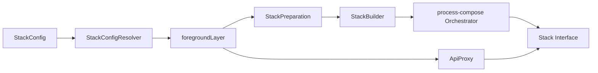

# Architecture of `@supabase/stack`

`@supabase/stack` turns Supabase-local configuration into a supervised graph of native processes
and Docker containers. It owns Supabase-specific configuration, artifact selection, topology,
proxying, state projection, managed-daemon persistence, and cleanup. Generic process lifecycle is
delegated to [`@supabase/process-compose`](../../process-compose/docs/architecture.md).

## Public entrypoints

The package exposes three levels of Interface:

- `@supabase/stack` selects `bun.ts` or `node.ts` through export conditions and exposes the
  Promise-oriented `createStack()` / `StackHandle` Interface plus prefetch helpers.
- `@supabase/stack/effect` selects a runtime Adapter through the same export conditions and exposes
  Effect Interfaces plus platform-bound layer factories used by the CLI and advanced callers.
- `@supabase/stack/managed` selects the Node or Bun SQLite Adapter and exposes managed identity,
  discovery, persistence, and lifecycle coordination. Its repository can be replaced by a caller.
- `@supabase/stack/testing` exposes only the service tags needed to replace daemon transport in
  consumer tests. Runtime implementation tags do not leak through the root or Effect barrels.

Internal runtime Adapters provide Effect filesystem, path, child-process, HTTP-server, and Unix
socket HTTP implementations. `createStack.ts` and the layer factories remain platform-agnostic;
the conditional root and Effect entries bind them to their selected runtime.

The direct and managed surfaces compose in one direction only: managed policy resolves one opaque
stack identity and concrete roots, ports, and runtime selection, then a caller may pass those
resolved values to the core runtime. The core runtime never discovers workspaces or opens the
global registry.


```mermaid
flowchart LR
    Input["StackConfig"] --> Resolve["StackConfigResolver"]
    Resolve --> Layer["foregroundLayer"]
    Layer --> Prepare["StackPreparation"]
    Prepare --> Builder["StackBuilder"]
    Builder --> Orch["process-compose Orchestrator"]
    Layer --> Proxy["ApiProxy"]
    Orch --> Stack["Stack Interface"]
    Proxy --> Stack
```

`StackHandle` converts Effect calls and streams to Promises and `AsyncIterable`s and implements
`AsyncDisposable`. The Effect `Stack` Interface is also implemented by `RemoteStack`, so CLI code
can use the same lifecycle calls against an in-process stack or a detached daemon.

## Configuration and roots

`StackConfig` is an in-memory library input, not the project configuration-file schema. Its
top-level fields choose runtime mode, startup mode, cache/runtime roots, API keys, JWT secret, a
resolved Edge Functions bundle, and per-service configuration. `false` disables an optional
service.

`StackConfigResolver.resolveConfig()`:

1. chooses cache, durable stack, runtime, and project roots;
2. allocates every required port through one port allocator;
3. creates development JWTs and opaque publishable/secret keys;
4. applies per-service defaults and current `DEFAULT_VERSIONS`;
5. records auto-managed paths for scoped cleanup.

Readiness policy is part of the resolved configuration. The package default is a finite three-minute
deadline; callers can choose a different finite deadline or explicit infinite waiting. Per-call
`ReadyOptions` take precedence over the stack policy, while `inherit` delegates to the stack
policy. The local Implementation applies this resolver to startup, service activation, restart,
reload, and explicit readiness waits. A finite deadline fails with `StackReadinessError` and runs
the same scoped cleanup used by disposal. Promise and remote Adapters pass `ReadyOptions` through
to that Implementation instead of layering a second timeout rule around it.

Request-triggered lazy activation expands the package-default deadline when a service's transitive
startup budget is longer than three minutes. Explicit finite and infinite stack policies are never
expanded.

The current zero-config stack enables PostgreSQL, PostgREST, Auth, and Edge Runtime. Realtime,
Storage, imgproxy, Mailpit, Postgres Meta, Studio, Analytics, Vector, and Supavisor are enabled only
when their corresponding configuration object is present. In `native` mode, Edge Runtime is also
disabled by omission because the automatic artifact policy currently classifies it as Docker-only.

`mode` has these meanings:

- `native`: require native artifacts and reject enabled Docker-only services;
- `auto`: prefer supported native artifacts, then fall back to Docker;
- `docker`: resolve every enabled service to a Docker image.

`startupMode` defaults to `eager`; `lazy` defers eligible proxied services until first use.

## Preparation and artifact resolution

Preparation is separate from topology construction:

- `ServiceCatalog.ts` is the exhaustive source for service identity, default version, runtime
  support, artifact providers, activation policy, and allocated port fields.
- `BinaryResolver` detects the platform, downloads and verifies archives, restores executable
  permissions, and publishes complete cache entries atomically.
- `StackPreparation` resolves all enabled public services, emits download/pull progress, and
  returns `PreparedStackArtifacts`.
- `StackBuilder` consumes only resolved artifacts; it does not perform network fetches.

Native cache identity includes service, provider, version, and asset name. `.complete` is written
last, so an incomplete download is never treated as reusable. Supabase-owned Docker images are
tried through ECR, Docker Hub, then GHCR; upstream images use their canonical repository.

`ServiceResolution` belongs to this preparation domain. `prefetch()` uses the same
`StackPreparation` Interface and its binary-to-Docker fallback without constructing a lifecycle
runtime.

## Service coverage and topology

`StackBuilder.build(config, prepared)` is the explicit owner of cross-service topology. Individual
factories under `src/services/` own executable arguments, environment, mounts, health checks, and
per-process cleanup. Docker factories also own their host-network and port-mapping arguments. The
builder owns which definitions exist and how they depend on one another, including the choice
between `postgres-init (completed)` and `postgres (healthy)` for every database consumer.

| Public service | Automatic runtime support               | Principal dependency or role                                                                                       |
| -------------- | --------------------------------------- | ------------------------------------------------------------------------------------------------------------------ |
| `postgres`     | Native preferred, Docker fallback       | Root database process. Native PostgreSQL also introduces the internal `postgres-init` one-shot definition.         |
| `postgrest`    | Native preferred, Docker fallback       | Database initialization completed, or PostgreSQL healthy in all-Docker mode.                                       |
| `auth`         | Native preferred, Docker fallback       | Database initialization completed/healthy; optionally sends mail through Mailpit.                                  |
| `edge-runtime` | Docker-only under automatic preparation | Database initialization completed/healthy; reads a generated functions runtime file.                               |
| `realtime`     | Docker                                  | Database initialization completed/healthy; started eagerly and routed by the API proxy for ordinary HTTP requests. |
| `storage`      | Docker                                  | Database initialization completed/healthy; optionally calls imgproxy.                                              |
| `imgproxy`     | Docker                                  | Storage healthy; owned and activated with Storage.                                                                 |
| `mailpit`      | Docker                                  | Direct web, SMTP, and POP3 listeners.                                                                              |
| `pgmeta`       | Docker                                  | Database initialization completed/healthy.                                                                         |
| `analytics`    | Docker                                  | Database initialization completed/healthy.                                                                         |
| `vector`       | Docker                                  | Analytics healthy; owned and activated with Analytics.                                                             |
| `pooler`       | Docker                                  | Database initialization completed/healthy; direct database and admin listeners.                                    |
| `studio`       | Docker                                  | Postgres Meta healthy and, when enabled, Analytics healthy.                                                        |

`postgres-init` is an internal helper only for native PostgreSQL. It applies initial schema and
privilege setup and completes before database consumers start. `StackStateProjection` hides it and
projects active initialization as `postgres: Initializing`; helper failure is projected onto
PostgreSQL.

Configuration validation prevents unsupported combinations, including imgproxy without Storage,
Vector without Analytics, and Studio without Postgres Meta.

## Lifecycle ownership

The local Implementation is `LocalStack`. Its scoped layer owns one lifecycle:

- preparation and its single-flight deferred;
- graph construction and the process-compose runtime;
- a shared `LogBuffer`;
- public state projection;
- activation and lifecycle locks;
- exact cleanup targets and metadata persistence;
- disposal of processes, Docker resources, ports, and auto-managed paths.

`Stack.ts` contains only the public Effect Interface and transport schemas. `LocalStack` constructs
the state once and publishes both `Stack` and the narrower `StackServiceActivator` Interface from
the same scoped layer. `ApiProxy` therefore activates a lazy backend without gaining unrelated
lifecycle operations or requiring a second pass-through lifecycle tag.

Before the orchestrator exists, `LocalStack` publishes synthetic `Pending` and `Downloading`
states. After construction, it subscribes to raw process-compose state and publishes only public
projected states. `StackServiceState` adds `Downloading`, `Initializing`, and `Dormant` to the raw
process statuses.

`start()` prepares artifacts, creates the runtime once, starts the appropriate services, and waits
for their generic process-compose readiness. `stop()` preserves explicit per-service stop intent;
`dispose()` additionally closes the scoped runtime and executes cleanup. Stack readiness policy is
enforced around generic process-compose waits, which remain intentionally policy-free and
unbounded. Structural `Equal.equals` comparison suppresses duplicate projected state emissions.

## Eager and lazy activation

`ServiceActivation.ts` evaluates the startup and companion-ownership metadata in
`ServiceCatalog.ts`:

- eager: PostgreSQL, Realtime, Mailpit, Studio, and Pooler;
- lazy: PostgREST, Auth, Edge Runtime, Storage, imgproxy, Postgres Meta, Analytics, and Vector;
- Storage activates and owns imgproxy;
- Analytics activates and owns Vector;
- Studio activates Analytics but does not own it.

In eager startup mode, every enabled service is started. In lazy mode, the internal
`postgres-init` service, enabled eager services, and any activation companions they require start
initially. Proxy handlers activate their backend before forwarding, with single-flight lifecycle
coordination and a 30-second proxy activation timeout. Unrequested lazy services project as
`Dormant`; `waitAllReady()` considers only services desired to run.

Realtime stays eager because the HTTP proxy owns ordinary request forwarding, while WebSocket
transport is not duplicated in a separate lazy-activation Adapter. Direct listeners must also
exist before their endpoints are advertised.

## API proxy and connection information

`ApiProxy` owns the public API port and routes Supabase paths to loopback service ports. It covers
Auth, PostgREST, Edge Functions, Realtime, Storage, Postgres Meta, Analytics, Pooler administration,
and Studio's MCP route. It adds forwarding/CORS headers and translates opaque `publishableKey` and
`secretKey` values into the internal anon and service-role JWTs when appropriate.

`StackInfo` contains user-facing connection data:

- API URL and database URL;
- opaque publishable and secret keys;
- internal anon and service-role JWTs;
- endpoints for enabled services.

Cleanup targets do not belong to `StackInfo`; they are internal runtime metadata.

## Functions runtime configuration and reload

Project discovery is outside the stack boundary. A caller supplies a serializable
`ResolvedFunctionsBundle` containing absolute entrypoint, optional import-map, and static-file
paths plus already-resolved shared and per-function environment values. The import-map path is
explicitly nullable. Per-function environment values override shared values; stack-owned runtime
URLs and credentials take final precedence when the worker is created.

`LocalStack` keeps the current bundle in runtime-local memory. `reloadFunctions({ functions })`
replaces it, while a reload without `functions` preserves the latest bundle. An Edge Runtime reload
uses that same current bundle unless its body supplies a replacement. The stack combines the
bundle with runtime URLs and credentials, atomically publishes `functions-runtime-config.json`
with owner-only permissions under the Edge Runtime workspace, and removes it on disposal.

Detached stacks deliberately exclude resolved bundles from daemon startup IPC, durable metadata,
live state, logs, URLs, and rendered validation errors. Both `/functions/reload` and
`/edge-runtime/reload` accept validated JSON bodies over the local Unix socket. This keeps resolved
environment values confined to an explicit request body and the ephemeral runtime file.

## Port leases

Port allocation returns a `PortLease`, not just numbers. The stack reserves ports before cold asset
preparation. The lifecycle Adapter passes:

- `beforeStart` to reserve the service's fields again for a restart generation;
- `beforeSpawn` to release those fields immediately before process creation;
- a platform-factory release Effect for the public API server.

This narrows but cannot completely remove the race between releasing a reservation and the child
binding. Supervised Docker services have a wider window because the supervisor starts before
`docker run` binds published ports.

## Cleanup and crash recovery

Every Docker definition has ordinary in-process cleanup and supervisor-owned orphan cleanup.
`StackBuilder` also returns exact Docker container names for the definitions it constructed. The
local Implementation captures these targets before persistence or orchestrator setup, persists
them for managed daemons, and uses them as a force-removal safety net after graceful stop. Launch,
exact cleanup, and candidate cleanup all derive container identity through the same naming
function. Auto-created PostgreSQL, Storage, and runtime paths are also removed.

Cleanup is intentionally defensive:

1. process-compose finalizers stop individual process trees and run definition cleanup;
2. supervisor runtimes survive abrupt owner loss long enough to kill child trees and clean
   external resources;
3. stack disposal force-removes exact known Docker containers;
4. managed `stop` can use persisted cleanup metadata after daemon death;
5. a failure before the exact build plan exists has candidate cleanup derived from enabled catalog
   services; a partial startup failure disposes the exact build-produced plan.

These paths overlap by design and must remain idempotent.

## Foreground and daemon Adapters

`foregroundLayer()` builds the local stack and API proxy in the caller process.

Detached mode adds:

- `daemonLayer()`: forks a runtime-specific daemon entrypoint and returns a `RemoteStack` layer;
- `daemon.ts`: receives configuration excluding the resolved Functions bundle over Node IPC,
  resolves ports, builds the foreground daemon layer, claims live state, and waits for HTTP stop or
  a signal;
- `DaemonServer`: exposes the `Stack` Interface over HTTP/SSE on a Unix-domain socket;
- `RemoteStack`: maps that transport back to the same Effect `Stack` Interface;
- `StateManager`: atomically persists and discovers durable metadata and live state.

The management transport includes health, status, status stream, start/stop, readiness,
per-service lifecycle, logs/history, and Edge Runtime reload routes. Readiness waits use validated
`ReadyOptions` JSON bodies and preserve `StackReadinessError` across the transport. It is local
Unix-socket transport, not the public Supabase API proxy.

See [detach mode](./detach-mode.md) for paths, process startup, and compiled executable dispatch.

## Managed identity and state

Here, **managed state** means the centralized registry API exposed from
`@supabase/stack/managed`. It is distinct from the older `ManagedStack` daemon-discovery record in
`managed-stack.ts`, which remains part of the legacy Effect daemon surface. The registry API uses
Promises because its consumers perform short filesystem and SQLite coordination around the
Promise-oriented `createStack()` boundary; the runtime lifecycle beneath it remains Effect-based.
Its errors are ordinary `Error` subclasses with stable `code` fields so Node and Bun callers can
branch on failures without requiring an Effect runtime at this persistence boundary.

The managed surface owns a versioned SQLite registry with separate records for projects,
checkouts, checkout locations, development contexts, stacks, port reservations, and operations.
The public repository contract contains no SQLite types, so the same service runs with the
in-memory test repository and the Node or Bun persistent Adapter.

For an ordinary non-Git folder, the first mutating managed operation atomically publishes:

```text
<workspace>/.supabase/identity.json
  version
  projectId
  checkoutId
  contextId
```

No mutable runtime state or credential value is stored in that marker. Read-only discovery does
not create it. The registry stores only an opaque credential reference, never resolved plaintext
credentials. Discovery returns the marker identity even when it has no stack records, but reports
`registered: false` until at least one stack exists for the marker's complete project, checkout,
and context identity.

The managed state root is explicitly injectable. Otherwise it resolves from `SUPABASE_HOME` or
the platform application-state directory. Every physical stack path is keyed only by its opaque
stack UUID:

```text
<managedStateRoot>/
  registry-v3.sqlite3
  stacks/<stackId>/
    data/
    logs/
    runtime/
```

Schema v3 intentionally has no migration path for this unreleased POC. Before first use of v3,
developers holding any earlier `registry-v*.sqlite3` must remove the old managed state root,
including its shared `stacks/` directory; registry generations must not be kept side by side.
The state root is required to be a non-empty path wherever it is passed explicitly, so a blank
value fails instead of silently anchoring managed state to the process' working directory.
Recovery can also leave an
unregistered UUID stack root when a provisioner writes after its pending row was concurrently
aborted. The provision error reports the failed ownership cleanup, but there is no automatic orphan
garbage collection; remove that root only after independently confirming its runtime is stopped.

Stack publication and operation claims are transactional. A new stack remains `pending` while its
directories and caller-supplied initialization are validated, then becomes `active` atomically.
Concurrent callers resolve the published record rather than creating aliases. Recovery first
retains claims whose owner process is still alive. Once an owner is gone, runtime inspection either
publishes a running pending stack or aborts a stopped pending stack so the same identity can retry.
An abandoned claim over an already tombstoned row is a deletion that died before releasing it:
recovery finishes that deletion instead of reconciling a lifecycle. It never revives the row and
never drops the tombstone, since idempotent deletion depends on it; it releases the claim and
reclaims the leaked stack directory, reporting a failed removal like any other reclamation failure.
Reconciliation is therefore repeatable: a second pass over the same crashed deletion is a no-op.
Ownership races are isolated per operation so one completed claim does not stop the recovery pass.
PID liveness is deliberately conservative and assumes the managed root stays within one host PID
namespace. Because a PID is not a permanent process identity, callers can request forced recovery
after trustworthy runtime inspection; this is also the required integration path for a state root
shared across PID namespaces. Forced recovery requires an exact stack ID and operation token,
processes only that claim, and bypasses only its PID gate—never runtime inspection. Forced recovery
and the `startedBefore` age filter are mutually exclusive. Recovery results distinguish live owners,
unknown or failed liveness/runtime inspection, concurrent skips, reconciliation failures,
reclaimed tombstones from finished deletions, and post-abort data-reclamation failures. A failed reconciliation of an active stack marks its lifecycle
`failed` before best-effort claim release, preserving the requirement for an explicit stop path
before deletion. A failed pending-stack adoption retains its claim so a later pass can retry without
losing potentially live unpublished data. That claim blocks other mutations, including deletion,
until normal reconciliation succeeds or the caller obtains its stack ID and token from
`repository.listActiveOperations()` and performs a scoped forced recovery after trustworthy runtime
inspection.

Port assignments are sticky metadata, while port ownership is a lifecycle lease. Stopped stacks
retain their assigned numbers without blocking other stopped stacks. Entering `starting`,
`running`, or `stopping` claims those ports host-wide; a collision fails without relocating a
sticky automatic assignment. On a stopped stack, exact configuration replaces persisted automatic
state, while an automatic request reuses the current number and changes only its intent. Failed
stacks follow the same non-occupying rules. Intent-only changes are accepted, and a lifecycle update
can release a lease and change ports atomically; port-number drift is rejected only while a stack
continues to occupy its ports.

Explicit deletion re-reads lifecycle after claiming the operation, safely stops when needed,
tombstones, and removes only the UUID-derived selected stack root. Repeating deletion retries any
leftover tombstoned data reclamation. Once tombstoned, unsafe or failed filesystem cleanup is
reported as retained data rather than making future deletion non-idempotent. Prune removes checkout
location metadata only. The delete outcome describes the registry tombstone, not guaranteed disk
reclamation: callers must inspect `dataReclamation`, surface retained errors, and arrange a later
retry. Lifecycle transitions likewise trust the caller to stop the real runtime before declaring a
port-occupying stack stopped and releasing its lease. Runtime qualification, legacy bootstrap
selection, and credential resolution remain outside this persistence boundary and are composed by
later CLI slices.

## Legacy daemon paths

The pre-managed daemon implementation still reads its project-keyed state as a legacy/bootstrap
input for later CLI integration:

```text
<cacheRoot>/projects/<sha256(projectDir)[0:16]>/stacks/<name>/
  stack.json
  state.json
  data/
```

The live runtime directory is short and outside the project tree:

```text
/tmp/supabase/s-<sha256(stackRoot)[0:12]>/
  daemon-<generation>.sock
```

Windows substitutes its system temporary directory for `/tmp`. Socket names are generation-scoped
so a delayed daemon shutdown cannot unlink a replacement daemon's socket.

Callers may explicitly supply `projectStateRoot`, in which case durable stacks live under
`<projectStateRoot>/stacks/`; managed daemon callers may not directly override individual
`stackRoot` or `runtimeRoot` values.

These path hashes and stack-name directories are not identities in the new managed model and must
not be used for new managed records.

## Runtime entrypoints and exports

- `bun.ts` and `node.ts` are root export-condition targets.
- `effect-bun.ts` and `effect-node.ts` are Effect export-condition targets. They bind foreground,
  daemon, and Unix-socket layers without exposing raw platform factories or bootstrap paths.
- `managed-bun.ts` and `managed-node.ts` bind the same storage-independent managed service to the
  runtime's built-in SQLite implementation. Both delegate to one shared factory
  (`managed/create-service.ts`) parameterized by how a registry file is opened, so their option
  surfaces cannot drift apart. The in-memory repository is not part of this entrypoint; it is a test
  seam published through `@supabase/stack/testing`.
- `managed/model.ts` is exported as `@supabase/stack/managed-model` because it has no runtime
  imports: consumers can read `MANAGED_ERROR_CODES` under either runtime without pulling in a SQLite
  driver. The CLI's telemetry classifier types its managed dispatch table against that union, so a
  new managed error code cannot be added without classifying it.
- `daemon-bun.ts` is exported as `@supabase/stack/daemon-bun` so the compiled CLI can dispatch to
  it in-process.
- `daemon-node.ts` is intentionally not a package export. The internal Node platform Adapter
  resolves it by file URL and passes that filesystem path to `daemonLayer`; the package
  `knip.entry` list preserves this live file-URL-only entrypoint.
- `effect.ts` is the platform-agnostic consumer contract re-exported by the conditional Effect
  entries. There is no general-purpose `internals.ts` entrypoint.

## Testing

- Unit tests cover configuration resolution, ports, versions, artifact definitions, service
  factories, topology, projection, cleanup metadata, and protocol schemas.
- Integration tests exercise binary publication, lifecycle coordination, daemon HTTP/SSE, remote
  stack behavior, state persistence, and Unix socket streaming with stateful Effect Adapters.
- Targeted e2e tests own the expensive process/container Seam for full stack startup, parallel
  stacks, daemon lifecycle, and cleanup behavior.

The authoritative current service versions are the `defaultVersion` fields in
`src/ServiceCatalog.ts`; `DEFAULT_VERSIONS` is derived from that catalog, and package
documentation should link to that source rather than copy its values.
