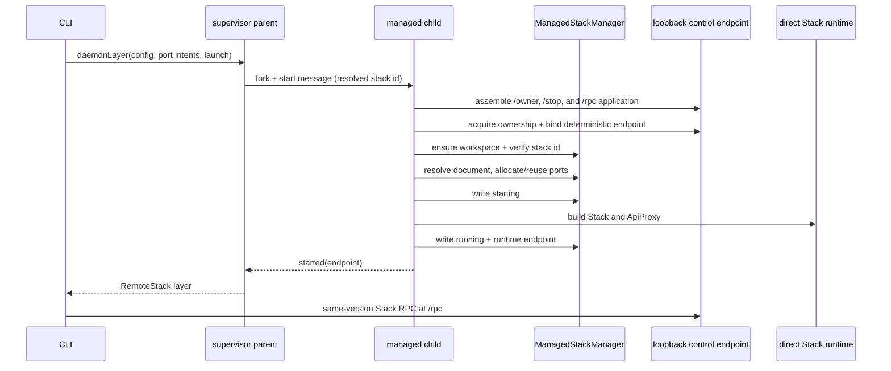

# How `@supabase/stack` works

`@supabase/stack` is the local Supabase runtime for Node and Bun. It has two
runtime modes that share the same service graph, port allocator, and HTTP
proxy:

- **Direct** (`createStack`) keeps the stack in the caller's process and lets
  the caller own its lifecycle.
- **Managed** (`daemonLayer` and the managed lifecycle facade) runs one
  supervisor child per deterministic stack identity. The CLI uses this mode
  when a stack must outlive one command, be reattached by another command, or
  be isolated from a sibling worktree.

Choose direct mode for an application, test, or script that can keep a handle
open and dispose it. Choose managed mode for a CLI workflow or any caller that
needs detached ownership, durable status, sticky ports, logs, or reattachment.
Managed mode is a coordination layer around the direct runtime; it does not
introduce a second service registry, repository contract, or SQLite adapter.

## Managed startup at a glance

The parent resolves the workspace identity before forking. The child creates a
`SupervisorSession` actor and the complete control application before attempting
the deterministic loopback bind. Ownership is claimed before expensive
workspace reconciliation, while `/owner` and the session-fenced `/stop` route
remain available throughout startup. Runtime RPC is gated until the runtime is
published as running.


```mermaid
sequenceDiagram
    participant CLI
    participant Parent as supervisor parent
    participant Child as managed child
    participant Manager as ManagedStackManager
    participant Control as loopback control endpoint
    participant Runtime as direct Stack runtime

    CLI->>Parent: daemonLayer(config, port intents, launch)
    Parent->>Child: fork + start message (resolved stack id)
    Child->>Control: assemble /owner, /stop, and /rpc application
    Child->>Control: acquire ownership + bind deterministic endpoint
    Child->>Manager: ensure workspace + verify stack id
    Child->>Manager: resolve document, allocate/reuse ports
    Child->>Manager: write starting
    Child->>Runtime: build Stack and ApiProxy
    Child->>Manager: write running + runtime endpoint
    Child-->>Parent: started(endpoint)
    Parent-->>CLI: RemoteStack layer
    CLI->>Control: same-version Stack RPC at /rpc
```

`running` in the managed document is recorded only after
`SupervisorSession` has published a ready runtime. The actor is the one
atomic state projection: control is available during `starting`, while RPC
handlers read `runtimeStack` and fail fast with typed `StackUnavailableError`
until `running` (and again during shutdown).

## Public entrypoints

The package exposes the same platform-neutral contracts through conditional
Node and Bun bindings:

- `@supabase/stack` is the Promise-based direct API (`createStack`, `prefetch`,
  and the stack types).
- `@supabase/stack/effect` provides the platform-bound Effect layers. It
  includes `foregroundLayer` for direct use, `daemonLayer` to launch a managed
  supervisor, `connectLayer` to reattach, and lifecycle/discovery helpers such
  as `stopDaemon` and `updateManagedLaunch`.
- `@supabase/stack/managed` exposes managed identity, control, document,
  manager, and lifecycle operations for consumers that need those boundaries
  directly.
- `@supabase/stack/testing` exposes only runtime seams used to build integration
  tests; it is not a production repository or fixture contract.

`@supabase/stack/daemon-bun` is an internal compiled-Bun re-entry target. The
Node and Bun entrypoints provide filesystem, path, process, HTTP, and control
transport services to the shared implementation.

## Direct runtime

The internal `createStack` Effect validates allocation-free port intents, acquires
one authoritative lease for every active field, then resolves configuration once
with those selected ports and builds a scoped runtime and handle. Temporary roots
created during resolution are tracked and removed on failure. Node and Bun adapt
that handle to the Promise/`AsyncIterable` facade at the package edge; there is no
Promise resolver that can expose a placeholder port set. The lease owns each
socket until its exact runtime consumer takes over the port, and retains every
remaining reservation until disposal. Automatic API-port handoff may retry with
an OS-selected port only before the first successful start, while explicit ports
remain sticky.
The direct runtime does **not** start service processes. Asset preparation and
process-compose graph construction happen when the handle is first started or
a service is activated.

`stack.start()` starts services according to the configured startup mode and
waits for the selected readiness policy. The handle also exposes status, logs,
per-service operations, and graceful `stop()`/`dispose()` methods. Its scope
owns service processes and releases the lease when disposed. A direct stack
never reads or writes managed documents and never coordinates with a sibling
stack.

### Concurrency and cleanup

`SupervisorSession` owns one command `Queue`, one actor fiber, the startup
fiber, and a child runtime scope. `/stop`, signals, startup completion, and
unexpected runtime disposal submit commands to that actor instead of mutating
lifecycle state independently. Shutdown publishes `stopping`, interrupts and
joins startup, stops and disposes any constructed runtime, closes its scope,
persists the terminal document state, and releases the control listener last.
Concurrent stop callers join the same actor-owned cleanup transaction, which is
also the session scope's idempotent finalizer. Explicit stops complete after all
teardown attempts and log cleanup anomalies; startup and runtime failures
preserve their primary cause. Unary calls and streams observe the same
stop-accepted gate, so streams finish before listener shutdown. For HTTP stop,
Node and Bun close the listener gracefully after flushing a successful `202`;
the stable client consumes that bounded response and polls the exact session
fence until the owner disappears.

`StackPreparation` resolves independent services with a concurrency cap of four.
Its closure includes the resources for every public graph dependency a requested
service can start, so Docker never auto-pulls outside the preparation pipeline.
Each service resolves one canonical GHCR image. Pulls retry only transient
registry and network failures on a one-second exponential `Schedule`, capped at
five retries; non-retryable failures surface immediately with deterministic
details. Auto-managed roots are removed through the Effect `FileSystem` with a
bounded retry schedule. Each removal pass is uninterruptible, while the delay
between attempts remains interruptible; cleanup stays scoped to the exact paths
owned by that stack. Stale binary staging directories use the same small
concurrency cap during reconciliation.

## Managed lifecycle

### One document and one owner

Each managed stack has one durable document under:

```text
<supabase-home>/managed/stacks/<stack-id>/stack.json
```

The same directory contains `data/` for managed service data, `logs/` for
runtime logs, and `runtime/` for supervisor-owned runtime files. The
`ManagedStackManager` is the only component that writes `stack.json`.

Control ownership is the liveness and mutation authority. `acquireControl`
returns `Owned` for the process that bound the deterministic endpoint or
`Attached` for a live owner. An attached caller uses the owner's endpoint for
runtime requests; it never edits the document directly.

### Start and attach

1. `daemonLayer` discovers the workspace and derives the stack id before the
   parent forks a supervisor child. Managed-only port intents and launch
   metadata stay separate from the generic daemon configuration.
2. The child constructs the session actor and the complete static application,
   then claims the deterministic endpoint. A bind failure never leaves a
   partially installed runtime server.
3. The owner re-checks workspace identity, re-reads the document, selects or
   validates its concrete runtime, and reconciles stale named resources. The
   manager allocates or reuses ports and records `starting`.
4. The child builds the direct runtime, publishes it through
   `SupervisorSession`, records `running`, and sends the verified owner
   descriptor to the parent.
5. The parent returns a `RemoteStack` layer. The CLI invokes `StackRpc` over
   `POST /rpc` for runtime operations.

`connectManagedStack` reads the document, probes the deterministic endpoint
without binding it, and returns a `RemoteStack` only when the owner reports a
ready running state. Read-only status and discovery therefore do not claim an
endpoint; mutating operations acquire control ownership.

### Update, stop, and delete

- `updateManagedLaunch` is owner-gated. An attached client posts the validated
  launch payload to the same-version `UpdateLaunch` RPC; the owner invokes
  `ManagedStackManager.updateLaunch`, and the caller re-reads the document.
- `stopManagedStack` asks an attached owner to perform a graceful
  `RemoteStack.stop()`, waits for the document to become `stopped`, and lets
  the owner close the runtime before releasing control. If the old owner is
  gone, the facade acquires control, removes containers named for the
  stack id, records `stopped`, and does not inspect PIDs or scan processes.
- `deleteManagedStack` requires owned control, reconciles any owned running or
  failed runtime resources, and then removes the document and its managed data
  root. The explicit destructive path can also remove an invalid document
  after ownership is acquired; ordinary status and start operations report
  corruption instead of guessing.

### Failure and recovery

The owner records `starting`, `running`, `stopped`, `failed`, and `deleting`
transitions. A startup error records `failed` and releases the port lease. A
graceful stop closes the direct runtime before recording `stopped`.

If a supervisor crashes, its document and possible runtime artifacts remain.
The next managed start acquires control, reconciles named container resources by
stack id, and reuses sticky ports according to their persisted `exact` or
`automatic` intent. No PID file, process scan, second metadata file, or registry
surgery is needed for recovery.

Every document contains a concrete launch selection. Native documents record
`mode: "native"`; container documents record `mode: "docker"` together with
the selected `docker` or `podman` executable. Inputs may omit a mode to request
selection, but unresolved launch state is never persisted. Resolved direct
runtime configuration uses the same correlated native-or-container union.

## Identity and state

The stack id is a deterministic hash of workspace lineage, checkout lineage,
branch or detached context, the canonical local project key, and the managed
stack name. `workspaceId` identifies a local repository or ordinary-folder
lineage; it is not a remote Supabase project id.

For a Git checkout, `localProjectKey` is the canonical project-root path
relative to the enclosing checkout root, normalized with `/` and `.` for the
root. Sibling nested projects therefore get different identities and ports
even when they use the default name. Renaming a local project directory
intentionally creates a new identity; migration is not attempted.

Git metadata supplies checkout and branch context. An ordinary folder receives
an explicit private marker under `.supabase/`. Git checkout markers and
ordinary-folder markers are private, unreleased storage owned by the current
build; there is no migration layer or parallel document format.

Consuming applications resolve and pass the canonical local Supabase project
root to the managed environment APIs. `workspacePath` is an identity input, not
an arbitrary current working directory: the stack does not inspect
`supabase/config.toml`, remote-link metadata, or CLI-specific project layout
conventions.

Moved checkouts can be repaired with `repairWorkspace`, preserving the identity
and ports. Duplicate checkout adoption is intentionally unsupported and
requires an explicit ownership decision. Read-only project discovery treats
unsupported or unreadable Git metadata as no managed stack; mutating operations
fail loudly rather than creating state against ambiguous identity evidence.

## Ports and control ownership

Managed port assignments preserve both a port and its intent:

- `exact` means the caller requested that number and a live conflicting owner
  is an error.
- `automatic` means the assignment is sticky for the document but may be
  allocated independently for a sibling worktree or nested project.

Startup derives active and disabled fields from the enabled-service
configuration and preserves the raw project document so omitted values remain
automatic. Automatic managed service allocation excludes the entire loopback
control range (`10000..32767`). Explicit service ports may use that range, but
they still conflict with the incoming stack's deterministic endpoint, a known
persisted endpoint, or another stack's reservation under the normal exact-port
rules. A persisted automatic assignment in the control range is invalid and
fails loudly rather than being silently migrated.

A deterministic sequence of eight control endpoint candidates is derived from
the stack id and served on loopback. Acquisition scans for an existing matching
owner, then binds the first available candidate; read-only probes scan the same
sequence without claiming it. A hash collision or unrelated listener consumes
that candidate, and acquisition fails with a typed conflict only when the
sequence cannot yield an unambiguous owner or free endpoint. The manager
reserves every known candidate against service allocation, and the document
records the endpoint the owner actually bound. An exact service port can still
equal a future candidate of an identity that has never started, so that
candidate is skipped when ownership is acquired. Start fails only when the
sequence cannot distinguish an owner from an ambiguous transport failure or
find a free endpoint; explicit ports are not forbidden across the whole
reserved range.

This is deliberately a small single-user localhost mechanism. The stable
control protocol has no token authentication; ownership, endpoint identity,
protocol-version checks, and the owner session fence provide the lifecycle
boundary. The one static application exposes only:

- `GET /owner` for the current supervisor lifecycle and CLI version, or the
  current maintenance operation;
- `POST /stop` for an idempotent shutdown request containing the ownership id,
  exact owner session id, and explicit-user or upgrade-replacement intent; and
- `POST /rpc` for same-version Effect RPC over framed NDJSON, fenced to the
  expected ownership id and owner session before dispatch.

`RemoteStack` is the thin typed RPC adapter. It never maintains a handwritten
runtime route table or stream parser. Remote stop uses the stable `/stop` route
and waits for the targeted owner session to end.

The `/owner` payload is an exhaustive union. A `supervisor` owner publishes the
deterministic ownership id, random `ownerSessionId`, control protocol/version,
lifecycle state, readiness, and daemon CLI version. A `maintenance` owner
publishes its operation (`delete`, `stop`, `update`, or `repair`) and has no
daemon version or RPC surface. `/stop` requires ownership id, session id, and
intent, returns `409` for a different owner session, `423` while maintenance
owns the endpoint, and `202` only after the supervisor has accepted the
one-shot shutdown request. The caller then observes the captured session under
one deadline; disappearance completes as ended, while another valid owner is a
replacement. The protocol is session-fenced from its first supported release;
there is no legacy runtime compatibility window or second-server handoff.

### CLI version identity and upgrade restart

The owner response includes the daemon CLI version. Released and preview
versions are immutable and unique, so that version is the compatibility
identity. A `RemoteStack` RPC client is constructed only when the client CLI
version equals the owner CLI version. A mismatch is a typed
`DaemonUpgradeRequired`; it never becomes an attempted RPC request. Every RPC
request repeats the same owner/session fence so a client that outlives its
captured listener session is rejected before a handler runs.

Direct source execution uses the visible `0.0.0-dev` sentinel. It is a
development mode, not a cross-checkout compatibility promise: after changing
runtime or RPC code, the developer restarts the managed stack before testing.

Only an explicit `supabase start` may authorize an upgrade restart. It
preflights the managed document and persisted launch selection while the old
owner is live, sends a session-fenced replacement `/stop`, waits for that exact
session to end, then starts the current version. The upgrade restart preserves the
managed stack identity and creation metadata, data roots, runtime mode, pinned
service versions, exclusions, and sticky port intents. It never invokes the
destructive delete path or silently changes launch metadata.

The public `@supabase/stack/effect` entry exposes this authorization as
`restartManagedStackForUpgrade`. Ordinary `daemonLayer` calls cannot authorize a
restart: an incompatible owner fails with `DaemonUpgradeRequired` and remains running.

An upgrade restart is one parent-owned transaction. After preflight, the CLI
emits its restart notice, then the parent uses the shared stable `ControlClient`
with the captured ownership and session ids and waits for that exact session to
end. It re-reads and preflights the persisted launch before spawning an ordinary
child marked as the authorized replacement. The child only starts or attaches;
it never decides to stop an incompatible owner. Persisted
exclusions are applied to effective runtime service policies before preflight,
active-port calculation, allocation, configuration resolution, and startup;
copying them only into `stack.json` is insufficient. Once the new runtime is
up, its managed summary is authoritative for subsequent launch updates.

Connect-only commands fail with `DaemonUpgradeRequired`: status renders a degraded
owner/document summary with an instruction to run `supabase start`, while logs,
service operations, and other runtime commands return the actionable upgrade
error. No read-only command restarts a live stack. A stop request always uses
the stable control protocol, regardless of CLI version.

The upgrade restart is a stop/start transaction rather than a supervisor handoff.
Preflight failure leaves the old owner running; stop timeout never binds a new
owner; startup failure preserves the document and data for retry. Concurrent
ordinary starts never restart an incompatible stack, and a delayed stop
containing the old session id receives `409` from the new owner. An explicit
user stop is persisted before the old endpoint closes and prevents an attached
or delayed replacement child from restarting the stack; a replacement stop
does not set that user intent.

### Static application and lifecycle ownership

`SupervisorSession` owns lifecycle state, the owner session, runtime
publication, and the serialized shutdown state machine. All shutdown sources
submit to its `Queue`. The accepted `202` stop response is flushed by the
listener's graceful close; the stable control client consumes the bounded
response body and polls the exact fenced session until it disappears. The actor
finishes startup cancellation and runtime-scope finalizers before terminal
persistence and ownership/listener close. Node, Bun, and compiled Bun children
use the same pre-bind application and session composition.

## Service execution and `ApiProxy`

`StackPreparation` resolves each enabled service to a verified native binary or
a Docker image. Explicit `mode: "native"` uses the supported native services
and rejects Docker-only services; explicit `mode: "docker"` requires a usable
Docker or Podman runtime and resolves every service to an image. When mode is
omitted, selection prefers a usable Docker or Podman runtime and otherwise uses
native mode only on a host for which native artifacts are published; that
automatic fallback disables Docker-only services before ports or managed launch
state are acquired. The selected runtime is then fixed for the stack. Service
versions are normalized to their catalog form before either binary resolution
or Docker image resolution, and `StackBuilder` turns the results into one
process-compose graph. Docker resources are namespaced with the managed stack
id.

`ApiProxy` listens on the configured public `apiPort` and routes Supabase API
paths (`/auth`, `/rest`, `/functions`, `/realtime`, `/storage`, `/pg`,
`/analytics`, and related endpoints) to the service ports. The database URL
and direct service endpoints remain available from `Stack.getInfo()`. The
loopback control endpoint is management traffic and is never the user-facing
API URL.

## Platform re-entry: compiled Bun

In source mode, Node and Bun supervisors fork the adjacent `daemon-node.ts` or
`daemon-bun.ts` entrypoint. A Bun single-file executable cannot fork a source
URL from Bun's virtual filesystem, so the child re-enters the compiled CLI
instead. The parent sets `SUPABASE_STACK_RUN_DAEMON=1`; the CLI entrypoint
handles that marker before normal command dispatch and invokes the same
`runBunDaemon()` supervisor entrypoint. This is the only stack-specific
self-dispatch path; the daemon branch does not run normal CLI command dispatch.

## Component map

| Concern                                           | Owner                                                                                   |
| ------------------------------------------------- | --------------------------------------------------------------------------------------- |
| Public Promise and Effect entrypoints             | `src/{node,bun,effect-node,effect-bun}.ts`                                              |
| Identity discovery and stack id                   | `managed/environment.ts`, `managed/identity.ts`, `managed/git.ts`                       |
| Document paths, schema, and atomic persistence    | `managed/paths.ts`, `managed/document.ts`, `managed/store.ts`                           |
| Managed reads, writes, ports, and lifecycle state | `managed/manager.ts`, `managed/lifecycle.ts`, `discovery.ts`                            |
| Ownership and deterministic endpoint              | `managed/control.ts`                                                                    |
| Detached child protocol and startup               | `supervisor.ts`, `SupervisorUpgradeRestart.ts`, `daemon-node.ts`, `daemon-bun.ts`       |
| Runtime control RPC and client                    | `SupervisorControlServer.ts`, `StackRpc.ts`, `RemoteStack.ts`, `HttpTransportClient.ts` |
| Direct runtime construction and service lifecycle | `createStack.ts`, `layers.ts`, `LocalStack.ts`, `Stack.ts`                              |
| Asset resolution and native/Docker graph          | `StackPreparation.ts`, `StackBuilder.ts`, `ServiceCatalog.ts`                           |
| Public API routing                                | `ApiProxy.ts`                                                                           |
| Platform listeners and process services           | `platform-node.ts`, `platform-bun.ts`                                                   |

## Testing boundary

Integration tests exercise the surfaces a consumer uses: manager identity and
documents, sibling worktrees and nested projects, detached start/reattach,
launch updates through RPC, status and logs, graceful session-fenced stop,
stale-owner recovery, and deletion. They also cover control before runtime
construction, real HTTP/NDJSON unary and stream calls, stream cancellation,
CLI version mismatch, upgrade restart and preservation (including actual
excluded-service behavior and sticky-port reuse), concurrent lifecycle
requests, cleanup after cancellation or failure, and response flush before
close. Node and Bun control adapters share conflict classification, and a small
number of end-to-end tests cover Node, Bun, and compiled-Bun subprocess
boundaries.

Unit tests are reserved for pure identity, port, document, projection, and
platform algorithms or for branches unreachable through the public runtime
surface. The testing entrypoint exposes only the static control application and transport
seams needed to build those journeys; it does not recreate a repository,
SQLite adapter, or contract-fixture implementation.
