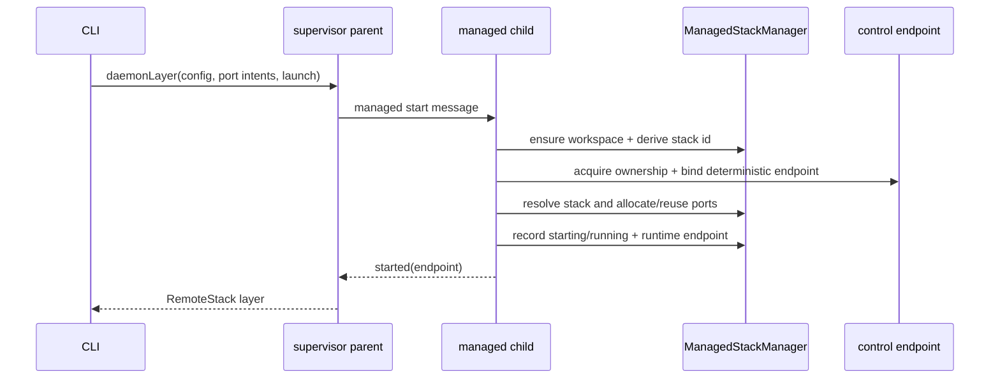

# Detached managed mode

Detached mode runs the managed stack in a supervisor child and returns a
`RemoteStack` layer to the caller. The CLI uses this path for `start`,
`status`, `logs`, `functions dev`, branch switching, update, and stop.

## Startup flow

The start message carries the generic daemon configuration separately from
managed port intents and launch metadata. The parent passes the raw project
document and value origins so omitted sticky ports remain automatic. The child
is the only process that owns the lease and writes lifecycle state.

## One document and one owner

Managed state lives beneath `<supabase-home>/managed/stacks/<stack-id>/`:

- `stack.json` is the single durable document;
- `data/` contains managed service data;
- `runtime/` contains control/runtime files owned by the supervisor.

`ManagedStackManager` is the only writer. `acquireControl(stackId)` returns
`Owned` for the live owner or `Attached` for an existing owner. An attached
caller must use the owner endpoint for runtime actions; it never writes the
document directly.

The endpoint is derived from the stack id. A client validates that the endpoint
stored in `stack.json` matches that deterministic value before connecting. This
avoids stale runtime endpoint assumptions and makes a replacement owner safe.

## Attach, update, stop, delete

`connectManagedStack` acquires control and returns `RemoteStack` only for an
attached live owner. `updateManagedLaunch` posts the validated launch payload
to `/managed/launch`; the owner invokes `ManagedStackManager.updateLaunch` and
the caller re-reads the document.

`stopManagedStack` acquires control before deciding how to stop. An attached
owner receives the normal `RemoteStack.stop` request, and the facade waits for
the document to become `stopped`. If ownership is acquired because the old
owner is gone, the facade performs deterministic Docker cleanup by stack id and
records `stopped`; it does not inspect PIDs.

`deleteManagedStack` requires owned control and removes a stopped document. The
CLI waits for stop completion before deleting so document removal cannot race a
child shutdown.

## Transport

`DaemonServer` exposes the typed `Stack` interface, logs, status, and the launch
update route over the local control transport. `RemoteStack` is the only client
used by consumers. The configured API proxy remains the user-facing service
URL; control traffic is local management traffic.

### Compiled Bun re-entry

Source mode forks the adjacent `daemon-bun.ts` entrypoint. In a compiled Bun
executable that source path lives in Bun's virtual filesystem, so the child
re-enters the compiled CLI instead. The parent sets
`SUPABASE_STACK_RUN_DAEMON=1`; the CLI entrypoint handles that marker before
normal command dispatch and invokes the same `runBunDaemon()` supervisor
entrypoint. This is the only stack-specific self-dispatch path.

## Failure and recovery

The child records `starting`, then `running`, and finally `stopped` or `failed`.
Startup failure releases the managed port lease and records `failed`. A process
crash leaves persisted assignments and possible runtime artifacts; the next managed start
acquires ownership, reconciles the document, and reuses sticky ports according
to their persisted intent. No second metadata file or StateManager
claim is involved.

## Implementation map

| Concern                             | Owner                                              |
| ----------------------------------- | -------------------------------------------------- |
| Identity and document paths         | `managed/environment.ts`, `managed/paths.ts`       |
| Document reads/writes and lifecycle | `managed/manager.ts`, `managed/store.ts`           |
| Ownership and endpoint              | `managed/control.ts`                               |
| Public lifecycle facade             | `managed/lifecycle.ts`                             |
| Child protocol and startup          | `supervisor.ts`, `daemon-node.ts`, `daemon-bun.ts` |
| Runtime control routes              | `DaemonServer.ts`, `RemoteStack.ts`                |
| HTTP client                         | `HttpTransportClient.ts`                           |
| Platform control listeners          | `platform-node.ts`, `platform-bun.ts`              |

The direct `createStack` API remains independent of detached managed state.
